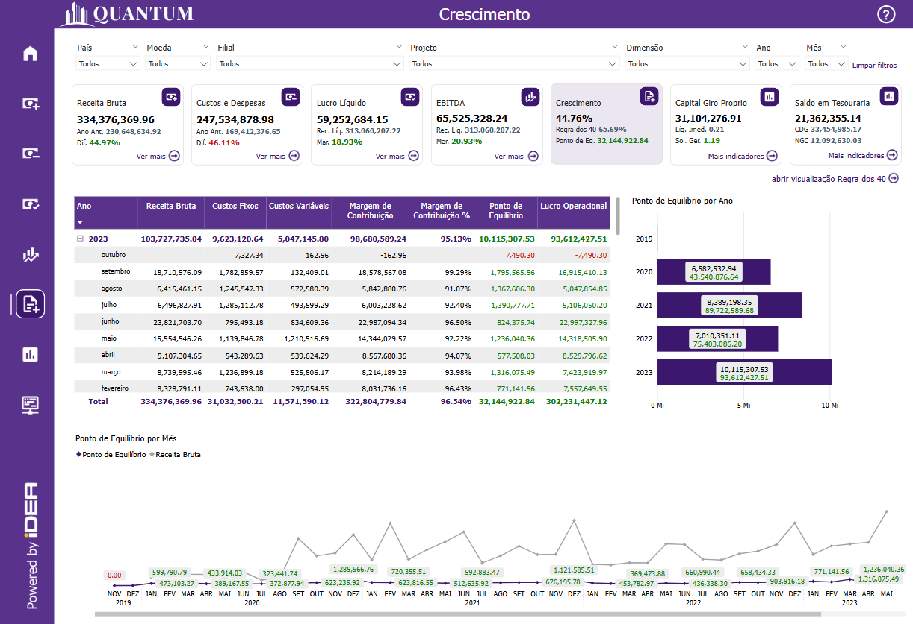
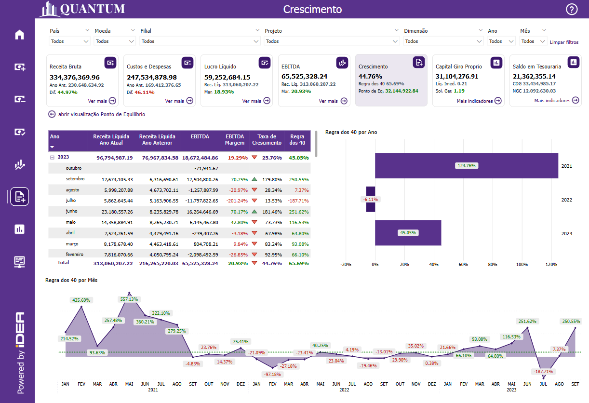
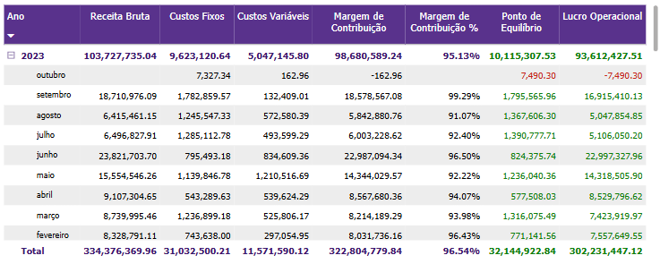
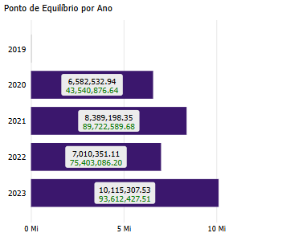
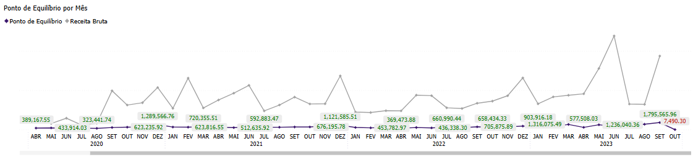
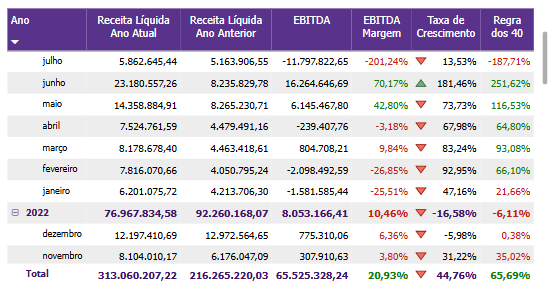
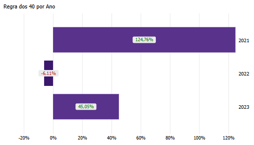
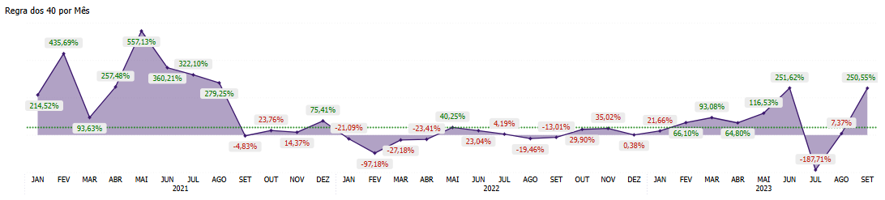

# Painel Crescimento

  
  <h6>Imagem 1: Crescimento - Ponto de Equilíbrio</h6>
  
  <h6>Imagem 2: Crescimento - Regra dos 40</h6>

## Informações no Ponto de Equilíbrio

### Ponto de Equilíbrio

O Ponto de Equilíbrio é uma métrica essencial para avaliar a sustentabilidade financeira de uma empresa, representando o momento em que suas receitas totais igualam seus custos totais, sem gerar lucro ou prejuízo. Esse conceito é fundamental para gestores e investidores, pois indica o volume de vendas necessário para cobrir todas as despesas operacionais e garantir a viabilidade do negócio.

O cálculo do Ponto de Equilíbrio é relativamente simples: basta dividir os custos fixos da empresa pela margem de contribuição, que é obtida subtraindo os custos variáveis da receita. A fórmula pode ser expressa da seguinte maneira:

Ponto de Equilíbrio = Custos Fixos / Margem de Contribuição (%)

Por exemplo, se uma empresa possui custos fixos de R$ 100.000 e uma margem de contribuição de 40%, seu Ponto de Equilíbrio será de R$ 250.000 em faturamento. Isso significa que a empresa precisa gerar essa receita para cobrir suas despesas e operar sem prejuízo. Se o faturamento for inferior a esse valor, haverá déficit; se for superior, a empresa começará a gerar lucro.

Monitorar o Ponto de Equilíbrio é especialmente relevante para empresas em fase de crescimento ou que operam em mercados altamente competitivos. Empresas que conseguem reduzir seus custos fixos ou aumentar sua margem de contribuição podem diminuir seu Ponto de Equilíbrio, tornando-se mais sustentáveis e resilientes a oscilações do mercado.

Outro aspecto importante é a diferença entre o Ponto de Equilíbrio contábil, econômico e financeiro. O contábil considera apenas custos fixos e margem de contribuição, enquanto o econômico inclui também a remuneração do capital próprio. Já o financeiro leva em conta a necessidade de capital de giro e os prazos de recebimento e pagamento, tornando-se mais relevante para a gestão de caixa.

Empresas que mantêm um Ponto de Equilíbrio saudável tendem a ser mais atrativas para investidores e credores, pois demonstram capacidade de sustentar suas operações sem depender excessivamente de capital externo. Isso também permite maior flexibilidade para investimento em expansão, inovação e estratégias de crescimento.

Em resumo, o Ponto de Equilíbrio é uma ferramenta essencial para a gestão financeira, proporcionando uma visão clara sobre o volume mínimo de vendas necessário para manter a empresa operando de forma sustentável. Compreender e monitorar essa métrica permite uma tomada de decisão mais assertiva, garantindo maior segurança financeira e potencializando as oportunidades de crescimento.

## Visão Ponto de Equilíbrio

### Matrix de Ponto de Equilíbrio

  
  <h6>Imagem 2: Matrix de Ponto de Equilíbrio</h6>

Esta matriz apresenta colunas que incluem Receita Bruta, Custos Fixos, Custos Variáveis, Margem de Contribuição, Margem de Contribuição %, Ponto de Equilíbrio e Lucro Operacional, todas organizadas de forma clara por ano e mês. Cada uma dessas colunas desempenha um papel fundamental na análise financeira, oferecendo insights profundos sobre o desempenho da empresa ao longo do tempo, especialmente no contexto da análise do Ponto de Equilíbrio.

A coluna de Receita Bruta permite acompanhar o total de vendas antes de quaisquer deduções, fornecendo uma visão ampla da capacidade de geração de receita da empresa. Já os Custos Fixos representam os gastos que não variam com a produção ou vendas, como aluguel, salários administrativos e despesas gerais, sendo essenciais para calcular o Ponto de Equilíbrio.

A coluna de Custos Variáveis inclui despesas que aumentam ou diminuem conforme o volume de produção ou vendas, como matérias-primas e comissões. Esses custos influenciam diretamente a Margem de Contribuição, que é calculada subtraindo os Custos Variáveis da Receita Bruta. A Margem de Contribuição indica quanto da receita está disponível para cobrir os Custos Fixos e gerar lucro operacional.

A Margem de Contribuição %, que é a Margem de Contribuição dividida pela Receita Bruta, oferece uma visão percentual de quanto a empresa retém para cobrir custos fixos e lucro. Essa métrica é fundamental para a análise da rentabilidade e eficiência da operação.

A coluna do Ponto de Equilíbrio representa o nível de receita necessário para cobrir todos os Custos Fixos e Variáveis, sem gerar lucro ou prejuízo. Esse indicador é crucial para determinar a sustentabilidade financeira da empresa e avaliar se as vendas atuais são suficientes para manter a operação viável.

Por fim, a coluna de Lucro Operacional reflete o valor restante após a dedução de todos os custos, destacando a real lucratividade da empresa. Monitorar esse indicador permite avaliar se a empresa está crescendo de forma sustentável e se suas margens são suficientes para garantir a viabilidade no longo prazo.

Esse layout da matriz, com sua estrutura de dados combinada a uma apresentação visual clara e intuitiva, permite que os gestores e analistas avaliem rapidamente a performance da empresa ao longo do tempo. A utilização de cores e ícones facilita a identificação de tendências e áreas problemáticas, permitindo uma análise mais ágil e eficaz do equilíbrio financeiro e operacional da empresa.

#### Receita Bruta
Reflete o total de receita gerada pela empresa antes de deduções, sendo um indicador-chave para avaliar a capacidade de geração de vendas.
#### Custos Fixos
Inclui despesas que não variam com a produção, como aluguel e salários administrativos, impactando diretamente o Ponto de Equilíbrio.
#### Custos Variáveis
Representa os gastos diretamente relacionados ao volume de vendas ou produção, como matérias-primas e comissões.
#### Margem de Contribuição
Calculada como Receita Bruta menos Custos Variáveis, indica quanto sobra para cobrir custos fixos e gerar lucro.
#### Margem de Contribuição %
Representa a Margem de Contribuição como percentual da Receita Bruta, auxiliando na análise da eficiência operacional.
#### Ponto de Equilíbrio
Mostra a receita mínima necessária para cobrir todos os custos, ajudando a determinar a viabilidade financeira da empresa.
#### Lucro Operacional
Reflete o valor restante após todos os custos, sendo um indicador final da lucratividade da empresa.

## Ponto de Equilíbrio por Ano

  
  <h6>Imagem 3: Ponto de Equilíbrio por Ano</h6>

Este gráfico de barras exibe o **Ponto de Equilíbrio** por ano, proporcionando uma visão clara do momento em que a empresa cobre todos os seus custos e começa a gerar lucro operacional. O **Ponto de Equilíbrio** é uma métrica essencial que reflete a relação entre Receita Bruta, Custos Fixos e Custos Variáveis, sendo um indicador fundamental para a sustentabilidade financeira da empresa.  

O gráfico apresenta barras que representam o **Ponto de Equilíbrio** ao longo dos anos, com rótulos de texto que mudam de cor conforme a relação entre a Receita Bruta e o Ponto de Equilíbrio. Quando a Receita Bruta fica **abaixo** do Ponto de Equilíbrio, os rótulos aparecem em **vermelho**, sinalizando que a empresa ainda não cobriu seus custos totais e pode estar operando com prejuízo. Quando a Receita Bruta é **igual ou superior** ao Ponto de Equilíbrio, os rótulos aparecem em **verde**, indicando que a empresa está gerando lucro operacional e garantindo sua viabilidade financeira.  

A visualização anual do **Ponto de Equilíbrio** é essencial para compreender a evolução da empresa ao longo do tempo. Enquanto análises mensais ou trimestrais podem ser afetadas por sazonalidades e oscilações de mercado, a perspectiva anual permite identificar **tendências sustentáveis**, avaliando se a empresa está conseguindo reduzir custos, aumentar sua margem de contribuição e melhorar sua eficiência operacional. Esse acompanhamento possibilita ajustes estratégicos, ajudando a empresa a aprimorar sua estrutura de custos e sua capacidade de geração de receita.  

Este gráfico de barras também oferece a possibilidade de aplicar [filtros](https://idea-technology-it.github.io/docs-idea/contabilidade/intro/#filtros), permitindo uma análise mais granular do **Ponto de Equilíbrio** por **filial, projeto ou qualquer outra dimensão relevante**. Isso possibilita aos gestores identificarem quais unidades estão operando acima ou abaixo do Ponto de Equilíbrio e entenderem quais fatores contribuem para esse desempenho. Por exemplo, ao analisar por **filial**, é possível verificar quais unidades estão com margens de contribuição mais baixas e exigem maior controle sobre custos variáveis. Da mesma forma, ao filtrar por **projeto**, pode-se avaliar se determinadas iniciativas estão alcançando o equilíbrio financeiro esperado.  

Além disso, a **interatividade bidirecional** entre este gráfico e outros visuais do painel aumenta a capacidade analítica da ferramenta. Ao selecionar um ano específico no gráfico de barras do **Ponto de Equilíbrio**, outros gráficos, como a [Matrix de Ponto de Equilíbrio](https://idea-technology-it.github.io/docs-idea/contabilidade/crescimento/#matrix-de-ponto-de-equilibrio) e a [Ponto de Equilíbrio por Mês](https://idea-technology-it.github.io/docs-idea/contabilidade/crescimento/#ponto-de-equilibrio-por-mes), são automaticamente filtrados para mostrar detalhes do período selecionado. Por exemplo, se em determinado ano a empresa teve dificuldades para atingir o Ponto de Equilíbrio, os outros visuais podem destacar quais fatores contribuíram para esse cenário, como aumento de custos fixos ou queda na margem de contribuição.  

Essa interatividade permite análises mais detalhadas e dinâmicas, ajudando os gestores a identificarem oportunidades de melhoria e a tomarem **decisões estratégicas mais informadas**. Acompanhando o **Ponto de Equilíbrio**, a empresa pode planejar melhor seus custos e receitas, garantindo um crescimento sustentável e maior rentabilidade ao longo do tempo.

## Ponto de Equilíbrio por Mês

  
  <h6>Imagem 4: Ponto de Equilíbrio por Mês</h6>

O gráfico de área é uma ferramenta poderosa projetada para visualizar o desempenho da empresa em relação ao Ponto de Equilíbrio por Mês, que representa o momento em que as receitas cobrem exatamente os custos, sem gerar lucro ou prejuízo. Este gráfico exibe o Ponto de Equilíbrio como uma porcentagem em uma base mensal e anual, permitindo uma análise detalhada das tendências ao longo do tempo. O gráfico é codificado por cores para maior clareza: os rótulos ficam vermelhos quando o valor está abaixo do ponto de equilíbrio, sinalizando um desempenho financeiro preocupante, e verdes quando supera esse ponto, indicando saúde financeira positiva. A inclusão de uma linha de referência horizontal no nível do Ponto de Equilíbrio melhora a comparação visual, facilitando a identificação de padrões de desempenho.

Esse método de visualização é fundamental porque oferece uma visão imediata e intuitiva sobre a saúde financeira da empresa. Ao mostrar o Ponto de Equilíbrio em uma linha do tempo contínua, os usuários podem rapidamente identificar meses ou anos em que as receitas ficaram abaixo dos custos, indicando possíveis problemas que podem exigir investigação mais profunda. Por outro lado, os períodos em que o indicador está em verde representam momentos de equilíbrio ou superávit, oferecendo oportunidades para reforçar estratégias bem-sucedidas. Os rótulos codificados por cores permitem uma avaliação instantânea, reduzindo a carga cognitiva dos usuários e garantindo que eles possam focar nos períodos-chave que podem requerer ações.

O gráfico não funciona de forma isolada; ele interage de maneira dinâmica com outros visuais e [filtros](https://idea-technology-it.github.io/docs-idea/contabilidade/intro/#filtros) do painel. Por exemplo, quando o usuário aplica filtros com base em ano, filial ou projetos específicos, o gráfico de área é atualizado em tempo real para refletir os dados filtrados. Isso torna possível analisar o Ponto de Equilíbrio em diferentes contextos, como por divisão, região ou linha de produto. Ao selecionar um período específico ou segmento de negócio, o usuário pode ver como diferentes áreas da empresa impactam o equilíbrio financeiro.

Além disso, essa visualização interage com outros indicadores financeiros no painel, como crescimento de receita bruta, custos e despesas ou EBITDA. Por exemplo, se a empresa não atingir o Ponto de Equilíbrio em um determinado mês, os usuários podem facilmente cruzar essa informação com outras métricas, como queda na receita ou aumento de custos no mesmo período, ajudando a identificar as causas subjacentes. Essa interconexão promove uma compreensão mais profunda de como diferentes componentes financeiros influenciam o equilíbrio da empresa, apoiando uma tomada de decisão mais estratégica e informada.

A presença da linha de meta do Ponto de Equilíbrio é especialmente útil nesse contexto interativo. Ela serve como um ponto de referência consistente, permanecendo visível à medida que os dados são filtrados. Isso permite que os usuários avaliem se a empresa está no caminho certo para manter a estabilidade financeira, independentemente do período ou filtro aplicado. A ênfase visual na meta de equilíbrio reforça sua importância na orientação da estratégia empresarial, ajudando executivos e analistas a identificar rapidamente desvios e a tomar ações corretivas no momento adequado.

Em resumo, o gráfico de área para o Ponto de Equilíbrio por Mês não apenas fornece uma visualização clara e codificada por cores do desempenho financeiro ao longo do tempo, mas também serve como uma ferramenta crítica de análise quando combinado com outros elementos do painel. Sua interação com filtros e outros visuais permite que os usuários detalhem segmentos específicos do negócio, oferecendo uma visão abrangente e em tempo real de como a empresa está aderindo às suas metas financeiras estratégicas. Essa abordagem holística e interativa capacita as partes interessadas a tomarem decisões orientadas por dados, garantindo um equilíbrio financeiro sustentável.

## Informações no Regra dos 40

### Regra dos 40

A Regra dos 40 é uma métrica amplamente utilizada para avaliar o equilíbrio entre crescimento e lucratividade de uma empresa, especialmente aquelas em fase de expansão acelerada. Esse conceito foi introduzido como uma forma simplificada de determinar se uma empresa está conseguindo expandir suas operações de forma sustentável, sem sacrificar demais sua rentabilidade. A regra funciona de maneira bastante simples: uma empresa é considerada saudável se a soma de sua taxa de crescimento de receita e sua margem EBITDA (ou margem operacional) for igual ou superior a 40%.

Por exemplo, se uma empresa apresenta um crescimento anual de receita de 30% e uma margem EBITDA de 15%, a soma desses dois números resulta em 45%, o que indica que a empresa está cumprindo a Regra dos 40. Da mesma forma, uma empresa com um crescimento de receita de 20% e uma margem EBITDA de 20% também estaria dentro dos parâmetros dessa métrica. Entretanto, se uma empresa cresce a uma taxa de 50%, mas sua margem EBITDA é de -20%, o resultado seria 30%, o que representaria um sinal de alerta para investidores e gestores sobre a sustentabilidade financeira no longo prazo.

A Regra dos 40 é particularmente relevante para empresas que frequentemente enfrentam o desafio de equilibrar crescimento rápido com a manutenção da lucratividade. Empresas em fase de expansão tendem a investir de forma significativa em marketing, desenvolvimento de produtos e infraestrutura, o que pode reduzir temporariamente suas margens de lucro. No entanto, a Regra dos 40 oferece uma maneira de avaliar se esses investimentos estão compensando em termos de crescimento suficiente para sustentar a empresa a longo prazo.

Monitorar e analisar a Regra dos 40 permite às empresas e investidores determinar se uma empresa está priorizando adequadamente o equilíbrio entre crescer e ser financeiramente eficiente. Se uma empresa apresenta uma alta taxa de crescimento, mas suas margens estão muito comprimidas, pode indicar que, apesar do crescimento rápido, a empresa enfrenta desafios operacionais que podem comprometer sua saúde financeira no futuro. Por outro lado, se a margem EBITDA é alta, mas o crescimento da receita é baixo, isso pode sugerir que a empresa está financeiramente estável, mas não está expandindo sua base de clientes ou aumentando sua receita de forma significativa, o que pode limitar o potencial de crescimento futuro.

Para as empresas que conseguem atingir a Regra dos 40, o benefício é duplo: elas são vistas como financeiramente saudáveis e capazes de equilibrar crescimento com eficiência operacional. Essas empresas tendem a atrair maior interesse de investidores, uma vez que demonstram que não estão apenas crescendo, mas também são capazes de gerir seus custos operacionais de forma eficaz. Por isso, a Regra dos 40 se tornou uma métrica crítica não apenas para startups em rápido crescimento, mas também para empresas em setores competitivos, onde a eficiência e o crescimento precisam andar lado a lado para garantir a viabilidade a longo prazo.

Em resumo, a análise da Regra dos 40 oferece uma visão clara e abrangente da capacidade de uma empresa de equilibrar crescimento e rentabilidade. Ao examinar a soma do crescimento da receita e da margem EBITDA, as empresas conseguem entender melhor sua eficiência operacional e sustentabilidade. Esse equilíbrio é crucial para garantir que as empresas possam continuar a crescer enquanto mantêm a saúde financeira, tornando a Regra dos 40 uma métrica fundamental para o sucesso no setor de tecnologia e além.

## Visão Regra dos 40

### Matrix de Regra dos 40

  
  <h6>Imagem 2: Matrix de Regra dos 40</h6>

Esta matriz apresenta colunas que incluem Receita Líquida Ano Atual, Receita Líquida Ano Anterior, EBITDA, Margem EBITDA, Taxa de Crescimento, e Regra dos 40, todas organizadas de forma clara por ano e mês. Cada uma dessas colunas desempenha um papel fundamental na análise financeira, oferecendo insights profundos sobre o desempenho da empresa ao longo do tempo, especialmente no contexto da aplicação da Regra dos 40.

A coluna de Receita Líquida Ano Atual permite acompanhar o desempenho atual da empresa em termos de receita, enquanto a Receita Líquida Ano Anterior serve como uma referência para medir o crescimento ano a ano. Isso facilita a visualização imediata de como a empresa está se desenvolvendo e se o crescimento está ocorrendo de maneira constante.

A coluna de EBITDA (Lucro antes de Juros, Impostos, Depreciação e Amortização) oferece uma visão clara da lucratividade operacional da empresa, destacando sua eficiência sem os efeitos de despesas não operacionais. Já a Margem EBITDA complementa essa análise, mostrando a porcentagem de receita que a empresa consegue converter em lucro operacional. Além disso, a Margem EBITDA é realçada com um esquema de cores que facilita a interpretação visual: o texto aparece em vermelho quando a margem é inferior a 20%, sinalizando um alerta, e em verde quando supera os 20%, indicando uma margem saudável e eficiente.

A coluna de Taxa de Crescimento compara a receita líquida atual com a do ano anterior, revelando o ritmo de expansão da empresa. Essa taxa é acompanhada por ícones visuais que auxiliam na análise rápida do desempenho: um ícone verde aparece quando a taxa de crescimento excede 100%, sugerindo um crescimento acelerado e positivo, enquanto um ícone vermelho aparece quando a taxa fica abaixo desse valor, apontando para um desempenho aquém do esperado ou até mesmo declínio.

Por fim, a coluna de Regra dos 40 resume a métrica que combina o crescimento da receita e a margem EBITDA. Essa regra é um indicador crucial para avaliar se a empresa está equilibrando crescimento e rentabilidade de maneira saudável. O valor dessa coluna também utiliza um esquema de cores intuitivo para destacar o desempenho: o texto é exibido em verde quando a soma do crescimento da receita e da margem EBITDA é igual ou superior a 40%, indicando que a empresa está dentro dos padrões ideais de crescimento sustentável. Quando essa soma fica abaixo de 40%, o texto é exibido em vermelho, sinalizando um possível desequilíbrio entre crescimento e eficiência operacional, o que pode exigir atenção por parte da gestão.

Esse layout da matriz, com sua estrutura de dados combinada a uma apresentação visual clara e intuitiva, permite que os gestores e analistas avaliem rapidamente a performance da empresa ao longo do tempo. A utilização de cores e ícones facilita a identificação de tendências e áreas problemáticas, permitindo uma análise mais ágil e eficaz do equilíbrio entre crescimento e lucratividade, com base na Regra dos 40.

####	Receita Líquida Ano Atual
Reflete o total de receita gerada pela empresa no ano em curso, após a dedução de descontos, devoluções e abatimentos. Esta coluna é essencial para avaliar a capacidade de geração de receita atual da empresa e fornece a base para comparar com o período anterior.
#### Receita Líquida Ano Anterior
Mostra a receita líquida registrada no mesmo período do ano anterior. Comparar essa coluna com a Receita Líquida Ano Atual permite medir o crescimento ou a desaceleração das receitas ao longo do tempo, oferecendo uma perspectiva histórica de desempenho.
#### EBITDA
Representa o lucro operacional da empresa antes de juros, impostos, depreciação e amortização. Esta coluna é crucial para entender a rentabilidade operacional e a eficiência da empresa em gerar lucro a partir de suas operações principais, sem os impactos de variáveis externas.
#### Margem EBITDA
Calculada como EBITDA dividido pela Receita Líquida, esta coluna mostra a porcentagem da receita que é convertida em EBITDA. A Margem EBITDA é um indicador importante da eficiência operacional e da capacidade da empresa em manter rentabilidade a partir de suas vendas.
#### Taxa de Crescimento
Mede a variação percentual na Receita Líquida em relação ao período anterior. Esta coluna é vital para avaliar o ritmo de expansão da empresa, oferecendo uma visão sobre o sucesso das estratégias de crescimento e a capacidade de aumentar a receita ao longo do tempo.
#### Regra dos 40
Calculada como a soma da Margem EBITDA e da Taxa de Crescimento, esta coluna é usada para verificar se a soma desses dois indicadores atinge ou supera a meta de 40%. A Regra dos 40 é um parâmetro chave para equilibrar crescimento e lucratividade, e sua análise ajuda a determinar se a empresa está atingindo um desempenho financeiro saudável e sustentável.

## Regra dos 40 por Ano

  
  <h6>Imagem 3: Regra dos 40 por Ano</h6>

Este gráfico de barras exibe a Regra dos 40 por ano, oferecendo uma visão clara e objetiva do desempenho da empresa em relação a essa métrica essencial ao longo do tempo. A Regra dos 40 equilibra o crescimento da receita e a lucratividade operacional, sendo amplamente utilizada, para avaliar o alinhamento entre esses dois aspectos críticos. O gráfico apresenta barras que representam o desempenho anual da empresa, com rótulos de texto que mudam de cor conforme o desempenho em relação à meta de 40%. Quando o valor da Regra dos 40 está abaixo de 40%, os rótulos ficam em vermelho, sinalizando um possível desequilíbrio, onde o crescimento pode estar sendo priorizado em detrimento da lucratividade. Quando o valor é igual ou superior a 40%, os rótulos aparecem em verde, indicando que a empresa está atingindo ou superando a meta, refletindo um equilíbrio saudável entre crescimento e rentabilidade.

A visualização anual da Regra dos 40 é particularmente importante, pois fornece uma perspectiva de longo prazo sobre a performance da empresa. Diferente de visões trimestrais ou mensais, que podem ser impactadas por sazonalidades ou eventos pontuais, a análise anual permite identificar tendências sustentáveis no crescimento e na rentabilidade ao longo do tempo. Ela revela como as estratégias de crescimento estão se desenvolvendo, se o equilíbrio entre receita e margem está sendo mantido e se a empresa está atingindo uma trajetória de crescimento saudável. Essa visão também facilita a identificação de anos em que o desempenho ficou aquém ou superou as expectativas, permitindo ajustes estratégicos baseados em dados sólidos.

Este gráfico de barras também oferece a possibilidade de aplicar [filtros](https://idea-technology-it.github.io/docs-idea/contabilidade/intro/#filtros) para obter uma visão mais granular da Regra dos 40, permitindo a análise por filial, projeto ou dimensão específica dentro da empresa. Utilizando esses filtros, os gestores podem isolar o desempenho de diferentes partes da organização e observar como elas contribuem individualmente para o resultado geral da Regra dos 40. Por exemplo, ao filtrar por filial, é possível identificar quais unidades estão alinhadas com a meta de 40% e quais estão abaixo, fornecendo insights valiosos sobre a eficiência operacional e a capacidade de geração de receita de cada local. Da mesma forma, ao analisar por projeto, pode-se avaliar o impacto de iniciativas específicas no crescimento da receita e na lucratividade. A interatividade com as dimensões também é crucial para entender como diferentes áreas do negócio, como produto ou segmento de mercado, estão se comportando, permitindo ajustes focados e decisões estratégicas mais direcionadas para melhorar o equilíbrio entre crescimento e rentabilidade em cada área.

Além disso, o benefício da **interatividade bidirecional** entre este gráfico e outros visuais no painel de controle aumenta significativamente o poder analítico da ferramenta. Ao selecionar um ano específico no gráfico de barras da Regra dos 40, outros gráficos, como [Matrix de Regra dos 40](https://idea-technology-it.github.io/docs-idea/contabilidade/regra_dos_40/#matrix-de-regra-dos-40) e [Regra dos 40 por Mês](https://idea-technology-it.github.io/docs-idea/contabilidade/regra_dos_40/#regra-dos-40-por-mes), são automaticamente filtrados para mostrar o desempenho detalhado daquele período. Por exemplo, ao clicar em um ano em que a empresa não atingiu a meta de 40%, os outros visuais podem destacar quais fatores específicos contribuíram para esse resultado, como uma desaceleração no crescimento de receita ou um aumento nos custos operacionais que impactaram negativamente a margem EBITDA.

Essa interatividade bidirecional permite uma análise mais detalhada e dinâmica, proporcionando aos gestores a capacidade de identificar rapidamente quais áreas da empresa estão performando bem em relação à Regra dos 40 e onde estão as oportunidades de melhoria. Isso não apenas melhora a compreensão do desempenho passado, mas também facilita a tomada de decisões estratégicas mais informadas para o futuro.

## Regra dos 40 por Mês

  
  <h6>Imagem 4: Regra dos 40 por Mês</h6>

O gráfico de área é uma ferramenta poderosa projetada para visualizar o desempenho da empresa em relação à Regra dos 40, que combina lucratividade e crescimento para medir a saúde e a sustentabilidade do negócio. Este gráfico exibe a Regra dos 40 como uma porcentagem em uma base mensal e anual, permitindo uma análise detalhada das tendências ao longo do tempo. O gráfico é codificado por cores para maior clareza: os rótulos ficam vermelhos quando o valor cai abaixo da meta de 40%, sinalizando desempenho abaixo do esperado, e verdes quando o valor atinge ou supera os 40%, indicando desempenho satisfatório ou excepcional. A inclusão de uma linha de referência horizontal no nível de 40% melhora a comparação visual, facilitando a visualização de como o desempenho real se alinha com os objetivos estratégicos da empresa.

Esse método de visualização é fundamental porque oferece uma visão imediata e intuitiva sobre a saúde financeira da empresa. Ao mostrar a Regra dos 40 em uma linha do tempo contínua, os usuários podem rapidamente identificar meses ou anos em que o desempenho caiu abaixo das expectativas, indicando possíveis problemas que podem exigir investigação mais profunda. Por outro lado, períodos em que a Regra dos 40 está em verde indicam momentos de força, oferecendo oportunidades para replicar estratégias de sucesso. Os rótulos codificados por cores permitem uma avaliação instantânea, reduzindo a carga cognitiva dos usuários e garantindo que eles possam focar nos períodos-chave que podem requerer ações.

O gráfico não funciona de forma isolada; ele interage de maneira dinâmica com outros visuais e [filtros](https://idea-technology-it.github.io/docs-idea/contabilidade/intro/#filtros) do painel. Por exemplo, quando o usuário aplica filtros com base em ano, filial ou projetos específicas, o gráfico de área é atualizado em tempo real para refletir os dados filtrados. Isso torna possível analisar a Regra dos 40 em diferentes contextos, como por divisão, região ou linha de produto. Ao selecionar um período específico ou segmento de negócio, o usuário pode ver como áreas específicas da empresa contribuem para – ou prejudicam – o desempenho geral em relação à Regra dos 40.

Além disso, essa visualização interage com outros indicadores financeiros no painel, como crescimento de receita bruta, custos e despesas ou EBITDA. Por exemplo, se a Regra dos 40 cair abaixo do limite de 40% em um determinado mês, os usuários podem facilmente cruzar essa informação com outras métricas, como queda na receita ou aumento de custos no mesmo período, ajudando a identificar as causas subjacentes. Essa interconexão promove uma compreensão mais profunda de como diferentes componentes financeiros influenciam a Regra dos 40, apoiando uma tomada de decisão mais estratégica e informada.

A presença da linha de meta de 40% é especialmente útil nesse contexto interativo. Ela serve como um ponto de referência consistente, permanecendo visível à medida que os dados são filtrados. Isso permite que os usuários avaliem se a empresa está no caminho certo para atingir suas metas, independentemente do período ou filtro aplicado. A ênfase visual na meta de 40% reforça sua importância na orientação da estratégia empresarial, lembrando os usuários do compromisso da empresa em manter o equilíbrio entre lucratividade e crescimento. Isso ajuda executivos e analistas a identificar rapidamente desvios da meta e a tomar ações corretivas no momento adequado.

Em resumo, o gráfico de área para a Regra dos 40 não apenas fornece uma visualização clara e codificada por cores do desempenho ao longo do tempo, mas também serve como uma ferramenta crítica de análise quando combinado com outros elementos do painel. Sua interação com filtros e outros visuais permite que os usuários detalhem segmentos específicos do negócio, oferecendo uma visão abrangente e em tempo real de como a empresa está aderindo às suas metas financeiras estratégicas. Essa abordagem holística e interativa capacita as partes interessadas a tomarem decisões orientadas por dados, alinhando o desempenho aos objetivos de longo prazo.

  
***Aviso Legal:** Os números e informações apresentados nesta documentação são baseados em um conjunto de dados fictício. Eles são destinados exclusivamente para fins educacionais e de demonstração. Os dados não refletem condições do mundo real ou métricas de negócios reais e não devem ser usados ​​para tomada de decisão ou análise. Qualquer semelhança com entidades, eventos ou dados reais é mera coincidência.*
