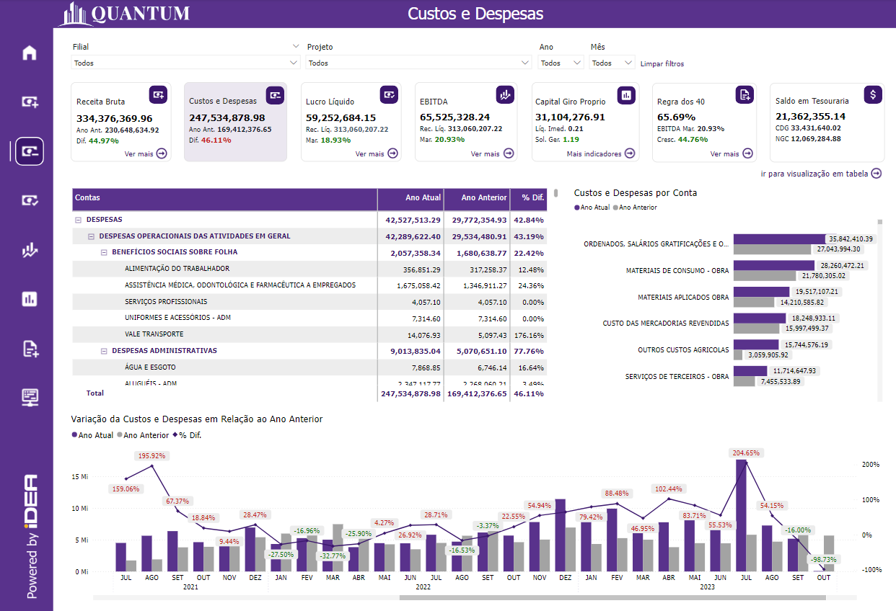
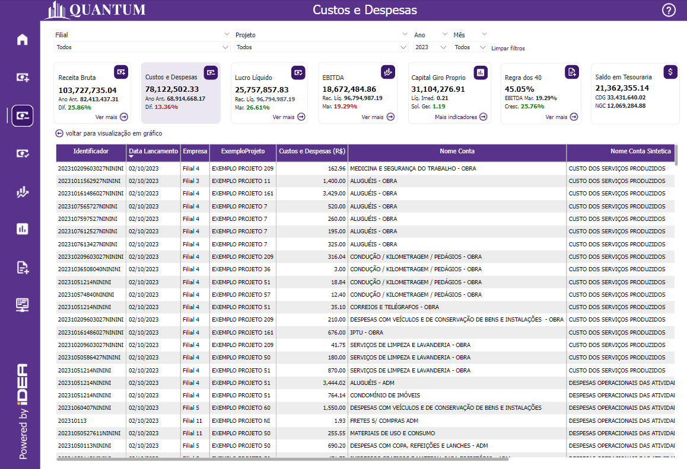
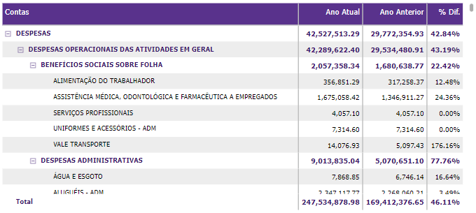
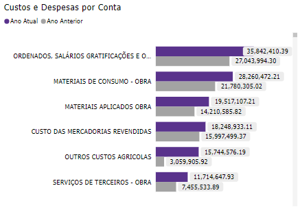
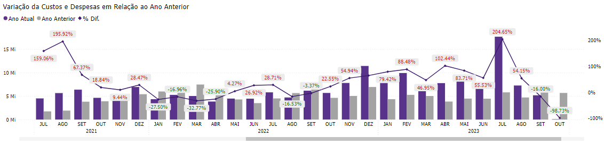
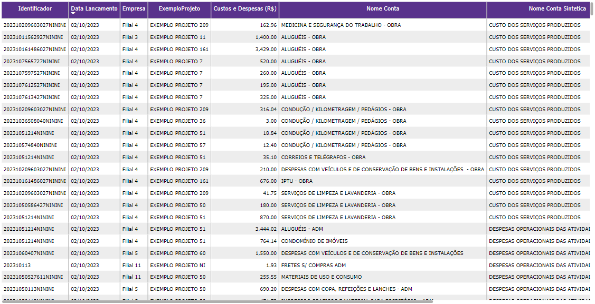

# Painel Custos e Despesas

  
  <h6>Imagem 1: Custos e Despesas Visão Gráfica</h6>
  
  <h6>Imagem 2: Custos e Despesas Visão de Tabela</h6>

Custos e Despesas refere-se aos gastos totais de uma empresa relacionados à sua operação e produção, antes de deduzir receitas ou outros ajustes. 

Essa métrica é essencial para entender a eficiência operacional e a gestão financeira da empresa, pois oferece uma visão clara dos custos envolvidos na manutenção das operações e permite avaliar como esses gastos impactam a rentabilidade geral.

Esta página do relatório é dividida em duas visualizações, visão gráfica e visão de tabela.

Na página de Receita Bruta, você encontrará:

## Visão Gráfica
### Tabela de Custos e Despesas

  
  <h6>Imagem 3: Tabela de Custos e Despesas</h6>

Esta tabela exibe Custos e Despesas para o Ano Atual, o Ano Anterior e a % Diferença entre eles, organizada por Nome da Conta e Nível, conforme a ordem do Modelo. 

A importância dessa tabela está na capacidade de comparar diretamente os custos e despesas entre dois períodos e por diferentes contas, permitindo uma análise detalhada das variações e tendências. 

A % Diferença é crucial para compreender o crescimento ou a redução nos custos e despesas, fornecendo insights sobre a performance de cada conta específica e ajudando a identificar áreas que podem necessitar de ajuste ou controle.

### Custos e Despesas por Conta

  
  <h6>Imagem 4: Custos e Despesas por Conta</h6>

Este gráfico de barras verticais que mostra os Custos e Despesas para o Ano Atual e o Ano Anterior, organizados por Nome da Conta e ordenados do maior valor do Ano Atual para o menor. 

Esse gráfico é importante porque oferece uma comparação visual clara entre os custos e despesas atuais e anteriores, facilitando a identificação de contas com variações significativas. 

A ordenação dos dados ajuda a destacar as principais contas em termos de custos e despesas, e facilita a identificação de padrões de desempenho.

### Variação dos Custos e Despesas em Relação ao Ano Anterior

  
  <h6>Imagem 5: Variação dos Custos e Despesas em Relação ao Ano Anterior</h6>

Este gráfico de barras com linha que combina barras e uma linha para mostrar os Custos e Despesas do Ano Atual e do Ano Anterior, com a linha representando a % Diferença entre eles. A linha é colorida em verde quando a diferença é positiva e em vermelho quando é negativa. 

Este gráfico é essencial para a análise temporal dos custos e despesas, permitindo visualizar as variações mês a mês e ano a ano, bem como a magnitude e a direção das mudanças. 

A codificação por cor da % Diferença ajuda a identificar rapidamente os períodos de aumento ou diminuição no desempenho financeiro.

## Visão de Tabela
### Tabela de Detalhamento

  
  <h6>Imagem 6: Tabela de Detalhamento</h6>

Esta tabela contém dados detalhados com colunas para Identificador (ID da Transação), Data de Lançamento, Filial, Projeto, Valor dos Custos e Despesas, Nome da Conta (conforme o Modelo), Nome da Conta Sintética (conforme o Modelo) e Nome da Conta Analítica (conforme o Modelo). 

A importância desta tabela está em fornecer uma visão granular e específica das transações individuais de custos e despesas. Isso permite uma análise detalhada do impacto de cada transação, facilitando a auditoria e o rastreamento dos gastos. 

A inclusão dos diferentes níveis de contas ajuda a entender melhor a estrutura e os detalhes dos custos, possibilitando uma análise mais precisa e contextualizada das despesas da empresa

***Aviso Legal:** Os números e informações apresentados nesta documentação são baseados em um conjunto de dados fictício. Eles são destinados exclusivamente para fins educacionais e de demonstração. Os dados não refletem condições do mundo real ou métricas de negócios reais e não devem ser usados ​​para tomada de decisão ou análise. Qualquer semelhança com entidades, eventos ou dados reais é mera coincidência.*
