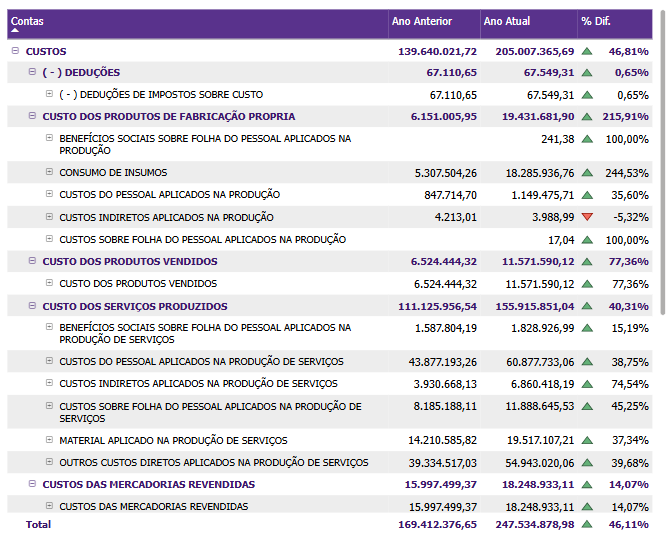
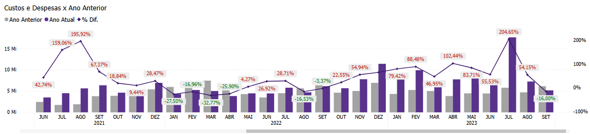

# Painel Custos e Despesas

  
  <h6>Imagem 1: Custos e Despesas Visão Gráfica</h6>
  
  <h6>Imagem 2: Custos e Despesas Visão de Tabela</h6>

## Navegação

O painel de relatórios é projetado com duas visualizações distintas. Alguns visuais são consistentes em ambas as visualizações, enquanto outros são específicos para cada visualização, garantindo que informações relevantes sejam apresentadas de acordo com o contexto de cada perspectiva;

- **[Visão Gráfica e Tabela](https://idea-technology-it.github.io/docs-idea/contabilidade/custos_e_despesas/#visao-grafica-e-tabela)** - pode ser navegada através do [botão](https://idea-technology-it.github.io/docs-idea/contabilidade/intro/#botoes-para-diferentes-visoes) "voltar para visualização em gráfico" ou "ir para visualização em tabela".
- **[Visão Gráfica](https://idea-technology-it.github.io/docs-idea/contabilidade/custos_e_despesas/#visao-grafico)** - pode ser navegada através do [botão](https://idea-technology-it.github.io/docs-idea/contabilidade/intro/#botoes-para-diferentes-visoes) "voltar para visualização em gráfico".
- **[Visão de Tabela](https://idea-technology-it.github.io/docs-idea/contabilidade/custos_e_despesas/#visao-de-tabela)** - pode ser navegada através do [botão](https://idea-technology-it.github.io/docs-idea/contabilidade/intro/#botoes-para-diferentes-visoes) "ir para visualização em tabela".

## Informações no Painel Custos e Despesas

A análise de custos e despesas é um componente crucial no Business Intelligence (BI) para contabilidade, pois fornece uma visão detalhada e estratégica das saídas financeiras de uma empresa. Monitorar e analisar custos e despesas permite às empresas controlar e otimizar seus gastos, garantindo uma gestão financeira eficaz e um melhor alinhamento com seus objetivos estratégicos.

Visualizações como custos acumulados e comparação de despesas mês a mês são essenciais para acompanhar o desempenho financeiro ao longo do tempo. Os custos acumulados oferecem uma perspectiva de longo prazo, demonstrando como os custos se acumulam ao longo de um período específico. Isso ajuda a identificar tendências e prever a necessidade de ajustes orçamentários. Por outro lado, a comparação de despesas mês a mês permite que as empresas detectem variações de curto prazo, como aumentos sazonais ou impactos de mudanças operacionais, facilitando ajustes rápidos e eficazes.

A análise detalhada de custos por centro de custo, departamento ou projeto é fundamental para uma visão granular da gestão financeira. Esse tipo de análise permite que as empresas identifiquem quais áreas ou projetos estão gerando maiores gastos e quais estão dentro do orçamento. Compreender essa distribuição ajuda a identificar oportunidades de redução de custos, a melhorar a eficiência operacional e a alocar recursos de forma mais eficaz.

A análise do prazo médio de pagamento e recebimento de despesas fornece insights sobre a gestão de fluxo de caixa e a eficiência dos processos financeiros. Identificar quais despesas são pagas pontualmente e quais enfrentam atrasos ajuda a otimizar o fluxo de caixa e a melhorar a gestão de risco financeiro.

O impacto da análise de custos e despesas vai além da contabilidade e das finanças. Os insights obtidos desses dados podem influenciar estratégias operacionais, decisões de compras e planejamento financeiro. Por exemplo, entender quais despesas são mais variáveis pode ajudar as equipes a ajustar orçamentos e prever melhor as necessidades financeiras. Além disso, a análise de tendências de custos auxilia na identificação de áreas para economia e na otimização de estratégias de preços.

Em resumo, a análise de custos e despesas no BI para contabilidade é uma ferramenta poderosa para promover uma gestão financeira eficiente e estratégica. Ao examinar custos de vários ângulos, como desempenho acumulado, variações mensais e detalhamento por centro de custo, as empresas obtêm uma compreensão mais profunda de suas saídas financeiras. Essa análise não só melhora a gestão de custos e despesas, mas também impacta outras áreas-chave como operações, compras e planejamento estratégico, criando um ambiente financeiro mais responsivo e orientado por dados.

## Visão Gráfica e Tabela

### Custos e Despesas por Conta

  
  <h6>Imagem 3: Tabela de Custos e Despesas</h6>

Esta tabela exibe Custos e Despesas para o Ano Atual, o Ano Anterior e a % Diferença entre eles, organizada por Nome da Conta e Nível, conforme a ordem do Modelo. 

A importância dessa tabela está na capacidade de comparar diretamente os custos e despesas entre dois períodos e por diferentes contas, permitindo uma análise detalhada das variações e tendências. 

A % Diferença é crucial para compreender o crescimento ou a redução nos custos e despesas, fornecendo insights sobre a performance de cada conta específica e ajudando a identificar áreas que podem necessitar de ajuste ou controle.

### Custos e Despesas por Filial ou Projeto

  
  <h6>Imagem 4: Custos e Despesas por Conta</h6>

Este gráfico de barras verticais que mostra os Custos e Despesas para o Ano Atual e o Ano Anterior, organizados por Nome da Conta e ordenados do maior valor do Ano Atual para o menor. 

Esse gráfico é importante porque oferece uma comparação visual clara entre os custos e despesas atuais e anteriores, facilitando a identificação de contas com variações significativas. 

A ordenação dos dados ajuda a destacar as principais contas em termos de custos e despesas, e facilita a identificação de padrões de desempenho.

## Visão Gráfica

### Variação dos Custos e Despesas em Relação ao Ano Anterior

  
  <h6>Imagem 5: Variação dos Custos e Despesas em Relação ao Ano Anterior</h6>

Este gráfico de barras com linha que combina barras e uma linha para mostrar os Custos e Despesas do Ano Atual e do Ano Anterior, com a linha representando a % Diferença entre eles. A linha é colorida em verde quando a diferença é positiva e em vermelho quando é negativa. 

Este gráfico é essencial para a análise temporal dos custos e despesas, permitindo visualizar as variações mês a mês e ano a ano, bem como a magnitude e a direção das mudanças. 

A codificação por cor da % Diferença ajuda a identificar rapidamente os períodos de aumento ou diminuição no desempenho financeiro.

## Visão de Tabela

### Tabela de Detalhamento

  
  <h6>Imagem 6: Tabela de Detalhamento</h6>

Esta tabela contém dados detalhados com colunas para Identificador (ID da Transação), Data de Lançamento, Filial, Projeto, Valor dos Custos e Despesas, Nome da Conta (conforme o Modelo), Nome da Conta Sintética (conforme o Modelo) e Nome da Conta Analítica (conforme o Modelo). 

A importância desta tabela está em fornecer uma visão granular e específica das transações individuais de custos e despesas. Isso permite uma análise detalhada do impacto de cada transação, facilitando a auditoria e o rastreamento dos gastos. 

A inclusão dos diferentes níveis de contas ajuda a entender melhor a estrutura e os detalhes dos custos, possibilitando uma análise mais precisa e contextualizada das despesas da empresa

  
***Aviso Legal:** Os números e informações apresentados nesta documentação são baseados em um conjunto de dados fictício. Eles são destinados exclusivamente para fins educacionais e de demonstração. Os dados não refletem condições do mundo real ou métricas de negócios reais e não devem ser usados ​​para tomada de decisão ou análise. Qualquer semelhança com entidades, eventos ou dados reais é mera coincidência.*
