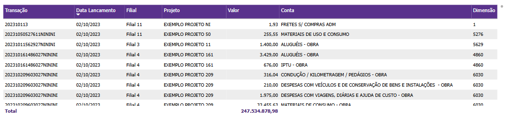

# Painel Custos e Despesas

  
  <h6>Imagem 1: Custos e Despesas - Visão Principal</h6>
  
  <h6>Imagem 2: Custos e Despesas - Visão de Tabela</h6>
  
  <h6>Imagem 3: Custos e Despesas - Visão de Tempo</h6>

## Navegação

O painel de relatórios de **Custos e Despesas** é projetado com três visualizações distintas, garantindo flexibilidade e uma análise adaptada a diferentes contextos. As visualizações compartilham certos elementos, mas também apresentam informações específicas para otimizar a análise conforme o cenário;

- **[Visão Principal](https://idea-technology-it.github.io/docs-idea/contabilidade/custos_e_despesas/#visao-principal)** – pode ser acessada por meio do [botão](https://idea-technology-it.github.io/docs-idea/contabilidade/intro/#botoes-para-diferentes-visoes) "fechar visualização por tempo" ou "fechar visualização em tabela".
- **[Visão de Tabela](https://idea-technology-it.github.io/docs-idea/contabilidade/custos_e_despesas/#visao-de-tabela)** – acessível via o [botão](https://idea-technology-it.github.io/docs-idea/contabilidade/intro/#botoes-para-diferentes-visoes) "abrir visualização em tabela".
- **[Visão de Tempo](https://idea-technology-it.github.io/docs-idea/contabilidade/custos_e_despesas/#visao-de-tempo)** – pode ser acessada pelo [botão](https://idea-technology-it.github.io/docs-idea/contabilidade/intro/#botoes-para-diferentes-visoes) "abrir visualização por tempo".

## Informações no Painel Custos e Despesas

A análise de custos e despesas é um componente crucial no Business Intelligence (BI) para contabilidade, pois fornece uma visão detalhada e estratégica das saídas financeiras de uma empresa. Monitorar e analisar custos e despesas permite às empresas controlar e otimizar seus gastos, garantindo uma gestão financeira eficaz e um melhor alinhamento com seus objetivos estratégicos.

Visualizações como custos acumulados e comparação de despesas mês a mês são essenciais para acompanhar o desempenho financeiro ao longo do tempo. Os custos acumulados oferecem uma perspectiva de longo prazo, demonstrando como os custos se acumulam ao longo de um período específico. Isso ajuda a identificar tendências e prever a necessidade de ajustes orçamentários. Por outro lado, a comparação de despesas mês a mês permite que as empresas detectem variações de curto prazo, como aumentos sazonais ou impactos de mudanças operacionais, facilitando ajustes rápidos e eficazes.

Além disso, o painel oferece uma análise detalhada dos custos por filial, projeto, ou centro de custo, permitindo que a empresa identifique quais áreas estão consumindo mais recursos. Essa análise granular é crucial para entender onde os custos estão concentrados e onde podem ser feitos ajustes para melhorar a eficiência operacional. A segmentação dos custos por diferentes dimensões também permite que as empresas comparem o desempenho de várias unidades ou projetos e façam correções estratégicas.

O monitoramento da relação entre custos e receita também é um aspecto central do painel. Ao comparar o crescimento dos custos com o aumento da receita, as empresas podem garantir que estão operando de forma eficiente, com despesas controladas e margens de lucro saudáveis. Essa análise integrada ajuda a identificar áreas onde os custos estão crescendo mais rápido que a receita, permitindo ações corretivas.

Quando utilizado em conjunto com outros painéis, como o de [Receita Bruta](https://idea-technology-it.github.io/docs-idea/contabilidade/receita_bruta/), a análise de Custos e Despesas fornece uma visão completa da saúde financeira da empresa. Enquanto o painel de receita ajuda a entender como as vendas e as receitas estão evoluindo, o painel de custos complementa essa visão ao detalhar como esses ganhos estão sendo impactados pelos gastos operacionais e administrativos. A interação entre esses painéis permite uma análise integrada, possibilitando que a empresa identifique **gargalos de rentabilidade** e faça ajustes estratégicos.

Em resumo, o painel de **Custos e Despesas** é uma ferramenta indispensável para uma gestão financeira eficiente. Ele permite monitorar de perto os gastos, entender sua distribuição por diversas dimensões e tomar decisões informadas para otimizar a lucratividade da empresa. Ao combinar essa análise com a visão de **Receita Bruta**, as empresas têm em mãos as informações necessárias para equilibrar suas operações, melhorar sua eficiência e garantir um crescimento sustentável.

## Visão Principal

### Custos e Despesas por Conta

  

    
    <h6>Imagem 4: Custos e Despesas por Conta - Níveis Abertos</h6>
  

  

    
    <h6>Imagem 5: Custos e Despesas por Conta - Níveis Fechados</h6>
  

Esta matriz oferece uma visão abrangente dos custos e despesas tanto para o Ano Atual quanto para o Ano Anterior, juntamente com a Diferença Percentual entre esses dois períodos, organizada por Conta e Nível de Conta conforme o modelo contábil estabelecido. O valor principal desta tabela está na sua capacidade de facilitar a comparação direta do desempenho de custos e despesas ao longo de diferentes períodos. Ao categorizar os dados de custos por Conta e Nível de Conta, a tabela proporciona uma visão detalhada de como cada segmento contribui para o total de despesas, destacando tendências e variações no desempenho financeiro da empresa.

Os números de custos e despesas para o Ano Atual oferecem uma visão atualizada do impacto financeiro dos gastos da empresa, servindo como ponto de referência para avaliar os custos do Ano Anterior. Essa comparação é fundamental para identificar áreas onde os custos cresceram ou diminuíram, proporcionando insights valiosos sobre quais contas ou níveis experimentaram mudanças significativas. A coluna de Diferença Percentual é particularmente importante, pois quantifica a variação entre os dois anos, permitindo que os usuários avaliem a extensão da mudança nos custos. Isso ajuda a identificar quais áreas estão enfrentando aumentos de despesas e onde há potencial para cortes ou ajustes.

Além disso, a inclusão de ícones ao lado de cada Diferença Percentual melhora a clareza visual dos dados. Ícones verdes indicam uma redução nos custos, ícones vermelhos sinalizam um aumento nas despesas e ícones amarelos denotam estabilidade. Esse sistema de codificação por cores oferece pistas visuais rápidas, facilitando a interpretação imediata dos dados e ajudando a identificar áreas de atenção ou eficiência. No geral, a tabela é uma ferramenta poderosa para uma análise financeira detalhada, permitindo uma compreensão profunda das dinâmicas de custos e apoiando decisões estratégicas.

A matriz também permite expandir e recolher hierarquias, oferecendo uma visualização dinâmica dos dados. Clicar no sinal de mais (+) ao lado de uma conta revela os níveis de conta abaixo. Essa hierarquia expandida facilita a análise aprofundada, permitindo que os usuários rastreiem o impacto de cada conta em detalhes e sua contribuição para o total de custos e despesas. Da mesma forma, os usuários podem recolher a hierarquia clicando no sinal de menos (-), permitindo uma navegação mais simplificada para quando uma visão geral é suficiente.

Este visual está disponível em todas as três visualizações do painel. Na [Visão Principal](https://idea-technology-it.github.io/docs-idea/contabilidade/custos_e_despesas/#visao-principal), os níveis de conta estão totalmente expandidos, proporcionando uma visão detalhada dos custos e despesas logo na instância inicial. Já na [Visão de Tabela](https://idea-technology-it.github.io/docs-idea/contabilidade/custos_e_despesas/#visao-de-tabela) e na [Visão de Tempo](https://idea-technology-it.github.io/docs-idea/contabilidade/custos_e_despesas/#visao-de-tempo), os níveis de conta são expandidos apenas até o segundo nível, criando um design mais compacto, com foco na interatividade com outros visuais da visualização.

### Custos e Despesas por Filial, Projeto ou Conta

  

    
    <h6>Imagem 6: Custos e Despesas por Filial, Projeto ou Conta - Altura Total</h6>
  

  

    
    <h6>Imagem 7: Custos e Despesas por Filial, Projeto ou Conta - Altura Reduzida</h6>
  

Este gráfico de barras exibe os **Custos e Despesas**, oferecendo a capacidade de alternar entre diferentes níveis de análise: Filial, Projeto ou Conta. Essa funcionalidade proporciona uma visão detalhada e dinâmica dos custos e despesas associados a cada Filial, Projeto ou Conta, permitindo uma compreensão aprofundada de como esses fatores contribuem para o total de despesas da empresa. A flexibilidade para alternar entre esses níveis facilita comparações granulares e ajuda a identificar quais unidades ou iniciativas estão mais impactando o desempenho financeiro.

Complementando a tabela comparativa dos Custos e Despesas do Ano Atual e do Ano Anterior, este gráfico de barras oferece uma visualização intuitiva e direta das contribuições de cada categoria. Enquanto a tabela fornece uma análise detalhada das variações entre períodos, o gráfico de barras destaca as proporções e o peso de cada Filial, Projeto ou Conta no total de despesas. A combinação desses visuais proporciona uma abordagem completa: a tabela aprofunda a comparação temporal, e o gráfico revela as principais categorias que influenciam o desempenho financeiro.

Os rótulos detalhados no gráfico, que mostram a porcentagem dos Custos e Despesas para cada categoria, oferecem uma visão adicional às informações de variação percentual da tabela. Enquanto a tabela foca nas mudanças ao longo dos anos, o gráfico de barras permite observar a representatividade relativa de cada Filial, Projeto ou Conta dentro do total de custos e despesas atuais. Isso ajuda a identificar não apenas onde ocorreram alterações ao longo do tempo, mas também qual é o peso atual de cada categoria em relação ao total geral.

Usar este visual em conjunto com o [Custos e Despesas por Conta](https://idea-technology-it.github.io/docs-idea/contabilidade/custos_e_despesas/#custos-e-despesas-por-conta) proporciona uma análise financeira abrangente. A tabela oferece uma visão detalhada das mudanças ao longo do tempo, enquanto o gráfico de barras foca na distribuição atual dos custos e despesas, revelando padrões de desempenho e destacando áreas críticas ou oportunidades para ajustes. Juntos, esses visuais oferecem uma compreensão completa tanto do passado quanto do presente dos Custos e Despesas.

Este visual está disponível em todas as três visualizações do painel. Na [Visão Principal](https://idea-technology-it.github.io/docs-idea/contabilidade/custos_e_despesas/#visao-principal), o gráfico ocupa o comprimento do painel para incluir o máximo possível de categorias. Na [Visão de Tabela](https://idea-technology-it.github.io/docs-idea/contabilidade/custos_e_despesas/#visao-de-tabela) e na [Visão de Tempo](https://idea-technology-it.github.io/docs-idea/contabilidade/custos_e_despesas/#visao-de-tempo), são exibidas apenas as cinco categorias principais, mas é possível rolar para visualizar todas as categorias disponíveis.

Para navegar entre os níveis, você pode usar os [ícones de cabeçalho](https://idea-technology-it.github.io/docs-idea/contabiliadade/intro/#icones-de-cabecalho), que aparecem ao passar o mouse ou clicar no gráfico.

  
  <h6>Ícones de Cabeçalho</h6>

Aqui, você pode explorar diferentes níveis hierárquicos, como Filial, Projeto ou Conta, para analisar a área de interesse desejada.

## Visão de Tabela

### Tabela de Detalhes

  
  <h6>Imagem 8: Tabela de Detalhes</h6>

Esta tabela detalha os Custos e Despesas, organizados por transação, e inclui colunas essenciais para uma análise abrangente de cada item de custo. Cada linha da tabela representa uma transação individual, com informações cruciais como data de lançamento, filial, projeto, valor, conta e dimensão associada. Esta visão detalhada é fundamental para a gestão e controle preciso dos custos e despesas da empresa.

A organização por transação facilita a identificação e rastreamento de cada item de despesa, permitindo a conciliação com outros sistemas e a verificação detalhada das entradas. A coluna de data de lançamento permite acompanhar a cronologia das despesas, fornecendo uma visão clara sobre quando os custos foram incorridos. A coluna de filial revela a unidade da empresa responsável pela despesa, proporcionando uma visão regionalizada das operações e ajudando a identificar áreas com maiores custos. A coluna de projeto vincula os custos a projetos específicos, sendo útil para empresas que precisam controlar despesas associadas a diferentes iniciativas.

A coluna de valor exibe o montante dos custos e despesas de cada transação, oferecendo uma visão detalhada dos valores envolvidos. A identificação da conta proporciona um detalhamento financeiro mais granular, associando os custos a categorias contábeis específicas. A dimensão adiciona uma camada adicional de análise, permitindo a segmentação dos dados por critérios extras e facilitando a compreensão da origem e natureza dos custos e despesas.

Essa tabela pode ser usada em conjunto com outros visuais, como gráficos de barras ou de linha, para permitir uma análise mais profunda das transações individuais após uma visão geral das tendências de custos e despesas. A possibilidade de aplicar [filtros](https://idea-technology-it.github.io/docs-idea/contabilidade/intro/#filtros) interativos ou clicar nos gráficos ajuda na navegação rápida entre diferentes camadas de informação, tornando o processo de análise mais dinâmico e eficiente.

#### Transação
ID único que identifica cada transação de custos e despesas. Essencial para rastreamento e conciliação.

#### Data de Lançamento
Data em que o custo ou despesa foi registrado. Importante para análise temporal e histórico das transações.

#### Filial
Unidade da empresa responsável pelo custo ou despesa. Ajuda a identificar a distribuição geográfica das despesas.

#### Projeto
Relaciona o custo ou despesa a um projeto específico, útil para monitorar despesas associadas a iniciativas empresariais específicas.

#### Valor
O montante dos custos e despesas de cada transação. Fornece uma visão clara dos valores gerados.

#### Conta
Categoria contábil da transação, essencial para análises financeiras detalhadas.

#### Dimensão
Categoria adicional que facilita a segmentação e a análise dos custos e despesas, oferecendo uma visão mais completa das transações.

## Visão de Tempo

### Custos e Despesas x Ano Anterior

  
  <h6>Imagem 9: Custos e Despesas x Ano Anterior</h6>

Este gráfico de barras com linha oferece uma visão clara e comparativa dos Custos e Despesas entre dois períodos – o Ano Atual e o Ano Anterior – com a linha sobreposta destacando a % Diferença entre os anos. As barras representam os valores absolutos de custos e despesas para cada período, enquanto a linha revela a variação percentual entre os dois anos. Esta combinação facilita a análise do montante total de custos e despesas e das mudanças percentuais, proporcionando uma visão clara do crescimento ou redução ao longo do tempo.

A linha da % diferença é um recurso essencial, pois destaca de forma eficaz as variações de desempenho entre os períodos. Enquanto as barras mostram os valores absolutos, a linha de diferença percentual facilita a identificação rápida das áreas de maior mudança, seja um aumento ou uma redução. Isso permite uma avaliação ágil de onde os custos e despesas mais se alteraram e onde podem ser necessários ajustes.

Utilizado em conjunto com os visuais de [Custos e Despesas por Conta](https://idea-technology-it.github.io/docs-idea/contabilidade/custos_e_despesas/#custos-e-despesas-por-conta) e [Custos e Despesas por Filial, Projeto ou Conta](https://idea-technology-it.github.io/docs-idea/contabilidade/custos_e_despesas/#custos-e-despesas-por-filial-projeto-ou-conta), este gráfico de barras com linha se torna uma ferramenta ainda mais poderosa. O visual de **Custos e Despesas por Categoria** oferece um detalhamento dos diferentes tipos de custos e despesas, enquanto o visual de **Custos e Despesas por Filial, Projeto ou Conta** permite a análise em diferentes níveis de detalhamento, seja por filial, projeto ou conta.

A interação entre esses três visuais proporciona uma análise abrangente. O gráfico de barras com linha oferece uma visão geral das mudanças nos custos e despesas de um período para outro, destacando onde estão as principais variações. Com base nessa visão, o usuário pode usar o visual de [Custos e Despesas por Conta](https://idea-technology-it.github.io/docs-idea/contabilidade/custos_e_despesas/#custos-e-despesas-por-conta) para entender quais categorias específicas foram mais impactadas, ou o visual de [Custos e Despesas por Filial, Projeto ou Conta](https://idea-technology-it.github.io/docs-idea/contabilidade/custos_e_despesas/#custos-e-despesas-por-filial-projeto-ou-conta) para identificar quais unidades, projetos ou contas influenciaram os custos e despesas.

Combinados, esses três visuais oferecem uma análise multidimensional completa. O gráfico de barras com linha destaca as variações gerais nos custos e despesas, enquanto os outros dois visuais permitem uma análise mais detalhada e segmentada, ajudando a identificar áreas críticas e ajustar estratégias para otimizar a gestão de custos e despesas.

  
***Aviso Legal:** Os números e informações apresentados nesta documentação são baseados em um conjunto de dados fictício. Eles são destinados exclusivamente para fins educacionais e de demonstração. Os dados não refletem condições do mundo real ou métricas de negócios reais e não devem ser usados ​​para tomada de decisão ou análise. Qualquer semelhança com entidades, eventos ou dados reais é mera coincidência.*
