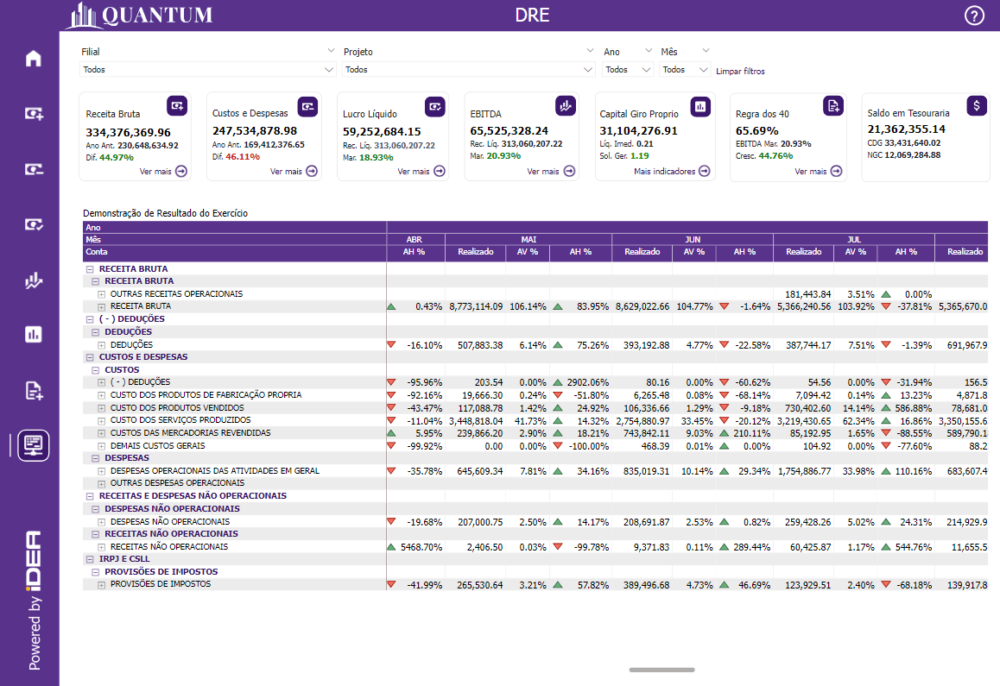
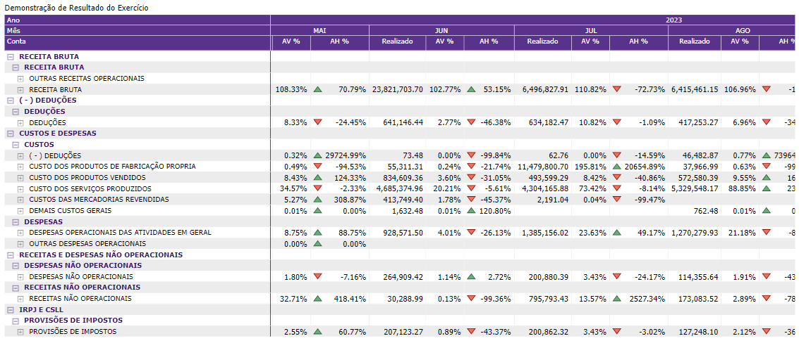

# Demonstração do Resultado do Exercício (DRE)

  
  <h6>Imagem 1: Demonstração do Resultado do Exercício</h6>

A Demonstração do Resultado do Exercício (DRE) é um relatório financeiro que fornece um resumo detalhado das receitas, custos e despesas de uma empresa durante um determinado período, geralmente um trimestre ou ano fiscal. A DRE é crucial porque ajuda as partes interessadas, como investidores, gestores e reguladores, a entenderem o desempenho financeiro da empresa, mostrando como a receita se transforma em lucro ou prejuízo líquido. 

Esse relatório é essencial para avaliar a lucratividade, tomar decisões empresariais informadas e avaliar a saúde financeira e a eficiência operacional da empresa. Ao analisar a DRE, é possível identificar tendências, gerenciar recursos de forma eficaz e desenvolver estratégias para melhorar a lucratividade e sustentar o crescimento.

## Tabela de DRE

  
  <h6>Imagem 2: Tabela de DRE</h6>

A página DRE (Demonstração do Resultado do Exercício) apresenta uma matriz detalhada que mostra os valores realizados, AV% (Variação Absoluta Percentual) e AH% (Variação Absoluta Percentual Histórica) para cada conta e subconta no modelo. Os ícones coloridos indicam variações positivas (verde) e negativas (vermelho), e as colunas são organizadas por ano e/ou mês, enquanto as linhas incluem contas como Receita Bruta, Deduções, Receita Líquida, Custos e Despesas, EBITDA, Receitas e Despesas Não Operacionais, Custos Indiretos (Rateio Adm.), Lucro Antes do IRPJ e CSLL, IRPJ e CSLL, e Lucro Líquido, além de suas subcontas.

### AV% (Variação Absoluta Percentual)
Este indicador mostra a mudança percentual no valor realizado em comparação com o período mais recente. Calculado como a diferença percentual entre o valor atual e o valor do período anterior imediato, o AV% ajuda a identificar variações recentes e a avaliar o impacto das mudanças nas receitas e despesas de um período para o outro. Ícones verdes e vermelhos facilitam a rápida interpretação das variações positivas e negativas.
### AH% (Variação Absoluta Percentual Histórica)
Este indicador compara o valor realizado com o valor do mesmo período no ano anterior, expressando a mudança percentual em relação ao período correspondente do ano passado. O AH% é útil para avaliar o desempenho financeiro ao longo do tempo e entender como as métricas atuais se comparam com o desempenho histórico. Ele ajuda a identificar tendências de longo prazo e a medir o crescimento ou declínio anual em cada conta.

A Demonstração do Resultado do Exercício (DRE) é crucial para a análise financeira, pois fornece uma visão abrangente da rentabilidade da empresa, permitindo uma avaliação detalhada do desempenho operacional e financeiro. A análise das variações AV% e AH% ajuda a compreender as flutuações financeiras, identificar áreas de melhoria e tomar decisões estratégicas baseadas em dados precisos e históricos.

