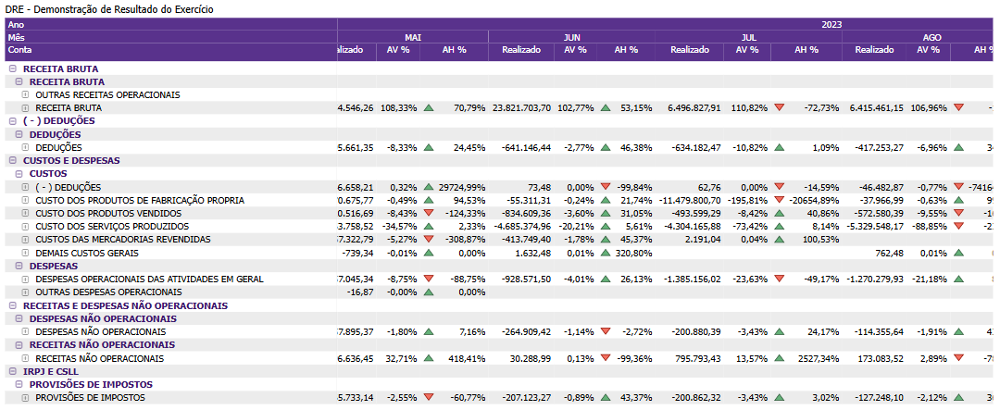

# Painel Demonstração do Resultado do Exercício (DRE)

  
  <h6>Imagem 1: Demonstração do Resultado do Exercício</h6>

A Demonstração do Resultado do Exercício (DRE) é uma das principais ferramentas de análise contábil no Business Intelligence (BI), oferecendo uma visão completa e detalhada da performance financeira de uma empresa ao longo de um período. A DRE expõe de forma clara e estruturada as receitas, custos e despesas, permitindo que gestores, investidores e analistas acompanhem a formação do lucro líquido, que é o resultado final das operações da empresa após todos os encargos e tributações. Monitorar e analisar a DRE é essencial para entender a rentabilidade e a eficiência operacional, proporcionando insights cruciais para decisões estratégicas de curto e longo prazo.

A DRE é amplamente utilizada por sua capacidade de detalhar a origem dos resultados da empresa. Ao segmentar as informações em receitas operacionais, custos de mercadorias vendidas (CMV), despesas operacionais e resultado financeiro, a DRE permite uma análise precisa das áreas que estão gerando valor e das que precisam de ajustes. Esse detalhamento ajuda a identificar quais atividades estão impactando mais diretamente o resultado final e como os diferentes componentes da estrutura de custos e receitas influenciam a lucratividade. Por exemplo, uma análise de DRE pode destacar se a empresa está enfrentando problemas com margens apertadas ou despesas elevadas, facilitando a adoção de medidas corretivas.

Além disso, a DRE facilita comparações internas e externas por meio de técnicas como a Análise Vertical (AV) e Análise Horizontal (AH). A AV expressa cada linha da DRE como uma porcentagem da receita total, permitindo identificar a proporção de cada componente no resultado geral. Essa técnica é especialmente útil para comparar a estrutura de custos de diferentes períodos ou empresas, evidenciando mudanças na eficiência operacional ou na gestão de custos. Por outro lado, a AH foca na evolução dos valores ao longo do tempo, mostrando as variações percentuais entre períodos consecutivos e ajudando a detectar tendências de crescimento ou retração em áreas específicas, como receita, custos e despesas.

Um aspecto fundamental da análise de DRE no BI é a capacidade de desagregar o resultado por segmentos, produtos ou filiais. Isso permite uma compreensão mais aprofundada de quais áreas da empresa estão contribuindo mais para o lucro ou prejuízo, e quais estão drenando recursos. Ao fazer essa análise detalhada, a empresa pode alocar melhor seus recursos, concentrando esforços nas áreas mais lucrativas e corrigindo deficiências nas operações menos eficientes. Esse nível de detalhamento é crucial para garantir a sustentabilidade e o crescimento contínuo, especialmente em mercados competitivos onde a otimização de margens e a gestão de custos são essenciais.

A análise de margens dentro da DRE também é crucial para entender a rentabilidade operacional. Indicadores como a margem de lucro líquido e margem de EBITDA oferecem uma visão clara de como a empresa está gerindo seus custos em relação às receitas geradas. Margens mais altas indicam uma maior eficiência operacional, sugerindo que a empresa consegue manter uma parte significativa de sua receita após cobrir os custos de produção e despesas operacionais. Isso é vital não apenas para a saúde financeira da empresa, mas também para atrair investidores, que tendem a valorizar empresas com altos índices de lucratividade e baixo risco operacional.

Além do impacto direto na contabilidade, a análise da DRE tem repercussões em diversas áreas estratégicas da empresa. A compreensão detalhada do desempenho financeiro através da DRE pode influenciar decisões sobre expansão, corte de custos, reinvestimento de lucros, e até mesmo fusões e aquisições. Como a DRE reflete diretamente a eficiência das operações e a saúde financeira geral da empresa, os gestores podem usar essas informações para ajustar suas estratégias e otimizar os resultados. Em processos de valuation, a DRE é uma métrica fundamental para avaliar o valor de uma empresa, sendo utilizada amplamente por analistas e investidores para medir o desempenho financeiro em negociações e avaliações de mercado.

Em resumo, a Demonstração do Resultado do Exercício (DRE) é uma ferramenta poderosa e indispensável no BI para contabilidade. Sua capacidade de detalhar e segmentar o desempenho financeiro de uma empresa oferece insights valiosos para a gestão eficiente dos negócios. Através de análises de margens, evolução de receitas e despesas, e comparações entre segmentos, a DRE permite que as empresas tomem decisões estratégicas mais informadas, assegurando uma performance financeira robusta e sustentada ao longo do tempo.

## Tabela de DRE - Demonstração do Resultado do Exercício

  
  <h6>Imagem 2: Tabela de DRE - Demonstração do Resultado do Exercício</h6>

Em uma matriz DRE onde os valores são exibidos por mês e ano, a análise se torna ainda mais dinâmica e perspicaz, fornecendo uma perspectiva clara e baseada no tempo sobre o desempenho financeiro do negócio. Cada linha da matriz corresponde a contas específicas, como Receita ou Custos e Despesas, divididos em vários níveis de subcontas. A matriz organiza essas contas juntamente com seus valores correspondentes para Realizado (valores reais), AV% (comparação ano a ano) e AH% (comparação histórica) para cada mês e ano, permitindo a análise de tendências mês a mês e ano a ano.

Ao apresentar dados por mês, as empresas podem acompanhar de perto as flutuações na receita e despesas ao longo do ano, identificando padrões como picos sazonais de vendas ou variações de custo. Por exemplo, uma empresa pode observar vendas mais altas durante períodos de férias ou aumento dos custos operacionais em certos meses, o que pode informar melhor planejamento e orçamento. A coluna Realizado mostra o desempenho financeiro real para cada mês, permitindo que os gerentes comparem como as receitas e os custos mudam ao longo do tempo. Essa granularidade mensal fornece insights imediatos sobre o desempenho operacional de curto prazo da empresa.

O AV% (Análise Vertical) expressa cada item da DRE como uma porcentagem de uma figura base, normalmente a receita total. Esse método permite que os analistas compreendam o peso relativo de cada item, como o custo das mercadorias vendidas ou despesas operacionais, em relação à receita total. A Análise Vertical é essencial para identificar como cada despesa impacta a receita, ajudando a avaliar a eficiência da gestão de custos e a distribuição dos recursos dentro da empresa. Por exemplo, se os custos operacionais representam uma porcentagem crescente da receita ao longo do tempo, isso pode sinalizar potenciais problemas de eficiência.

Por outro lado, o AH% (Análise Horizontal) faz a comparação dos números ao longo do tempo, mostrando o crescimento ou declínio de cada item em relação ao período anterior. Esse método é crucial para identificar tendências e avaliar o crescimento ou declínio no desempenho financeiro ao longo de vários períodos. Por exemplo, um crescimento de 10% nas despesas operacionais em comparação ao ano anterior poderia ser um alerta para investigar potenciais ineficiências ou aumentos de custo.

A inclusão de ícones visuais, como setas ou símbolos codificados por cores na coluna AH%, aprimora ainda mais a análise, oferecendo dicas visuais imediatas sobre tendências de desempenho. Uma seta verde para cima pode indicar melhoria em comparação com médias históricas, enquanto uma seta vermelha para baixo pode significar um declínio. Esses recursos visuais ajudam os tomadores de decisão a compreender rapidamente áreas que exigem atenção, como aumento de custos ou queda de receitas em meses específicos.

Essa matriz DRE, com detalhamento mensal e anual, é essencial para empresas que desejam manter um controle rigoroso de suas finanças. Ao oferecer dados detalhados mês a mês e comparações históricas e anuais mais amplas, a matriz permite que as empresas gerenciem o fluxo de caixa, otimizem a alocação de recursos e garantam a lucratividade. Além disso, apoia a tomada de decisões estratégicas, destacando tanto as flutuações de curto prazo como as tendências de longo prazo, permitindo que as empresas ajustem as suas operações, refinem as suas estratégias e garantam uma saúde financeira sustentada.

Os [filtros](https://idea-technology-it.github.io/docs-idea/contabilidade/intro/#filtros) para Filial, Projeto, e Dimensão em conjunto com a visualização DRE oferecem uma poderosa ferramenta para uma análise financeira altamente segmentada e personalizada. Utilizando esses filtros, os usuários podem isolar o desempenho de filiais específicas, projetos ou centros de custo, permitindo que as empresas vejam com clareza como cada área ou unidade de negócio está contribuindo para os resultados financeiros globais. Por exemplo, ao aplicar o filtro de Filial, é possível analisar o desempenho financeiro individual de uma unidade geográfica, identificando aquelas que estão gerando maior lucro ou enfrentando dificuldades operacionais. Da mesma forma, o filtro de Projeto permite acompanhar os resultados financeiros de iniciativas específicas, possibilitando a avaliação do retorno sobre o investimento de cada projeto. O filtro de Dimensão é especialmente útil para entender como diferentes departamentos ou áreas funcionais estão impactando a margem de lucro e o custo operacional, facilitando a identificação de áreas que necessitam de ajustes ou melhorias.

Além disso, a combinação com os filtros de Ano e Mês oferece uma análise temporal detalhada, permitindo que os usuários visualizem o desempenho ao longo de diferentes períodos. Com o filtro de Ano, é possível comparar a evolução financeira de um período anual para outro, observando tendências de longo prazo e avaliando a eficiência de estratégias implementadas. Já o filtro de Mês permite um acompanhamento mais granular, ajudando a identificar sazonalidades, flutuações de curto prazo ou impactos de eventos específicos que possam ter ocorrido durante o ano. 

Essa interação entre filtros temporais e segmentados capacita a empresa a realizar uma análise financeira mais aprofundada e precisa, oferecendo insights valiosos sobre como decisões estratégicas e operacionais afetam a performance em diferentes níveis e momentos. Isso não só facilita a identificação de áreas de crescimento e oportunidades de otimização, como também oferece uma base sólida para a tomada de decisões rápidas e informadas em um ambiente de negócios dinâmico.

A matriz oferece a funcionalidade de expansão e recolhimento de hierarquias, proporcionando ao usuário a flexibilidade de explorar os dados em diferentes níveis de detalhe. Por exemplo, ao clicar no sinal de mais (+) ao lado de uma conta principal, como Receita ou Despesas Operacionais, a matriz se expande para revelar as subcontas associadas, como Custos dos Produtos Vendidos ou Juros. Isso possibilita uma visão mais granular, permitindo a análise detalhada de onde exatamente estão sendo gerados os custos ou receitas. Da mesma forma, ao recolher (-) essas hierarquias, o usuário pode voltar a uma visão mais resumida, focando apenas nos principais números consolidados. Essa funcionalidade é especialmente útil para empresas que operam com múltiplas filiais, unidades de negócios ou projetos, pois permite acompanhar o desempenho financeiro de forma detalhada e focada, sem perder a visão geral da empresa como um todo.

Para navegar entre os níveis, você tambêm pode usar os [ícones de cabeçalho](https://idea-technology-it.github.io/docs-idea/contabilidade/intro/#icones-de-cabecalho) que estão disponíveis quando você passa o mouse ou clica no gráfico.

  
  <h6>Ícones de Cabeçalho</h6>

Aqui, você pode navegar entre diferentes níveis hierárquicos, como Conta e Subcontas, para analisar a área desejada.

  
***Aviso Legal:** Os números e informações apresentados nesta documentação são baseados em um conjunto de dados fictício. Eles são destinados exclusivamente para fins educacionais e de demonstração. Os dados não refletem condições do mundo real ou métricas de negócios reais e não devem ser usados ​​para tomada de decisão ou análise. Qualquer semelhança com entidades, eventos ou dados reais é mera coincidência.*
