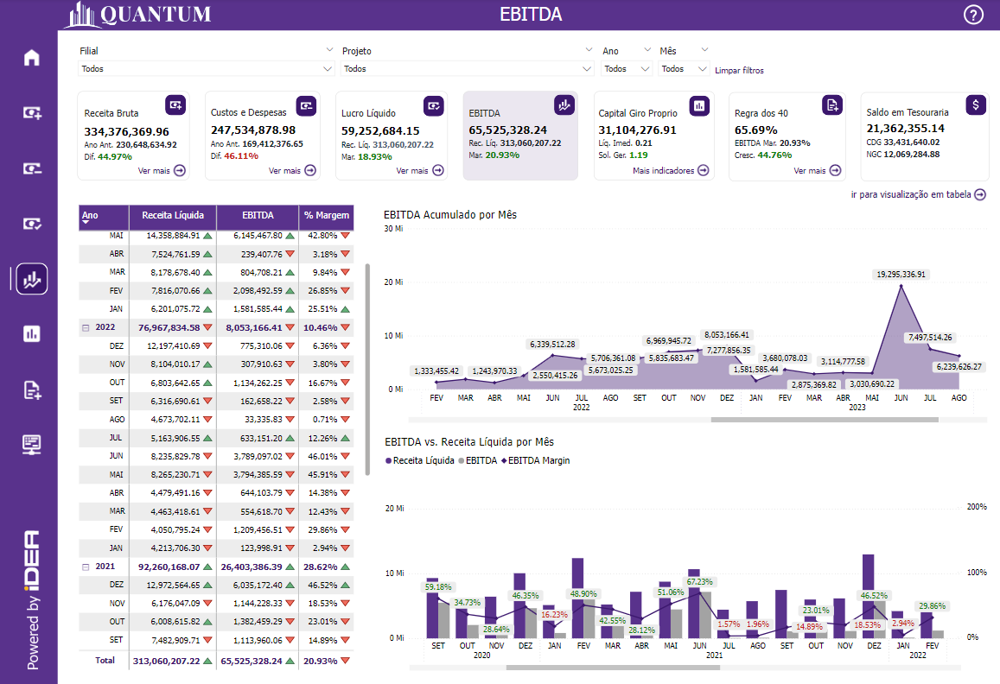
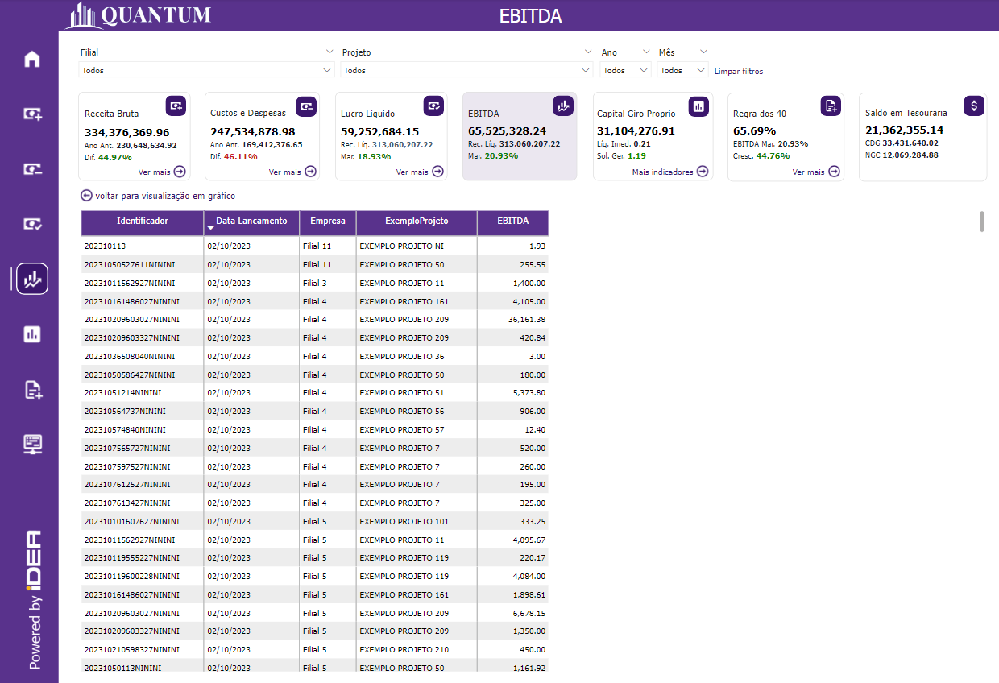
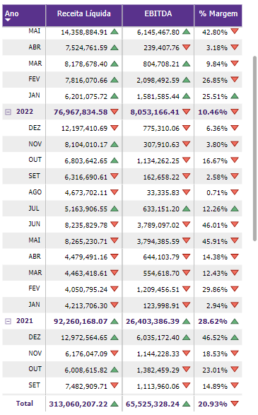
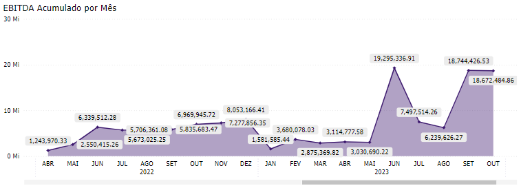
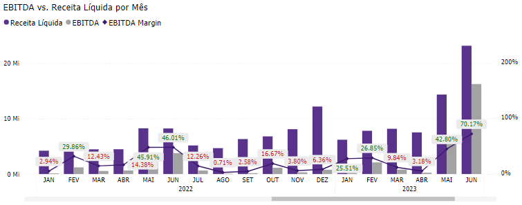
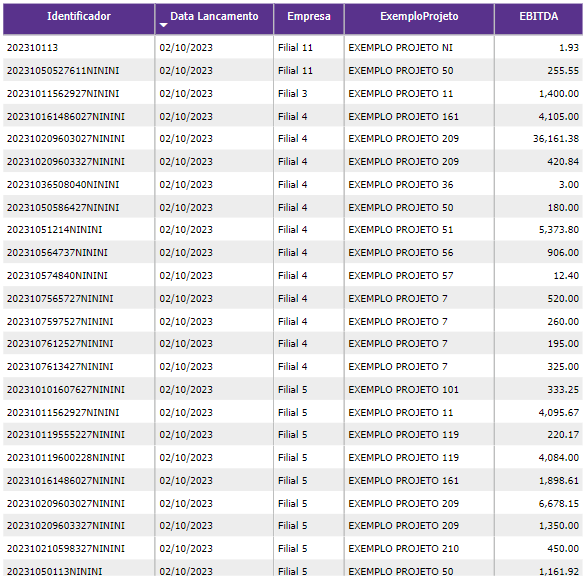

# Painel EBITDA

  
  <h6>Imagem 1: EBITDA Visão Gráfica</h6>
  
  <h6>Imagem 2: EBITDA Visão de Tabela</h6>

EBITDA (Earnings Before Interest, Taxes, Depreciation, and Amortization) é uma métrica financeira que mede o lucro operacional de uma empresa antes da dedução de juros, impostos, depreciação e amortização. Essa métrica é amplamente utilizada para avaliar a performance operacional de uma empresa, pois fornece uma visão clara de quanto a empresa está gerando de lucro a partir de suas operações principais, sem os efeitos de decisões financeiras e contabilísticas.

Ao focar apenas nas receitas e despesas operacionais, o EBITDA ajuda a analisar a eficiência operacional e a rentabilidade da empresa, desconsiderando os impactos de estruturas de capital, políticas fiscais e gastos com ativos de longo prazo. Ele é especialmente útil para comparar empresas dentro do mesmo setor, pois elimina variáveis que podem distorcer a comparação, como diferentes práticas de depreciação e amortização.

O EBITDA é frequentemente usado por investidores e analistas para avaliar a capacidade de uma empresa de gerar fluxo de caixa a partir de suas operações principais e para determinar o valor da empresa através de múltiplos, como o EV/EBITDA (Enterprise Value sobre EBITDA). Uma análise cuidadosa do EBITDA pode fornecer insights sobre a eficiência da empresa em gerar lucro a partir de suas operações principais e sua capacidade de atender a obrigações financeiras e reinvestir no crescimento.

Esta página do relatório é dividida em duas visualizações, visão gráfica e visão de tabela.

Na página de Receita Bruta, você encontrará:

## Visão Gráfica
### Tabela de EBITDA

  
  <h6>Imagem 3: Tabela de EBITDA</h6>

Esta tabela fornece uma visão geral abrangente dos principais indicadores financeiros, exibindo a Receita Líquida, EBITDA e a % Margem (calculada como EBITDA dividido pela Receita Líquida) para cada ano e mês. 

Ícones são usados para representar visualmente as tendências: uma seta verde indica um aumento em comparação com o mesmo período do ano anterior, enquanto uma seta vermelha denota uma diminuição. 

Este recurso visual ajuda a avaliar rapidamente as mudanças no desempenho ao longo do tempo.

### EBITDA Acumulado por Mês

  
  <h6>Imagem 4: EBITDA Acumulado por Mês</h6>

O gráfico de área visualiza o valor acumulado do EBITDA ao longo do tempo, proporcionando uma representação clara de como o EBITDA cresceu ou mudou. 

Ao passar o cursor sobre o gráfico, as dicas de ferramenta mostram informações adicionais, incluindo a Receita Líquida acumulada e a % Margem entre esses valores, oferecendo insights sobre a relação entre receita e lucratividade em diferentes períodos.

### EBITDA vs. Receita Líquida por Mês

  
  <h6>Imagem 5: EBITDA vs. Receita Líquida por Mês</h6>

Este gráfico combina um gráfico de barras e um gráfico de linhas para fornecer uma análise detalhada do EBITDA e da Receita Líquida. 

O gráfico de barras mostra os valores mensais e anuais para o EBITDA e a Receita Líquida, enquanto o gráfico de linhas rastreia a % Margem. 

A linha é codificada por cores: vermelha para margens abaixo de 20% e verde para margens iguais ou superiores a 20%, permitindo uma avaliação visual imediata do desempenho da lucratividade.

## Visão de Tabela
### Tabela de Detalhamento

  
  <h6>Imagem 6: Tabela de Detalhamento</h6>

Esta tabela apresenta dados detalhados de transações com colunas para Identificador (ID da Transação), Data Lançamento (Data da Transação), Filial (Filial), Projeto e EBITDA. 

Ela fornece uma visão granular de cada transação, permitindo que os usuários detalhem informações específicas e analisem o impacto das transações individuais no desempenho geral do EBITDA.

***Aviso Legal:** Os números e informações apresentados nesta documentação são baseados em um conjunto de dados fictício. Eles são destinados exclusivamente para fins educacionais e de demonstração. Os dados não refletem condições do mundo real ou métricas de negócios reais e não devem ser usados ​​para tomada de decisão ou análise. Qualquer semelhança com entidades, eventos ou dados reais é mera coincidência.*
