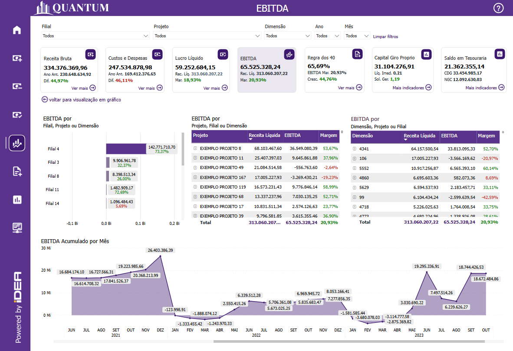
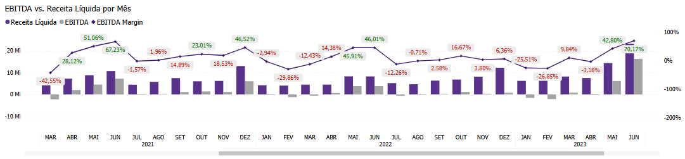

# Painel EBITDA

  
  <h6>Imagem 1: EBITDA Visão Gráfica</h6>
  
  <h6>Imagem 2: EBITDA Visão Acumulado</h6>

## Navegação

O painel de relatórios é projetado com duas visualizações distintas. Alguns visuais são consistentes em ambas as visualizações, enquanto outros são específicos para cada visualização, garantindo que informações relevantes sejam apresentadas de acordo com o contexto de cada perspectiva;

- **[Visão Gráfica e Acumulado](https://idea-technology-it.github.io/docs-idea/contabilidade/ebitda/#visao-grafica-e-acumulado)** - Esses recursos visuais estão disponíveis o tempo todo neste painel.
- **[Visão Gráfica](https://idea-technology-it.github.io/docs-idea/contabilidade/ebitda/#visao-grafica)** - pode ser navegada através do [botão](https://idea-technology-it.github.io/docs-idea/contabilidade/intro/#botoes-para-diferentes-visoes) "voltar para visualização em gráfico".
- **[Visão Acumulado](https://idea-technology-it.github.io/docs-idea/contabilidade/ebitda/#visao-acumulado)** - pode ser navegada através do [botão](https://idea-technology-it.github.io/docs-idea/contabilidade/intro/#botoes-para-diferentes-visoes) "ir para visualização acumulado".

## Informações no Painel EBITDA

### EBITDA (Earnings Before Interest, Taxes, Depreciation, and Amortization)

A análise de EBITDA (Earnings Before Interest, Taxes, Depreciation, and Amortization) que se traduz em Lucro antes de Juros, Impostos, Depreciação e Amortização é um elemento essencial no Business Intelligence (BI) para contabilidade, pois fornece uma visão clara da performance operacional de uma empresa, sem as interferências de despesas não operacionais e custos financeiros. Monitorar e analisar o EBITDA permite que as empresas avaliem a lucratividade operacional pura, ajudando a identificar o potencial de geração de caixa antes de considerar decisões financeiras e políticas fiscais.

O EBITDA é amplamente utilizado na contabilidade e análise financeira porque ele remove da equação fatores que podem variar significativamente entre empresas, como juros sobre dívidas, políticas fiscais e métodos de depreciação/amortização, permitindo uma comparação mais clara do desempenho operacional entre diferentes empresas ou segmentos. Dessa forma, o EBITDA oferece uma métrica que reflete a eficiência operacional de uma empresa, sendo particularmente útil para análises de desempenho e benchmarking.

Um EBITDA de 20% ou mais é considerado um excelente indicador de desempenho financeiro, pois sugere que a empresa está gerando uma margem operacional saudável em relação à sua receita. Essa margem elevada indica eficiência na gestão dos custos operacionais, permitindo que a empresa mantenha uma boa parte de sua receita como lucro antes de descontar juros, impostos, depreciação e amortização. Além disso, um EBITDA robusto proporciona maior flexibilidade financeira, permitindo à empresa reinvestir em crescimento, pagar dívidas ou distribuir dividendos aos acionistas. Essa saúde financeira é frequentemente vista como um sinal positivo para investidores e credores, aumentando a confiança e a possibilidade de captação de recursos para expansão e novos projetos. Em um cenário competitivo, manter um EBITDA acima de 20% pode ser um diferencial significativo, refletindo não apenas a sustentabilidade do negócio, mas também sua capacidade de resistir a flutuações econômicas.

Visualizações como o EBITDA acumulado e o crescimento do EBITDA mês a mês são fundamentais para acompanhar a performance operacional ao longo do tempo. O EBITDA acumulado oferece uma perspectiva de longo prazo, mostrando como a lucratividade operacional se desenvolve e se acumula ao longo de um período específico. Isso ajuda os analistas a identificar tendências operacionais e prever a capacidade futura da empresa de gerar lucro, sem o impacto de fatores externos como dívidas ou custos de depreciação de ativos. Já a comparação do EBITDA mês a mês permite detectar variações de curto prazo no desempenho operacional, como mudanças sazonais, variações nas vendas, ou alterações no controle de custos, possibilitando ajustes rápidos e eficazes nas operações da empresa.

Além disso, a análise detalhada do EBITDA por segmento, produto, filial ou centro de custo é crucial para entender quais áreas da empresa estão gerando mais lucro operacional. A análise por segmento pode revelar quais produtos ou filiais são os mais eficientes e quais áreas estão com baixo desempenho. Essa visão ajuda a empresa a focar seus recursos e esforços nas operações mais rentáveis, além de possibilitar ajustes em áreas que precisam de melhorias, como controle de custos ou otimização de processos.

A análise da margem de EBITDA também é importante, pois fornece insights sobre a eficiência operacional e a gestão de custos diretos, ao mostrar a relação entre receitas e despesas operacionais. Empresas com margens de EBITDA mais altas tendem a ser mais eficientes e possuem um maior potencial de geração de caixa, independentemente das dívidas ou ativos que possuam. Essa análise pode indicar oportunidades para melhorar a eficiência operacional ou identificar a necessidade de ajustes na política de preços e controle de custos diretos.

O impacto da análise de EBITDA vai além do departamento de contabilidade. Os insights obtidos a partir dessa métrica podem influenciar decisões estratégicas em diversas áreas da empresa, como operações, planejamento de investimentos, fusões e aquisições, e planejamento de expansão. O EBITDA é frequentemente usado por investidores e analistas como um indicador de desempenho, justamente por sua capacidade de mostrar a saúde operacional de uma empresa sem o ruído de fatores financeiros e fiscais. Além disso, ele é muito utilizado na avaliação de empresas, sendo uma métrica essencial para medir o valor e o desempenho em processos de valuation.

Em resumo, a análise de EBITDA no BI para contabilidade é uma ferramenta poderosa que oferece uma visão detalhada e precisa da eficiência operacional de uma empresa. Ao examinar o EBITDA acumulado, variações mensais e o detalhamento por segmento, as empresas conseguem identificar claramente suas áreas mais lucrativas e tomar decisões estratégicas mais informadas. Essa análise impacta não apenas a gestão financeira, mas também outras áreas-chave, como planejamento de investimentos, otimização de operações e decisões de expansão, proporcionando um ambiente empresarial mais focado em crescimento e eficiência operacional.

## Visão Gráfica e Acumulado

### EBITDA por Filial, Projeto ou Dimensão

  
  <h6>Imagem 3: EBITDA por Filial, Projeto ou Dimensão</h6>

O gráfico de barras de **EBITDA por Filial, Projeto ou Dimensão** é uma ferramenta poderosa para a análise visual do desempenho operacional da empresa. Ele permite comparar o EBITDA de diferentes filiais, projetos ou dimensões de maneira clara e eficiente, destacando rapidamente as áreas de maior ou menor eficiência operacional. Cada barra do gráfico representa o valor de EBITDA para a respectiva filial, projeto ou dimensão, proporcionando uma visão comparativa instantânea entre os diferentes segmentos da operação.

Além do valor de EBITDA, o gráfico inclui um rótulo detalhado para cada barra que exibe a Margem de EBITDA (%). Esse rótulo possui uma codificação visual que facilita a análise: quando a margem está abaixo de 20%, o texto aparece em vermelho, sinalizando uma margem baixa e alertando para possíveis problemas de eficiência operacional; quando a margem está acima de 20%, o texto aparece em verde, indicando uma margem saudável e sugerindo que o segmento está gerando lucro operacional de forma eficaz. Essa diferenciação visual permite uma avaliação imediata da rentabilidade operacional de cada filial, projeto ou dimensão, ajudando os gestores a identificar rapidamente as áreas que necessitam de melhorias ou ajustes.

A combinação do valor absoluto do EBITDA com a exibição detalhada da Margem de EBITDA (%) em cada barra oferece uma análise completa da saúde financeira de cada segmento. O gráfico é ideal para decisões estratégicas, pois permite uma comparação direta entre diferentes áreas de atuação, facilitando a identificação de quais filiais, projetos ou dimensões estão desempenhando melhor e quais estão enfrentando desafios operacionais.

Além da exibição clara dos valores e das cores para indicar a saúde da margem, o gráfico também oferece uma **interação bidirecional** com outros visuais na página. Ao clicar em outro gráfico, como o gráfico de [EBITDA por Projeto, Filial ou Dimensão](https://idea-technology-it.github.io/docs-idea/contabilidade/ebitda/#ebitda-por-projeto-filial-ou-dimensao) ou [EBITDA por Dimensão, Projeto ou Filial](https://idea-technology-it.github.io/docs-idea/contabilidade/ebitda/#ebitda-por-dimensao-projeto-ou-filial), o gráfico será automaticamente filtrado conforme a seleção, permitindo uma análise mais específica dos resultados financeiros para aquela filial, projeto ou dimensão. Da mesma forma, ao clicar em uma linha do gráfico, outros visuais da página serão ajustados, possibilitando a exploração dos dados de forma interativa e detalhada.

Ao focar em Filial, por exemplo, os gestores podem avaliar a performance regional, comparando o EBITDA entre as diversas unidades e identificando quais regiões estão contribuindo mais para a eficiência operacional da empresa. Quando o gráfico é ajustado para Projeto, ele permite a avaliação de iniciativas específicas, ajudando a determinar quais projetos são mais lucrativos. Já com a visualização por Dimensão, como categorias de produtos ou departamentos, os gestores podem identificar quais áreas da empresa estão gerando maior valor operacional.

Esse gráfico é especialmente útil em relatórios de **Contabilidade**, onde a análise visual clara e detalhada do EBITDA e da Margem de EBITDA (%) oferece uma ferramenta essencial para o acompanhamento da saúde financeira. A combinação de barras de EBITDA com rótulos detalhados facilita a visualização das áreas de sucesso e das que necessitam de atenção, permitindo ajustes estratégicos para maximizar a rentabilidade operacional da empresa.

Para navegar entre os níveis, você pode usar os [ícones de cabeçalho](https://idea-technology-it.github.io/docs-idea/contabilidade/intro/#icones-de-cabecalho) que estão disponíveis quando você passa o mouse ou clica no gráfico.

  
  <h6>Ícones de Cabeçalho</h6>

Aqui, você pode navegar entre diferentes níveis hierárquicos, como Filial, Projeto ou Dimensão, para analisar a área desejada.

### EBITDA por Projeto, Filial ou Dimensão

  
  <h6>Imagem 4: EBITDA por Projeto, Filial ou Dimensão</h6>

A matriz de **EBITDA por Projeto, Filial ou Dimensão** é uma ferramenta essencial para análise detalhada do desempenho operacional, permitindo uma compreensão clara de quais projetos, filiais ou dimensões estão contribuindo positivamente para a eficiência operacional da empresa e quais áreas precisam de atenção. Ao exibir as informações de maneira organizada e acessível, essa matriz proporciona uma visão holística do EBITDA, Receita Operacional Líquida e a Margem de EBITDA (%), ajudando na tomada de decisões estratégicas.

A matriz apresenta os valores absolutos de Receita Operacional Líquida, EBITDA e a Margem de EBITDA (%) para cada projeto, filial ou dimensão. Esses indicadores são fundamentais para avaliar a eficiência operacional de cada segmento da operação. Além disso, a Margem de EBITDA (%) é exibida com um código de cores: quando a margem está abaixo de 20%, o valor é destacado em vermelho, indicando uma baixa eficiência operacional ou potencial risco; quando a margem está acima de 20%, o valor é exibido em verde, sinalizando uma margem saudável e positiva. Essa diferenciação visual facilita a identificação rápida de áreas críticas que requerem ajustes, bem como aquelas que estão superando as expectativas.

Além da exibição clara dos valores e das cores para indicar a saúde da margem, a matriz também oferece uma **interação bidirecional** com outros visuais na página. Ao clicar em outro gráfico, como o gráfico de [EBITDA por Filial, Projeto ou Dimensão](https://idea-technology-it.github.io/docs-idea/contabilidade/ebitda/#ebitda-por-filial-projeto-ou-dimensao) ou [EBITDA por Dimensão, Projeto ou Filial](https://idea-technology-it.github.io/docs-idea/contabilidade/ebitda/#ebitda-por-dimensao-projeto-ou-filial), a matriz será automaticamente filtrada conforme a seleção, permitindo uma análise mais específica dos resultados financeiros para aquela filial, projeto ou dimensão. Da mesma forma, ao clicar em uma linha da matriz, outros visuais da página serão ajustados, possibilitando a exploração dos dados de forma interativa e detalhada.

A matriz permite a expansão e recolhimento de hierarquias, onde o usuário pode explorar os dados em diferentes níveis de detalhe. Por exemplo, ao clicar no sinal de mais (+) ao lado de uma Filial ou Projeto, a tabela se expande para mostrar os valores de Receita Operacional Líquida, EBITDA e Margem de EBITDA relacionados às Dimensões ou subcategorias. Esse nível de detalhamento adicional facilita o acompanhamento do desempenho financeiro em níveis específicos, enquanto a possibilidade de recolher a hierarquia (-) oferece uma visão mais resumida e de alto nível quando necessário.

Com a capacidade de visualizar e comparar os indicadores de Receita Operacional Líquida, EBITDA e Margem de EBITDA (%) por Projeto, Filial ou Dimensão, essa matriz se torna uma ferramenta essencial para a gestão financeira. Sua funcionalidade visual, que diferencia automaticamente margens baixas ou altas através da coloração — com valores de margem abaixo de 20% em vermelho e acima de 20% em verde — proporciona uma análise clara e acessível, permitindo aos gestores identificar rapidamente áreas de baixa eficiência e ajustar estratégias operacionais conforme necessário. A flexibilidade de alternar entre diferentes combinações de visualização aumenta ainda mais o poder da análise, oferecendo múltiplas perspectivas sobre a performance financeira. 

Com essa variação de combinações, os tomadores de decisão podem visualizar a performance financeira sob diferentes ângulos, comparando a eficiência de cada filial, projeto ou dimensão, e detectando rapidamente áreas que precisam de mais atenção. Além disso, ao focar em diferentes categorias, como Filial para comparar a performance regional, Projeto para avaliar iniciativas específicas, ou Dimensão para analisar departamentos ou categorias de produtos, a matriz oferece uma análise aprofundada que facilita a identificação dos pontos fortes e fracos da operação. Essa abordagem dinâmica é especialmente eficaz em relatórios de **Contabilidade**, onde a combinação dessas perspectivas facilita uma visão holística da saúde financeira da empresa, permitindo uma tomada de decisões mais informada e estratégica para maximizar a eficiência e a rentabilidade geral.

Para navegar entre os níveis, você pode usar os [ícones de cabeçalho](https://idea-technology-it.github.io/docs-idea/contabilidade/intro/#icones-de-cabecalho) que estão disponíveis quando você passa o mouse ou clica no gráfico.

  
  <h6>Ícones de Cabeçalho</h6>

Aqui, você pode navegar entre diferentes níveis hierárquicos, como Projeto, Filial ou Dimensão, para analisar a área desejada.

### EBITDA por Dimensão, Projeto ou Filial

  
  <h6>Imagem 5: EBITDA por Dimensão, Projeto ou Filial</h6>

A matriz de EBITDA por Dimensão, Projeto ou Filial é uma ferramenta essencial para realizar uma análise detalhada do desempenho financeiro da empresa, oferecendo uma compreensão clara de quais dimensões, projetos ou filiais estão contribuindo positivamente para o EBITDA e quais áreas necessitam de atenção. Ao organizar as informações de maneira acessível, a matriz fornece uma visão abrangente dos indicadores de EBITDA, Receita Líquida, e Margem de EBITDA (%), auxiliando na tomada de decisões estratégicas.

Os valores absolutos de Receita Líquida, EBITDA e a Margem de EBITDA (%) são exibidos para cada dimensão, projeto ou filial, permitindo uma avaliação precisa da rentabilidade operacional de cada segmento. A Margem de EBITDA (%) possui um código de cores que facilita a identificação de margens de risco ou sucesso: valores abaixo de 20% são destacados em vermelho, indicando baixa lucratividade operacional ou áreas de atenção, enquanto margens acima de 20% aparecem em verde, sinalizando saúde financeira. Essa diferenciação visual imediata ajuda a identificar rapidamente áreas críticas que precisam de ajustes, assim como aquelas que estão gerando resultados positivos.

Além dessa clara exibição de dados e diferenciação visual, a matriz de EBITDA por Dimensão, Projeto ou Filial permite uma interação bidirecional com outros visuais presentes na página. Ao clicar em gráficos como o EBITDA por Filial, Projeto ou Dimensão ou EBITDA por Projeto, Filial ou Dimensão, a matriz será automaticamente filtrada com base na seleção feita, facilitando uma análise mais detalhada e específica dos resultados financeiros daquela dimensão, projeto ou filial. Da mesma forma, ao selecionar uma linha específica na matriz, os outros visuais na página se ajustarão, proporcionando uma exploração interativa dos dados financeiros.

A matriz também oferece a funcionalidade de expansão e recolhimento de hierarquias, permitindo ao usuário explorar os dados em diferentes níveis de detalhe. Por exemplo, ao clicar no sinal de mais (+) ao lado de uma Dimensão ou Projeto, a matriz se expande para mostrar os valores associados de EBITDA, Receita Líquida e Margem de EBITDA para subcategorias ou filiais correspondentes. Essa capacidade de detalhar os dados permite uma análise mais profunda do desempenho financeiro em níveis específicos, enquanto a opção de recolher (-) as hierarquias facilita uma visão mais condensada quando necessário.

Com a capacidade de visualizar e comparar os indicadores de Receita Líquida, EBITDA e Margem de EBITDA (%) por Dimensão, Projeto ou Filial, a matriz se torna indispensável para uma gestão financeira eficaz. A diferenciação de margens baixas ou altas através de coloração – com margens abaixo de 20% destacadas em vermelho e acima de 20% em verde – proporciona uma análise clara, permitindo que os gestores identifiquem rapidamente áreas que requerem ajustes e otimizem suas estratégias. A flexibilidade de alternar entre diferentes combinações de visualização aumenta ainda mais o poder da análise, oferecendo múltiplas perspectivas sobre a performance financeira. Ao focar em categorias como Dimensão, para comparar departamentos ou categorias de produtos, Projeto, para avaliar a lucratividade de iniciativas específicas, ou Filial, para analisar a performance regional, a matriz facilita a identificação de pontos fortes e fracos, permitindo decisões mais informadas. Esse recurso dinâmico se destaca em relatórios de Contabilidade, onde a combinação dessas diferentes perspectivas proporciona uma visão abrangente da saúde financeira da empresa, maximizando a eficácia na gestão da rentabilidade operacional.

Para navegar entre os níveis, você pode usar os [ícones de cabeçalho](https://idea-technology-it.github.io/docs-idea/contabilidade/intro/#icones-de-cabecalho) que estão disponíveis quando você passa o mouse ou clica no gráfico.

  
  <h6>Ícones de Cabeçalho</h6>

Aqui, você pode navegar entre diferentes níveis hierárquicos, como Dimensão, Projeto ou Filial, para analisar a área desejada.

## Visão Gráfica

### Margem de EBITDA por Mês

  
  <h6>Imagem 6: Margem de EBITDA por Mês</h6>

O gráfico de barras de **Margem de EBITDA por Mês** é uma representação visual fundamental para acompanhar o desempenho financeiro da empresa ao longo do tempo, exibindo os dados mês a mês e ano a ano. Ele apresenta duas barras principais: uma para a Receita Líquida e outra para o EBITDA de cada mês. Além das barras, uma linha de tendência é traçada para mostrar a Margem de EBITDA (%) ao longo do tempo, com rótulos detalhados que destacam o percentual de margem. Esses rótulos são codificados por cores para facilitar a análise rápida: quando a margem está abaixo de 20%, o texto é exibido em vermelho, indicando uma margem insatisfatória ou potencial risco financeiro; quando está acima de 20%, o texto aparece em verde, sinalizando uma margem saudável.

Esse gráfico é crucial para a análise do EBITDA, pois permite observar não apenas os valores absolutos de receita e EBITDA, mas também como a margem de EBITDA está evoluindo ao longo dos meses. O monitoramento dessa margem ao longo do tempo ajuda a identificar padrões sazonais, picos de rentabilidade e períodos de baixo desempenho, fornecendo insights valiosos sobre a eficácia das estratégias financeiras e operacionais. A presença da linha de margem também ajuda a contextualizar a relação entre receita e EBITDA: mesmo que a receita seja alta, uma margem de EBITDA baixa pode indicar problemas de controle de custos ou eficiência operacional.

Esse gráfico funciona em conjunto com outros visuais na página, como os gráficos de [EBITDA por Filial, Projeto ou Dimensão](https://idea-technology-it.github.io/docs-idea/contabilidade/lucro_liquido/#lucro-liquido-por-filial-projeto-ou-dimensao), para oferecer uma visão mais completa do desempenho financeiro da empresa. Por exemplo, ao observar uma queda na Margem de EBITDA em determinado mês, o usuário pode interagir com outros gráficos para identificar se essa queda está relacionada a uma filial específica, a um projeto ou a uma dimensão da empresa. Essa capacidade de interação bidirecional entre os visuais permite que o usuário clique em qualquer mês do gráfico de EBITDA por Mês e filtre automaticamente os outros gráficos na página, destacando as filiais, projetos ou dimensões que impactaram o resultado financeiro naquele período. Da mesma forma, ao selecionar uma filial ou projeto específico em outro gráfico, o gráfico de EBITDA por Mês ajustará a exibição para refletir o desempenho daquele segmento ao longo do tempo, facilitando a análise detalhada.

A **interação bidirecional** entre os gráficos oferece uma ferramenta poderosa para explorar os dados de forma dinâmica e identificar rapidamente áreas que requerem atenção. Essa funcionalidade aumenta a profundidade da análise e permite decisões estratégicas mais informadas, já que o usuário pode analisar o desempenho financeiro sob diferentes perspectivas, ajustando os dados conforme necessário para obter insights detalhados sobre o comportamento da margem de EBITDA e seus fatores determinantes.

## Visão Acumulado

### EBITDA Acumulado por Mês

  
  <h6>Imagem 7: Lucro Líquido Acumulado por Mês</h6>

O gráfico de área de **EBITDA Acumulado por Mês** é uma ferramenta visual poderosa para monitorar o crescimento do EBITDA ao longo do tempo. Este gráfico exibe o valor acumulado do EBITDA mês a mês, proporcionando uma visão clara de como o desempenho financeiro da empresa se desenvolve de forma contínua. À medida que o EBITDA é somado mês a mês, o gráfico de área cria uma linha ascendente (ou, em casos de queda, descendente), refletindo o progresso financeiro de maneira cumulativa.

A análise do EBITDA Acumulado é particularmente importante em relatórios de contabilidade, pois permite que os gestores observem o impacto das operações e estratégias ao longo de um período prolongado. Ao invés de apenas visualizar os resultados de meses individuais, este gráfico revela o efeito composto dos ganhos e perdas, possibilitando uma avaliação mais precisa da estabilidade e saúde financeira da empresa. Ele também ajuda a identificar tendências de longo prazo e entender se a empresa está conseguindo manter um crescimento consistente ou se há flutuações que podem sinalizar áreas problemáticas, como aumento de custos operacionais ou redução de eficiência.

A funcionalidade de interação bidirecional com outros visuais na página torna esse gráfico ainda mais valioso. Ao selecionar um ponto no gráfico de EBITDA Acumulado por Mês, os outros visuais, como gráficos de [EBITDA por Projeto, Filial ou Dimensão](https://idea-technology-it.github.io/docs-idea/contabilidade/lucro_liquido/#lucro-liquido-por-projeto-filial-ou-dimensao), serão automaticamente filtrados para destacar quais segmentos da empresa estão contribuindo para o acúmulo de EBITDA ou perda em um determinado período. Isso permite que o usuário identifique, por exemplo, quais filiais ou projetos foram responsáveis por impulsionar o crescimento ou limitar o progresso do EBITDA acumulado. Da mesma forma, ao interagir com gráficos de filiais ou projetos, o gráfico de EBITDA Acumulado será ajustado para refletir o desempenho específico desses segmentos ao longo do tempo.

Essa interatividade possibilita uma análise profunda e detalhada, permitindo aos tomadores de decisão mergulhar nas causas subjacentes dos resultados acumulados, garantindo que estratégias corretivas possam ser implementadas com base em dados concretos. No contexto de contabilidade, onde o acompanhamento contínuo do desempenho financeiro é essencial, esse gráfico não só oferece uma visão clara do histórico financeiro, mas também se torna uma ferramenta essencial para a elaboração de relatórios e previsões financeiras.

  
***Aviso Legal:** Os números e informações apresentados nesta documentação são baseados em um conjunto de dados fictício. Eles são destinados exclusivamente para fins educacionais e de demonstração. Os dados não refletem condições do mundo real ou métricas de negócios reais e não devem ser usados ​​para tomada de decisão ou análise. Qualquer semelhança com entidades, eventos ou dados reais é mera coincidência.*
