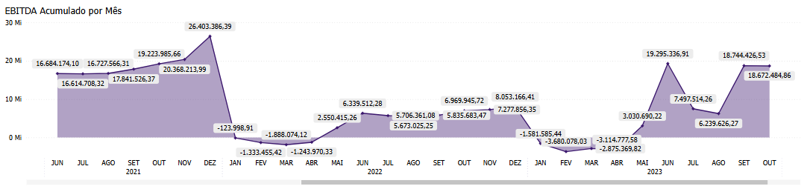

# Painel EBITDA

  
  <h6>Imagem 1: EBITDA Visão Gráfica</h6>
  
  <h6>Imagem 2: EBITDA Visão Acumulado</h6>

## Navegação

O painel de relatórios é projetado com duas visualizações distintas. Alguns visuais são consistentes em ambas as visualizações, enquanto outros são específicos para cada visualização, garantindo que informações relevantes sejam apresentadas de acordo com o contexto de cada perspectiva;

- **[Visão Gráfica e Acumulado](https://idea-technology-it.github.io/docs-idea/contabilidade/ebitda/#visao-grafica-e-acumulado)** - Esses recursos visuais estão disponíveis o tempo todo neste painel.
- **[Visão Gráfica](https://idea-technology-it.github.io/docs-idea/contabilidade/ebitda/#visao-grafica)** - pode ser navegada através do [botão](https://idea-technology-it.github.io/docs-idea/contabilidade/intro/#botoes-para-diferentes-visoes) "voltar para visualização em gráfico".
- **[Visão Acumulado](https://idea-technology-it.github.io/docs-idea/contabilidade/ebitda/#visao-acumulado)** - pode ser navegada através do [botão](https://idea-technology-it.github.io/docs-idea/contabilidade/intro/#botoes-para-diferentes-visoes) "ir para visualização acumulado".

## Informações no Painel EBITDA

EBITDA (Earnings Before Interest, Taxes, Depreciation, and Amortization) é uma métrica financeira que mede o lucro operacional de uma empresa antes da dedução de juros, impostos, depreciação e amortização. Essa métrica é amplamente utilizada para avaliar a performance operacional de uma empresa, pois fornece uma visão clara de quanto a empresa está gerando de lucro a partir de suas operações principais, sem os efeitos de decisões financeiras e contabilísticas.

Ao focar apenas nas receitas e despesas operacionais, o EBITDA ajuda a analisar a eficiência operacional e a rentabilidade da empresa, desconsiderando os impactos de estruturas de capital, políticas fiscais e gastos com ativos de longo prazo. Ele é especialmente útil para comparar empresas dentro do mesmo setor, pois elimina variáveis que podem distorcer a comparação, como diferentes práticas de depreciação e amortização.

O EBITDA é frequentemente usado por investidores e analistas para avaliar a capacidade de uma empresa de gerar fluxo de caixa a partir de suas operações principais e para determinar o valor da empresa através de múltiplos, como o EV/EBITDA (Enterprise Value sobre EBITDA). Uma análise cuidadosa do EBITDA pode fornecer insights sobre a eficiência da empresa em gerar lucro a partir de suas operações principais e sua capacidade de atender a obrigações financeiras e reinvestir no crescimento.

## Visão Gráfica e Acumulado

### EBITDA por Filial, Projeto ou Dimensão

  
  <h6>Imagem 3: EBITDA por Filial, Projeto ou Dimensão</h6>

### EBITDA por Projeto, Filial ou Dimensão

  
  <h6>Imagem 4: EBITDA por Projeto, Filial ou Dimensão</h6>

### EBITDA por Dimensão, Projeto ou Filial

  
  <h6>Imagem 5: EBITDA por Dimensão, Projeto ou Filial</h6>

## Visão Gráfica

### Margem de EBITDA por Mês

  
  <h6>Imagem 6: Margem de EBITDA por Mês</h6>

## Visão Acumulado

### Lucro Líquido Acumulado por Mês

  
  <h6>Imagem 7: Lucro Líquido Acumulado por Mês</h6>

  
***Aviso Legal:** Os números e informações apresentados nesta documentação são baseados em um conjunto de dados fictício. Eles são destinados exclusivamente para fins educacionais e de demonstração. Os dados não refletem condições do mundo real ou métricas de negócios reais e não devem ser usados ​​para tomada de decisão ou análise. Qualquer semelhança com entidades, eventos ou dados reais é mera coincidência.*
