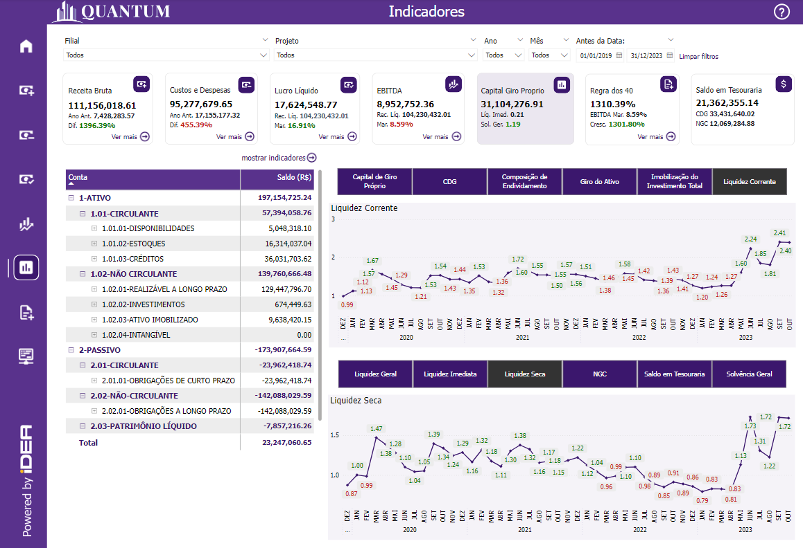
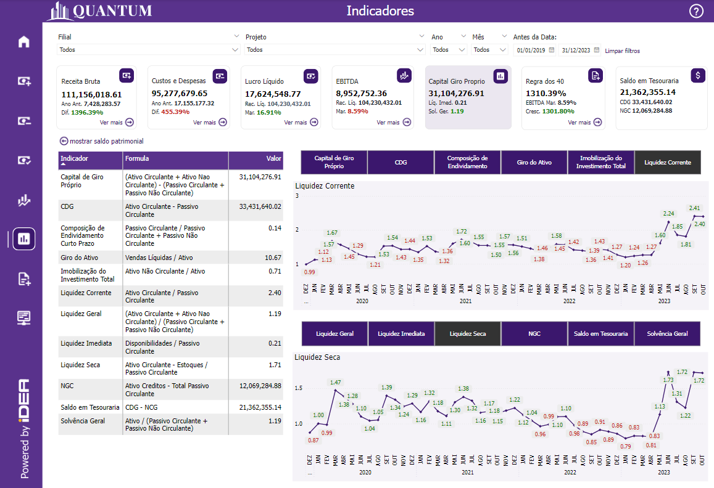
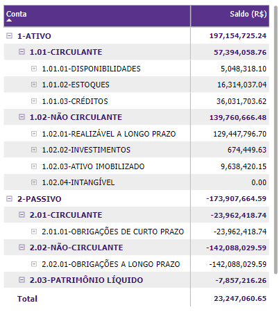
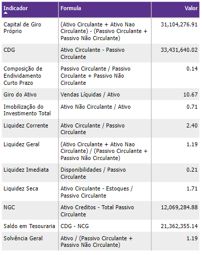
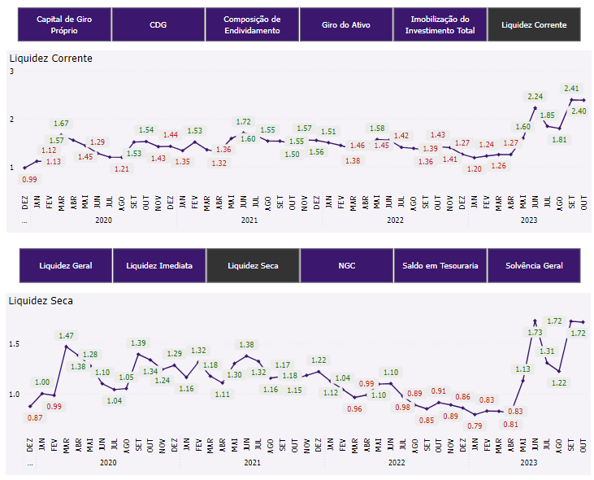

# Painel Indicadores

  
  <h6>Imagem 1: Indicadores Visão de Matrix de Saldo Acumulado por Contas e Subcontas</h6>
  
  <h6>Imagem 2: Indicadores Visão de Tabela de Indicadores</h6>

Os indicadores financeiros são ferramentas essenciais para avaliar a saúde e a sustentabilidade de uma empresa. Eles fornecem uma visão detalhada sobre diferentes aspectos financeiros, como liquidez, endividamento, eficiência operacional e capacidade de financiamento. 

Estes indicadores ajudam gestores e investidores a entenderem como a empresa está performando, identificar áreas que precisam de atenção e tomar decisões informadas para melhorar a estratégia financeira. Para uma análise aprofundada, esses indicadores são representados em gráficos de linha, permitindo acompanhar sua evolução ao longo do tempo. 

Em nossa página de indicadores, os indicadores selecionados são exibidos em dois gráficos de linha distintos, que podem ser acessados e alternados através de botões específicos. Isso proporciona uma visualização clara das tendências e variações em cada indicador, facilitando a interpretação dos dados e a tomada de decisões estratégicas.

Os seguintes indicadores estão incluídos na página de indicadores dedicada;

-	Capital de Giro Próprio
- CDG (Capital de Giro)
- Composição de Endividamento
- Giro do Ativo
- Imobilização do Investimento Total
- Liquidez Corrente
- Liquidez Geral
- Liquidez Imediata
- Liquidez Seca
- NGC (Necessidade de Capital de Giro)
- Saldo em Tesouraria
- Solvência Geral

Para acessar a Matrix de Saldo Acumulado por Contas e Subcontas, clique no botão 'Mostrar Saldo Patrimonial' se ela não estiver visível na página. Além disso, a Tabela de Indicadores proporciona uma análise detalhada dos principais indicadores financeiros e é acessível através do botão 'Mostrar Indicadores', caso não esteja atualmente em exibição. Esses botões facilitam a navegação entre diferentes visualizações e ajudam a obter uma compreensão completa da situação financeira da empresa, Mantendo a visualização dos gráficos de linha dos indicadores.

Na página de Indicadores, você encontrará:

## Matrix de Saldo Acumulado por Contas e Subcontas

  
  <h6>Imagem 3: Matrix de Saldo Acumulado por Contas e Subcontas</h6>

A matriz que apresenta o saldo acumulado por contas principais e suas respectivas subcontas oferece uma visão abrangente e detalhada da estrutura financeira da empresa. Esta matriz inclui as principais contas de Ativo e Passivo, e suas subdivisões, como Ativo Circulante, Ativo Não Circulante, Passivo Circulante, Passivo Não Circulante e Passivo Patrimônio Líquido, além das subcontas associadas a cada uma dessas categorias. 

A visualização dos saldos acumulados permite avaliar como os recursos estão distribuídos e como as obrigações são estruturadas ao longo do tempo. 

Analisando esses dados, é possível identificar tendências e padrões, como a alocação de ativos e passivos, e avaliar a saúde financeira da empresa com base na evolução de cada conta e subconta. 

Essa matriz é essencial para a compreensão detalhada da posição financeira da empresa e para a realização de análises estratégicas e de planejamento financeiro.

## Tabela de Indicadores

  
  <h6>Imagem 4: Tabela de Indicadores</h6>

A Tabela de Indicadores exibe uma lista detalhada dos principais indicadores financeiros, incluindo a fórmula utilizada para cada cálculo e o valor atual correspondente. 

Esta tabela é uma ferramenta valiosa para usuários que precisam de uma visão clara e precisa dos indicadores financeiros da empresa. Com a tabela, os usuários podem verificar como cada indicador é calculado e acompanhar os valores em tempo real, facilitando a compreensão dos resultados financeiros e a avaliação da performance da empresa. 

A transparência nas fórmulas e a visualização direta dos valores ajudam a identificar tendências, fazer comparações e tomar decisões informadas com base em dados financeiros precisos e atualizados.

## Gráficos de Linhas por Indicadores

  
  <h6>Imagem 5: Gráficos de Linhas por Indicadores</h6>

Existem dois gráficos de linha controlados por dois conjuntos de botões. Cada botão mudará o gráfico de linha diretamente abaixo para o Indicador representado pelo botão.

Existem doze botões para doze indicadores. Abaixo está uma explicação mais detalhada de cada um;

### Capital de Giro Próprio
Refere-se ao capital que a empresa possui disponível para financiar suas operações diárias, após a dedução de suas dívidas de curto prazo. Ele indica a saúde financeira da empresa, mostrando a capacidade de manter suas operações sem depender de financiamento externo.
### CDG (Capital de Giro)
Representa o montante de recursos que a empresa necessita para cobrir suas obrigações de curto prazo, garantindo que as operações diárias possam continuar sem interrupções. É um indicador chave da liquidez operacional da empresa.
### Composição de Endividamento
Refere-se à proporção das dívidas de curto e longo prazo em relação ao total de passivos da empresa. Esse indicador mostra a estrutura de financiamento da empresa e sua dependência de capital externo para operar.
### Giro do Ativo
Mede a eficiência com que a empresa utiliza seus ativos para gerar receita. É calculado dividindo a Receita Líquida pelos Ativos Totais, indicando a produtividade dos ativos em relação às vendas.
### Imobilização do Investimento Total
Representa a porcentagem do investimento total da empresa que está imobilizado em ativos fixos, como imóveis, maquinário e equipamentos. Esse indicador mostra quanto do capital da empresa está atrelado a ativos de longo prazo.
### Liquidez Corrente
Indica a capacidade da empresa em pagar suas obrigações de curto prazo com seus ativos circulantes. É calculada dividindo os Ativos Circulantes pelos Passivos Circulantes, fornecendo uma visão da liquidez de curto prazo da empresa.
### Liquidez Geral
Mede a capacidade da empresa em honrar suas obrigações, tanto de curto quanto de longo prazo, utilizando seus ativos circulantes e realizáveis a longo prazo. É um indicador da solvência financeira a longo prazo da empresa.
### Liquidez Imediata
Refere-se à capacidade da empresa em liquidar suas obrigações de curto prazo utilizando seus ativos de alta liquidez, como caixa e equivalentes de caixa. Esse indicador mostra a posição de liquidez imediata da empresa.
### Liquidez Seca
Semelhante à Liquidez Corrente, mas exclui os estoques dos Ativos Circulantes. Esse indicador é utilizado para avaliar a capacidade da empresa em honrar suas dívidas de curto prazo sem depender da venda de estoques.
### NGC (Necessidade de Capital de Giro)
Refere-se ao capital necessário para financiar o ciclo operacional da empresa, cobrindo o período entre o pagamento de seus fornecedores e o recebimento de suas vendas. Esse indicador mostra a necessidade de recursos para manter as operações contínuas.
### Saldo em Tesouraria
Representa o valor disponível em caixa após a empresa ter cumprido todas as suas obrigações de curto prazo. É um indicador crucial da saúde financeira e da capacidade de lidar com contingências.
### Solvência Geral
Mede a capacidade de uma empresa em cumprir todas as suas obrigações financeiras, utilizando todos os seus ativos. Esse indicador reflete a sustentabilidade financeira da empresa a longo prazo.

***Aviso Legal:** Os números e informações apresentados nesta documentação são baseados em um conjunto de dados fictício. Eles são destinados exclusivamente para fins educacionais e de demonstração. Os dados não refletem condições do mundo real ou métricas de negócios reais e não devem ser usados ​​para tomada de decisão ou análise. Qualquer semelhança com entidades, eventos ou dados reais é mera coincidência.*
