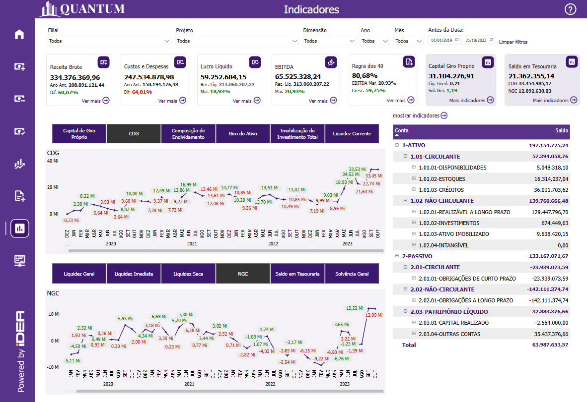

# Painel Indicadores

  
  <h6>Imagem 1: Indicadores - Visão Saldo Patrimonial</h6>
  
  <h6>Imagem 2: Indicadores - Visão Indicadores</h6>

## Navegação

O painel de relatórios é projetado com duas visualizações distintas. Alguns visuais são consistentes em ambas as visualizações, enquanto outros são específicos para cada visualização, garantindo que informações relevantes sejam apresentadas de acordo com o contexto de cada perspectiva;

- **[Visão Saldo Patrimonial e Indicadores](https://idea-technology-it.github.io/docs-idea/contabilidade/receita_bruta/#visao-saldo-patrimonial-e-indicadores)** - pode ser navegada através do [botão](https://idea-technology-it.github.io/docs-idea/contabilidade/intro/#botoes-para-diferentes-visoes) "mostrar saldo patrimonial" ou "mostrar indicadores".
- **[Visão Saldo Patrimonial](https://idea-technology-it.github.io/docs-idea/contabilidade/receita_bruta/#visao-saldo-patrimonial)** - pode ser navegada através do [botão](https://idea-technology-it.github.io/docs-idea/contabilidade/intro/#botoes-para-diferentes-visoes) "mostrar saldo patrimonial".
- **[Visão Indicadores](https://idea-technology-it.github.io/docs-idea/contabilidade/receita_bruta/#visao-indicadores)** - pode ser navegada através do [botão](https://idea-technology-it.github.io/docs-idea/contabilidade/intro/#botoes-para-diferentes-visoes) "mostrar indicadores".

## Informações no Painel Indicadores

O Painel Indicadores é uma ferramenta essencial para o gerenciamento e análise detalhada da saúde financeira e eficiência operacional da empresa. Ele apresenta uma série de indicadores-chave que oferecem uma visão abrangente e estratégica sobre diversos aspectos financeiros, facilitando a tomada de decisões e a implementação de estratégias eficazes.

A visualização dos indicadores é feita através de um gráfico de linhas, onde cada linha representa um ano específico e o eixo x mostra os meses. Esse formato permite uma análise detalhada das tendências ao longo do tempo, revelando como os indicadores evoluem e como variações sazonais ou anuais impactam a saúde financeira da empresa. A visualização temporal é fundamental para entender a dinâmica dos negócios, identificar padrões sazonais e antecipar tendências futuras. Com o gráfico de linhas, é possível comparar o desempenho de diferentes anos, avaliar o impacto de mudanças estratégicas e observar a evolução dos indicadores ao longo de períodos prolongados.

Além do gráfico de linhas, o Painel Indicadores inclui três gráficos de barras que fornecem uma análise detalhada do desempenho em diferentes áreas, como filiais, centros de custo ou departamentos. Esses gráficos de barras permitem uma comparação clara e direta entre diferentes categorias, ajudando a identificar quais áreas estão mais eficientes e onde há oportunidades para melhorias. A segmentação é essencial para uma gestão mais granular, permitindo que os gestores possam avaliar o desempenho em diferentes níveis da organização e identificar áreas que necessitam de atenção ou de estratégias específicas.

Os indicadores apresentados no painel são fundamentais para o acompanhamento da saúde financeira da empresa e para a análise de sua eficiência operacional. Aqui está um detalhamento mais aprofundado de cada indicador:

### Capital de Giro Próprio
Este indicador representa o valor do capital de giro que a empresa possui sem recorrer a financiamentos externos. Ele é crucial para avaliar a capacidade da empresa de manter suas operações diárias e cobrir suas obrigações de curto prazo. Monitorar o Capital de Giro Próprio ajuda a identificar a solidez financeira e a sustentabilidade das operações da empresa.

### CDG (Capital de Giro)
O Capital de Giro (CDG) é a diferença entre os ativos circulantes e os passivos circulantes. Esse indicador é essencial para entender a capacidade da empresa de financiar suas operações e cobrir suas obrigações de curto prazo. A análise do CDG permite avaliar a eficiência na gestão dos recursos de curto prazo e identificar possíveis necessidades de financiamento adicional.

### Composição de Endividamento
Este indicador avalia a estrutura de endividamento da empresa, mostrando a proporção de dívidas em relação ao total de ativos. É fundamental para entender o nível de risco financeiro e a dependência de financiamentos externos. Uma análise da composição de endividamento ajuda a avaliar a saúde financeira e a sustentabilidade a longo prazo da empresa.

### Giro do Ativo
O Giro do Ativo mede a eficiência com que a empresa utiliza seus ativos para gerar receita. Um giro do ativo mais alto indica uma utilização mais eficiente dos ativos. Esse indicador é crucial para avaliar a eficácia operacional e identificar oportunidades para melhorar a eficiência na utilização dos recursos.

### Imobilização do Investimento Total
Esse indicador avalia a proporção do investimento total da empresa que está imobilizado em ativos fixos. Ele ajuda a entender a estrutura de investimento da empresa e a capacidade de alocar recursos para expansão ou crescimento. Uma alta imobilização pode indicar menos flexibilidade financeira.

### Liquidez Corrente
A Liquidez Corrente mede a capacidade da empresa de pagar suas obrigações de curto prazo com seus ativos circulantes. Esse indicador é essencial para avaliar a saúde financeira e a capacidade de manter operações diárias sem dificuldades de liquidez.

### Liquidez Geral
A Liquidez Geral é uma medida mais abrangente da capacidade da empresa de cumprir suas obrigações de curto e longo prazo, considerando todos os ativos e passivos. Esse indicador é crucial para entender a saúde financeira geral da empresa e sua capacidade de enfrentar situações financeiras adversas.

### Liquidez Imediata
A Liquidez Imediata avalia a capacidade da empresa de pagar suas obrigações de curto prazo com seus ativos líquidos mais imediatos, como caixa e equivalentes. Esse indicador é importante para avaliar a disponibilidade de recursos líquidos para cobrir necessidades urgentes.

### Liquidez Seca
A Liquidez Seca é uma medida da capacidade da empresa de pagar suas obrigações de curto prazo sem contar com o estoque. Esse indicador é útil para entender a capacidade de manter a liquidez em situações onde a conversão de estoques em dinheiro não é imediata.

### NGC (Necessidade de Capital de Giro)
A Necessidade de Capital de Giro (NGC) indica o montante de capital necessário para financiar as operações diárias da empresa. Esse indicador ajuda a avaliar a eficiência na gestão do capital de giro e a identificar se há necessidade de financiamento adicional.

### Saldo em Tesouraria
O Saldo em Tesouraria representa o valor disponível em caixa e equivalentes. Esse indicador é crucial para entender a posição de liquidez da empresa e sua capacidade de atender a obrigações financeiras imediatas.

### Solvência Geral
A Solvência Geral avalia a capacidade da empresa de pagar todas as suas dívidas, incluindo dívidas de longo prazo, com todos os seus ativos. Esse indicador é fundamental para entender a estabilidade financeira e a capacidade de enfrentar compromissos financeiros a longo prazo.

O Painel Indicadores, com sua combinação de gráficos de linhas e barras, oferece uma visão clara e integrada do desempenho financeiro e da eficiência operacional. Ele ajuda a identificar tendências, monitorar o cumprimento de metas e avaliar a eficácia das estratégias. Com essas informações, os gestores podem tomar decisões informadas, ajustar suas abordagens e implementar ações corretivas para melhorar a performance geral da empresa, garantindo uma gestão financeira e operacional mais eficiente e eficaz.

## Visão Saldo Patrimonial

### Botões para Seleção

  
  <h6>Imagem 2: Botões para Seleção</h6>

  
  <h6>Imagem 2: Botões para Seleção</h6>

O conjunto de botões interativos é uma ferramenta essencial para personalizar a visualização dos dados no painel. Cada botão representa um dos indicadores-chave de contabilidade: Capital de Giro Próprio, CDG (Capital de Giro), Composição de Endividamento, Giro do Ativo, Imobilização do Investimento Total, Liquidez Corrente, Liquidez Geral, Liquidez Imediata, Liquidez Seca, NGC (Necessidade de Capital de Giro), Saldo em Tesouraria e Solvência Geral. Ao clicar em um dos botões, a página é filtrada para exibir informações específicas relacionadas ao indicador selecionado, ajustando os visuais principais para refletir os dados correspondentes.

Essa funcionalidade é particularmente útil para uma análise detalhada e dinâmica. Ao selecionar um botão, o usuário pode concentrar-se instantaneamente em um aspecto específico da saúde financeira da empresa, como o impacto da liquidez corrente ou a variação no capital de giro. Os visuais principais da página, que podem incluir gráficos de linhas, gráficos de barras e outras visualizações, são automaticamente atualizados para apresentar informações relevantes sobre o indicador escolhido.

A capacidade de alternar rapidamente entre diferentes indicadores e ver como cada um afeta os dados principais oferece uma compreensão mais completa e detalhada da performance financeira da empresa. Por exemplo, ao selecionar "Liquidez Corrente", todos os visuais são ajustados para mostrar o desempenho da liquidez ao longo do tempo, por filiais, e entre diferentes períodos, facilitando a identificação de padrões e comparações entre segmentos. Da mesma forma, ao escolher "Capital de Giro", o usuário pode analisar como o capital de giro é distribuído entre as diferentes áreas da empresa e como isso varia ao longo dos períodos.

Esse nível de interatividade não só melhora a experiência do usuário, mas também proporciona uma análise mais eficaz e informada, permitindo que os gestores tomem decisões mais precisas e fundamentadas com base nas informações detalhadas apresentadas.

### Saldo Patrimonial por Conta e Subconta

  
  <h6>Imagem 3: Saldo Patrimonial por Conta e Subconta</h6>

A matriz que apresenta o saldo acumulado por contas principais e suas respectivas subcontas oferece uma visão abrangente e detalhada da estrutura financeira da empresa. Esta matriz inclui as principais contas de Ativo e Passivo, e suas subdivisões, como Ativo Circulante, Ativo Não Circulante, Passivo Circulante, Passivo Não Circulante e Passivo Patrimônio Líquido, além das subcontas associadas a cada uma dessas categorias. 

A visualização dos saldos acumulados permite avaliar como os recursos estão distribuídos e como as obrigações são estruturadas ao longo do tempo. 

Analisando esses dados, é possível identificar tendências e padrões, como a alocação de ativos e passivos, e avaliar a saúde financeira da empresa com base na evolução de cada conta e subconta. 

Essa matriz é essencial para a compreensão detalhada da posição financeira da empresa e para a realização de análises estratégicas e de planejamento financeiro.

## Visão Indicadores

### Tabela de Indicadores

  
  <h6>Imagem 4: Tabela de Indicadores</h6>

A Tabela de Indicadores exibe uma lista detalhada dos principais indicadores financeiros, incluindo a fórmula utilizada para cada cálculo e o valor atual correspondente. 

Esta tabela é uma ferramenta valiosa para usuários que precisam de uma visão clara e precisa dos indicadores financeiros da empresa. Com a tabela, os usuários podem verificar como cada indicador é calculado e acompanhar os valores em tempo real, facilitando a compreensão dos resultados financeiros e a avaliação da performance da empresa. 

A transparência nas fórmulas e a visualização direta dos valores ajudam a identificar tendências, fazer comparações e tomar decisões informadas com base em dados financeiros precisos e atualizados.

## Visão Saldo Patrimonial e Indicadores

### Indicador por Tempo

  
  <h6>Imagem 5: Indicador por Tempo</h6>

O Painel Indicadores oferece uma análise aprofundada do desempenho financeiro da empresa através de gráficos de linhas, que são essenciais para entender as tendências temporais dos indicadores-chave. Esses gráficos são divididos em dois conjuntos distintos de indicadores, permitindo a visualização simultânea de duas métricas diferentes. Cada gráfico utiliza linhas para representar diferentes anos, enquanto o eixo x é segmentado por meses, proporcionando uma visão detalhada e contínua das variações ao longo do tempo.

O primeiro conjunto de indicadores inclui:
- **Capital de Giro Próprio**
- **CDG (Capital de Giro)**
- **Composição de Endividamento**
- **Giro do Ativo**
- **Imobilização do Investimento Total**
- **Liquidez Corrente**

Cada um desses indicadores é crucial para avaliar a saúde financeira da empresa de diferentes ângulos. Por exemplo, o **Capital de Giro Próprio** e o **CDG (Capital de Giro)** fornecem uma visão sobre a capacidade da empresa de financiar suas operações e crescer de forma sustentável. A **Composição de Endividamento** ajuda a entender a estrutura de capital e o nível de risco financeiro. O **Giro do Ativo** e a **Imobilização do Investimento Total** oferecem insights sobre a eficiência no uso dos ativos e investimentos. A **Liquidez Corrente** mede a capacidade da empresa de cumprir suas obrigações de curto prazo.

O segundo conjunto de indicadores é composto por:
- **Liquidez Geral**
- **Liquidez Imediata**
- **Liquidez Seca**
- **NGC (Necessidade de Capital de Giro)**
- **Saldo em Tesouraria**
- **Solvência Geral**

Esses indicadores fornecem uma visão complementar sobre a capacidade da empresa de gerenciar seus recursos financeiros e manter a estabilidade financeira. A **Liquidez Geral**, **Liquidez Imediata** e **Liquidez Seca** avaliam a capacidade da empresa de enfrentar obrigações de curto e longo prazo, ajustando-se a diferentes cenários de liquidez. O **NGC (Necessidade de Capital de Giro)** mostra a quantidade de capital necessário para sustentar as operações diárias. O **Saldo em Tesouraria** reflete a posição de caixa disponível, enquanto a **Solvência Geral** oferece uma visão sobre a capacidade da empresa de atender suas dívidas no longo prazo.

A possibilidade de visualizar dois indicadores simultaneamente oferece uma análise mais rica e contextualizada. Por exemplo, ao comparar **Capital de Giro Próprio** com **Liquidez Corrente**, é possível entender como a capacidade de financiar as operações afeta a liquidez da empresa. Da mesma forma, analisar **Giro do Ativo** ao lado de **Imobilização do Investimento Total** pode revelar como a eficiência no uso dos ativos impacta o retorno sobre investimentos.

A interação com os gráficos permite que os usuários selecionem e visualizem indicadores específicos, ajustando a análise para responder a perguntas e cenários financeiros variados. Os gráficos de linhas interativos, ajustados por meio de botões para seleção, oferecem uma visão clara e integrada dos dados financeiros ao longo do tempo. Essa funcionalidade é crucial para identificar padrões, tendências e anomalias, possibilitando uma melhor compreensão do desempenho financeiro e facilitando o planejamento estratégico e a implementação de medidas corretivas.

Essa abordagem de visualização não só melhora a experiência do usuário, mas também permite uma análise mais detalhada e fundamentada, ajudando os gestores a tomar decisões informadas e ajustar estratégias com base em uma visão abrangente da saúde financeira da empresa.

  
***Aviso Legal:** Os números e informações apresentados nesta documentação são baseados em um conjunto de dados fictício. Eles são destinados exclusivamente para fins educacionais e de demonstração. Os dados não refletem condições do mundo real ou métricas de negócios reais e não devem ser usados ​​para tomada de decisão ou análise. Qualquer semelhança com entidades, eventos ou dados reais é mera coincidência.*
