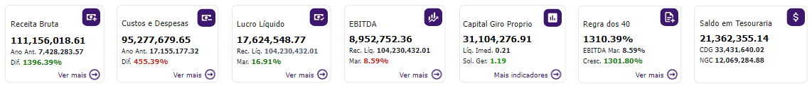
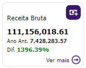
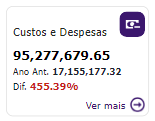
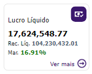
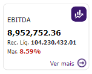
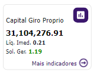
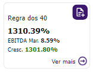
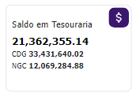

# Indicadores Contábeis

  
  <h6>Imagem 1: Indicadores Contábeis</h6>

Em cada página do nosso relatório no Power BI, você encontrará caixas de indicadores posicionadas de forma proeminente no topo. Essas caixas não são apenas marcadores; elas são ferramentas vitais projetadas para aprimorar sua experiência de relatório ao exibir de maneira consistente valores-chave que são centrais para a análise de cada página. As informações fornecidas nessas caixas de indicadores servem como uma referência rápida, garantindo que você possa acompanhar os dados críticos sem precisar navegar para frente e para trás entre as diferentes páginas do relatório.

Uma das grandes vantagens dessas caixas de indicadores é a sua consistência. Os valores exibidos permanecem uniformes ao longo do relatório, permitindo um fluxo contínuo de informações à medida que você avança por diferentes seções. Essa consistência significa que, independentemente da página em que você esteja, você sempre terá acesso aos mesmos pontos de dados essenciais, facilitando a manutenção de uma visão clara das principais métricas do relatório. Esse recurso é particularmente útil ao realizar análises detalhadas, pois elimina a necessidade de se reorientar constantemente com os dados.

Além disso, os valores apresentados nessas caixas de indicadores estão dinamicamente vinculados aos filtros aplicados no relatório. Essa integração garante que, à medida que você aplica diferentes filtros para refinar sua análise, os valores nas caixas de indicadores serão ajustados automaticamente para refletir os dados filtrados. Essa interação dinâmica torna sua análise não apenas mais eficiente, mas também mais precisa, pois as caixas de indicadores fornecem uma visão instantânea dos dados filtrados. Seja analisando dados em diferentes períodos, regiões ou outras dimensões, essas caixas ajudam a simplificar o processo, oferecendo uma visão clara e concisa de como seus filtros impactam os dados gerais.

Em resumo, as caixas de indicadores no topo de cada página do relatório no Power BI são essenciais para manter a continuidade e clareza ao longo da sua análise. Elas fornecem métricas consistentes e sensíveis aos filtros que simplificam a capacidade de acompanhar e comparar os principais números em todo o relatório, aprimorando sua experiência analítica geral.

## Caixa de Receita Bruta

  
  <h6>Imagem 2: Caixa de Receita Bruta</h6>

### Receita Bruta

Receita Bruta refere-se à receita total bruta gerada por uma empresa durante um período específico, antes de quaisquer deduções, como impostos, descontos ou devoluções. Ela representa a renda completa de todas as vendas e serviços prestados pela empresa, refletindo o desempenho financeiro geral e a demanda de mercado por seus produtos ou serviços.

### Receita Bruta Ano Anterior

Receita Bruta (Ano Ant.) é a receita bruta registrada no mesmo período do ano anterior. Essa métrica é crucial para comparações ano a ano, permitindo que as empresas avaliem o crescimento, as tendências e as mudanças de desempenho ao longo do tempo. Ao comparar a receita atual com a Receita Bruta (Ano Ant.), as empresas podem medir seu progresso e identificar áreas para melhoria.

### Diferença

Diferença (Dif.) exibe a diferença percentual entre a Receita Bruta do período atual e a Receita Bruta do ano anterior. Essa métrica é calculada para mostrar a variação, positiva ou negativa, no desempenho financeiro da empresa em relação ao mesmo período do ano passado, fornecendo uma visão clara do crescimento ou declínio ao longo do tempo.

### Botão Ver mais

Botão "Ver mais", quando clicado, este botão leva o usuário à página de Receita Bruta. Quando o cartão já corresponde à página atual (ou seja, o usuário já está na página de Receita Bruta), o botão "Ver Mais" não é visível, e o cartão é destacado.

## Caixa de Custos e Despesas

  
  <h6>Imagem 3: Caixa de Custos e Despesas</h6>

### Custos e Despesas

Custos e Despesas referem-se a todos os gastos incorridos por uma empresa durante um período específico, incluindo custos operacionais, salários, matéria-prima, manutenção, e outros custos necessários para a operação do negócio. Esses valores são subtraídos das receitas para determinar o lucro ou prejuízo da empresa, refletindo a eficiência operacional e a gestão financeira da empresa.

### Custos e Despesas Ano Anterior

Custos e Despesas (Ano Ant.) são os custos e despesas registrados no mesmo período do ano anterior. Essa métrica é essencial para comparações ano a ano, permitindo que as empresas avaliem a eficiência em relação a períodos anteriores, identifiquem mudanças nas despesas operacionais, e determinem áreas onde os custos podem ser otimizados.

### Diferencça

Diferença (Dif.) exibe a diferença percentual entre os Custos e Despesas do período atual e os Custos e Despesas do ano anterior. Essa métrica é calculada para mostrar a variação, positiva ou negativa, na eficiência e controle de gastos da empresa em comparação com o mesmo período do ano passado, oferecendo uma visão clara do aumento ou redução de custos ao longo do tempo.

### Botão Ver mais

Botão "Ver mais", quando clicado, este botão leva o usuário à página de Custos e Despesas. Quando o cartão já corresponde à página atual (ou seja, o usuário já está na página de Custos e Despesas), o botão "Ver Mais" não é visível, e o cartão é destacado.

## Caixa de Lucro Líquido

  
  <h6>Imagem 4: Caixa de Lucro Líquido</h6>

### Lucro Líquido

Lucro Líquido refere-se ao lucro final obtido por uma empresa após deduzir todos os custos, despesas, impostos e outras deduções da receita total. Ele representa o valor real que a empresa retém como ganho, refletindo sua lucratividade e eficiência financeira.

### Receita Líquida

Receita Líquida (Rec. Líq.) é o valor total de vendas ou receitas geradas por uma empresa após a dedução de descontos, devoluções e abatimentos. Esse valor reflete a receita efetiva obtida pelas operações comerciais da empresa.

### Margem de Lucro Líquido

Margem de Lucro Líquido (Mar.) exibe a margem de lucro líquida, calculada como o Lucro Líquido dividido pela Receita Líquida. Essa métrica expressa a porcentagem da receita que se traduz em lucro líquido, oferecendo uma visão clara da eficiência da empresa em converter receita em lucro.

### Botão Ver mais

Botão "Ver mais", quando clicado, este botão leva o usuário à página de Lucro Líquido. Quando o cartão já corresponde à página atual (ou seja, o usuário já está na página de Lucro Líquido), o botão "Ver Mais" não é visível, e o cartão é destacado.

## Caixa de EBITDA

  
  <h6>Imagem 5: Caixa de EBITDA</h6>

### EBITDA

EBITDA (Earnings Before Interest, Taxes, Depreciation, and Amortization) refere-se ao lucro operacional de uma empresa antes da dedução de juros, impostos, depreciação e amortização. Ele é usado para avaliar o desempenho operacional de uma empresa, excluindo os efeitos das decisões de financiamento e contabilização de ativos.

### Receita Líquida

Receita Líquida (Rec. Líq.) é o valor total de vendas ou receitas geradas por uma empresa após a dedução de descontos, devoluções e abatimentos. Esse valor reflete a receita efetiva obtida pelas operações comerciais da empresa.

### Margem de EBITDA

Margem EBITDA (Mar.) exibe a margem EBITDA, calculada como o EBITDA dividido pela Receita Líquida. Essa métrica expressa a porcentagem da receita que se traduz em EBITDA, proporcionando uma visão clara da eficiência operacional da empresa.

### Botão Ver mais

Botão "Ver mais", quando clicado, este botão leva o usuário à página de EBITDA. Quando o cartão já corresponde à página atual (ou seja, o usuário já está na página de EBITDA), o botão "Ver Mais" não é visível, e o cartão é destacado.

## Caixa de Capital Giro Próprio

  
  <h6>Imagem 6: Caixa de Capital Giro Próprio</h6>

### Capital de Giro Próprio

O Capital de Giro Próprio refere-se ao montante de recursos próprios que a empresa utiliza para financiar suas operações diárias. Ele é calculado como a diferença entre os ativos circulantes e os passivos circulantes, ajustado pelos recursos próprios da empresa. Esse valor é essencial para avaliar a capacidade da empresa em manter suas operações e cobrir suas obrigações de curto prazo com seus próprios recursos, sem depender de capital de terceiros.

### Liquidez Imediata

A Liquidez Imediata (Líq Imed.) mede a capacidade da empresa de atender a suas obrigações de curto prazo com seus recursos mais líquidos, como caixa e equivalentes de caixa. Calculada como a razão entre o caixa e equivalentes de caixa e as obrigações de curto prazo, essa métrica fornece uma visão clara da solvência da empresa em situações de emergência, onde é necessário garantir a liquidez suficiente para cobrir passivos imediatos.

### Solvência Geral

A Solvência Geral (Sol. Ger.) é uma métrica que avalia a capacidade da empresa de cumprir suas obrigações de longo prazo com seus ativos totais. Calculada como a razão entre o patrimônio líquido e o total de passivos, essa métrica fornece uma visão abrangente da estabilidade financeira da empresa e de sua capacidade de resistir a choques financeiros ao longo do tempo, indicando a proporção do capital próprio em relação ao total de dívidas.

### Botão Mais indicadores

Botão "Mais indicadores", quando clicado, este botão leva o usuário à página de Indicadores. Quando o cartão já está na página de Indicadores (ou seja, o usuário já está visualizando a página de Indicadores), o botão "Mais indicadores" não é visível, e o cartão é destacado.
Na página de "Indicadores", você pode encontrar os seguintes indicadores:
- **Capital de Giro Próprio**
- **CDG (Capital de Giro)**
- **Composição de Endividamento**
- **Giro do Ativo**
- **Imobilização do Investimento Total**
- **Liquidez Corrente**
- **Liquidez Geral**
- **Liquidez Imediata**
- **Liquidez Seca**
- **NGC (Necessidade de Capital de Giro)**
- **Saldo em Tesouraria**
- **Solvência Geral**

## Caixa de Regra dos 40

  
  <h6>Imagem 7: Caixa de Regra dos 40</h6>

### Regra dos 40

Regra dos 40 é um princípio amplamente utilizado para avaliar o equilíbrio entre crescimento e rentabilidade de uma empresa. De acordo com essa regra, a soma da taxa de crescimento anual da receita (em percentual) e a margem de lucro operacional (em percentual) deve ser igual ou superior a 40%. Esse indicador é especialmente relevante para empresas onde o crescimento rápido e a lucratividade sustentável são essenciais para o sucesso a longo prazo.

Por exemplo, se uma empresa tem uma taxa de crescimento anual de 30% e uma margem de lucro operacional de 15%, a soma desses dois números seria 45%, o que supera a marca de 40% e, portanto, indica que a empresa está em um caminho saudável de crescimento e lucratividade. Por outro lado, se uma empresa tem um crescimento muito acelerado, mas sua margem de lucro é baixa ou negativa, ou vice-versa, a soma pode ficar abaixo de 40%, sugerindo que a empresa pode enfrentar desafios em manter um crescimento sustentável a longo prazo.

A Regra dos 40 oferece uma métrica simples e poderosa para investidores e gestores avaliarem se uma empresa está conseguindo equilibrar sua expansão de mercado com eficiência financeira, garantindo assim um caminho equilibrado entre a busca por participação de mercado e a saúde financeira.

### Margem de EBITDA

Margem EBITDA (EBITDA Mar.), exibe a margem EBITDA, calculada como o EBITDA dividido pela Receita Líquida. Essa métrica expressa a porcentagem da receita que se traduz em EBITDA, proporcionando uma visão clara da eficiência operacional da empresa.

### Taxa de Crescimento

Taxa de Crescimento (Cresc.) é a taxa de crescimento da receita ano a ano. Ela mede o quanto a receita da empresa está aumentando.

### Botão Ver mais

Botão "Ver mais", quando clicado, este botão leva o usuário à página de Regra dos 40. Quando o cartão já está na página de Regra dos 40 (ou seja, o usuário já está visualizando a página de Regra dos 40), o botão "Ver Mais" não é visível, e o cartão é destacado.

## Caixa de Saldo em Tesouraria

  
  <h6>Imagem 8: Caixa de Saldo em Tesouraria</h6>

### Saldo em Tesouraria

Saldo em Tesouraria representa o valor disponível em caixa após a empresa ter cumprido todas as suas obrigações de curto prazo. É um indicador crucial da saúde financeira e da capacidade de lidar com contingências.

### Capital de Giro (CDG)

Capital de Giro (CDG) representa o montante de recursos que a empresa necessita para cobrir suas obrigações de curto prazo, garantindo que as operações diárias possam continuar sem interrupções. É um indicador chave da liquidez operacional da empresa.

### Necessidade de Capital de Giro (NGC)

Necessidade de Capital de Giro (NGC) refere-se ao capital necessário para financiar o ciclo operacional da empresa, cobrindo o período entre o pagamento de seus fornecedores e o recebimento de suas vendas. Esse indicador mostra a necessidade de recursos para manter as operações contínuas.

***Aviso Legal:** Os números e informações apresentados nesta documentação são baseados em um conjunto de dados fictício. Eles são destinados exclusivamente para fins educacionais e de demonstração. Os dados não refletem condições do mundo real ou métricas de negócios reais e não devem ser usados ​​para tomada de decisão ou análise. Qualquer semelhança com entidades, eventos ou dados reais é mera coincidência.*
