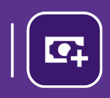
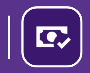
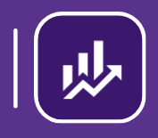
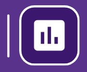
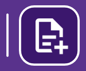
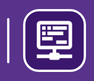
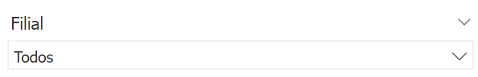
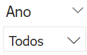
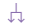

# Introdução ao BI Contábil

  
  <h6>Imagem 1: Painel de Contábil</h6>

Um relatório de BI (Business Intelligence) abrangente e focado em Contabilidade é fundamental para proporcionar uma visão clara e detalhada da saúde financeira de uma empresa. Esse tipo de relatório oferece uma análise profunda das finanças, permitindo a gestão eficaz de caixa, a comparação detalhada entre receitas e despesas, e a avaliação do desempenho econômico ao longo do tempo. As visualizações precisas e detalhadas ajudam a identificar tendências, monitorar variações e tomar decisões informadas que podem otimizar a gestão financeira e melhorar a rentabilidade da empresa.

Uma das principais vantagens dos relatórios de BI é a sua capacidade de atualização contínua. Isso significa que os dados são atualizados em tempo real ou com uma frequência definida, garantindo que as informações refletidas no relatório estejam sempre atualizadas e sejam relevantes para as decisões atuais. Essa atualização contínua permite aos gestores responderem rapidamente a mudanças no mercado ou na operação da empresa, ajustando estratégias e ações conforme necessário.

Além disso, os relatórios de BI oferecem a capacidade de integrar dados de várias fontes em um único painel, proporcionando uma visão holística e consolidada das finanças da empresa. Isso facilita a análise comparativa e a identificação de padrões e anomalias que podem não ser evidentes ao analisar dados isoladamente.

Os relatórios de BI também melhoram a precisão e a consistência das informações financeiras, reduzindo o risco de erros manuais e inconsistências que podem ocorrer com relatórios tradicionais baseados em planilhas. Além disso, eles oferecem ferramentas de análise avançadas, como gráficos interativos e filtros dinâmicos, que ajudam a explorar os dados de maneira mais detalhada e a gerar insights mais profundos.

Em resumo, um relatório de BI bem estruturado não apenas fornece uma visão detalhada e atualizada da saúde financeira da empresa, mas também facilita a tomada de decisões estratégicas, melhora a eficiência operacional e fortalece a capacidade da empresa de se adaptar e prosperar em um ambiente de negócios em constante mudança.

## Botão para Documentação

Há um botão em cada painel do relatório que está vinculado à documentação daquele painel específico, o que facilita a navegação direta para explicações sobre os recursos visuais ou recursos.

## Barra de Menu

  
  <h6>Imagem 2: Barra de Menu</h6>

A barra de menu é um recurso de navegação localizado no lado esquerdo de todas as páginas do relatório, fornecendo acesso fácil a várias seções e páginas detalhadas do relatório. Ela ajuda os usuários a navegarem de forma eficiente entre diferentes áreas de análise e insights dos dados. O botão da página atual ficará destacado (mostrado abaixo).

Aqui está uma visão geral dos botões disponíveis na barra de menu:

### Botão Home

<h6>Esquerda: Página atual, Direita: Página disponível</h6>
Este botão leva os usuários de volta à página principal, intitulada Visão Contábil. É o ponto central de partida onde os usuários podem acessar uma visão geral e navegar para outras seções.

  
### Botão Receita Bruta

<h6>Esquerda: Página atual, Direita: Página disponível</h6>
Clicar neste botão direciona os usuários para a página intitulada Receita Bruta. Esta página inclui visualizações e análises relacionadas ao total de receita gerada pela empresa antes de quaisquer deduções.
  
### Botão Custos e Despesas

<h6>Esquerda: Página atual, Direita: Página disponível</h6>
Este botão navega para a página intitulada Custos e Despesas. Aqui, os usuários podem visualizar e analisar os custos e despesas incorridos pela empresa, ajudando a avaliar o desempenho financeiro e a gestão de custos.
  
###  Botão Lucro Líquido

<h6>Esquerda: Página atual, Direita: Página disponível</h6>
Selecionar este botão leva os usuários à página intitulada Lucro Líquido. Esta seção fornece insights sobre o lucro líquido da empresa após todas as despesas, impostos e deduções serem contabilizados.
  
### Botão EBITDA

<h6>Esquerda: Página atual, Direita: Página disponível</h6>
Este botão direciona para a página intitulada EBITDA. Os usuários podem explorar o desempenho operacional da empresa, excluindo os efeitos das decisões financeiras e contábeis.
  
### Botão Indicadores

<h6>Esquerda: Página atual, Direita: Página disponível</h6>
Clicar neste botão abre a página intitulada Indicadores, onde os usuários podem visualizar várias métricas financeiras-chave que avaliam diferentes aspectos da saúde financeira da empresa.

  
### Botão Regra dos 40

<h6>Esquerda: Página atual, Direita: Página disponível</h6>
Este botão navega para a página intitulada Regra dos 40, que foca em analisar se a soma da margem EBITDA e do crescimento da receita atende ou excede o marco de 40%.
  
### Botão DRE

Selecionar este botão leva os usuários à página intitulada DRE (Demonstração do Resultado do Exercício), onde eles podem visualizar a demonstração de resultados, detalhando a receita, despesas e lucratividade da empresa ao longo de um período específico.

## Filtros

  
  <h6>Imagem 3: Filtros ou Slicers</h6>

Os filtros, que você pode ver sendo chamados de Slicers, são ferramentas cruciais que permitem filtrar todos os visuais presentes nas páginas do relatório de forma dinâmica e sincronizada. 

Ao ajustar qualquer um dos slicers, todos os gráficos, tabelas e outros elementos visuais em todas as páginas do relatório são atualizados automaticamente para refletir apenas os dados relevantes de acordo com o critério selecionado.

Os filtros são feitos a partir dos dados da empresa, ou seja, você pode filtrar por áreas específicas como projeto ou filial. Por exemplo, se você quiser ver os números de um projeto chamado “Novo Edifício”, basta selecioná-lo no slicer e o filtro será aplicado. Agora você pode ver todos os dados relacionados a este projeto em cada página do relatório.

###	Filial

Este filtro permite filtrar os dados com base na filial específica da empresa. Ao selecionar uma filial, todos os visuais em todas as páginas do relatório mostrarão informações apenas relacionadas a essa filial. Isso é útil para analisar o desempenho e os resultados de diferentes unidades de negócios ou localizações.

###	Projeto

O filtro de projeto possibilita a filtragem dos dados por projetos específicos. Selecionando um projeto, o relatório ajusta todos os visuais para exibir apenas informações relevantes a esse projeto, facilitando a análise detalhada dos custos, receitas e outros indicadores associados.

###	Ano

O filtro de ano permite selecionar o ano desejado para a análise. Aplicando um filtro de ano, todos os visuais nas páginas do relatório são atualizados para mostrar dados exclusivamente para o ano selecionado, permitindo uma comparação e análise de tendências anuais.

###	Mês

Este filtro possibilita a filtragem dos dados por mês específico. Ao escolher um mês, todos os visuais no relatório são ajustados para refletir apenas as informações desse período, facilitando a análise mensal e a identificação de variações sazonais.

###	Antes da Data

Este filtro está disponível apenas na página Indicadores e permite ao usuário ajustar o visual para mostrar dados entre duas datas. Isto simplifica a comparação e análise dos indicadores durante qualquer período de tempo necessário.

###	Limpar filtros

Para limpar todos os filtros aplicados e retornar à visualização completa dos dados, utilize o botão "Limpar filtros" localizado no lado direito dos slicers. Este botão remove todos os filtros, proporcionando uma visão geral abrangente dos dados.

## Ícones de Cabeçalho

  
  <h6>Imagem 4: Ícones de Cabeçalho</h6>

Quando um visual é selecionado ou o mouse passa sobre ele, ícones de cabeçalho podem aparecer no canto superior direito da janela visual. Esses ícones dependem do tipo de visual, do conteúdo do visual e das opções selecionadas em relação aos ícones de cabeçalho na criação.

Neste relatório, os ícones de cabeçalho mais úteis são "Fazer drill up" e "Ir para o próximo nível na hierarquia", que ajudam a facilitar a troca entre níveis como cliente ou projeto.

Abaixo estão as opções que um usuário pode ver, o que elas significam e como usá-las.

### Fazer drill on Linhas ou Colunas

Isso altera o drill down para as linhas ou colunas em uma tabela, por exemplo, os cabeçalhos das colunas têm anos e meses, você pode selecionar colunas, permitindo que você faça drill up apenas para os anos, down apenas para os meses ou expanda para ver o ano e o mês como cabeçalhos de coluna. Da mesma forma, se você selecionar linhas, poderá navegar pela hierarquia das linhas.

### Fazer drill up

Usar o botão fazer drill up move você para cima um degrau na hierarquia. Se o visual tiver opções como cliente, origem, filial e projeto e você estiver na filial, ao clicar neste botão ele exibirá a origem.

### Clique aqui parahabilitar o Drill down

Este botão não é necessário para nossos relatórios, ele habilita os recursos de detalhamento, mas eles são predefinidos na criação.

### Ir para o próximo nível na hierarquia

Há uma grande diferença entre este botão e o botão de expansão. Para este botão, você irá para o próximo nível da hierarquia. Por exemplo, se tiver uma hierarquia de cliente, origem, filial e projeto e você estiver em cliente, quando clicar neste botão, você exibirá origem no visual e não verá mais cliente. Se você tinha uma hierarquia de ano, mês e estava em ano no visual, clicar neste botão exibirá apenas o mês - sem dividi-lo por ano.
Clicar aqui quando estiver no nível superior desabilitará a opção de usar o botão "Expandir todo o campo um nível abaixo ne hierarquia" nos próximos níveis.

### Expandir todo o campo um nível abaixo ne hierarquia

Este botão habilita a expansão dos dados no visual. Em vez de mover para baixo na hierarquia, usar este botão fará com que o próximo nível apareça como subcategorias do nível acima. Por exemplo, se você tiver uma hierarquia de ano e mês e estiver no ano, ao clicar neste botão, você exibirá o ano e os meses dentro daquele ano no visual. Ou se você tivesse uma hierarquia de cliente, origem, filial e projeto e estivesse no cliente, você veria a origem exibida como subcategorias para cada cliente. 
Clicar aqui quando estiver no nível superior desabilitará a opção de usar o botão "Ir para o próximo nível na hierarquia" nos próximos níveis.

### Filtros e segmentações afetando este visual

Informa quais filtros estão impactando o visual no momento.

### Modo de foco

Abre o modo de foco, que é uma nova página com apenas o visual selecionado, dando mais espaço ao visual.

### Mais opções

Este botão abre um menu com mais opções como Pesquisar, Exportar dados, Mostrar como tabela, Remover, Destacar e Classificar.
Nem todas essas opções estarão disponíveis em todos os visuais.

  
***Aviso Legal:** Os números e informações apresentados nesta documentação são baseados em um conjunto de dados fictício. Eles são destinados exclusivamente para fins educacionais e de demonstração. Os dados não refletem condições do mundo real ou métricas de negócios reais e não devem ser usados ​​para tomada de decisão ou análise. Qualquer semelhança com entidades, eventos ou dados reais é mera coincidência.*
