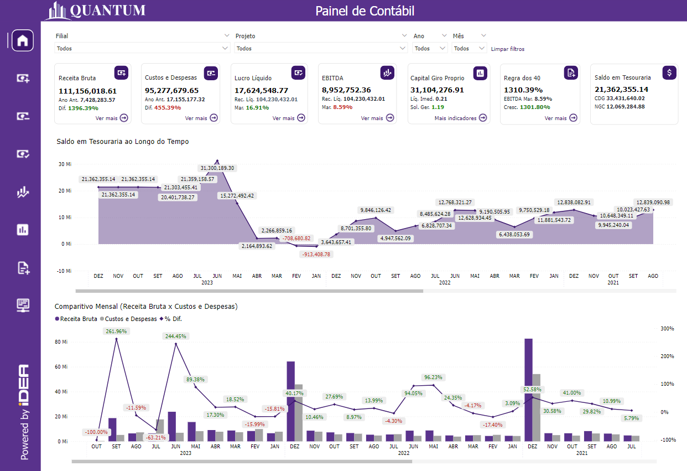
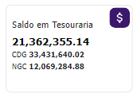

# Introdução ao Relatório Contabilidade

  
  <h6>Imagem 1: Relatório Contabilidade - Visão Contábil</h6>

Um relatório de BI (Business Intelligence) abrangente e focado em Contabilidade é fundamental para proporcionar uma visão clara e detalhada da saúde financeira de uma empresa. Esse tipo de relatório oferece uma análise profunda das finanças, permitindo a gestão eficaz de caixa, a comparação detalhada entre receitas e despesas, e a avaliação do desempenho econômico ao longo do tempo. As visualizações precisas e detalhadas ajudam a identificar tendências, monitorar variações e tomar decisões informadas que podem otimizar a gestão financeira e melhorar a rentabilidade da empresa.

Uma das principais vantagens dos relatórios de BI é a sua capacidade de atualização contínua. Isso significa que os dados são atualizados em tempo real ou com uma frequência definida, garantindo que as informações refletidas no relatório estejam sempre atualizadas e sejam relevantes para as decisões atuais. Essa atualização contínua permite aos gestores responderem rapidamente a mudanças no mercado ou na operação da empresa, ajustando estratégias e ações conforme necessário.

Além disso, os relatórios de BI oferecem a capacidade de integrar dados de várias fontes em um único painel, proporcionando uma visão holística e consolidada das finanças da empresa. Isso facilita a análise comparativa e a identificação de padrões e anomalias que podem não ser evidentes ao analisar dados isoladamente.

Os relatórios de BI também melhoram a precisão e a consistência das informações financeiras, reduzindo o risco de erros manuais e inconsistências que podem ocorrer com relatórios tradicionais baseados em planilhas. Além disso, eles oferecem ferramentas de análise avançadas, como gráficos interativos e filtros dinâmicos, que ajudam a explorar os dados de maneira mais detalhada e a gerar insights mais profundos.

Em resumo, um relatório de BI bem estruturado não apenas fornece uma visão detalhada e atualizada da saúde financeira da empresa, mas também facilita a tomada de decisões estratégicas, melhora a eficiência operacional e fortalece a capacidade da empresa de se adaptar e prosperar em um ambiente de negócios em constante mudança.

## Barra de Menu

  
  <h6>Imagem 2: Barra de Menu</h6>

A barra de menu é um recurso de navegação localizado no lado esquerdo de todas as páginas do relatório, fornecendo acesso fácil a várias seções e páginas detalhadas do relatório. Ela ajuda os usuários a navegarem de forma eficiente entre diferentes áreas de análise e insights dos dados. Aqui está uma visão geral dos botões disponíveis na barra de menu:

- **Home**:
  

Este botão leva os usuários de volta à página principal, intitulada Visão Contábil. É o ponto central de partida onde os usuários podem acessar uma visão geral e navegar para outras seções.
  
-	**Receita Bruta**: Clicar neste botão direciona os usuários para a página intitulada Receita Bruta. Esta página inclui visualizações e análises relacionadas ao total de receita gerada pela empresa antes de quaisquer deduções.
  
-	**Custos e Despesas**: Este botão navega para a página intitulada Custos e Despesas. Aqui, os usuários podem visualizar e analisar os custos e despesas incorridos pela empresa, ajudando a avaliar o desempenho financeiro e a gestão de custos.
  
-	**Lucro Líquido**: Selecionar este botão leva os usuários à página intitulada Lucro Líquido. Esta seção fornece insights sobre o lucro líquido da empresa após todas as despesas, impostos e deduções serem contabilizados.
  
-	**EBITDA**: Este botão direciona para a página intitulada EBITDA. Os usuários podem explorar o desempenho operacional da empresa, excluindo os efeitos das decisões financeiras e contábeis.
  
-	**Indicadores**: Clicar neste botão abre a página intitulada Indicadores, onde os usuários podem visualizar várias métricas financeiras-chave que avaliam diferentes aspectos da saúde financeira da empresa.
  
-	**Regra dos 40**: Este botão navega para a página intitulada Regra dos 40, que foca em analisar se a soma da margem EBITDA e do crescimento da receita atende ou excede o marco de 40%.
  
-	**DRE**: Selecionar este botão leva os usuários à página intitulada DRE (Demonstração do Resultado do Exercício), onde eles podem visualizar a demonstração de resultados, detalhando a receita, despesas e lucratividade da empresa ao longo de um período específico.

