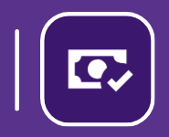
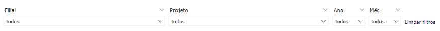
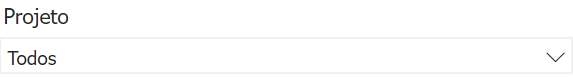
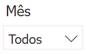
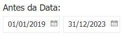

# Introdução ao Relatório Contabilidade

  
  <h6>Imagem 1: Relatório Contabilidade - Visão Contábil</h6>

Um relatório de BI (Business Intelligence) abrangente e focado em Contabilidade é fundamental para proporcionar uma visão clara e detalhada da saúde financeira de uma empresa. Esse tipo de relatório oferece uma análise profunda das finanças, permitindo a gestão eficaz de caixa, a comparação detalhada entre receitas e despesas, e a avaliação do desempenho econômico ao longo do tempo. As visualizações precisas e detalhadas ajudam a identificar tendências, monitorar variações e tomar decisões informadas que podem otimizar a gestão financeira e melhorar a rentabilidade da empresa.

Uma das principais vantagens dos relatórios de BI é a sua capacidade de atualização contínua. Isso significa que os dados são atualizados em tempo real ou com uma frequência definida, garantindo que as informações refletidas no relatório estejam sempre atualizadas e sejam relevantes para as decisões atuais. Essa atualização contínua permite aos gestores responderem rapidamente a mudanças no mercado ou na operação da empresa, ajustando estratégias e ações conforme necessário.

Além disso, os relatórios de BI oferecem a capacidade de integrar dados de várias fontes em um único painel, proporcionando uma visão holística e consolidada das finanças da empresa. Isso facilita a análise comparativa e a identificação de padrões e anomalias que podem não ser evidentes ao analisar dados isoladamente.

Os relatórios de BI também melhoram a precisão e a consistência das informações financeiras, reduzindo o risco de erros manuais e inconsistências que podem ocorrer com relatórios tradicionais baseados em planilhas. Além disso, eles oferecem ferramentas de análise avançadas, como gráficos interativos e filtros dinâmicos, que ajudam a explorar os dados de maneira mais detalhada e a gerar insights mais profundos.

Em resumo, um relatório de BI bem estruturado não apenas fornece uma visão detalhada e atualizada da saúde financeira da empresa, mas também facilita a tomada de decisões estratégicas, melhora a eficiência operacional e fortalece a capacidade da empresa de se adaptar e prosperar em um ambiente de negócios em constante mudança.

## Barra de Menu

  
  <h6>Imagem 2: Barra de Menu</h6>

A barra de menu é um recurso de navegação localizado no lado esquerdo de todas as páginas do relatório, fornecendo acesso fácil a várias seções e páginas detalhadas do relatório. Ela ajuda os usuários a navegarem de forma eficiente entre diferentes áreas de análise e insights dos dados. Aqui está uma visão geral dos botões disponíveis na barra de menu:

### Home

<h6>Esquerda: Página atual, Direita: Página disponível</h6>
Este botão leva os usuários de volta à página principal, intitulada Visão Contábil. É o ponto central de partida onde os usuários podem acessar uma visão geral e navegar para outras seções.

  
### Receita Bruta

<h6>Esquerda: Página atual, Direita: Página disponível</h6>
Clicar neste botão direciona os usuários para a página intitulada Receita Bruta. Esta página inclui visualizações e análises relacionadas ao total de receita gerada pela empresa antes de quaisquer deduções.
  
### Custos e Despesas

<h6>Esquerda: Página atual, Direita: Página disponível</h6>
Este botão navega para a página intitulada Custos e Despesas. Aqui, os usuários podem visualizar e analisar os custos e despesas incorridos pela empresa, ajudando a avaliar o desempenho financeiro e a gestão de custos.
  
###  Lucro Líquido

<h6>Esquerda: Página atual, Direita: Página disponível</h6>
Selecionar este botão leva os usuários à página intitulada Lucro Líquido. Esta seção fornece insights sobre o lucro líquido da empresa após todas as despesas, impostos e deduções serem contabilizados.
  
### EBITDA

<h6>Esquerda: Página atual, Direita: Página disponível</h6>
Este botão direciona para a página intitulada EBITDA. Os usuários podem explorar o desempenho operacional da empresa, excluindo os efeitos das decisões financeiras e contábeis.
  
### Indicadores

<h6>Esquerda: Página atual, Direita: Página disponível</h6>
Clicar neste botão abre a página intitulada Indicadores, onde os usuários podem visualizar várias métricas financeiras-chave que avaliam diferentes aspectos da saúde financeira da empresa.

  
### Regra dos 40

<h6>Esquerda: Página atual, Direita: Página disponível</h6>
Este botão navega para a página intitulada Regra dos 40, que foca em analisar se a soma da margem EBITDA e do crescimento da receita atende ou excede o marco de 40%.
  
### DRE

Selecionar este botão leva os usuários à página intitulada DRE (Demonstração do Resultado do Exercício), onde eles podem visualizar a demonstração de resultados, detalhando a receita, despesas e lucratividade da empresa ao longo de um período específico.

## Filtros ou Slicers

  
  <h6>Imagem 3: Filtros ou Slicers</h6>

Os filtros, que você pode ver sendo chamados de Slicers, são ferramentas cruciais que permitem filtrar todos os visuais presentes nas páginas do relatório de forma dinâmica e sincronizada. 

Ao ajustar qualquer um dos slicers, todos os gráficos, tabelas e outros elementos visuais em todas as páginas do relatório são atualizados automaticamente para refletir apenas os dados relevantes de acordo com o critério selecionado.

Os filtros são feitos a partir dos dados da empresa, ou seja, você pode filtrar por áreas específicas como projeto ou filial. Por exemplo, se você quiser ver os números de um projeto chamado “Novo Edifício”, basta selecioná-lo no slicer e o filtro será aplicado. Agora você pode ver todos os dados relacionados a este projeto em cada página do relatório.

###	Filial

Este slicer permite filtrar os dados com base na filial específica da empresa. Ao selecionar uma filial, todos os visuais em todas as páginas do relatório mostrarão informações apenas relacionadas a essa filial. Isso é útil para analisar o desempenho e os resultados de diferentes unidades de negócios ou localizações.

###	Projeto

O slicer de projeto possibilita a filtragem dos dados por projetos específicos. Selecionando um projeto, o relatório ajusta todos os visuais para exibir apenas informações relevantes a esse projeto, facilitando a análise detalhada dos custos, receitas e outros indicadores associados.

###	Ano

O slicer de ano permite selecionar o ano desejado para a análise. Aplicando um filtro de ano, todos os visuais nas páginas do relatório são atualizados para mostrar dados exclusivamente para o ano selecionado, permitindo uma comparação e análise de tendências anuais.

###	Mês

Este slicer possibilita a filtragem dos dados por mês específico. Ao escolher um mês, todos os visuais no relatório são ajustados para refletir apenas as informações desse período, facilitando a análise mensal e a identificação de variações sazonais.

###	Antes da Data

Este filtro está disponível apenas na página Indicadores e permite ao usuário ajustar o visual para mostrar dados entre duas datas. Isto simplifica a comparação e análise dos indicadores durante qualquer período de tempo necessário.

###	Limpar filtros

Para limpar todos os filtros aplicados e retornar à visualização completa dos dados, utilize o botão "Limpar filtros" localizado no lado direito dos slicers. Este botão remove todos os filtros, proporcionando uma visão geral abrangente dos dados.
