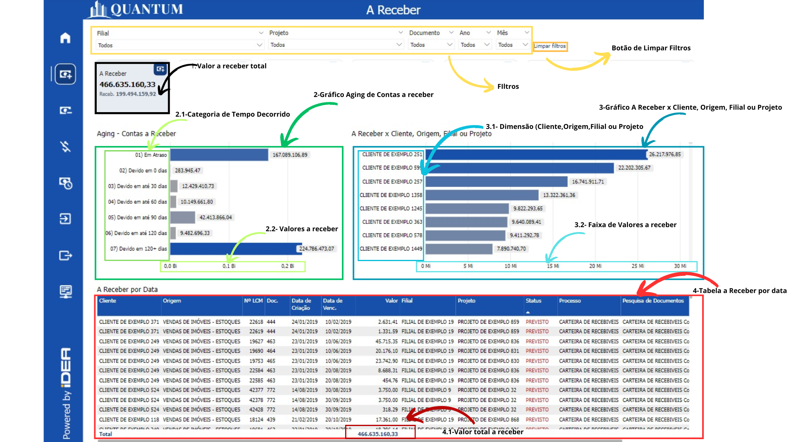

# Introdução 

<h6 align="center">Imagem 1: Relatório Contabilidade - Visão Contábil</h6>

Um relatório de BI (Business Intelligence) abrangente e focado em Contabilidade é fundamental para proporcionar uma visão clara e detalhada da saúde financeira de uma empresa. Esse tipo de relatório oferece uma análise profunda das finanças, permitindo a gestão eficaz de caixa, a comparação detalhada entre receitas e despesas, e a avaliação do desempenho econômico ao longo do tempo. As visualizações precisas e detalhadas ajudam a identificar tendências, monitorar variações e tomar decisões informadas que podem otimizar a gestão financeira e melhorar a rentabilidade da empresa.

Uma das principais vantagens dos relatórios de BI é a sua capacidade de atualização contínua. Isso significa que os dados são atualizados em tempo real ou com uma frequência definida, garantindo que as informações refletidas no relatório estejam sempre atualizadas e sejam relevantes para as decisões atuais. Essa atualização contínua permite aos gestores responderem rapidamente a mudanças no mercado ou na operação da empresa, ajustando estratégias e ações conforme necessário.

Além disso, os relatórios de BI oferecem a capacidade de integrar dados de várias fontes em um único painel, proporcionando uma visão holística e consolidada das finanças da empresa. Isso facilita a análise comparativa e a identificação de padrões e anomalias que podem não ser evidentes ao analisar dados isoladamente.

Os relatórios de BI também melhoram a precisão e a consistência das informações financeiras, reduzindo o risco de erros manuais e inconsistências que podem ocorrer com relatórios tradicionais baseados em planilhas. Além disso, eles oferecem ferramentas de análise avançadas, como gráficos interativos e filtros dinâmicos, que ajudam a explorar os dados de maneira mais detalhada e a gerar insights mais profundos.

Em resumo, um relatório de BI bem estruturado não apenas fornece uma visão detalhada e atualizada da saúde financeira da empresa, mas também facilita a tomada de decisões estratégicas, melhora a eficiência operacional e fortalece a capacidade da empresa de se adaptar e prosperar em um ambiente de negócios em constante mudança.

