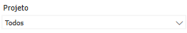
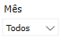
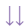

# Introdução ao BI Contábil

  
  <h6>Imagem 1: Painel Contábil</h6>

Um relatório de BI (Business Intelligence) abrangente e focado em Contabilidade é fundamental para proporcionar uma visão clara e detalhada da saúde financeira de uma empresa. Esse tipo de relatório oferece uma análise profunda das finanças, permitindo a gestão eficaz de caixa, a comparação detalhada entre receitas e despesas, e a avaliação do desempenho econômico ao longo do tempo. As visualizações precisas e detalhadas ajudam a identificar tendências, monitorar variações e tomar decisões informadas que podem otimizar a gestão financeira e melhorar a rentabilidade da empresa.

Uma das principais vantagens dos relatórios de BI é a sua capacidade de atualização contínua. Isso significa que os dados são atualizados em tempo real ou com uma frequência definida, garantindo que as informações refletidas no relatório estejam sempre atualizadas e sejam relevantes para as decisões atuais. Essa atualização contínua permite aos gestores responderem rapidamente a mudanças no mercado ou na operação da empresa, ajustando estratégias e ações conforme necessário.

Além disso, os relatórios de BI oferecem a capacidade de integrar dados de várias fontes em um único painel, proporcionando uma visão holística e consolidada das finanças da empresa. Isso facilita a análise comparativa e a identificação de padrões e anomalias que podem não ser evidentes ao analisar dados isoladamente.

Os relatórios de BI também melhoram a precisão e a consistência das informações financeiras, reduzindo o risco de erros manuais e inconsistências que podem ocorrer com relatórios tradicionais baseados em planilhas. Além disso, eles oferecem ferramentas de análise avançadas, como gráficos interativos e filtros dinâmicos, que ajudam a explorar os dados de maneira mais detalhada e a gerar insights mais profundos.

Em resumo, um relatório de BI bem estruturado não apenas fornece uma visão detalhada e atualizada da saúde financeira da empresa, mas também facilita a tomada de decisões estratégicas, melhora a eficiência operacional e fortalece a capacidade da empresa de se adaptar e prosperar em um ambiente de negócios em constante mudança.

## Navegação

Existem várias maneiras de navegar pelo BI Contábil. Botões estrategicamente posicionados e rotulados são colocados em todos os painéis, otimizando a experiência do usuário ao permitir uma navegação clara e intuitiva. Esses botões fornecem acesso direto às principais áreas, permitindo que os usuários explorem dados de forma eficiente sem se perderem em menus complexos. Seja retornando a uma página anterior, buscando insights mais específicos ou alternando entre diferentes visões contábeis, o layout garante que os usuários possam se mover suavemente pelo relatório, melhorando sua interação geral e produtividade.

### Botões de Menu

A primeira opção é a [barra de menu](https://idea-technology-it.github.io/docs-idea/contabilidade/intro/#barra-de-menu), sempre no lado esquerdo do relatório, não importa qual painel você esteja visualizando. Cada botão navega para um painel específico no relatório. Ao passar o mouse, uma instrução descritiva aparecerá como esta;

  

### Botões de Ver mais ou Mais indicadores

A segunda maneira de navegar é através dos botões "Ver mais" e "Mais indicadores" localizados nos [Indicadores Contábeis](https://idea-technology-it.github.io/docs-idea/contabilidade/indicadores_contabeis/) - as caixas que aparecem na parte superior de cada página. Eles também têm uma descrição quando o mouse passa sobre eles, no entanto, para maior clareza, as imagens na caixa correspondente correspondem à imagem usada na barra de menu.

  
  

### Botões para Diferentes Visões

O terceiro método é usar botões para alternar entre diferentes visualizações dentro de um painel. Em certos painéis, há duas ou três visualizações, com visuais diferentes para aquele painel. Abaixo dos [Indicadores Financeiros](https://idea-technology-it.github.io/docs-idea/contabilidade/indicadores_contabeis/) pode haver um desses botões, se disponível, o botão alternará a visualização e o botão oposto aparecerá. Para entender melhor essas visualizações, você pode ver quais opções estão disponíveis para o painel através do [Botão para Documentação](https://idea-technology-it.github.io/docs-idea/contabilidade/intro/#botao-para-documentacao) que contém imagens e explicações de todos os visuais disponíveis.

  
  

  
  

  
  

<!-- ### Drill-through

A função usada para fazer isso é chamada de "Drill-through" e pode ser executada clicando com o botão direito em um visual e selecionando Drill-through no menu que aparece, isso estenderá o menu que mostra "Detalhamento". Uma vez clicado, o Painel de Detalhamento será aberto e será filtrado automaticamente pelo ponto de dados em que você clicou com o botão direito. Abaixo está um exemplo de clique com o botão direito na barra para 01) Em Atraso no visual Aging - Contas a Pagar;

  
  <h6>Imagem 2: Drill-through</h6>

Por padrão, este painel fica oculto, tornando-se visível apenas quando um drillthrough é iniciado. Uma vez na página de drillthrough, os usuários encontrarão uma tabela abrangente exibindo todos os campos e dados relevantes vinculados ao item específico em que eles fizeram drill, oferecendo uma visão mais granular desses dados.

Além disso, quando terminar de revisar os detalhes, os usuários podem clicar no botão de retorno na barra de menu (que só aparece depois que um drillthrough é executado) para voltar à página de onde vieram. Essa configuração permite uma exploração mais profunda dos dados sem perder o contexto original. -->

### Botão para Documentação

Finalmente, há um botão em cada painel do relatório que está vinculado à documentação daquele painel específico, o que facilita a navegação direta para explicações sobre os recursos visuais ou recursos.

## Barra de Menu

  
  <h6>Imagem 2: Barra de Menu</h6>

A barra de menu é um recurso de navegação localizado no lado esquerdo de todas as páginas do relatório, fornecendo acesso fácil a várias seções e páginas detalhadas do relatório. Ela ajuda os usuários a navegarem de forma eficiente entre diferentes áreas de análise e insights dos dados. O botão da página atual ficará destacado (mostrado abaixo).

Aqui está uma visão geral dos botões disponíveis na barra de menu:

### Botão Painel Contábil

<h6>Esquerda: Página atual, Direita: Página disponível</h6>
Este botão leva os usuários de volta à página principal, intitulada [Painel Contábil](https://idea-technology-it.github.io/docs-idea/contabilidade/painel_contabil/). É o ponto central de partida onde os usuários podem acessar uma visão geral e navegar para outras seções.

### Botão Receita Bruta

<h6>Esquerda: Página atual, Direita: Página disponível</h6>
Clicar neste botão direciona os usuários para a página intitulada [Receita Bruta](https://idea-technology-it.github.io/docs-idea/contabilidade/receita_bruta/). Esta página inclui visualizações e análises relacionadas ao total de receita gerada pela empresa antes de quaisquer deduções.
  
### Botão Custos e Despesas

<h6>Esquerda: Página atual, Direita: Página disponível</h6>
Este botão navega para a página intitulada [Custos e Despesas](https://idea-technology-it.github.io/docs-idea/contabilidade/custos_e_despesas/). Aqui, os usuários podem visualizar e analisar os custos e despesas incorridos pela empresa, ajudando a avaliar o desempenho financeiro e a gestão de custos.
  
### Botão Lucro Líquido

<h6>Esquerda: Página atual, Direita: Página disponível</h6>
Selecionar este botão leva os usuários à página intitulada [Lucro Líquido](https://idea-technology-it.github.io/docs-idea/contabilidade/lucro_liquido/). Esta seção fornece insights sobre o lucro líquido da empresa após todas as despesas, impostos e deduções serem contabilizados.
  
### Botão EBITDA

<h6>Esquerda: Página atual, Direita: Página disponível</h6>
Este botão direciona para a página intitulada [EBITDA](https://idea-technology-it.github.io/docs-idea/contabilidade/ebitda/). Os usuários podem explorar o desempenho operacional da empresa, excluindo os efeitos das decisões financeiras e contábeis.

### Botão Regra dos 40

<h6>Esquerda: Página atual, Direita: Página disponível</h6>
Este botão navega para a página intitulada [Regra dos 40](https://idea-technology-it.github.io/docs-idea/contabilidade/regra_dos_40/), que foca em analisar se a soma da margem EBITDA e do crescimento da receita atende ou excede o marco de 40%.

### Botão Indicadores

<h6>Esquerda: Página atual, Direita: Página disponível</h6>
Clicar neste botão abre a página intitulada [Indicadores](https://idea-technology-it.github.io/docs-idea/contabilidade/indicadores/), onde os usuários podem visualizar várias métricas financeiras-chave que avaliam diferentes aspectos da saúde financeira da empresa.  

### Botão DRE

Selecionar este botão leva os usuários à página intitulada [Demonstração do Resultado do Exercício](https://idea-technology-it.github.io/docs-idea/contabilidade/dre/), onde eles podem visualizar a demonstração de resultados, detalhando a receita, despesas e lucratividade da empresa ao longo de um período específico.

## Filtros

  
  <h6>Imagem 3: Filtros - Visão 1</h6>
  
  <h6>Imagem 3: Filtros - Visão 2</h6>

Os filtros são ferramentas essenciais que permitem ajustar dinamicamente todos os visuais presentes nas páginas do relatório de forma sincronizada. Ao selecionar um filtro, gráficos, tabelas e outros elementos visuais são automaticamente atualizados para exibir apenas os dados relevantes com base nos critérios escolhidos.

Os filtros são baseados nos dados da empresa, possibilitando a seleção de áreas específicas como projeto ou filial. Por exemplo, para visualizar as informações de um projeto chamado "Novo Edifício", basta selecioná-lo no filtro. Assim, todos os dados referentes a esse projeto serão exibidos em cada página do relatório, proporcionando uma análise focada e precisa.

###	Filial

Este filtro permite segmentar os dados com base em uma filial específica da empresa. Ao selecionar uma filial, todos os visuais em todas as páginas do relatório serão automaticamente ajustados para exibir apenas as informações relacionadas àquela unidade. Essa funcionalidade é extremamente útil para analisar o desempenho e os resultados de diferentes unidades de negócios ou localizações, proporcionando uma visão mais detalhada e focada.

###	Projeto

O filtro de projeto permite segmentar os dados por projetos específicos. Ao selecionar um projeto, todos os visuais no relatório são automaticamente ajustados para exibir apenas as informações relacionadas a ele. Isso facilita uma análise detalhada de custos, receitas e outros indicadores associados, proporcionando uma visão mais focada e precisa do desempenho de cada projeto.

###	Dimensão

O filtro de dimensão permite segmentar os dados por critérios específicos, como categorias ou características adicionais. Ao selecionar uma dimensão, todos os visuais no relatório são automaticamente ajustados para exibir apenas as informações relacionadas a essa escolha. Isso facilita uma análise detalhada de custos, receitas e outros indicadores associados, proporcionando uma visão mais focada e precisa do desempenho de cada categoria ou característica analisada.

###	Ano

O filtro de ano permite selecionar o período específico para análise. Ao aplicá-lo, todos os visuais nas páginas do relatório são automaticamente atualizados para exibir dados referentes apenas ao ano escolhido, facilitando a comparação e a análise de tendências ao longo dos anos.

###	Mês

Este filtro possibilita a filtragem dos dados por mês específico. Ao escolher um mês, todos os visuais no relatório são ajustados para refletir apenas as informações desse período, facilitando a análise mensal e a identificação de variações sazonais.

###	Antes da Data

Este filtro está disponível apenas na página Indicadores e permite ao usuário ajustar o visual para mostrar dados entre duas datas. Isto simplifica a comparação e análise dos indicadores durante qualquer período de tempo necessário.

###	Limpar filtros

Para limpar todos os filtros aplicados e retornar à visualização completa dos dados, utilize o botão "Limpar filtros" localizado no lado direito dos slicers. Este botão remove todos os filtros, proporcionando uma visão geral abrangente dos dados.

## Ícones de Cabeçalho

  
  <h6>Imagem 4: Ícones de Cabeçalho</h6>

Quando um visual é selecionado ou o mouse passa sobre ele, ícones de cabeçalho podem aparecer no canto superior direito da janela visual. Esses ícones dependem do tipo de visual, do conteúdo do visual e das opções selecionadas em relação aos ícones de cabeçalho na criação.

Neste relatório, os ícones de cabeçalho mais úteis são "Fazer drill up" e "Ir para o próximo nível na hierarquia", que ajudam a facilitar a troca entre níveis como cliente ou projeto.

Abaixo estão as opções que um usuário pode ver, o que elas significam e como usá-las.

### Fazer drill on Linhas ou Colunas

Isso altera o drill down para as linhas ou colunas em uma tabela, por exemplo, os cabeçalhos das colunas têm anos e meses, você pode selecionar colunas, permitindo que você faça drill up apenas para os anos, down apenas para os meses ou expanda para ver o ano e o mês como cabeçalhos de coluna. Da mesma forma, se você selecionar linhas, poderá navegar pela hierarquia das linhas.

### Fazer drill up

Usar o botão fazer drill up move você para cima um degrau na hierarquia. Se o visual tiver opções como cliente, origem, filial e projeto e você estiver na filial, ao clicar neste botão ele exibirá a origem.

### Clique aqui parahabilitar o Drill down

Este botão não é necessário para nossos relatórios, ele habilita os recursos de detalhamento, mas eles são predefinidos na criação.

### Ir para o próximo nível na hierarquia

Há uma grande diferença entre este botão e o botão de expansão. Para este botão, você irá para o próximo nível da hierarquia. Por exemplo, se tiver uma hierarquia de cliente, origem, filial e projeto e você estiver em cliente, quando clicar neste botão, você exibirá origem no visual e não verá mais cliente. Se você tinha uma hierarquia de ano, mês e estava em ano no visual, clicar neste botão exibirá apenas o mês - sem dividi-lo por ano.
Clicar aqui quando estiver no nível superior desabilitará a opção de usar o botão "Expandir todo o campo um nível abaixo ne hierarquia" nos próximos níveis.

### Expandir todo o campo um nível abaixo ne hierarquia

Este botão habilita a expansão dos dados no visual. Em vez de mover para baixo na hierarquia, usar este botão fará com que o próximo nível apareça como subcategorias do nível acima. Por exemplo, se você tiver uma hierarquia de ano e mês e estiver no ano, ao clicar neste botão, você exibirá o ano e os meses dentro daquele ano no visual. Ou se você tivesse uma hierarquia de cliente, origem, filial e projeto e estivesse no cliente, você veria a origem exibida como subcategorias para cada cliente. 
Clicar aqui quando estiver no nível superior desabilitará a opção de usar o botão "Ir para o próximo nível na hierarquia" nos próximos níveis.

### Filtros e segmentações afetando este visual

Informa quais filtros estão impactando o visual no momento.

### Modo de foco

Abre o modo de foco, que é uma nova página com apenas o visual selecionado, dando mais espaço ao visual.

### Mais opções

Este botão abre um menu com mais opções como Pesquisar, Exportar dados, Mostrar como tabela, Remover, Destacar e Classificar.
Nem todas essas opções estarão disponíveis em todos os visuais.

## Dicas de Ferramentas

  
  

As Dicas de Ferramentas oferecem uma maneira poderosa de visualizar contexto adicional ou detalhes sobre pontos de dados em um visual, sem sobrecarregar a exibição principal. Ao passar o cursor sobre um elemento específico em um visual, como uma barra em um gráfico de barras ou um ponto de dados em um gráfico de linhas, uma Dica de Ferramenta aparecerá exibindo informações relevantes para aquela seleção. Normalmente, as Dicas de Ferramentas mostram métricas chave, como totais, percentuais ou médias, ajudando os usuários a entender o significado do ponto de dados. No entanto, elas também podem conter detalhes adicionais que não estão visíveis diretamente no visual principal, oferecendo uma visão mais profunda. Por exemplo, um gráfico pode mostrar o valor, e a Dica de Ferramenta poderia incluir esse valor junto com o percentual correspondente. Essa camada oculta de informações enriquece a experiência do usuário, permitindo que explorem os dados de forma mais completa, sem sobrecarregar o visual com muitos detalhes de uma só vez. Para visualizar as Dicas de Ferramentas, os usuários simplesmente precisam passar o cursor sobre os diferentes pontos de dados, tornando-as um recurso intuitivo que aprimora a exploração de dados e a tomada de decisões.

  
***Aviso Legal:** Os números e informações apresentados nesta documentação são baseados em um conjunto de dados fictício. Eles são destinados exclusivamente para fins educacionais e de demonstração. Os dados não refletem condições do mundo real ou métricas de negócios reais e não devem ser usados ​​para tomada de decisão ou análise. Qualquer semelhança com entidades, eventos ou dados reais é mera coincidência.*
