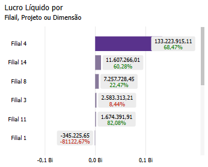
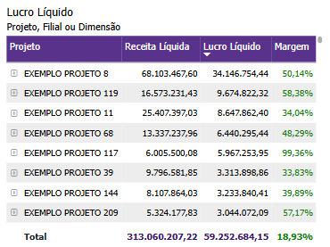
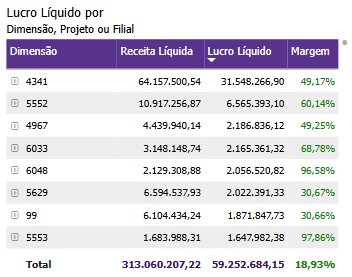

# Painel Lucro Líquido

  
  <h6>Imagem 1: Lucro Líquido - Visão Gráfica</h6>
  
  <h6>Imagem 2: Lucro Líquido - Visão Acumulado</h6>

## Navegação

O painel de relatórios é projetado com duas visualizações distintas. Alguns visuais são consistentes em ambas as visualizações, enquanto outros são específicos para cada visualização, garantindo que informações relevantes sejam apresentadas de acordo com o contexto de cada perspectiva;

- **[Visão Gráfica e Acumulado](https://idea-technology-it.github.io/docs-idea/contabilidade/lucro_liquido/#visao-grafica-e-acumulado)** - Esses recursos visuais estão disponíveis o tempo todo neste painel.
- **[Visão Gráfica](https://idea-technology-it.github.io/docs-idea/contabilidade/lucro_liquido/#visao-grafica)** - pode ser navegada através do [botão](https://idea-technology-it.github.io/docs-idea/contabilidade/intro/#botoes-para-diferentes-visoes) "voltar para visualização em gráfico".
- **[Visão Acumulado](https://idea-technology-it.github.io/docs-idea/contabilidade/lucro_liquido/#visao-acumulado)** - pode ser navegada através do [botão](https://idea-technology-it.github.io/docs-idea/contabilidade/intro/#botoes-para-diferentes-visoes) "ir para visualização acumulado".

## Informações no Painel Lucro Líquido

A análise de lucro líquido é um elemento essencial no Business Intelligence (BI) para contabilidade, pois fornece uma visão abrangente da rentabilidade de uma empresa. Monitorar e analisar o lucro líquido permite que as empresas avaliem sua performance financeira geral, identifiquem áreas de lucratividade e potencialmente otimizem suas estratégias para melhorar os resultados financeiros.

Visualizações como lucro líquido acumulado e crescimento do lucro líquido mês a mês são fundamentais para acompanhar a performance financeira ao longo do tempo. O lucro líquido acumulado oferece uma perspectiva de longo prazo, mostrando como o lucro líquido se acumula ao longo de um período específico. Isso ajuda a identificar tendências de rentabilidade e a prever a saúde financeira futura da empresa. A comparação do lucro líquido mês a mês permite que as empresas detectem variações de curto prazo, como o impacto de mudanças operacionais ou eventos sazonais, e ajustem suas estratégias financeiras conforme necessário.

A análise detalhada do lucro líquido por segmento, produto, filial ou linha de negócio é crucial para entender quais áreas estão contribuindo mais para a rentabilidade e quais podem precisar de melhorias. Esse tipo de análise permite que as empresas identifiquem quais produtos ou segmentos estão gerando mais lucro e quais estão apresentando baixo desempenho. Compreender essa distribuição ajuda a alocar recursos de maneira mais eficiente, otimizar estratégias de preço e desenvolver planos de ação para melhorar a rentabilidade.

A análise da margem de lucro líquido fornece insights sobre a eficiência operacional e a gestão de custos. Ao examinar a margem de lucro líquido, as empresas podem avaliar a relação entre receita e despesas, identificar áreas para redução de custos e melhorar a eficiência operacional. Essa análise também pode destacar a necessidade de ajustes na estrutura de preços ou em estratégias de controle de custos.

O impacto da análise de lucro líquido vai além do departamento financeiro. Os insights obtidos dos dados de lucro líquido podem influenciar decisões estratégicas, como investimentos, expansão de negócios e desenvolvimento de novos produtos. Compreender quais áreas estão gerando o maior lucro pode ajudar as equipes de gestão a direcionar esforços e recursos de forma mais eficaz, enquanto a análise de tendências de lucro pode informar estratégias de crescimento e otimização.

Em resumo, a análise de lucro líquido no BI para contabilidade é uma ferramenta poderosa para impulsionar o desempenho financeiro e estratégico. Ao examinar o lucro líquido de vários ângulos, como desempenho acumulado, variações mensais e detalhamento por segmento, as empresas obtêm uma visão mais clara de sua rentabilidade. Essa análise não só melhora a gestão financeira, mas também impacta outras áreas-chave, como estratégias de negócios, planejamento financeiro e decisões de investimento, criando um ambiente mais focado em resultados e orientado por dados.

## Visão Gráfica e Acumulado

### Lucro Líquido por Filial, Projeto ou Dimensão

  
  <h6>Imagem 3: Lucro Líquido por Filial, Projeto ou Dimensão</h6>

O gráfico de barras de **Lucro Líquido por Filial, Projeto ou Dimensão** é uma ferramenta poderosa para a análise visual do desempenho financeiro da empresa. Ele permite comparar o Lucro Líquido de diferentes filiais, projetos ou dimensões de maneira clara e eficiente, destacando rapidamente as áreas de maior ou menor lucratividade. Cada barra do gráfico representa o valor de Lucro Líquido para a respectiva filial, projeto ou dimensão, proporcionando uma visão comparativa instantânea entre os diferentes segmentos da operação.

Além do valor de Lucro Líquido, o gráfico inclui um rótulo detalhado para cada barra que exibe a Margem de Lucro (%). Esse rótulo possui uma codificação visual que facilita a análise: quando a margem está abaixo de 10%, o texto aparece em vermelho, sinalizando uma margem baixa e alertando para possíveis problemas de rentabilidade; quando a margem está acima de 10%, o texto aparece em verde, indicando uma margem saudável e sugerindo que o segmento está gerando lucro de forma eficaz. Essa diferenciação visual permite uma avaliação imediata da rentabilidade de cada filial, projeto ou dimensão, ajudando os gestores a identificar rapidamente as áreas que necessitam de melhorias ou ajustes.

A combinação do valor absoluto do Lucro Líquido com a exibição detalhada da Margem de Lucro (%) em cada barra oferece uma análise completa da saúde financeira de cada segmento. O gráfico é ideal para decisões estratégicas, pois permite uma comparação direta entre diferentes áreas de atuação, facilitando a identificação de quais filiais, projetos ou dimensões estão desempenhando melhor e quais estão enfrentando desafios financeiros. 

Além da exibição clara dos valores e das cores para indicar a saúde da margem, é também oferece uma **interação bidirecional** com outros visuais na página. Ao clicar em outro gráfico, como o gráfico de [Lucro Líquido por Filial, Projeto ou Dimensão](https://idea-technology-it.github.io/docs-idea/contabilidade/lucro_liquido/#lucro-liquido-por-filial-projeto-ou-dimensao) ou [Lucro Líquido por Dimensão, Projeto ou Filial](https://idea-technology-it.github.io/docs-idea/contabilidade/lucro_liquido/#lucro-liquido-por-dimensao-projeto-ou-filial), o gráfico será automaticamente filtrada conforme a seleção, permitindo uma análise mais específica dos resultados financeiros para aquela filial, projeto ou dimensão. Da mesma forma, ao clicar em uma linha do gráfico, outros visuais da página serão ajustados, possibilitando a exploração dos dados de forma interativa e detalhada.

Ao focar em Filial, por exemplo, os gestores podem avaliar a performance regional, comparando o Lucro Líquido entre as diversas unidades e identificando quais regiões estão contribuindo mais para o lucro da empresa. Quando o gráfico é ajustado para Projeto, ele permite a avaliação de iniciativas específicas, ajudando a determinar quais projetos são mais lucrativos. Já com a visualização por Dimensão, como categorias de produtos ou departamentos, os gestores podem identificar quais áreas da empresa estão gerando maior valor.

Esse gráfico é especialmente útil em relatórios de **Contabilidade**, onde a análise visual clara e detalhada do Lucro Líquido e da Margem de Lucro (%) oferece uma ferramenta essencial para o acompanhamento da saúde financeira. A combinação de barras de lucro com rótulos detalhados facilita a visualização das áreas de sucesso e das que necessitam de atenção, permitindo ajustes estratégicos para maximizar a rentabilidade da empresa.

Para navegar entre os níveis, você pode usar os [ícones de cabeçalho](https://idea-technology-it.github.io/docs-idea/contabilidade/intro/#icones-de-cabecalho) que estão disponíveis quando você passa o mouse ou clica no gráfico.

  
  <h6>Ícones de Cabeçalho</h6>

Aqui, você pode navegar entre diferentes níveis hierárquicos, como Filial, Projeto ou Dimensão, para analisar a área desejada.

### Lucro Líquido por Projeto, Filial ou Dimensão

  
  <h6>Imagem 4: Lucro Líquido por Projeto, Filial ou Dimensão</h6>

A matriz de **Lucro Líquido por Projeto, Filial ou Dimensão** é uma ferramenta essencial para análise detalhada do desempenho financeiro, permitindo uma compreensão clara de quais projetos, filiais ou dimensões estão contribuindo positivamente para o lucro da empresa e quais áreas precisam de atenção. Ao exibir as informações organizadas de maneira clara e acessível, essa matriz proporciona uma visão holística do Lucro Líquido, Receita Líquida, e a Margem de Lucro Líquido (%), ajudando na tomada de decisões estratégicas.

A matriz apresenta os valores absolutos de Receita Líquida, Lucro Líquido, e a Margem de Lucro Líquido (%) para cada projeto, filial ou dimensão. Esses indicadores são fundamentais para avaliar a rentabilidade de cada segmento da operação. Além disso, a Margem de Lucro Líquido (%) é exibida com um código de cores: quando a margem está abaixo de 10%, o valor é destacado em vermelho, indicando uma baixa lucratividade ou potencial risco; quando a margem está acima de 10%, o valor é exibido em verde, sinalizando uma margem saudável e positiva. Essa diferenciação visual facilita a identificação rápida de áreas críticas que requerem ajustes, bem como aquelas que estão superando as expectativas.

Além da exibição clara dos valores e das cores para indicar a saúde da margem, a matriz também oferece uma **interação bidirecional** com outros visuais na página. Ao clicar em outro gráfico, como o gráfico de [Lucro Líquido por Filial, Projeto ou Dimensão](https://idea-technology-it.github.io/docs-idea/contabilidade/lucro_liquido/#lucro-liquido-por-filial-projeto-ou-dimensao) ou [Lucro Líquido por Dimensão, Projeto ou Filial](https://idea-technology-it.github.io/docs-idea/contabilidade/lucro_liquido/#lucro-liquido-por-dimensao-projeto-ou-filial), a matriz será automaticamente filtrada conforme a seleção, permitindo uma análise mais específica dos resultados financeiros para aquela filial, projeto ou dimensão. Da mesma forma, ao clicar em uma linha da matriz, outros visuais da página serão ajustados, possibilitando a exploração dos dados de forma interativa e detalhada.

A matriz permite a expansão e recolhimento de hierarquias, onde o usuário pode explorar os dados em diferentes níveis de detalhe. Por exemplo, ao clicar no sinal de mais (+) ao lado de uma Filial ou Projeto, a tabela se expande para mostrar os valores de Receita Líquida, Lucro Líquido e Margem de Lucro Líquido relacionados às Dimensões ou subcategorias. Esse nível de detalhamento adicional facilita o acompanhamento do desempenho financeiro em níveis específicos, enquanto a possibilidade de recolher a hierarquia (-) oferece uma visão mais resumida e de alto nível quando necessário.

Com a capacidade de visualizar e comparar os indicadores de Receita Líquida, Lucro Líquido, e Margem de Lucro Líquido (%) por Projeto, Filial ou Dimensão, é uma ferramenta essencial para a gestão financeira. Sua funcionalidade visual, que diferencia automaticamente margens baixas ou altas através da coloração – com valores de margem abaixo de 10% em vermelho e acima de 10% em verde – proporciona uma análise clara e acessível, permitindo aos gestores identificar rapidamente áreas de baixa rentabilidade e ajustar estratégias financeiras conforme necessário. A flexibilidade de alternar entre diferentes combinações de visualização aumenta ainda mais o poder da análise, oferecendo múltiplas perspectivas sobre a performance financeira. Com essa variação de combinações, os tomadores de decisão podem visualizar a performance financeira sob diferentes ângulos, comparando a lucratividade de cada filial, projeto ou dimensão, e detectando rapidamente áreas que precisam de mais atenção. Além disso, ao focar em diferentes categorias, como Filial para comparar a performance regional, Projeto para avaliar iniciativas específicas, ou Dimensão para analisar departamentos ou categorias de produtos, a matriz oferece uma análise aprofundada que facilita a identificação dos pontos fortes e fracos da operação. Essa abordagem dinâmica é especialmente eficaz em relatórios de **Contabilidade**, onde a combinação dessas perspectivas facilita uma visão holística da saúde financeira da empresa, permitindo uma tomada de decisões mais informada e estratégica para maximizar a rentabilidade geral.

Para navegar entre os níveis, você pode usar os [ícones de cabeçalho](https://idea-technology-it.github.io/docs-idea/contabilidade/intro/#icones-de-cabecalho) que estão disponíveis quando você passa o mouse ou clica no gráfico.

  
  <h6>Ícones de Cabeçalho</h6>

Aqui, você pode navegar entre diferentes níveis hierárquicos, como Projeto, Filial ou Dimensão, para analisar a área desejada.

### Lucro Líquido por Dimensão, Projeto ou Filial

  
  <h6>Imagem 5: Lucro Líquido por Dimensão, Projeto ou Filial</h6>

A matriz de **Lucro Líquido por Dimensão, Projeto ou Filial** é uma ferramenta essencial para realizar uma análise detalhada do desempenho financeiro da empresa, oferecendo uma compreensão clara de quais dimensões, projetos ou filiais estão contribuindo positivamente para o lucro e quais áreas necessitam de atenção. Ao organizar as informações de maneira acessível, a matriz fornece uma visão abrangente dos indicadores de **Lucro Líquido**, **Receita Líquida**, e **Margem de Lucro Líquido (%)**, auxiliando na tomada de decisões estratégicas.

Os valores absolutos de **Receita Líquida**, **Lucro Líquido**, e a **Margem de Lucro Líquido (%)** são exibidos para cada dimensão, projeto ou filial, permitindo uma avaliação precisa da rentabilidade de cada segmento. A **Margem de Lucro Líquido (%)** possui um código de cores que facilita a identificação de margens de risco ou sucesso: valores abaixo de **10%** são destacados em **vermelho**, indicando baixa lucratividade ou áreas de atenção, enquanto margens acima de **10%** aparecem em **verde**, sinalizando saúde financeira. Essa diferenciação visual imediata ajuda a identificar, de forma rápida, áreas críticas que precisam de ajustes, assim como aquelas que estão gerando resultados positivos.

Além dessa clara exibição de dados e diferenciação visual, a matriz de **Lucro Líquido por Dimensão, Projeto ou Filial** permite uma interação **bidirecional** com outros visuais presentes na página. Ao clicar em gráficos como o [Lucro Líquido por Filial, Projeto ou Dimensão](https://idea-technology-it.github.io/docs-idea/contabilidade/lucro_liquido/#lucro-liquido-por-filial-projeto-ou-dimensao) ou [Lucro Líquido por Projeto, Filial ou Dimensão](https://idea-technology-it.github.io/docs-idea/contabilidade/lucro_liquido/#lucro-liquido-por-projeto-filial-ou-dimensao), a matriz será automaticamente filtrada com base na seleção feita, facilitando uma análise mais detalhada e específica dos resultados financeiros daquela dimensão, projeto ou filial. Da mesma forma, ao selecionar uma linha específica na matriz, os outros visuais na página se ajustarão, proporcionando uma exploração interativa dos dados financeiros.

A matriz também oferece a funcionalidade de expansão e recolhimento de hierarquias, permitindo ao usuário explorar os dados em diferentes níveis de detalhe. Por exemplo, ao clicar no sinal de mais (+) ao lado de uma Dimensão ou Projeto, a matriz se expande para mostrar os valores associados de Lucro Líquido, Receita Líquida e Margem de Lucro para subcategorias ou filiais correspondentes. Essa capacidade de detalhar os dados permite uma análise mais profunda do desempenho financeiro em níveis específicos, enquanto a opção de recolher (-) as hierarquias facilita uma visão mais condensada quando necessário.

Com a capacidade de visualizar e comparar os indicadores de Receita Líquida, Lucro Líquido, e Margem de Lucro Líquido (%) por Dimensão, Projeto ou Filial, a matriz se torna indispensável para uma gestão financeira eficaz. A diferenciação de margens baixas ou altas através de coloração – com margens abaixo de 10% destacadas em vermelho e acima de 10% em verde – proporciona uma análise clara, permitindo que os gestores identifiquem rapidamente áreas que requerem ajustes e otimizem suas estratégias. A flexibilidade de alternar entre diferentes combinações de visualização aumenta ainda mais o poder da análise, oferecendo múltiplas perspectivas sobre a performance financeira. Ao focar em categorias como Dimensão, para comparar departamentos ou categorias de produtos, Projeto, para avaliar a lucratividade de iniciativas específicas, ou Filial, para analisar a performance regional, a matriz facilita a identificação de pontos fortes e fracos, permitindo decisões mais informadas. Esse recurso dinâmico se destaca em relatórios de **Contabilidade**, onde a combinação dessas diferentes perspectivas proporciona uma visão abrangente da saúde financeira da empresa, maximizando a eficácia na gestão da rentabilidade geral.

Para navegar entre os níveis, você pode usar os [ícones de cabeçalho](https://idea-technology-it.github.io/docs-idea/contabilidade/intro/#icones-de-cabecalho) que estão disponíveis quando você passa o mouse ou clica no gráfico.

  
  <h6>Ícones de Cabeçalho</h6>

Aqui, você pode navegar entre diferentes níveis hierárquicos, como Dimensão, Projeto ou Filial, para analisar a área desejada.

## Visão Gráfica

### Margem de Lucro Líquido por Mês

  
  <h6>Imagem 6: Margem de Lucro Líquido por Mês</h6>

O gráfico de barras de **Margem de Lucro Líquido por Mês** é uma representação visual fundamental para acompanhar o desempenho financeiro ao longo do tempo, sendo representado por mês e ano. Ele exibe duas barras principais: uma para a Receita Líquida e outra para o Lucro Líquido de cada mês. Além das barras, uma linha de tendência é desenhada para mostrar a Margem de Lucro Líquido (%) ao longo do tempo, com rótulos detalhados que destacam o percentual de margem. Esses rótulos são codificados por cores para facilitar a análise rápida: quando a margem está abaixo de 10%, o texto é exibido em vermelho, indicando uma margem insatisfatória ou potencial risco financeiro; quando está acima de 10%, o texto aparece em verde, sinalizando uma margem saudável.

Esse gráfico é crucial para a análise do Lucro Líquido, pois permite observar não apenas os valores absolutos de receita e lucro, mas também como a margem de lucro está evoluindo ao longo dos meses. O monitoramento dessa margem ao longo do tempo ajuda a identificar padrões sazonais, picos de rentabilidade e períodos de baixo desempenho, fornecendo insights valiosos sobre a eficácia das estratégias financeiras e operacionais. A presença da linha de margem também ajuda a contextualizar a relação entre receita e lucro: mesmo que a receita seja alta, uma margem de lucro baixa pode indicar problemas de controle de custos ou eficiência operacional.

Esse gráfico funciona em conjunto com outros visuais na página, como os gráficos de [Lucro Líquido por Filial, Projeto ou Dimensão](https://idea-technology-it.github.io/docs-idea/contabilidade/lucro_liquido/#lucro-liquido-por-filial-projeto-ou-dimensao), para oferecer uma visão mais completa do desempenho financeiro da empresa. Por exemplo, ao observar uma queda na Margem de Lucro Líquido em determinado mês, o usuário pode interagir com outros gráficos para identificar se essa queda está relacionada a uma filial específica, a um projeto, ou a uma dimensão da empresa. Essa capacidade de interação bidirecional entre os visuais permite que o usuário clique em qualquer mês do gráfico de Margem de Lucro Líquido por Mês e filtre automaticamente os outros gráficos na página, destacando as filiais, projetos ou dimensões que impactaram o resultado financeiro naquele período. Da mesma forma, ao selecionar uma filial ou projeto específico em outro gráfico, o gráfico de Margem de Lucro Líquido por Mês ajustará a exibição para refletir o desempenho daquele segmento ao longo do tempo, facilitando a análise detalhada.

A **interação bidirecional** entre os gráficos oferece uma ferramenta poderosa para explorar os dados de forma dinâmica e identificar rapidamente áreas que requerem atenção. Essa funcionalidade aumenta a profundidade da análise e permite decisões estratégicas mais informadas, já que o usuário pode analisar o desempenho financeiro sob diferentes perspectivas, ajustando os dados conforme necessário para obter insights detalhados sobre o comportamento da margem de lucro e seus fatores determinantes.

## Visão Acumulado

### Lucro Líquido Acumulado por Mês

  
  <h6>Imagem 7: Lucro Líquido Acumulado por Mês</h6>

O gráfico de área de **Lucro Líquido Acumulado por Mês** é uma ferramenta visual poderosa para monitorar o crescimento do lucro líquido ao longo do tempo. Este gráfico exibe o valor acumulado do Lucro Líquido mês a mês, proporcionando uma visão clara de como o desempenho financeiro da empresa se desenvolve em um período contínuo. À medida que o lucro líquido é somado mês a mês, o gráfico de área cria uma linha ascendente (ou em casos de perda, descendente), refletindo o progresso financeiro de forma cumulativa.

A análise do Lucro Líquido Acumulado é particularmente importante em relatórios de contabilidade, pois permite que os gestores observem o impacto das operações e estratégias ao longo de um período prolongado. Ao invés de apenas visualizar os resultados de meses individuais, este gráfico revela o efeito composto dos lucros e perdas, possibilitando uma avaliação mais precisa da estabilidade e saúde financeira da empresa. Ele também ajuda a identificar tendências de longo prazo e entender se a empresa está conseguindo manter um crescimento consistente ou se há flutuações que podem sinalizar áreas problemáticas, como aumento de custos ou redução de vendas.

A funcionalidade de interação bidirecional com outros visuais na página torna esse gráfico ainda mais valioso. Ao selecionar um ponto no gráfico de Lucro Líquido Acumulado por Mês, os outros visuais, como gráficos de [Lucro Líquido por Projeto, Filial ou Dimensão](https://idea-technology-it.github.io/docs-idea/contabilidade/lucro_liquido/#lucro-liquido-por-projeto-filial-ou-dimensao), serão automaticamente filtrados para destacar quais segmentos da empresa estão contribuindo para o acúmulo de lucro ou perda em um determinado período. Isso permite que o usuário identifique, por exemplo, quais filiais ou projetos foram responsáveis por impulsionar o crescimento ou frear o progresso do lucro acumulado. Da mesma forma, ao interagir com gráficos de filiais ou projetos, o gráfico de Lucro Líquido Acumulado será ajustado para refletir o desempenho específico desses segmentos ao longo do tempo.

Essa interatividade possibilita uma análise profunda e detalhada, permitindo aos tomadores de decisão mergulhar nas causas subjacentes dos resultados acumulados, garantindo que estratégias corretivas possam ser implementadas com base em dados concretos. No contexto de contabilidade, onde o acompanhamento contínuo de desempenho financeiro é essencial, esse gráfico não só oferece uma visão clara do histórico financeiro, mas também se torna uma ferramenta essencial para a elaboração de relatórios e previsões financeiras.

  
***Aviso Legal:** Os números e informações apresentados nesta documentação são baseados em um conjunto de dados fictício. Eles são destinados exclusivamente para fins educacionais e de demonstração. Os dados não refletem condições do mundo real ou métricas de negócios reais e não devem ser usados ​​para tomada de decisão ou análise. Qualquer semelhança com entidades, eventos ou dados reais é mera coincidência.*
