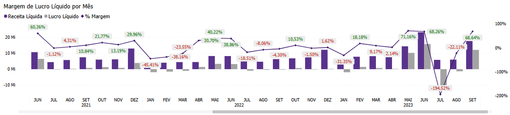

# Painel Lucro Líquido

  
  <h6>Imagem 1: Lucro Líquido Visão Gráfica</h6>
  
  <h6>Imagem 2: Lucro Líquido Visão de Tabela</h6>

Lucro Líquido refere-se ao lucro total da empresa após a dedução de todos os custos e despesas, incluindo impostos e despesas financeiras. Ele fornece uma visão clara do desempenho financeiro final da empresa, refletindo o lucro efetivo que pode ser reinvestido ou distribuído aos acionistas. 

O Lucro Líquido é um indicador crucial da saúde financeira da empresa e sua capacidade de gerar lucro após todas as obrigações.

Esta página do relatório é dividida em duas visualizações, visão gráfica e visão de tabela.

Na página de Receita Bruta, você encontrará:

## Visão Gráfica
### Tabela de Lucro Líquido

  
  <h6>Imagem 3: Tabela de Lucro Líquido</h6>

Esta tabela é exibindo Receita Líquida, Lucro Líquido e a % Margem (calculada como Lucro Líquido dividido pela Receita Líquida) por ano e mês. 

Ícones de aumento (Seta Verde) ou diminuição (Seta Vermelha) representam a variação em relação ao mesmo período do ano anterior. 

Esta tabela é importante porque fornece uma visão detalhada do desempenho financeiro ao longo do tempo, permitindo comparar os lucros e as margens de lucro mês a mês e ano a ano. As setas ajudam a identificar rapidamente tendências de crescimento ou declínio.

### Lucro Líquido Acumulado por Mês

  
  <h6>Imagem 4: Lucro Líquido Acumulado por Mês</h6>

Mostrando o valor acumulado do Lucro Líquido ao longo do tempo, com ‘tooltips’ que aparecem ao passar o cursor sobre a visualização, exibindo a Receita Líquida acumulada e a % Margem entre esses valores. 

Esse gráfico é essencial para analisar o comportamento acumulado do Lucro Líquido ao longo do tempo, ajudando a entender como as margens de lucro evoluem em relação à receita acumulada.

### Lucro Líquido vs. Receita Líquida por Mês

  
  <h6>Imagem 5: Lucro Líquido vs. Receita Líquida por Mês</h6>

Apresenta colunas para Lucro Líquido e Receita Líquida, com uma linha mostrando a % Margem. A linha é colorida em vermelho quando a margem está abaixo de 10% e em verde quando está igual ou acima de 10%. 

Esse gráfico facilita a comparação visual do Lucro Líquido e Receita Líquida, e ajuda a monitorar se a % Margem está atingindo a meta estabelecida, destacando períodos de desempenho insatisfatório ou excepcional.

## Visão de Tabela
### Tabela de Detalhamento

  
  <h6>Imagem 6: Tabela de Detalhamento</h6>

A tabela de detalhamento contém colunas para Identificador (ID da Transação), Data de Lançamento, Filial, Projeto e Lucro Líquido. Esta tabela fornece uma visão granular das transações individuais relacionadas ao Lucro Líquido. 

Permite uma análise detalhada de cada transação, facilitando a auditoria e o rastreamento do impacto das transações no Lucro Líquido. 

Essa visão é importante para identificar e avaliar os principais fatores que influenciam o lucro final da empresa.

  
***Aviso Legal:** Os números e informações apresentados nesta documentação são baseados em um conjunto de dados fictício. Eles são destinados exclusivamente para fins educacionais e de demonstração. Os dados não refletem condições do mundo real ou métricas de negócios reais e não devem ser usados ​​para tomada de decisão ou análise. Qualquer semelhança com entidades, eventos ou dados reais é mera coincidência.*
