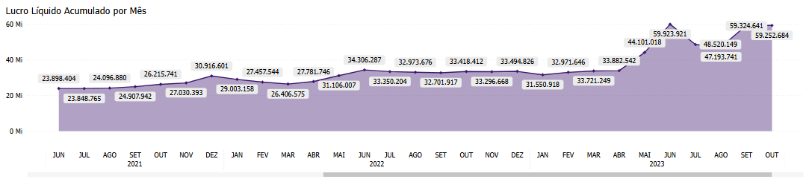

# Painel Lucro Líquido

  
  <h6>Imagem 1: Lucro Líquido - Visão Gráfica</h6>
  
  <h6>Imagem 2: Lucro Líquido - Visão de Tabela</h6>

## Navegação

O painel de relatórios é projetado com duas visualizações distintas. Alguns visuais são consistentes em ambas as visualizações, enquanto outros são específicos para cada visualização, garantindo que informações relevantes sejam apresentadas de acordo com o contexto de cada perspectiva;

- **[Visão Gráfica e Tabela](https://idea-technology-it.github.io/docs-idea/contabilidade/lucro_liquido/#visao-grafica-e-tabela)** - pode ser navegada através do [botão](https://idea-technology-it.github.io/docs-idea/contabilidade/intro/#botoes-para-diferentes-visoes) "voltar para visualização em gráfico" ou "ir para visualização em tabela".
- **[Visão Gráfica](https://idea-technology-it.github.io/docs-idea/contabilidade/lucro_liquido/#visao-grafica)** - pode ser navegada através do [botão](https://idea-technology-it.github.io/docs-idea/contabilidade/intro/#botoes-para-diferentes-visoes) "voltar para visualização em gráfico".
- **[Visão de Tabela](https://idea-technology-it.github.io/docs-idea/contabilidade/lucro_liquido/#visao-de-tabela)** - pode ser navegada através do [botão](https://idea-technology-it.github.io/docs-idea/contabilidade/intro/#botoes-para-diferentes-visoes) "ir para visualização em tabela".

## Informações no Painel Lucro Líquido

A análise de lucro líquido é um elemento essencial no Business Intelligence (BI) para contabilidade, pois fornece uma visão abrangente da rentabilidade de uma empresa. Monitorar e analisar o lucro líquido permite que as empresas avaliem sua performance financeira geral, identifiquem áreas de lucratividade e potencialmente otimizem suas estratégias para melhorar os resultados financeiros.

Visualizações como lucro líquido acumulado e crescimento do lucro líquido mês a mês são fundamentais para acompanhar a performance financeira ao longo do tempo. O lucro líquido acumulado oferece uma perspectiva de longo prazo, mostrando como o lucro líquido se acumula ao longo de um período específico. Isso ajuda a identificar tendências de rentabilidade e a prever a saúde financeira futura da empresa. A comparação do lucro líquido mês a mês permite que as empresas detectem variações de curto prazo, como o impacto de mudanças operacionais ou eventos sazonais, e ajustem suas estratégias financeiras conforme necessário.

A análise detalhada do lucro líquido por segmento, produto, filial ou linha de negócio é crucial para entender quais áreas estão contribuindo mais para a rentabilidade e quais podem precisar de melhorias. Esse tipo de análise permite que as empresas identifiquem quais produtos ou segmentos estão gerando mais lucro e quais estão apresentando baixo desempenho. Compreender essa distribuição ajuda a alocar recursos de maneira mais eficiente, otimizar estratégias de preço e desenvolver planos de ação para melhorar a rentabilidade.

A análise da margem de lucro líquido fornece insights sobre a eficiência operacional e a gestão de custos. Ao examinar a margem de lucro líquido, as empresas podem avaliar a relação entre receita e despesas, identificar áreas para redução de custos e melhorar a eficiência operacional. Essa análise também pode destacar a necessidade de ajustes na estrutura de preços ou em estratégias de controle de custos.

O impacto da análise de lucro líquido vai além do departamento financeiro. Os insights obtidos dos dados de lucro líquido podem influenciar decisões estratégicas, como investimentos, expansão de negócios e desenvolvimento de novos produtos. Compreender quais áreas estão gerando o maior lucro pode ajudar as equipes de gestão a direcionar esforços e recursos de forma mais eficaz, enquanto a análise de tendências de lucro pode informar estratégias de crescimento e otimização.

Em resumo, a análise de lucro líquido no BI para contabilidade é uma ferramenta poderosa para impulsionar o desempenho financeiro e estratégico. Ao examinar o lucro líquido de vários ângulos, como desempenho acumulado, variações mensais e detalhamento por segmento, as empresas obtêm uma visão mais clara de sua rentabilidade. Essa análise não só melhora a gestão financeira, mas também impacta outras áreas-chave, como estratégias de negócios, planejamento financeiro e decisões de investimento, criando um ambiente mais focado em resultados e orientado por dados.

## Visão Gráfica e Tabela

### Lucro Líquido por Filial ou Projeto

  
  <h6>Imagem 3: Tabela de Lucro Líquido</h6>

Esta tabela é exibindo Receita Líquida, Lucro Líquido e a % Margem (calculada como Lucro Líquido dividido pela Receita Líquida) por ano e mês. 

Ícones de aumento (Seta Verde) ou diminuição (Seta Vermelha) representam a variação em relação ao mesmo período do ano anterior. 

Esta tabela é importante porque fornece uma visão detalhada do desempenho financeiro ao longo do tempo, permitindo comparar os lucros e as margens de lucro mês a mês e ano a ano. As setas ajudam a identificar rapidamente tendências de crescimento ou declínio.

### Lucro Líquido Acumulado por Mês

  
  <h6>Imagem 4: Lucro Líquido Acumulado por Mês</h6>

Mostrando o valor acumulado do Lucro Líquido ao longo do tempo, com ‘tooltips’ que aparecem ao passar o cursor sobre a visualização, exibindo a Receita Líquida acumulada e a % Margem entre esses valores. 

Esse gráfico é essencial para analisar o comportamento acumulado do Lucro Líquido ao longo do tempo, ajudando a entender como as margens de lucro evoluem em relação à receita acumulada.

## Visão Gráfica

### Margem de Lucro Líquido por Mês

  
  <h6>Imagem 5: Lucro Líquido vs. Receita Líquida por Mês</h6>

Apresenta colunas para Lucro Líquido e Receita Líquida, com uma linha mostrando a % Margem. A linha é colorida em vermelho quando a margem está abaixo de 10% e em verde quando está igual ou acima de 10%. 

Esse gráfico facilita a comparação visual do Lucro Líquido e Receita Líquida, e ajuda a monitorar se a % Margem está atingindo a meta estabelecida, destacando períodos de desempenho insatisfatório ou excepcional.

## Visão de Tabela

### Tabela de Detalhamento

  
  <h6>Imagem 6: Tabela de Detalhamento</h6>

A tabela de detalhamento contém colunas para Identificador (ID da Transação), Data de Lançamento, Filial, Projeto e Lucro Líquido. Esta tabela fornece uma visão granular das transações individuais relacionadas ao Lucro Líquido. 

Permite uma análise detalhada de cada transação, facilitando a auditoria e o rastreamento do impacto das transações no Lucro Líquido. 

Essa visão é importante para identificar e avaliar os principais fatores que influenciam o lucro final da empresa.

  
***Aviso Legal:** Os números e informações apresentados nesta documentação são baseados em um conjunto de dados fictício. Eles são destinados exclusivamente para fins educacionais e de demonstração. Os dados não refletem condições do mundo real ou métricas de negócios reais e não devem ser usados ​​para tomada de decisão ou análise. Qualquer semelhança com entidades, eventos ou dados reais é mera coincidência.*
