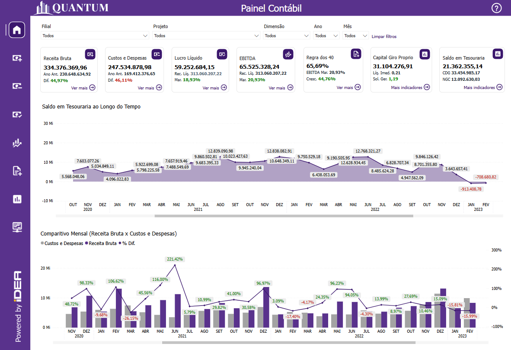
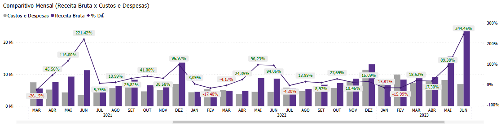

# Painel de Contábil

  
  <h6>Imagem 1: Painel de Contábil</h6>

## Informações noo Painel de Contábil

O Painel de Contábil oferece uma visão abrangente da saúde financeira da empresa por meio de indicadores contábeis detalhados e da Demonstração do Resultado do Exercício (DRE). Este painel é crucial para analisar a posição financeira e o desempenho da empresa, fornecendo insights valiosos que apoiam a tomada de decisões estratégicas e a gestão financeira eficaz.

A **Demonstração do Resultado do Exercício (DRE)** fornece um resumo das receitas, despesas e lucros ou prejuízos da empresa em um determinado período. Ela detalha como as receitas são convertidas em lucro líquido após a dedução das despesas operacionais, impostos e outras despesas. A análise da DRE permite identificar áreas de eficiência e ineficiência, avaliar a rentabilidade e monitorar o impacto de estratégias financeiras e operacionais.

Além da DRE, o painel apresenta uma série de indicadores contábeis fundamentais, como Capital de Giro Próprio, CDG (Capital de Giro), Composição de Endividamento, Giro do Ativo, Imobilização do Investimento Total, Liquidez Corrente, Liquidez Geral, Liquidez Imediata, Liquidez Seca, NGC (Necessidade de Capital de Giro), Saldo em Tesouraria e Solvência Geral. Cada indicador oferece uma perspectiva específica sobre a saúde financeira da empresa, permitindo uma análise detalhada e comparativa.

O **Painel de Contábil** facilita a compreensão da estrutura financeira da empresa ao mostrar todos esses indicadores de forma integrada. Ele permite que os usuários visualizem e comparem rapidamente o desempenho financeiro e os resultados operacionais, identificando tendências e áreas que podem exigir ajustes. A combinação da DRE com os indicadores contábeis proporciona uma visão holística, essencial para o planejamento estratégico e a gestão eficiente dos recursos financeiros.

Esse painel é uma ferramenta vital para a análise contábil, oferecendo uma visão clara e detalhada da situação financeira da empresa e possibilitando a identificação de oportunidades e riscos financeiros. Ele ajuda os gestores a manter uma gestão financeira sólida e informada, promovendo a saúde financeira e o crescimento sustentável da empresa.

## Saldo em Tesouraria ao Longo do Tempo

  
  <h6>Imagem 2: Saldo em Tesouraria ao Longo do Tempo</h6>

O gráfico de área que exibe o valor acumulado do saldo em tesouraria ao longo do tempo é uma ferramenta crucial para a análise financeira e contábil da empresa. Este gráfico ilustra a evolução do saldo disponível da empresa, proporcionando uma visão clara do desempenho financeiro ao longo de diferentes períodos. A inclusão de valores negativos destacados em vermelho é uma característica importante, pois permite identificar imediatamente períodos de déficit e visualizar com clareza as flutuações desfavoráveis no saldo em tesouraria.

A importância desse gráfico reside em sua capacidade de fornecer uma visão contínua e abrangente do saldo em tesouraria. Ao mostrar como o saldo varia ao longo do tempo, o gráfico permite que os gestores e contadores acompanhem a gestão de caixa da empresa de maneira eficaz. Isso é essencial para monitorar a disponibilidade de recursos financeiros e para identificar quaisquer problemas de liquidez que possam surgir.

A representação em vermelho para valores negativos é particularmente útil, pois destaca visualmente as variações desfavoráveis. Essa abordagem facilita a análise rápida e intuitiva dos períodos em que a empresa pode ter enfrentado dificuldades financeiras ou não ter conseguido manter um saldo positivo. Com essas informações, é possível realizar uma análise detalhada da gestão de caixa, identificar as causas de déficits e implementar medidas corretivas para melhorar a saúde financeira da empresa.

Além disso, o gráfico de área é uma ferramenta valiosa em relatórios contábeis, pois oferece uma visualização clara das tendências e padrões ao longo do tempo. Isso é fundamental para a elaboração de relatórios financeiros, o planejamento estratégico e a tomada de decisões informadas. O acompanhamento contínuo do saldo em tesouraria permite uma gestão financeira mais proativa e eficiente, ajudando a garantir que a empresa mantenha uma posição financeira saudável e esteja bem posicionada para enfrentar desafios futuros.

## Comparativo Mensal (Receita Bruta x Custos e Despesas)

  
  <h6>Imagem 3: Comparitivo Mensal (Receita Bruta x Custos e Despesas)</h6>

O gráfico de barras com linha é uma ferramenta visual poderosa que proporciona uma análise detalhada da Receita Bruta em comparação com Custos e Despesas ao longo do tempo. Neste gráfico, as barras representam os valores de Receita Bruta e Custos e Despesas para cada mês e ano, enquanto a linha sobreposta ilustra a diferença percentual entre esses dois conjuntos de dados, denotada como '% Dif.'

A adição da linha permite observar a variação percentual entre Receita Bruta e Custos e Despesas, oferecendo uma visão clara da eficiência financeira da empresa. As etiquetas de '% Dif.' são codificadas por cores, com verde para diferenças positivas e vermelho para diferenças negativas. Essa codificação por cores facilita a identificação rápida de períodos em que a empresa conseguiu gerar receita suficiente para cobrir seus custos e despesas, bem como aqueles em que as despesas superaram as receitas.

O gráfico permite uma comparação direta e visualmente intuitiva entre as receitas e os custos, ajudando a destacar os meses e anos em que a empresa teve uma performance financeira positiva ou negativa. Essa capacidade de visualizar as diferenças percentuais de maneira destacada é crucial para o ajuste de estratégias financeiras e para a tomada de decisões informadas.

A utilização deste gráfico em relatórios contábeis e financeiros é particularmente valiosa. Ele oferece uma visão clara sobre a relação entre receitas e despesas, permitindo identificar padrões, avaliar o impacto das variações financeiras e implementar medidas corretivas quando necessário. A combinação de barras e linha proporciona uma análise compreensiva que pode guiar a gestão para otimizar a performance financeira e garantir que as receitas sejam suficientes para cobrir os custos da empresa.

  
***Aviso Legal:** Os números e informações apresentados nesta documentação são baseados em um conjunto de dados fictício. Eles são destinados exclusivamente para fins educacionais e de demonstração. Os dados não refletem condições do mundo real ou métricas de negócios reais e não devem ser usados ​​para tomada de decisão ou análise. Qualquer semelhança com entidades, eventos ou dados reais é mera coincidência.*
