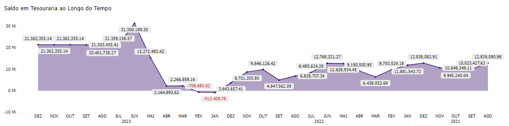
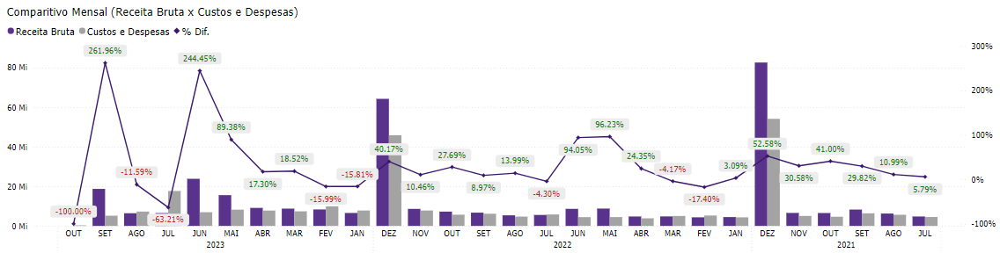

# Painel de Contábil - Home

  
  <h6>Imagem 1: Painel de Contábil - Home</h6>

Um relatório de BI (Business Intelligence) abrangente e focado em Contabilidade é crucial para oferecer uma visão clara e detalhada da saúde financeira de uma empresa. 

Esse tipo de relatório permite uma análise profunda das finanças, incluindo a gestão de caixa, comparação de receitas e despesas, e avaliação do desempenho econômico ao longo do tempo. 

Através de visualizações precisas e detalhadas, é possível identificar tendências, monitorar variações e tomar decisões informadas para otimizar a gestão financeira e melhorar a rentabilidade da empresa.

Na página de Home, você encontrará:

## Saldo em Tesouraria ao Longo do Tempo

  
  <h6>Imagem 2: Saldo em Tesouraria ao Longo do Tempo</h6>

Um gráfico de área mostrando o valor do saldo em tesouraria acumulado ao longo do tempo, com valores negativos exibidos em vermelho. 

Este gráfico é essencial para acompanhar a evolução do saldo em tesouraria da empresa, permitindo visualizar o saldo disponível em diferentes períodos e identificar quaisquer períodos de déficit. 

A representação em vermelho para valores negativos ajuda a destacar as variações desfavoráveis, facilitando a análise da gestão de caixa e a identificação de problemas de liquidez.

## Comparativo Mensal (Receita Bruta x Custos e Despesas)

  
  <h6>Imagem 3: Comparitivo Mensal (Receita Bruta x Custos e Despesas)</h6>

Um gráfico de barras com linha, onde as colunas mostram os valores de Receita Bruta e Custos e Despesas e a linha mostra a diferença entre essas duas barras como '% Dif.' por mês e ano. 

As etiquetas de '% Dif.' são verdes quando positivas e vermelhas quando negativas. Este gráfico permite comparar diretamente as receitas e despesas de cada mês e ano, visualizando a diferença percentual entre elas. 

A codificação por cores ajuda a identificar rapidamente se a empresa está gerando receita suficiente para cobrir seus custos e despesas, e a ajustar estratégias financeiras conforme necessário.

