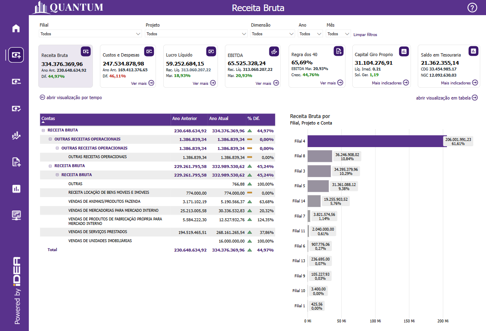
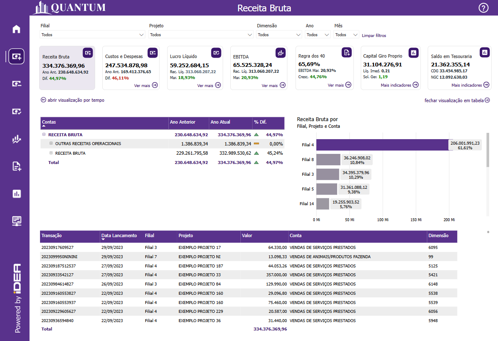
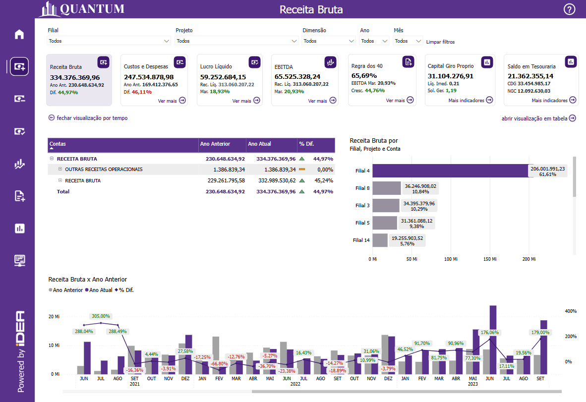
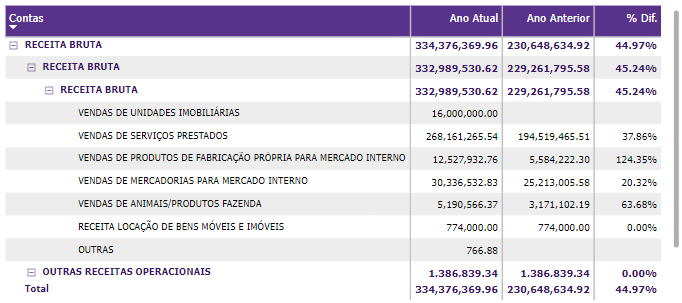
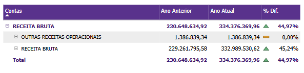
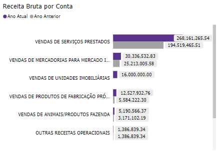
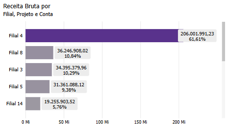
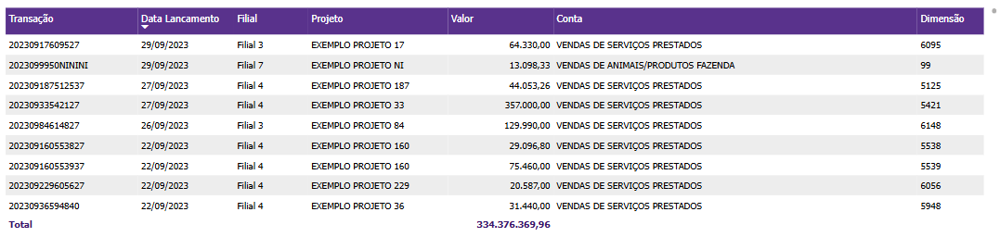
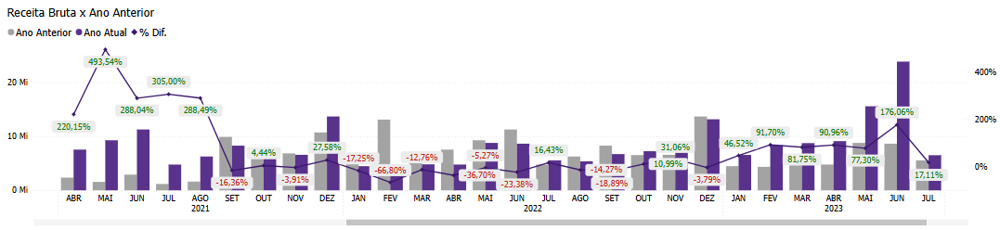

# Painel Receita Bruta

  
  <h6>Imagem 1: Receita Bruta - Visão Principal</h6>
  
  <h6>Imagem 2: Receita Bruta - Visão de Tabela</h6>
  
  <h6>Imagem 3: Receita Bruta - Visão de Tempo</h6>

## Navegação

O painel de relatórios é projetado com duas visualizações distintas. Alguns visuais são consistentes em ambas as visualizações, enquanto outros são específicos para cada visualização, garantindo que informações relevantes sejam apresentadas de acordo com o contexto de cada perspectiva;

- **[Visão Principal](https://idea-technology-it.github.io/docs-idea/contabilidade/receita_bruta/#visao-principal)** - pode ser navegada através do [botão](https://idea-technology-it.github.io/docs-idea/contabilidade/intro/#botoes-para-diferentes-visoes) "fechar visualização por tempo" ou "fechar visualização em tabela".
- **[Visão de Tabela](https://idea-technology-it.github.io/docs-idea/contabilidade/receita_bruta/#visao-de-tabela)** - pode ser navegada através do [botão](https://idea-technology-it.github.io/docs-idea/contabilidade/intro/#botoes-para-diferentes-visoes) "abrir visualização em tabela".
- **[Visão de Tempo](https://idea-technology-it.github.io/docs-idea/contabilidade/receita_bruta/#visao-de-tempo)** - pode ser navegada através do [botão](https://idea-technology-it.github.io/docs-idea/contabilidade/intro/#botoes-para-diferentes-visoes) "abrir visualização po tempo".

## Informações no Painel Receita Bruta

A análise de receita bruta é uma parte crucial do Business Intelligence (BI) para contabilidade, pois fornece uma visão essencial das receitas totais geradas por uma empresa antes da dedução de quaisquer custos ou despesas. Monitorar e analisar a receita bruta permite que as empresas avaliem sua capacidade de gerar vendas e identifiquem oportunidades para aumentar a receita e otimizar estratégias de negócios.

Visualizações como crescimento da receita bruta mês a mês são fundamentais para compreender o desempenho financeiro ao longo do tempo. A comparação da receita bruta mês a mês permite que as empresas detectem variações de curto prazo, como o impacto de campanhas de marketing ou mudanças no mercado, e ajustem suas estratégias de vendas e marketing de forma ágil.

Além disso, o painel oferece uma análise detalhada da **Receita Bruta** por filial, projeto ou conta, permitindo que a empresa identifique quais áreas estão gerando mais receita. Essa análise granular é essencial para entender onde as principais fontes de receita estão concentradas e onde há oportunidades para aumentar as vendas e melhorar o desempenho financeiro. A segmentação da receita por diferentes dimensões também permite que as empresas comparem o desempenho de várias unidades, projetos ou contas e façam ajustes estratégicos para otimizar os resultados.

O monitoramento da **variação de receita** ao longo do tempo também é um aspecto central do painel. Ao comparar o crescimento da receita de diferentes períodos, as empresas podem garantir que estão aproveitando oportunidades de crescimento, ao mesmo tempo que identificam áreas com desempenho inferior. Essa análise integrada ajuda a identificar tendências de crescimento e permite que as empresas ajustem suas estratégias para maximizar o aumento de receita.

Quando utilizado em conjunto com outros painéis, como o de [Custos e Despesas](https://idea-technology-it.github.io/docs-idea/contabilidade/custos_e_despesas/), a análise da Receita Bruta oferece uma visão completa da saúde financeira da empresa. Enquanto o painel de receita permite entender como as vendas e os lucros estão evoluindo, o painel de custos complementa essa visão ao detalhar o impacto dos gastos operacionais e administrativos sobre os resultados financeiros. A interação entre esses painéis possibilita uma análise abrangente, permitindo que a empresa identifique gargalos de rentabilidade e faça ajustes estratégicos para aumentar a eficiência operacional e maximizar os lucros.

Em resumo, o painel de **Receita Bruta** é uma ferramenta essencial para uma gestão financeira eficaz. Ele permite monitorar de perto as fontes de receita, entender sua distribuição por diversas dimensões e tomar decisões informadas para impulsionar o crescimento da empresa. Ao combinar essa análise com a visão de **Custos e Despesas**, as empresas obtêm uma visão integrada de suas operações, permitindo equilibrar suas atividades, melhorar sua eficiência e garantir um crescimento sustentável.

## Visão Principal

### Receita Bruta por Conta

  

    
    <h6>Imagem 4: Receita Bruta por Conta - Níveis Abertos</h6>
  

  

    
    <h6>Imagem 5: Receita Bruta por Conta - Níveis Fechados</h6>
  

Esta matriz oferece uma visão abrangente da Receita Bruta tanto para o Ano Atual quanto para o Ano Anterior, juntamente com a Diferença Percentual entre esses dois períodos, organizada por Conta e Nível de Conta de acordo com o modelo estabelecido. O valor principal desta tabela reside na sua capacidade de facilitar a comparação direta do desempenho da receita entre diferentes períodos. Ao categorizar os dados de receita por Conta e Nível de Conta, a tabela proporciona uma compreensão detalhada de como cada segmento contribui para a receita total, destacando assim tendências e variações no desempenho financeiro.

Os números de Receita Bruta para o Ano Atual oferecem uma visão do desempenho financeiro recente, servindo como um ponto de referência para avaliar a receita do Ano Anterior. Essa comparação é crucial para identificar tendências de crescimento ou declínio na receita, fornecendo insights valiosos sobre quais contas ou níveis experimentaram mudanças significativas. A coluna de Diferença Percentual é particularmente importante, pois quantifica a variação entre os dois anos, permitindo que os usuários avaliem a extensão do crescimento ou da redução da receita. Essa métrica ajuda a identificar quais áreas estão se destacando e quais podem precisar de ajustes estratégicos.

Além disso, a inclusão de ícones ao lado de cada Diferença Percentual melhora a clareza visual dos dados. Ícones verdes indicam um aumento na receita, ícones vermelhos denotam uma redução e ícones amarelos sinalizam que não houve alteração. Esse sistema de codificação por cores oferece pistas visuais imediatas, facilitando a interpretação dos dados rapidamente e identificando áreas de preocupação ou sucesso. No geral, a tabela serve como uma ferramenta poderosa para uma análise financeira detalhada, permitindo uma compreensão mais profunda das dinâmicas de receita e apoiando a tomada de decisões informadas.

A matriz também oferece a capacidade de expandir e recolher hierarquias. Clicar no sinal de mais (+) ao lado de uma conta permite que você veja os níveis de conta abaixo. Esta visualização hierárquica permite uma análise mais aprofundada, facilitando o rastreamento de cada conta em detalhes e sua contribuição para a receita bruta. Os usuários também podem recolher a hierarquia clicando no sinal de menos (-), permitindo uma navegação mais simplificada quando uma visualização mais geral for suficiente.

Este visual está disponível para todas as três visualizações deste painel, na [Visão Principal](https://idea-technology-it.github.io/docs-idea/contabilidade/receita_bruta/#visao-principal) os níveis de conta são expandidos totalmente, ajudando a ver detalhes granulares na instância initail. Enquanto que na [Visão de Tabela](https://idea-technology-it.github.io/docs-idea/contabilidade/receita_bruta/#visao-de-tabela) e na [Visão de Tempo](https://idea-technology-it.github.io/docs-idea/contabilidade/receita_bruta/#visao-de-tempo) esses níveis só se expandiram para o segundo nível para permitir um design mais compacto focado na interatividade com outros visuais na visualização.

### Receita Bruta por Filial, Projeto ou Conta

  

    
    <h6>Imagem 6: Receita Bruta por Filial, Projeto ou Conta - Altura Total</h6>
  

  

    
    <h6>Imagem 7: Receita Bruta por Filial, Projeto ou Conta - Altura Reduzida</h6>
  

Este gráfico de barras apresenta a Receita Bruta, permitindo que o usuário alterne entre diferentes níveis de análise: Filial, Projeto ou Conta. Essa flexibilidade torna o gráfico uma ferramenta dinâmica para explorar a receita em diversas dimensões, oferecendo uma visão detalhada da contribuição de cada Filial, Projeto ou Conta para a Receita Bruta total da empresa. Ao alternar entre esses níveis, o gráfico facilita comparações granulares e revela quais unidades de negócio ou iniciativas estão impulsionando o desempenho financeiro.

Em conjunto com a tabela comparativa da Receita Bruta do Ano Atual e do Ano Anterior, este gráfico de barras complementa a análise ao oferecer uma visualização mais intuitiva e direta das contribuições de receita. Enquanto a tabela permite uma análise detalhada de como as receitas mudaram entre dois períodos, o gráfico de barras dá suporte a essa análise ao visualizar as proporções e o peso de cada Filial, Projeto ou Conta no desempenho geral da empresa. A combinação dos dois visuais fornece uma abordagem quantitativa e visual completa: a tabela aprofunda a comparação entre os períodos, e o gráfico destaca as principais categorias que têm impacto no desempenho.

Além disso, os rótulos detalhados que exibem a porcentagem da Receita Bruta para cada categoria no gráfico de barras oferecem uma visão complementar às informações de variação percentual da tabela. Enquanto a tabela enfatiza a variação entre os anos, o gráfico de barras permite ver a representatividade relativa de cada Filial, Projeto ou Conta dentro do total de receitas atuais. Isso ajuda os usuários a identificar não apenas onde houve mudanças ao longo do tempo, mas também qual o peso atual de cada categoria em relação ao resultado geral.

Usando este visual em conjunto com a [Receita Bruta por Conta](https://idea-technology-it.github.io/docs-idea/contabilidade/receita_bruta/#receita-bruta-por-conta) permite que a análise financeira seja rica e multifacetada. A tabela fornece uma visão precisa das mudanças ao longo do tempo, enquanto o gráfico de barras foca na distribuição atual das receitas, ajudando a revelar padrões de desempenho e a destacar áreas críticas ou oportunidades de crescimento. Juntos, esses visuais permitem uma tomada de decisão mais informada, proporcionando uma visão completa tanto do passado quanto do presente da Receita Bruta.

Este visual está disponível para todas as três visualizações deste painel, na [Visão Principal](https://idea-technology-it.github.io/docs-idea/contabilidade/receita_bruta/#visao-principal) o visual ocupa o comprimento do painel para incluir o máximo possível de categorias. Enquanto que na [Visão de Tabela](https://idea-technology-it.github.io/docs-idea/contabilidade/receita_bruta/#visao-de-tabela) e na [Visão de Tempo](https://idea-technology-it.github.io/docs-idea/contabilidade/receita_bruta/#visao-de-tempo) apenas cinco categorias são exibidas com os maiores contribuidores primeiro, no entanto é possível rolar por todas as categorias disponíveis.

Para navegar entre os níveis, você pode usar os [ícones de cabeçalho](https://idea-technology-it.github.io/docs-idea/contabilidade/intro/#icones-de-cabecalho) que estão disponíveis quando você passa o mouse ou clica no gráfico.

  
  <h6>Ícones de Cabeçalho</h6>

Aqui, você pode navegar entre diferentes níveis hierárquicos, como Filial, Projeto ou Conta, para analisar a área desejada.

## Visão de Tabela

### Tabela de Detalhes

  
  <h6>Imagem 8: Tabela de Detalhes</h6>

Esta tabela de detalhes exibe informações fundamentais sobre as transações de Receita Bruta, organizada por transação, e inclui colunas essenciais para uma visão completa de cada lançamento. Cada linha da tabela representa uma transação individual, com informações como data de lançamento, filial, projeto, valor, conta e dimensão associada. Essa tabela é especialmente útil para a análise detalhada de cada transação, permitindo à empresa acompanhar e gerenciar suas receitas com precisão.

A organização por transação garante que cada transação seja facilmente identificada e rastreável, sendo útil para reconciliar os dados com outros sistemas. A data de lançamento permite acompanhar a cronologia dos registros e entender quando as receitas foram realizadas. A coluna de filial mostra a unidade da empresa relacionada a cada receita, fornecendo uma visão regionalizada das operações, enquanto a coluna projeto facilita a associação de receitas a projetos específicos, sendo especialmente valiosa para empresas que trabalham com múltiplos projetos simultaneamente.

A coluna de valor exibe o montante da receita bruta gerada por cada transação, oferecendo uma visão clara dos valores envolvidos. A identificação da conta permite um detalhamento financeiro ainda mais granular, associando receitas a categorias contábeis específicas. A dimensão adiciona uma camada analítica, facilitando a segmentação dos dados por critérios adicionais que ajudam a entender melhor a origem e a natureza das receitas.

Essa tabela pode ser utilizada em conjunto com outros visuais, como gráficos de barras ou de linha, para permitir um mergulho mais profundo nas transações individuais após uma análise mais ampla das tendências de receita bruta. A possibilidade de aplicar [filtros](https://idea-technology-it.github.io/docs-idea/contabilidade/intro/#filtros) interativos ou clicar nos gráficos auxilia na navegação rápida entre as diferentes camadas de informação, tornando o processo de análise mais dinâmico e eficiente.

#### Transação
ID único que identifica cada transação de receita bruta. Essencial para rastreamento e reconciliação.

#### Data de Lançamento 
Data em que a receita foi registrada. Importante para análise temporal e histórico das transações.

#### Filial
Unidade da empresa responsável pela receita. Ajuda a identificar a distribuição geográfica das operações.

#### Projeto
Relaciona a receita a um projeto específico, útil para monitorar receitas associadas a iniciativas empresariais específicas.

#### Valor
O montante da receita bruta de cada transação. Fornece uma visão clara dos valores gerados.

#### Conta
Categoria contábil da transação, essencial para análises financeiras detalhadas.

#### Dimensão
Categoria adicional que facilita a segmentação e a análise das receitas, oferecendo uma visão mais completa das transações.

## Visão de Tempo

### Receita Bruta x Ano Anterior

  
  <h6>Imagem 9: Receita Bruta x Ano Anterior</h6>

Este gráfico de barras com linha é uma representação poderosa para visualizar o desempenho da Receita Bruta de forma comparativa entre dois períodos – o Ano Atual e o Ano Anterior – enquanto a linha sobreposta indica a % Diferença entre os dois anos. As barras fornecem uma visão clara e direta dos valores absolutos de receita bruta em cada período, enquanto a linha destaca o quanto o desempenho variou entre os anos. Essa combinação é extremamente eficaz, pois facilita a análise tanto do valor bruto de cada período quanto da diferença percentual entre eles, fornecendo um entendimento visual imediato do crescimento ou declínio.

A linha da % diferença é uma adição crucial, pois destaca de maneira simples e eficaz as variações de desempenho entre os dois períodos. Pequenas variações nos valores de receita bruta podem passar despercebidas nas barras, mas a linha de diferença percentual permite identificar rapidamente as áreas de maior mudança, sejam elas positivas (aumento) ou negativas (redução). Assim, é possível avaliar rapidamente onde houve melhorias ou necessidade de ajustes no desempenho de receitas.

Quando usado em conjunto com os visuais de [Receita Bruta por Conta](https://idea-technology-it.github.io/docs-idea/contabilidade/receita_bruta/#receita-bruta-por-conta) e [Receita Bruta por Filial, Projeto ou Conta](https://idea-technology-it.github.io/docs-idea/contabilidade/receita_bruta/#receita-bruta-por-filial-projeto-ou-conta), esse gráfico de barras com linha se torna ainda mais poderoso. O visual de **Receita Bruta por Conta** fornece um detalhamento financeiro de cada conta, facilitando a análise dos fatores que influenciam o desempenho geral, enquanto o visual de **Receita Bruta por Filial, Projeto ou Conta** permite alternar entre diferentes níveis e dimensões, oferecendo uma análise mais específica e segmentada. 

A interação entre esses três visuais é essencial para uma análise mais rica. O gráfico de barras com linha oferece uma visão macro do desempenho da receita bruta de um período para outro, identificando rapidamente onde estão as maiores variações. A partir desse ponto, o usuário pode utilizar os visuais de [Receita Bruta por Conta](https://idea-technology-it.github.io/docs-idea/contabilidade/receita_bruta/#receita-bruta-por-conta) para aprofundar a análise e entender quais contas específicas contribuíram para essas variações, ou então usar o visual de [Receita Bruta por Filial, Projeto ou Conta](https://idea-technology-it.github.io/docs-idea/contabilidade/receita_bruta/#receita-bruta-por-filial-projeto-ou-conta) para identificar quais filiais, projetos ou contas específicas impulsionaram o aumento ou a redução da receita.

Em conjunto, esses três visuais proporcionam uma análise multidimensional. O gráfico de barras com linha destaca o panorama geral das mudanças de receita, enquanto os outros dois visuais oferecem a capacidade de detalhar e entender a composição dessas variações, permitindo uma análise mais direcionada e informada. Isso garante que a empresa possa monitorar seu desempenho de forma eficiente, identificar tendências de crescimento ou declínio, e ajustar sua estratégia para otimizar os resultados futuros.

  
***Aviso Legal:** Os números e informações apresentados nesta documentação são baseados em um conjunto de dados fictício. Eles são destinados exclusivamente para fins educacionais e de demonstração. Os dados não refletem condições do mundo real ou métricas de negócios reais e não devem ser usados ​​para tomada de decisão ou análise. Qualquer semelhança com entidades, eventos ou dados reais é mera coincidência.*
