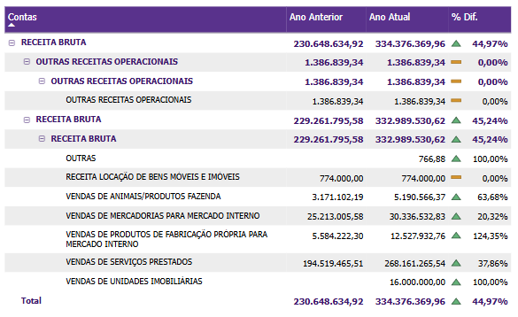
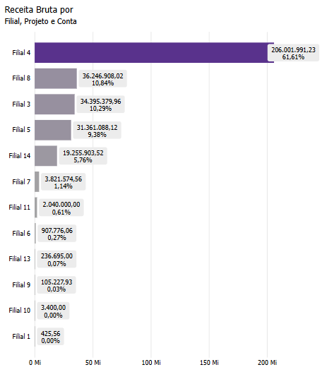

# Painel Receita Bruta

  
  <h6>Imagem 1: Receita Bruta Visão Gráfica</h6>
  
  <h6>Imagem 2: Receita Bruta Visão de Tabela</h6>

## Navegação

O painel de relatórios é projetado com duas visualizações distintas. Alguns visuais são consistentes em ambas as visualizações, enquanto outros são específicos para cada visualização, garantindo que informações relevantes sejam apresentadas de acordo com o contexto de cada perspectiva;

- **[Visão Gráfica e Tabela](https://idea-technology-it.github.io/docs-idea/contabilidade/receita_bruta/#visao-grafica-e-tabela)** - pode ser navegada através do [botão](https://idea-technology-it.github.io/docs-idea/contabilidade/intro/#botoes-para-diferentes-visoes) "voltar para visualização em gráfico" ou "ir para visualização em tabela".
- **[Visão Gráfica](https://idea-technology-it.github.io/docs-idea/contabilidade/receita_bruta/#visao-grafica)** - pode ser navegada através do [botão](https://idea-technology-it.github.io/docs-idea/contabilidade/intro/#botoes-para-diferentes-visoes) "voltar para visualização em gráfico".
- **[Visão de Tabela](https://idea-technology-it.github.io/docs-idea/contabilidade/receita_bruta/#visao-de-tabela)** - pode ser navegada através do [botão](https://idea-technology-it.github.io/docs-idea/contabilidade/intro/#botoes-para-diferentes-visoes) "ir para visualização em tabela".

## Informações no Painel Receita Bruta

A análise de receita bruta é uma parte crucial do Business Intelligence (BI) para contabilidade, pois fornece uma visão essencial das receitas totais geradas por uma empresa antes da dedução de quaisquer custos ou despesas. Monitorar e analisar a receita bruta permite que as empresas avaliem sua capacidade de gerar vendas e identifiquem oportunidades para aumentar a receita e otimizar estratégias de negócios.

Visualizações como receita bruta acumulada e crescimento da receita bruta mês a mês são fundamentais para compreender o desempenho financeiro ao longo do tempo. A receita bruta acumulada oferece uma visão de longo prazo, mostrando como a receita total se acumula ao longo de um período específico. Isso ajuda a identificar tendências de crescimento e a projetar a evolução futura da receita. A comparação da receita bruta mês a mês permite que as empresas detectem variações de curto prazo, como o impacto de campanhas de marketing ou mudanças no mercado, e ajustem suas estratégias de vendas e marketing de forma ágil.

A análise detalhada da receita bruta por produto, segmento, filial ou canal de vendas é essencial para entender quais áreas estão impulsionando as vendas e quais podem precisar de atenção. Esse tipo de análise permite que as empresas identifiquem quais produtos ou segmentos estão contribuindo mais para a receita e quais podem estar subperformando. Compreender essa distribuição ajuda a otimizar estratégias de vendas, ajustar ofertas de produtos e melhorar a alocação de recursos.

A análise da variação da receita bruta também fornece insights sobre a eficácia das estratégias de vendas e marketing. Ao comparar a receita bruta ao longo do tempo, as empresas podem identificar o impacto de campanhas promocionais, mudanças nos preços ou alterações nas condições de mercado. Essa análise pode ajudar a ajustar estratégias e campanhas para maximizar a geração de receita.

O impacto da análise de receita bruta vai além das vendas e marketing. Os insights obtidos dos dados de receita bruta podem influenciar decisões estratégicas, como expansão de mercado, desenvolvimento de novos produtos e planejamento financeiro. Compreender quais áreas estão gerando maior receita pode ajudar as equipes de gestão a tomar decisões informadas sobre investimentos e estratégias de crescimento.

Em resumo, a análise de receita bruta no BI para contabilidade é uma ferramenta poderosa para monitorar e otimizar o desempenho financeiro. Ao examinar a receita bruta de vários ângulos, como desempenho acumulado, variações mensais e detalhamento por segmento, as empresas obtêm uma compreensão mais profunda de suas fontes de receita. Essa análise não só melhora as estratégias de vendas e marketing, mas também impacta outras áreas-chave, como planejamento financeiro, desenvolvimento de produtos e decisões de expansão, criando um ambiente de negócios mais eficiente e orientado por dados.

## Visão Gráfica e Tabela

### Receita Bruta por Conta

  
  <h6>Imagem 3: Tabela de Receita Bruta</h6>

Esta tabela exibe a Receita Bruta para o Ano Atual, o Ano Anterior e a % Diferença entre eles, organizada por Nome da Conta e Nível, conforme a ordem do Modelo. 

A importância dessa tabela reside na sua capacidade de comparar diretamente o desempenho da Receita Bruta entre dois períodos diferentes e por diferentes contas, permitindo uma análise detalhada de variações e tendências. 

A % Diferença é crucial para entender o crescimento ou a redução nas receitas de um período para outro, fornecendo insights sobre a performance de cada conta específica e ajudando a identificar áreas que precisam de atenção ou otimização.

### Receita Bruta por Filial ou Projeto

  
  <h6>Imagem 4: Receita Bruta por Conta</h6>

Este gráfico de barras verticais apresenta barras que representam a Receita Bruta para o Ano Atual e o Ano Anterior, organizadas por Nome da Conta e ordenadas do maior valor do Ano Atual para o menor. 

Esse gráfico é importante porque permite uma comparação visual clara das receitas atuais e anteriores, facilitando a identificação de contas que tiveram crescimento significativo ou declínio. 

A ordenação dos dados ajuda a destacar as principais contas em termos de receita e facilita a identificação de padrões de desempenho.

## Visão Gráfica

### Receita Bruta Ano Atual vs. Ano Anterior

  
  <h6>Imagem 5: Variação da Receita Bruta em Relação ao Ano Anterior</h6>

Este gráfico de barras com linha combina barras e uma linha para mostrar a Receita Bruta para o Ano Atual e o Ano Anterior, com a linha representando a % Diferença entre eles. 

A linha é colorida em verde quando a diferença é positiva e em vermelho quando é negativa. 

Este gráfico é essencial para a análise temporal da Receita Bruta, pois permite visualizar as variações mês a mês e ano a ano, bem como a magnitude e a direção das mudanças. 

A codificação por cor da % Diferença ajuda a identificar rapidamente os períodos de melhoria ou deterioração no desempenho financeiro.

## Visão de Tabela

### Tabela de Detalhamento

  
  <h6>Imagem 6: Tabela de Detalhamento</h6>

Esta tabela contém dados detalhados com colunas para Identificador (ID da Transação), Data Lançamento (Data da Transação), Filial (Filial), Projeto (Projeto), Valor da Receita Bruta, Nome da Conta (conforme o Modelo), Nome da Conta Sintética (conforme o Modelo) e Nome da Conta Analítica (conforme o Modelo). 

A importância desta tabela reside na sua capacidade de fornecer uma visão granular e específica das transações individuais. Isso permite uma análise detalhada do impacto de cada transação na Receita Bruta, facilitando a auditoria e o rastreamento das origens das receitas, além de possibilitar a avaliação da performance por diferentes filiais, projetos e contas. 

A inclusão dos diferentes níveis de contas ajuda a entender melhor a estrutura e os detalhes das receitas, permitindo uma análise mais precisa e contextualizada.

  
***Aviso Legal:** Os números e informações apresentados nesta documentação são baseados em um conjunto de dados fictício. Eles são destinados exclusivamente para fins educacionais e de demonstração. Os dados não refletem condições do mundo real ou métricas de negócios reais e não devem ser usados ​​para tomada de decisão ou análise. Qualquer semelhança com entidades, eventos ou dados reais é mera coincidência.*
