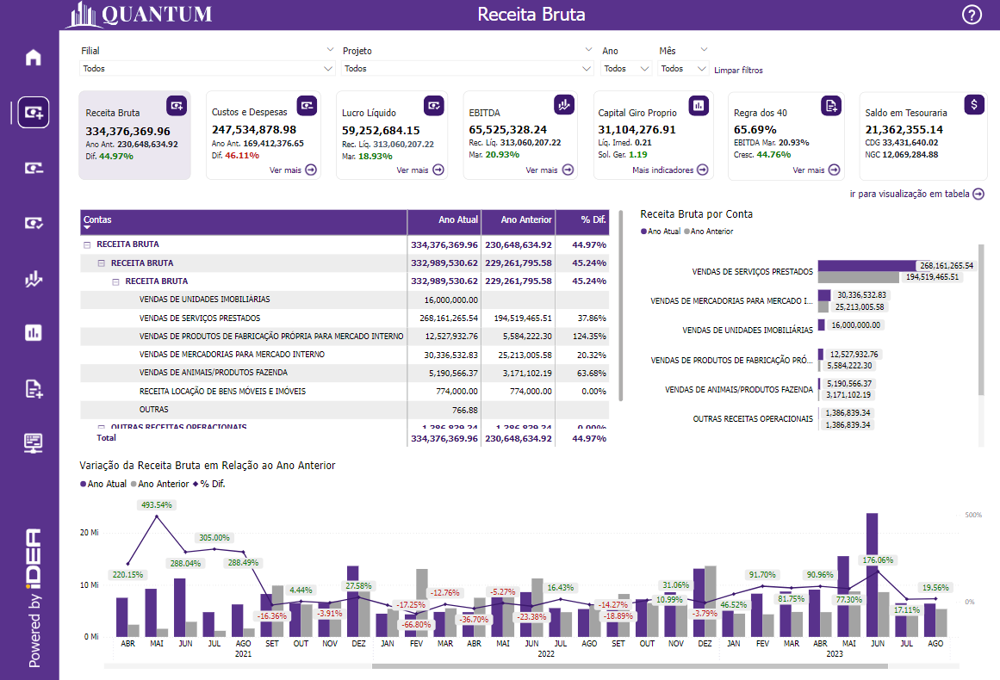
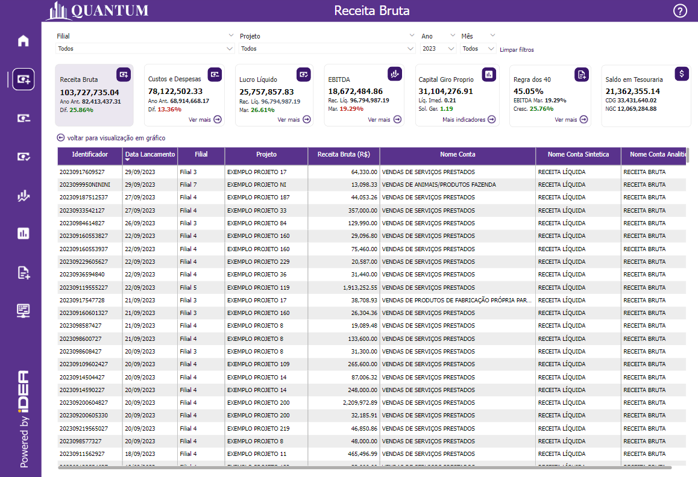
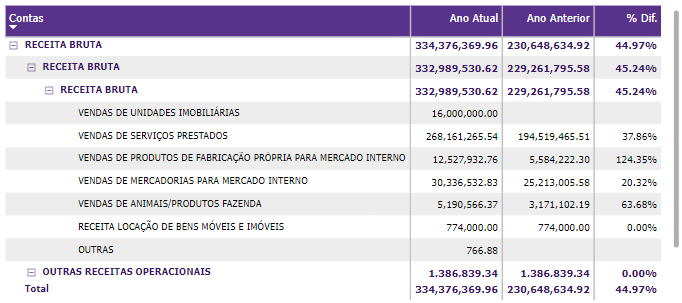
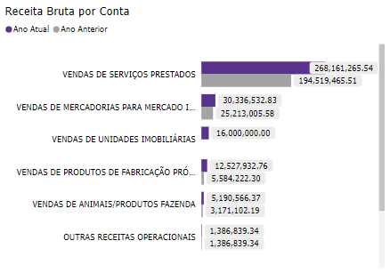
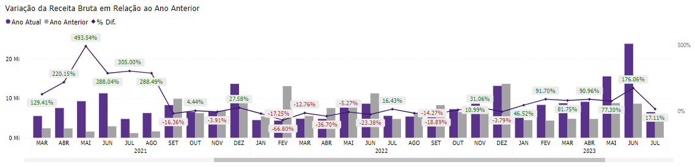
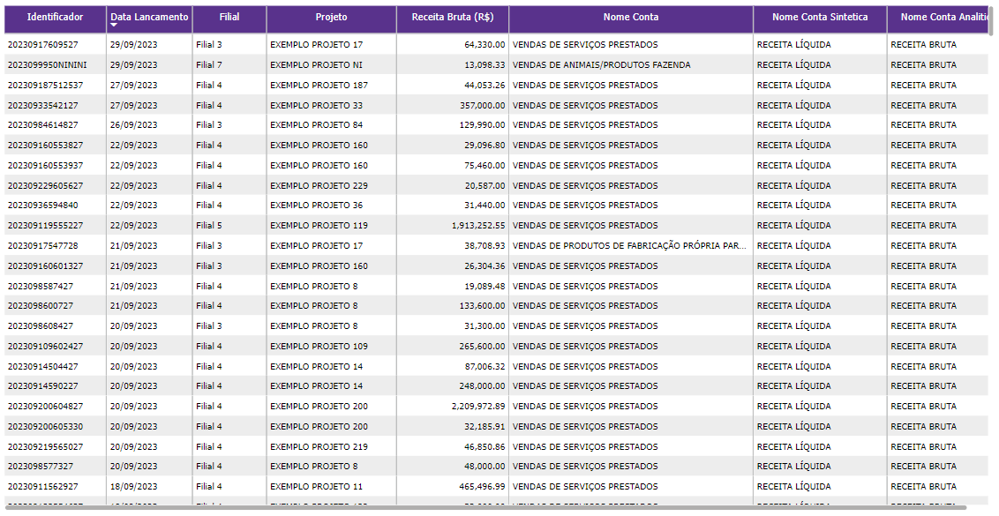

# Receita Bruta

  
  <h6>Imagem 1: Receita Bruta Visão Gráfica</h6>
  
  <h6>Imagem 2: Receita Bruta Visão de Tabela</h6>

Receita Bruta refere-se ao total de receita gerada pela empresa a partir de suas vendas e serviços antes de qualquer dedução, como impostos, descontos ou devoluções. 

Esta métrica é essencial porque fornece uma visão clara da performance geral da empresa e da demanda de mercado pelos seus produtos ou serviços. 

A Receita Bruta é um indicador chave para avaliar o volume de negócios e a capacidade de geração de receita da empresa.

Esta página do relatório é dividida em duas visualizações, visão gráfica e visão de tabela.

Na página de Receita Bruta, você encontrará:

## Visão Gráfica
### Tabela de Receita Bruta

  
  <h6>Imagem 3: Tabela de Receita Bruta</h6>

Esta tabela exibe a Receita Bruta para o Ano Atual, o Ano Anterior e a % Diferença entre eles, organizada por Nome da Conta e Nível, conforme a ordem do Modelo. 

A importância dessa tabela reside na sua capacidade de comparar diretamente o desempenho da Receita Bruta entre dois períodos diferentes e por diferentes contas, permitindo uma análise detalhada de variações e tendências. 

A % Diferença é crucial para entender o crescimento ou a redução nas receitas de um período para outro, fornecendo insights sobre a performance de cada conta específica e ajudando a identificar áreas que precisam de atenção ou otimização.

### Receita Bruta por Conta

  
  <h6>Imagem 4: Receita Bruta por Conta</h6>

Este gráfico de barras verticais apresenta barras que representam a Receita Bruta para o Ano Atual e o Ano Anterior, organizadas por Nome da Conta e ordenadas do maior valor do Ano Atual para o menor. 

Esse gráfico é importante porque permite uma comparação visual clara das receitas atuais e anteriores, facilitando a identificação de contas que tiveram crescimento significativo ou declínio. 

A ordenação dos dados ajuda a destacar as principais contas em termos de receita e facilita a identificação de padrões de desempenho.

### Variação da Receita Bruta em Relação ao Ano Anterior

  
  <h6>Imagem 5: Variação da Receita Bruta em Relação ao Ano Anterior</h6>

Este gráfico de barras com linha combina barras e uma linha para mostrar a Receita Bruta para o Ano Atual e o Ano Anterior, com a linha representando a % Diferença entre eles. 

A linha é colorida em verde quando a diferença é positiva e em vermelho quando é negativa. 

Este gráfico é essencial para a análise temporal da Receita Bruta, pois permite visualizar as variações mês a mês e ano a ano, bem como a magnitude e a direção das mudanças. 

A codificação por cor da % Diferença ajuda a identificar rapidamente os períodos de melhoria ou deterioração no desempenho financeiro.

## Visão de Tabela
### Tabela de Detalhamento

  
  <h6>Imagem 6: Tabela de Detalhamento</h6>

Esta tabela contém dados detalhados com colunas para Identificador (ID da Transação), Data Lançamento (Data da Transação), Filial (Filial), Projeto (Projeto), Valor da Receita Bruta, Nome da Conta (conforme o Modelo), Nome da Conta Sintética (conforme o Modelo) e Nome da Conta Analítica (conforme o Modelo). 

A importância desta tabela reside na sua capacidade de fornecer uma visão granular e específica das transações individuais. Isso permite uma análise detalhada do impacto de cada transação na Receita Bruta, facilitando a auditoria e o rastreamento das origens das receitas, além de possibilitar a avaliação da performance por diferentes filiais, projetos e contas. 

A inclusão dos diferentes níveis de contas ajuda a entender melhor a estrutura e os detalhes das receitas, permitindo uma análise mais precisa e contextualizada.

