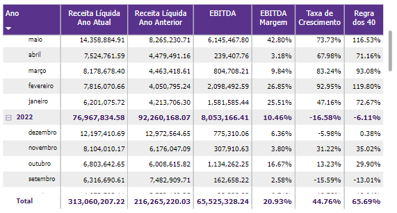
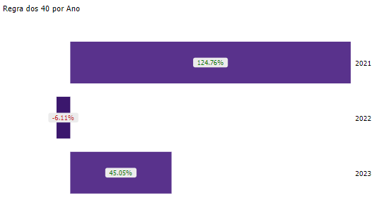

# Regra dos 40

  
  <h6>Imagem 1: Regra dos 40</h6>

Regra dos 40 é um princípio amplamente utilizado para avaliar o equilíbrio entre crescimento e rentabilidade de uma empresa. De acordo com essa regra, a soma da taxa de crescimento anual da receita (em percentual) e a margem de lucro operacional (em percentual) deve ser igual ou superior a 40%. Esse indicador é especialmente relevante para empresas de software como serviço (SaaS), onde o crescimento rápido e a lucratividade sustentável são essenciais para o sucesso a longo prazo.

Por exemplo, se uma empresa de tecnologia tem uma taxa de crescimento anual de 30% e uma margem de lucro operacional de 15%, a soma desses dois números seria 45%, o que supera a marca de 40% e, portanto, indica que a empresa está em um caminho saudável de crescimento e lucratividade. Por outro lado, se uma empresa tem um crescimento muito acelerado, mas sua margem de lucro é baixa ou negativa, ou vice-versa, a soma pode ficar abaixo de 40%, sugerindo que a empresa pode enfrentar desafios em manter um crescimento sustentável a longo prazo.

A Regra dos 40 oferece uma métrica simples e poderosa para investidores e gestores avaliarem se uma empresa está conseguindo equilibrar sua expansão de mercado com eficiência financeira, garantindo assim um caminho equilibrado entre a busca por participação de mercado e a saúde financeira.

Na página de Regra dos 40, você encontrará:

## Matrix de Regra dos 40

  
  <h6>Imagem 2: Matrix de Regra dos 40</h6>

Esta matriz apresenta colunas para Receita Líquida Ano Atual, Receita Líquida Ano Anterior, EBITDA, Margem EBITDA, Taxa de Crescimento e Regra dos 40, organizadas por ano e mês. Cada coluna desempenha um papel crucial na análise da aplicação da Regra dos 40 e oferece insights detalhados sobre o desempenho financeiro da empresa.

###	Receita Líquida Ano Atual
Reflete o total de receita gerada pela empresa no ano em curso, após a dedução de descontos, devoluções e abatimentos. Esta coluna é essencial para avaliar a capacidade de geração de receita atual da empresa e fornece a base para comparar com o período anterior.
### Receita Líquida Ano Anterior
Mostra a receita líquida registrada no mesmo período do ano anterior. Comparar essa coluna com a Receita Líquida Ano Atual permite medir o crescimento ou a desaceleração das receitas ao longo do tempo, oferecendo uma perspectiva histórica de desempenho.
### EBITDA
Representa o lucro operacional da empresa antes de juros, impostos, depreciação e amortização. Esta coluna é crucial para entender a rentabilidade operacional e a eficiência da empresa em gerar lucro a partir de suas operações principais, sem os impactos de variáveis externas.
### Margem EBITDA
Calculada como EBITDA dividido pela Receita Líquida, esta coluna mostra a porcentagem da receita que é convertida em EBITDA. A Margem EBITDA é um indicador importante da eficiência operacional e da capacidade da empresa em manter rentabilidade a partir de suas vendas.
### Taxa de Crescimento
Mede a variação percentual na Receita Líquida em relação ao período anterior. Esta coluna é vital para avaliar o ritmo de expansão da empresa, oferecendo uma visão sobre o sucesso das estratégias de crescimento e a capacidade de aumentar a receita ao longo do tempo.
### Regra dos 40
Calculada como a soma da Margem EBITDA e da Taxa de Crescimento, esta coluna é usada para verificar se a soma desses dois indicadores atinge ou supera a meta de 40%. A Regra dos 40 é um parâmetro chave para equilibrar crescimento e lucratividade, e sua análise ajuda a determinar se a empresa está atingindo um desempenho financeiro saudável e sustentável.

Cada coluna na matriz contribui para uma compreensão abrangente do desempenho financeiro da empresa e ajuda a avaliar se os objetivos de crescimento e lucratividade estão sendo atingidos de forma eficaz.

## Regra dos 40 por Ano

  
  <h6>Imagem 3: Regra dos 40 por Ano</h6>

Este gráfico de barras exibe a Regra dos 40 por ano, com rótulos de texto que mudam de cor conforme o desempenho em relação à meta. Os rótulos se tornam vermelhos quando o valor está abaixo de 40% e verdes quando igual ou superior a 40%. Essa representação ajuda a visualizar rapidamente o cumprimento da Regra dos 40 ao longo dos anos.

## Regra dos 40 por Mês

  
  <h6>Imagem 4: Regra dos 40 por Mês</h6>

O gráfico de área mostra a Regra dos 40 por mês e ano, com rótulos de texto que também mudam de cor de acordo com a meta. Os rótulos ficam vermelhos quando o valor está abaixo de 40% e verdes quando está igual ou acima de 40%. Além disso, o gráfico inclui uma linha que marca o objetivo de 40%, facilitando a comparação visual do desempenho com a meta estabelecida.
