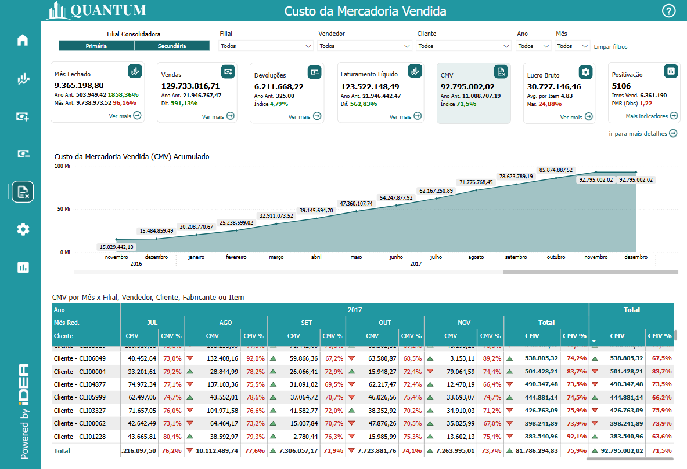
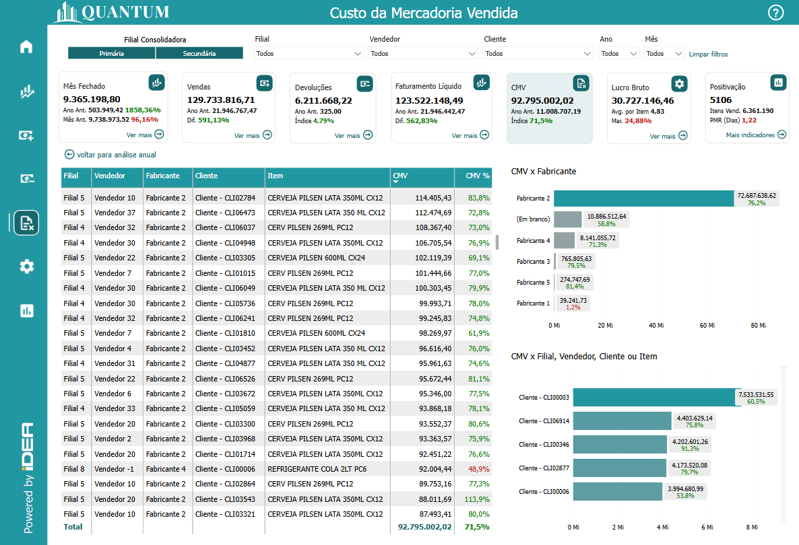
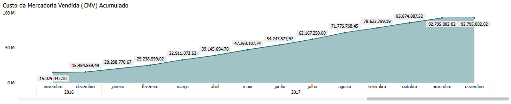
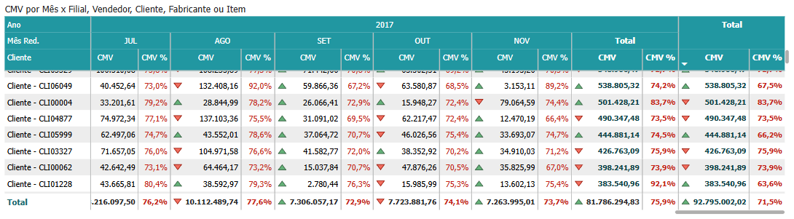
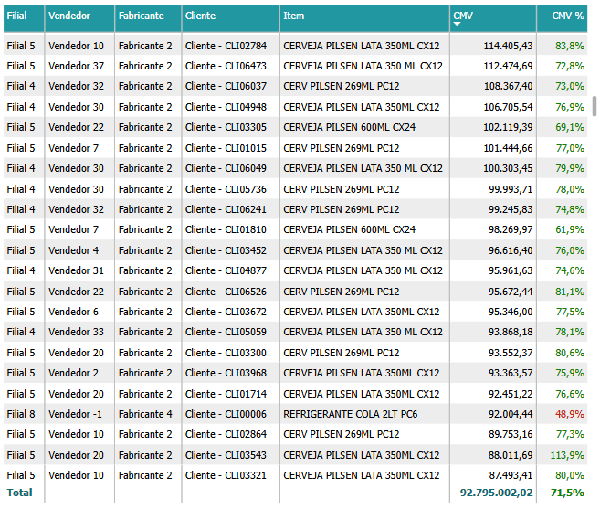
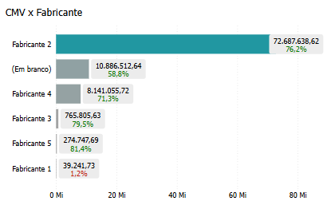
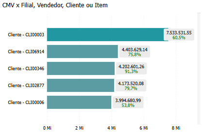

# Painel Custo de Mercadoria Vendida

  
  <h6>Imagem 1: Painel Custo de Mercadoria Vendida - Visão Análise anual</h6>

  
  <h6>Imagem 2: Painel Custo de Mercadoria Vendida - Visão Detalhes</h6>

## Navegação

Este painel de relatório está dividido em duas visualizações;

- **[Visão Análise Anual](https://idea-technology-it.github.io/docs-idea/faturamento/vendas/#visao-analise-anual)** - pode ser navegada através do [botão](https://idea-technology-it.github.io/docs-idea/faturamento/intro/#botoes-para-diferentes-visoes) "voltar para análise anual".
- **[Visão Detalhes](https://idea-technology-it.github.io/docs-idea/faturamento/vendas/#visao-detalhes)** - pode ser navegada através do [botão](https://idea-technology-it.github.io/docs-idea/faturamento/intro/#botoes-para-diferentes-visoes) "ir para mais detalhes".

## Informações no Painel Custo da Mercadoria Vendida

### Valor de Custo da Mercadoria Vendida (CMV)

A análise do Custo de Mercadorias Vendidas (CMV) é um componente essencial no Business Intelligence (BI), pois oferece insights valiosos sobre a eficiência operacional, a lucratividade e o controle de custos de uma empresa. Monitorar o CMV ajuda as empresas a entender melhor o impacto dos custos diretos relacionados à produção e venda de seus produtos, permitindo identificar áreas onde é possível melhorar a rentabilidade e a margem de lucro. Ao analisar várias métricas relacionadas ao CMV, as empresas podem otimizar seus processos produtivos, ajustar estratégias de precificação e tomar decisões mais embasadas.

Visualizações como o CMV acumulado e o CMV mês a mês são fundamentais para acompanhar os custos ao longo do tempo. O CMV acumulado oferece uma visão de longo prazo, mostrando como os custos estão se acumulando ao longo de um período específico. Essa análise ajuda a identificar padrões consistentes ou flutuações inesperadas nos custos, permitindo um planejamento financeiro mais preciso. Por outro lado, a comparação do CMV mês a mês possibilita detectar variações de curto prazo, como o impacto de mudanças em fornecedores, preços de insumos ou condições sazonais, ajudando a empresa a ajustar rapidamente suas operações e processos de compra.

Análises detalhadas do CMV por Filial, Vendedor, Cliente, Fabricante ou Item são essenciais para uma compreensão mais aprofundada dos custos em várias dimensões do negócio. Esse tipo de análise permite que as empresas identifiquem quais locais, produtos ou fornecedores estão gerando maiores custos, ajudando a ajustar estratégias de compra, negociação com fornecedores ou processos de fabricação. Além disso, essa análise detalhada revela quais produtos têm os maiores custos de produção e venda, permitindo à empresa ajustar sua estratégia de estoque e mix de produtos para otimizar a lucratividade.

A análise do CMV também oferece insights críticos para a gestão de fornecedores e a cadeia de suprimentos. Identificar como diferentes fornecedores impactam os custos de produção ajuda a empresa a renegociar contratos, procurar alternativas mais econômicas ou consolidar relações com fornecedores de maior confiança e qualidade. Esses insights são fundamentais para melhorar a eficiência operacional, reduzir o desperdício e minimizar custos associados à fabricação e distribuição de produtos.

Além disso, o CMV está intimamente relacionado à precificação e à margem de lucro de cada produto. Compreender os custos por item e as variações nos custos de produção ou compra permite que a equipe de vendas e finanças definam preços adequados para garantir que a margem de lucro seja mantida ou melhorada. Ao ajustar as estratégias de precificação com base no CMV, a empresa pode maximizar seus lucros sem sacrificar a competitividade no mercado.

A análise do CMV também influencia diretamente outras áreas da empresa, como marketing e desenvolvimento de produtos. Por exemplo, produtos com altos custos podem exigir campanhas de marketing mais segmentadas ou ofertas diferenciadas para atrair o público certo, enquanto a equipe de desenvolvimento pode focar em produtos com margens mais favoráveis para maximizar a eficiência dos recursos.

No contexto financeiro, o CMV tem um impacto direto na demonstração de resultados da empresa, afetando o lucro bruto e, consequentemente, a lucratividade geral. Uma análise detalhada do CMV ajuda as equipes financeiras a entender melhor o impacto dos custos variáveis e a ajustar projeções de lucro com mais precisão.

Em resumo, a análise do Custo de Mercadorias Vendidas (CMV) no BI é uma ferramenta essencial para melhorar a gestão de custos e a lucratividade da empresa. Ao examinar o CMV em várias dimensões, como desempenho acumulado, variações mensais e detalhamento por Filial, Vendedor, Cliente, Fabricante ou Item, as empresas podem identificar áreas críticas para ajustes e melhorias. Esse tipo de análise não apenas otimiza a gestão de custos, mas também impacta positivamente outras áreas-chave, como precificação, cadeia de suprimentos e operações, criando uma abordagem mais eficiente, estratégica e orientada por dados.

## Visão Análise Anual

### Custo de Mercadoria Vendida (CMV) Acumulado

  
  <h6>Imagem 3: Custo de Mercadoria Vendida (CMV) Acumulado</h6>

Um gráfico de área é uma ferramenta extremamente eficaz para visualizar o comportamento do Custo de Mercadorias Vendidas (CMV) acumulado ao longo do tempo, especialmente quando o eixo x é dividido por ano e mês. Esse tipo de gráfico permite que as empresas acompanhem as tendências dos custos de produção e venda de seus produtos, revelando padrões, flutuações sazonais, e variações em períodos específicos. A área preenchida abaixo da linha destaca visualmente o aumento ou diminuição acumulada do CMV, facilitando a compreensão de como os custos estão evoluindo ao longo dos meses.

Esse tipo de visualização é especialmente útil para destacar mudanças no CMV e identificar períodos de picos ou quedas nos custos. Um aumento repentino no CMV pode apontar para fatores como variações nos preços de insumos, problemas na cadeia de suprimentos, ou mudanças na demanda de produção. Por outro lado, uma redução consistente nos custos pode indicar eficiência nas operações, melhores acordos com fornecedores, ou processos de fabricação mais otimizados. As empresas podem usar essas informações para ajustar suas estratégias de compra, renegociar contratos com fornecedores, ou otimizar a gestão de produção.

Além disso, o gráfico de área acumulada é uma excelente ferramenta para identificar sazonalidades nos custos de produção. Por exemplo, uma empresa pode perceber que, após grandes campanhas de vendas ou eventos promocionais, os custos de produção aumentam, possivelmente devido ao aumento da demanda de produtos ou à necessidade de aquisição de insumos em maior quantidade. Com essa análise, a empresa pode se preparar melhor para períodos de maior demanda, ajustando suas previsões de custos, aumentando a eficiência dos processos de aquisição e fabricação, e garantindo que o impacto sobre a margem de lucro seja minimizado.

Outra grande vantagem desse gráfico é a sua capacidade de oferecer uma visão comparativa entre diferentes períodos. Ele permite que as empresas observem como o CMV de um determinado mês ou trimestre se compara ao mesmo período de anos anteriores, identificando se os custos estão sendo controlados de forma eficiente ou se há aumentos progressivos que precisam ser analisados. A visão cumulativa dos custos ao longo do tempo ajuda a verificar se as medidas implementadas para otimizar os processos produtivos estão funcionando ou se são necessárias mudanças mais drásticas para reduzir os custos.

Além de facilitar o acompanhamento e análise dos custos passados, o gráfico de área acumulada é uma ferramenta valiosa para planejamento financeiro e projeção de custos futuros. Com base em tendências anteriores, a empresa pode prever com maior precisão quais períodos são mais propensos a variações de custo e se preparar para isso. Isso auxilia na alocação de recursos e na definição de orçamentos, garantindo que a empresa tenha flexibilidade financeira para lidar com possíveis aumentos nos custos de produção ou aquisição de mercadorias.

O gráfico de área acumulada também ajuda a identificar pontos de ineficiência no processo de fabricação ou fornecimento. Ao observar aumentos anormais nos custos, a empresa pode investigar a fundo quais fatores estão gerando esses aumentos e implementar ações corretivas, seja por meio de mudanças no processo produtivo, ajuste nas estratégias de aquisição ou melhorias no controle de estoque.

Em resumo, o gráfico de área acumulada para o CMV proporciona uma visão clara e detalhada das tendências de custo ao longo do tempo, permitindo que as empresas identifiquem padrões e ajustem suas operações para maximizar a eficiência e a lucratividade. A capacidade de acompanhar o comportamento dos custos em diferentes períodos oferece insights estratégicos que impactam diretamente nas decisões sobre compras, produção e precificação, ajudando a empresa a manter uma gestão de custos mais rigorosa e eficiente. Ao fornecer uma base sólida para análise e projeções, essa visualização apoia as empresas em sua busca por otimização financeira e um melhor controle dos processos produtivos.

### CMV por Mês x Filial, Vendedor, Cliente, Fabricante ou Produto

  
  <h6>Imagem 4: CMV por Mês x Filial, Vendedor, Cliente, Fabricante ou Produto</h6>

Uma matriz que exibe os valores do Custo de Mercadorias Vendidas (CMV) mês a mês, com ícones que indicam aumento (verde) ou diminuição (vermelho) em relação ao mês anterior, oferece uma forma dinâmica e intuitiva de analisar o comportamento dos custos ao longo do tempo. Essa matriz permite que os usuários monitorem facilmente as flutuações no CMV, identifiquem tendências preocupantes e reconheçam melhorias em diferentes períodos. O uso de ícones coloridos simplifica a interpretação, fornecendo sinais visuais imediatos — verde para reduções nos custos e vermelho para aumentos —, facilitando a análise dos dados sem a necessidade de uma investigação profunda nos números.

O grande diferencial desta matriz é que, além de apresentar os valores absolutos do CMV, ela também exibe a percentagem do CMV em relação à receita de vendas. Essa métrica é essencial para avaliar a eficiência operacional da empresa e o impacto dos custos sobre a margem de lucro. Para facilitar ainda mais a interpretação, o texto da porcentagem muda de cor: verde para percentagens abaixo de um limite aceitável, indicando eficiência nos custos, e vermelho para percentagens acima do ideal, sinalizando uma área de risco que exige atenção. Essa codificação por cores oferece uma leitura rápida e eficaz, permitindo que os gestores identifiquem imediatamente os produtos, filiais ou fornecedores com maiores custos e avaliem onde estão as maiores ineficiências.

A matriz é altamente flexível, pois permite alterar os cabeçalhos das linhas entre Filial, Vendedor, Cliente, Fabricante ou Item, tornando-a uma ferramenta poderosa para uma análise segmentada e detalhada. Ao analisar o CMV por Filial, a empresa pode ver quais unidades estão enfrentando os maiores custos em relação às vendas, permitindo uma ação mais específica para otimizar a gestão de estoque ou renegociar preços com fornecedores locais. Ao alternar para Vendedor, a matriz fornece uma visão clara do impacto que cada representante de vendas tem sobre os custos, ajudando a identificar quem pode estar vendendo produtos com maiores custos de produção e, portanto, afetando a margem de lucro. A análise por Cliente permite avaliar o CMV associado a grandes clientes ou grupos de clientes, fornecendo insights sobre como os custos variam entre os segmentos de clientes mais importantes. Da mesma forma, a visualização por Fabricante ou Item possibilita uma avaliação detalhada dos produtos ou fornecedores que geram os maiores custos, o que pode levar a decisões de renegociação de contratos ou substituição de itens menos rentáveis.

Essa matriz não apenas ajuda na tomada de decisões rápidas, como também destaca oportunidades de melhoria em várias áreas da operação. A flexibilidade para alternar entre dimensões como Filial, Vendedor, Cliente, Fabricante ou Item oferece uma visão ampla e profunda, permitindo que a empresa formule estratégias eficazes para reduzir custos, otimizar a produção e melhorar a lucratividade. Ao detectar padrões de aumento ou diminuição no CMV, as equipes de gestão podem agir proativamente para resolver problemas e implementar práticas mais eficientes. A análise de CMV e CMV % permite uma visão detalhada da relação entre os custos de produção e as vendas, ajudando a empresa a tomar decisões mais embasadas, aumentar a eficiência e, em última instância, melhorar suas margens de lucro.

Com essa matriz, a empresa pode acompanhar as variações nos custos de forma rápida e eficaz, garantindo que os custos sejam mantidos sob controle e ajustados quando necessário. Ao otimizar seus processos e tomar decisões baseadas em dados, a empresa se posiciona melhor para melhorar a eficiência operacional, maximizar o desempenho financeiro e manter a competitividade no mercado.

Para navegar entre os níveis, você pode usar os [ícones de cabeçalho](https://idea-technology-it.github.io/docs-idea/faturamento/intro/#icones-de-cabecalho) que estão disponíveis quando você passa o mouse ou clica no gráfico.

  
  <h6>Ícones de Cabeçalho</h6>

Aqui, você pode mover para cima ou para baixo entre Filial, Vendedor, Cliente, Fabricante ou Item para analisar a área necessária.

## Visão Detalhes

### CMV Tabela de Detalhes

  
  <h6>Imagem 5: CMV Tabela de Detalhes</h6>

A Tabela de CMV Detalhada é um componente crucial para empresas que buscam analisar seus dados de Custo de Mercadorias Vendidas (CMV) de forma precisa e aprofundada. Essa tabela captura informações essenciais sobre cada transação relacionada ao CMV, incluindo de dados importantes como a filial envolvida, o representante de vendas responsável, o cliente que efetuou a compra, o fornecedor ou fabricante do produto, e o valor do CMV correspondente.

Esse nível de detalhamento permite que as empresas monitorem os custos individuais associados às vendas de maneira eficaz, facilitando a identificação de padrões, a realização de auditorias e a resolução rápida de discrepâncias. A tabela oferece uma visão clara de quais produtos estão gerando os maiores custos, por quem foram vendidos, o que é fundamental para entender como os custos de produção, logística e fornecimento impactam as margens de lucro. Além disso, ao vincular os custos a filiais, representantes de vendas, clientes e fornecedores específicos, as organizações conseguem identificar quais regiões ou equipes de vendas apresentam custos mais elevados, possibilitando uma gestão mais direcionada e proativa.

Esse detalhamento é essencial para otimizar a gestão da cadeia de suprimentos, melhorar a negociação com fornecedores e ajustar estratégias de vendas. Ao analisar quais clientes estão associados a maiores custos de venda ou quais fornecedores fornecem produtos com custos mais elevados, as empresas podem ajustar suas práticas para maximizar a rentabilidade, seja renegociando contratos de fornecimento, revisando a estratégia de precificação, ou aprimorando os processos logísticos.

Além disso, os dados de CMV são críticos para relatórios financeiros e análises de desempenho, uma vez que ajudam a avaliar o impacto direto dos custos sobre a receita e a monitorar o fluxo de caixa de maneira mais precisa. Com a capacidade de analisar essas informações detalhadas, as empresas podem tomar decisões estratégicas em relação ao gerenciamento de estoque, políticas de preço e manutenção de margens de lucro saudáveis. A Tabela de CMV Detalhada oferece insights valiosos para melhorar a eficiência operacional e garantir um crescimento sustentável, ao mesmo tempo que minimiza os custos associados à produção e venda de mercadorias.

Essa tabela é indispensável quando se busca uma análise detalhada dos custos envolvidos nas vendas. Ela pode ser filtrada de forma eficiente usando [filtros](https://idea-technology-it.github.io/docs-idea/faturamento/intro/#filtros). A seguir, explicamos como interpretar cada coluna da tabela.

#### Filial
A unidade da empresa onde a venda foi realizada. Ajuda a comparar o custo de mercadorias vendidas entre diferentes filiais, identificando quais locais estão gerando maiores custos e onde podem ser feitos ajustes para otimizar a rentabilidade.

#### Vendedor
O representante de vendas responsável pela transação. Facilita a análise de custo de mercadorias vendidas por vendedor, ajudando a identificar quais vendedores estão gerando maiores custos e onde é necessário implementar melhorias ou suporte adicional.

#### Fabricante
O fornecedor ou fabricante do produto vendido. Essencial para monitorar o custo de mercadorias vendidas associado a diferentes fabricantes, permitindo avaliar quais fornecedores estão contribuindo com maiores custos e ajustando as negociações ou estratégias de fornecimento conforme necessário.

#### Cliente
Identificação do cliente que realizou a compra. Crucial para analisar o impacto do custo de mercadorias vendidas em relação aos diferentes clientes, ajudando a identificar quais clientes estão gerando maiores custos e possibilitando estratégias para otimizar a rentabilidade e o relacionamento com clientes específicos.

#### Item
O produto específico que foi vendido. Essencial para analisar o custo de mercadorias vendidas associado a diferentes itens, permitindo identificar quais produtos estão gerando maiores custos. Com esses dados, é possível ajustar estratégias de precificação, renegociar condições com fornecedores ou melhorar a gestão de estoque para otimizar a rentabilidade.

#### CMV
O valor monetário do Custo de Mercadorias Vendidas (CMV) que permite acompanhar o impacto financeiro dos custos de produção e aquisição dos produtos vendidos. Esta métrica é essencial para identificar quais produtos ou categorias estão gerando maiores custos, ajudando a otimizar a gestão de estoque e a negociação com fornecedores.

#### CMV %
Percentual do CMV em relação ao total de vendas, que ajuda a mensurar a eficiência dos custos de mercadorias em comparação com a receita gerada. Esse indicador revela a proporção do custo em relação à receita e é crucial para avaliar a rentabilidade. Quando a porcentagem está abaixo de 10%, o texto será exibido em verde, indicando um custo controlado e mais aceitável; acima de 10%, será exibido em vermelho, sinalizando uma área que pode necessitar de revisão ou ajuste.

### CMV x Fabricante

  
  <h6>Imagem 6: CMV x Fabricante</h6>

Um gráfico de barras intitulado CMV x Fabricante oferece uma representação visual crucial do impacto dos custos de mercadorias vendidas (CMV) associados a diferentes fabricantes que fornecem os produtos. Cada barra no gráfico representa um fabricante específico e exibe tanto o valor monetário do CMV quanto a porcentagem de CMV em relação às vendas totais, permitindo que a empresa analise como os custos estão distribuídos entre os fornecedores.

Uma característica importante desse gráfico é o uso de cores para indicar a porcentagem de CMV: quando a porcentagem de CMV está acima de 10%, o texto da porcentagem será exibido em vermelho, sinalizando um possível problema com o custo dos produtos fornecidos ou com a eficácia do fornecimento. Quando a porcentagem está abaixo de 10%, o texto será exibido em verde, indicando um nível mais aceitável de custos.

Esse gráfico é particularmente valioso para avaliar o desempenho dos fabricantes em termos de CMV. O fabricante desempenha um papel essencial na determinação dos custos dos produtos e na conformidade com as expectativas de preço da empresa. Um gráfico CMV x Fabricante ajuda a identificar quais fornecedores estão associados a maiores custos de mercadorias vendidas, permitindo que a empresa tome medidas corretivas, como revisar contratos, renegociar termos ou até mesmo buscar novos parceiros de fornecimento.

Ao identificar padrões de CMV associados a determinados fabricantes, a empresa pode investigar problemas relacionados ao custo de produção ou fornecimento que estejam impactando a rentabilidade. Esses insights são fundamentais para garantir que a cadeia de suprimentos esteja otimizada para maximizar a margem de lucro e minimizar o impacto financeiro.

Além disso, o gráfico permite identificar fabricantes que têm baixos índices de CMV, o que pode indicar uma alta eficiência e confiabilidade em seus produtos. Esses fabricantes podem se tornar parceiros estratégicos, ajudando a reduzir custos associados a mercadorias e melhorar a rentabilidade da empresa.

Por fim, a análise dos custos de mercadorias vendidas por fabricante não apenas ajuda a melhorar a gestão de fornecedores, mas também possibilita que a empresa atue de forma proativa para otimizar seus custos e garantir que os produtos atendam ou superem as expectativas de custo e qualidade.

No geral, o gráfico de barras CMV x Fabricante oferece uma visão detalhada e essencial para a gestão da cadeia de suprimentos, com indicadores visuais (vermelho/verde) que facilitam a identificação de áreas críticas. Ele capacita os tomadores de decisão a avaliar o desempenho dos fabricantes, fortalecer relações com fornecedores eficientes e mitigar problemas de custo que impactam diretamente a rentabilidade e a eficiência operacional.

### CMV x Filial, Vendedor, Cliente ou Item

  
  <h6>Imagem 7: CMV x Filial, Vendedor, Cliente ou Item</h6>

Um gráfico de barras intitulado CMV x Filial, Vendedor, Cliente ou Item oferece uma representação visual poderosa do desempenho dos custos de mercadorias vendidas (CMV), segmentado por várias dimensões comerciais importantes, como Filial, Vendedor, Cliente ou Item. Cada barra no gráfico representa uma dessas dimensões e exibe tanto o valor monetário do CMV quanto a porcentagem de CMV em relação às vendas totais, permitindo que a empresa analise como os custos estão distribuídos entre diferentes entidades.

Uma funcionalidade importante desse gráfico é o uso de cores para indicar a porcentagem de CMV: quando a porcentagem de CMV está acima de 10%, o texto da porcentagem será exibido em vermelho, sinalizando uma preocupação ou problema que requer atenção. Por outro lado, quando a porcentagem de CMV está abaixo de 10%, o texto será exibido em verde, indicando uma situação mais controlada e favorável.

Esse tipo de gráfico é inestimável para identificar problemas e padrões nos custos de mercadorias vendidas. Por exemplo, um gráfico CMV x Filial ajuda a empresa a avaliar o impacto dos custos em diferentes filiais, mostrando quais locais enfrentam maiores valores ou porcentagens de CMV. Esse insight permite que a empresa tome decisões informadas, como investigar as causas dos altos custos em filiais específicas e implementar estratégias para otimizar os custos.

Da mesma forma, um gráfico CMV x Vendedor oferece uma visão clara de como cada vendedor está gerando custos de mercadorias vendidas em relação ao valor total de vendas. Ele ajuda a identificar quais vendedores podem precisar de suporte adicional ou ajustes nas suas estratégias para melhorar a rentabilidade, enquanto também possibilita o reconhecimento de vendedores com menores índices de CMV.

Um gráfico CMV x Cliente revela quais clientes estão associados aos maiores custos de mercadorias vendidas, tanto em valor absoluto quanto percentual. Isso permite que a empresa adote estratégias direcionadas para lidar com clientes de alto custo, ajustando as práticas de venda ou fornecimento para melhorar a rentabilidade e reduzir os custos.

Ao examinar o CMV por Item, o gráfico permite que as empresas analisem quais produtos estão gerando maiores custos, seja em termos de valor ou percentual de vendas. Isso é essencial para a gestão de produtos, pois ajuda a identificar produtos com problemas de custo, inconsistências de fornecimento ou outras causas subjacentes que levam a altos custos. A empresa pode usar esses insights para melhorar a eficiência do fornecimento, ajustar a estratégia de precificação ou renegociar contratos com fornecedores.

No geral, o gráfico de barras CMV x Filial, Vendedor, Cliente ou Item oferece uma análise detalhada dos custos de mercadorias vendidas, tanto em termos de valor monetário quanto de porcentagem em relação às vendas, com indicadores visuais (vermelho/verde) que facilitam a identificação de áreas críticas. Ele capacita os tomadores de decisão a identificar áreas problemáticas, otimizar custos e melhorar a eficiência geral. Com essas informações, a empresa pode aprimorar seus processos operacionais, de vendas e de fornecimento.

Para navegar entre os níveis, você pode usar os [ícones de cabeçalho](https://idea-technology-it.github.io/docs-idea/faturamento/intro/#icones-de-cabecalho) que estão disponíveis quando você passa o mouse ou clica no gráfico.

  
  <h6>Ícones de Cabeçalho</h6>

Aqui, você pode mover para cima ou para baixo entre Filial, Vendedor, Cliente, Fabricante ou Item para analisar a área necessária.

  
***Aviso Legal:** Os números e informações apresentados nesta documentação são baseados em um conjunto de dados fictício. Eles são destinados exclusivamente para fins educacionais e de demonstração. Os dados não refletem condições do mundo real ou métricas de negócios reais e não devem ser usados ​​para tomada de decisão ou análise. Qualquer semelhança com entidades, eventos ou dados reais é mera coincidência.*
