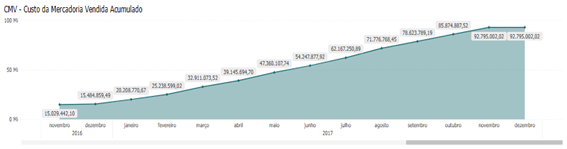
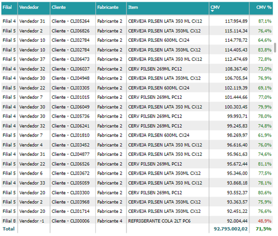
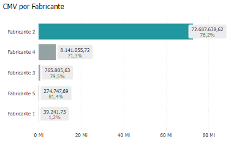

# Painel CMV

## O que é um CMV?

<h6 align = "center"> Imagem1 - Relatório Geral CMV</h6>

<h6 align = "center"> Imagem2 - Relatório Detalhado CMV</h6>

O CMV (Custo de Mercadorias Vendidas) é um indicador financeiro que contabiliza os custos relacionados à produção ou aquisição de mercadorias que foram efetivamente vendidas. Ele avalia a lucratividade das vendas ao longo de um período, mostrando se os custos associados às mercadorias precisam ser ajustados para melhorar os resultados financeiros. O CMV é crucial para calcular o lucro bruto, que é a diferença entre as receitas de vendas e os custos associados à produção ou aquisição das mercadorias vendidas.

### Componentes do CMV:

O cálculo do CMV geralmente inclui os seguintes elementos:

- **Estoque Inicial**: Valor do estoque de mercadorias no início do período (ex: início do mês ou ano).
- **Compras Durante o Período**: Valor total das mercadorias adquiridas ou produzidas ao longo do período.
- **Estoque Final**: Valor do estoque de mercadorias no final do período (ex: final do mês ou ano).

### Fórmula do CMV:

A fórmula básica para calcular o CMV é:

CMV = Estoque Inicial + Compras – Estoque Final

### Exemplo de Cálculo do CMV:

Suponha que uma empresa tenha os seguintes dados:

- **Estoque Inicial**: R$ 50.000
- **Compras Durante o Período**: R$ 120.000
- **Estoque Final**: R$ 30.000

O CMV seria calculado da seguinte forma:

CMV = R$ 50.000 + R$ 120.000 – R$ 30.000 = R$ 140.000

### Importância do CMV:

- **Margem de Lucro Bruto**: O CMV é essencial para calcular a margem de lucro bruto, que reflete a rentabilidade das operações antes de despesas operacionais, impostos e outros custos.
- **Análise de Eficiência**: O CMV ajuda a avaliar a eficiência dos processos de produção e compras. Um CMV elevado pode indicar custos altos, afetando negativamente a lucratividade.
- **Precificação de Produtos**: Compreender o CMV é vital para definir o preço de venda dos produtos, garantindo que a empresa cubra seus custos e gere lucro.
- **Controle de Estoque**: O CMV oferece insights sobre a gestão de estoque, ajudando a otimizar a compra e o armazenamento de mercadorias, reduzindo desperdícios e custos.

Em resumo, o CMV é uma métrica financeira essencial para o cálculo do lucro bruto, otimização de processos e definição de estratégias de precificação e controle de estoque.

## Gráfico CMV Acumulado

<h6 align = "center"> Imagem3 - Gráfico CMV Acumulado</h6>

O **Gráfico CMV Acumulado** é uma representação visual do Custo das Mercadorias Vendidas ao longo do tempo, mostrando a acumulação desses custos durante um período. Em vez de exibir os valores individuais em cada intervalo, ele foca na evolução acumulada dos custos, fornecendo uma visão contínua do impacto financeiro.

### Finalidade do Gráfico CMV Acumulado:

- **Análise de Custos ao Longo do Tempo**: Permite visualizar a evolução dos custos das mercadorias vendidas, facilitando o acompanhamento de tendências e a comparação entre diferentes períodos.
- **Monitoramento Financeiro**: Acompanhando o CMV acumulado, é possível avaliar o impacto dos custos de produção ou compra na operação total. Um aumento acelerado do CMV acumulado em comparação à receita acumulada pode indicar uma redução da margem de lucro.
- **Planejamento e Controle**: Fornece uma base visual para planejar e controlar os custos ao longo do tempo, permitindo identificar se a empresa está dentro do orçamento ou se os custos estão aumentando além do esperado.
- **Comparação entre Anos ou Períodos**: Facilita a comparação do CMV acumulado entre diferentes anos ou períodos, destacando como os custos evoluíram em relação ao histórico anterior.

### Exemplo de Utilização:

- **Varejo**: Um varejista pode usar o gráfico para monitorar os custos ao longo de um trimestre ou ano, comparando-os com as vendas e a margem de lucro.
- **Indústria**: Um fabricante pode utilizá-lo para acompanhar os custos de matérias-primas e produção ao longo das fases de fabricação e venda.

Resumidamente, o gráfico CMV acumulado é uma ferramenta poderosa para monitorar e analisar a evolução dos custos ao longo do tempo, auxiliando na tomada de decisões estratégicas.

## Gráfico CMV por Filial, Vendedor, Cliente, Fabricante ou Item

<h6 align = "center"> Imagem4 - Gráfico CMV por Filial, Vendedor, Cliente, Fabricante ou Produto</h6>

Esse gráfico é uma matriz dimensional que combina categorias como filiais, vendedores, clientes, fabricantes ou itens, permitindo uma análise detalhada do CMV com base em múltiplos parâmetros. Ele facilita a identificação de padrões, anomalias e oportunidades de melhoria em áreas específicas da operação.

### Finalidade do Gráfico CMV por Categorias:

- **Análise Comparativa**: Facilita a comparação do CMV entre diferentes combinações de categorias, como vendedores, clientes, produtos ou filiais, proporcionando uma análise detalhada dos custos.
- **Identificação de Padrões e Anomalias**: Permite identificar padrões de alto ou baixo CMV que podem não ser evidentes em análises mais simples, revelando possíveis problemas ou oportunidades de otimização.
- **Tomada de Decisões Estratégicas**: Ajuda na tomada de decisões informadas, como renegociação de contratos, melhorias na eficiência de vendedores ou ajustes na estratégia de vendas.
- **Otimização de Custos**: Ao visualizar o CMV em diferentes categorias, a empresa pode identificar áreas com custos excessivos e agir para reduzi-los, seja melhorando processos ou ajustando preços.

Resumindo, esse gráfico é uma ferramenta essencial para análises complexas e detalhadas, ajudando a visualizar como os custos das mercadorias vendidas se distribuem entre diferentes categorias operacionais e fornecendo insights valiosos para otimizar processos e aumentar a rentabilidade.

## Gráfico Detalhado do CMV

<h6 align = "center"> Imagem5 - Gráfico Detalhado do CMV</h6>

Esse gráfico é uma tabela analítica que exibe o CMV distribuído entre diferentes dimensões operacionais, como filiais, vendedores, clientes, fabricantes e produtos. Ele apresenta tanto o valor do CMV quanto a participação percentual desses custos no total, oferecendo uma análise detalhada e minuciosa dos custos.

### Finalidade do Gráfico em Tabela Detalhado:

- **Análise Minuciosa de Custos**: Permite uma análise detalhada do CMV em várias categorias, ajudando a identificar onde os custos estão concentrados e como estão distribuídos.
- **Identificação de Oportunidades**: Através da análise do CMV e do CMV%, é possível identificar oportunidades de redução de custos, melhorias em processos de compra ou renegociações com fornecedores.
- **Tomada de Decisões Estratégicas**: Fornece dados precisos para decisões baseadas em fatos, como ajustes na estratégia de vendas ou negociações com fabricantes de alto CMV.
- **Monitoramento e Controle**: Permite o acompanhamento contínuo do CMV ao longo do tempo, monitorando variações nos custos por diferentes dimensões.

### Benefícios:

- **Comparação Detalhada**: A tabela permite comparar o desempenho de diferentes filiais, vendedores, clientes, fabricantes e itens, identificando os maiores geradores de custos.
- **Identificação de Ineficiências**: Filiais ou vendedores com um CMV% elevado em relação ao total podem sinalizar ineficiências a serem corrigidas.
- **Acompanhamento de Metas**: Ajuda a monitorar se os custos estão alinhados com as metas estabelecidas, facilitando o controle financeiro e operacional.

De modo sucinto, o gráfico detalhado do CMV é essencial para análises precisas, fornecendo uma visão clara e organizada dos custos por categoria, o que auxilia na tomada de decisões estratégicas e na otimização dos processos.

## Gráfico CMV por Fabricante

<h6 align = "center"> Imagem6 - Gráfico CMV por Fabricante</h6>

O Gráfico CMV por Fabricante exibe o CMV distribuído entre diferentes fornecedores, facilitando a análise de desempenho e a gestão de custos com base nos fabricantes. Ele destaca rapidamente quais fabricantes estão associados aos maiores custos, auxiliando na tomada de decisões estratégicas.

### Finalidade do Gráfico CMV por Fabricantes:

- **Identificação de Fabricantes com maior CMV**: Facilita a identificação dos fabricantes cujos produtos geram os maiores custos, permitindo direcionar ações específicas, como negociações de preços ou busca por fornecedores alternativos.
- **Análise de Tendências**: Ajuda a identificar tendências ao longo do tempo, como aumentos significativos no CMV de um determinado fabricante, indicando potenciais problemas de custos.
- **Tomada de Decisões Estratégicas**: Fornece informações valiosas para decisões relacionadas à gestão de fornecedores, como renegociações de contratos ou diversificação de fornecedores.
- **Comparação entre Fabricantes**: Permite comparar rapidamente diferentes fabricantes em termos de impacto no CMV, destacando quais parcerias são mais custosas.

### Benefícios:

- **Facilidade de Interpretação**: Gráficos em barras são intuitivos e fáceis de interpretar, permitindo que os tomadores de decisão identifiquem rapidamente áreas de foco.
- **Clareza Visual**: A visualização do CMV por fabricantes facilita a comparação entre diferentes fornecedores, destacando aqueles com maior impacto no custo total.
- **Análise Direcionada**: Empresas podem usar esses gráficos para aprofundar a análise em fabricantes específicos e identificar oportunidades de melhoria na gestão de custos.

Resumidamente, o gráfico CMV por Fabricantes é uma ferramenta útil para otimizar a gestão de fornecedores, facilitando a análise do impacto dos diferentes fabricantes nos custos totais da empresa.

## Gráfico CMV por Filial, Vendedor, Cliente ou Item

<h6 align = "center"> Imagem7 - Gráfico CMV por Filial, Vendedor, Cliente ou Produto</h6>

O Gráfico CMV por Filial, Vendedor, Cliente ou Item é uma ferramenta visual poderosa que exibe o Custo das Mercadorias Vendidas (CMV) distribuído entre diferentes categorias operacionais. Ele permite que a empresa identifique rapidamente quais áreas, como filiais, vendedores, clientes ou produtos, estão associadas aos maiores custos, facilitando uma análise direcionada e eficaz da operação.

### Finalidade do Gráfico:

- **Identificação de Áreas com maior Custo**: O gráfico destaca quais filiais, vendedores, clientes ou produtos estão gerando os maiores custos de mercadorias vendidas, permitindo que a gestão se concentre nas áreas mais críticas.
- **Comparação entre Categorias**: Ao exibir os custos distribuídos entre diferentes categorias, o gráfico facilita a comparação entre filiais, vendedores, clientes e produtos, evidenciando onde o impacto do CMV é maior ou menor.
- **Análise de Tendências e Padrões**: A visualização dos custos por diferentes dimensões possibilita a identificação de tendências ao longo do tempo, como aumentos ou reduções de custos em áreas específicas.
- **Tomada de Decisões Estratégicas**: Os dados apresentados no gráfico podem ser usados para otimizar estratégias operacionais e de vendas, aprimorar a eficiência em determinadas filiais, renegociar condições com clientes de maior impacto ou ajustar o portfólio de produtos.

### Benefícios:

- **Visualização Clara**: O gráfico de barras proporciona uma visualização clara e intuitiva dos custos por diferentes categorias, facilitando a tomada de decisões rápidas e baseadas em dados.
- **Facilidade de Comparação**: A representação visual em barras torna simples a comparação do desempenho entre diferentes categorias, ajudando a identificar áreas com maior ou menor impacto nos custos.
- **Direcionamento de Ações**: Empresas podem utilizar esses gráficos para focar em filiais, vendedores, clientes ou produtos que requerem atenção especial, seja para controle de custos, ajustes em processos ou melhoria de desempenho.

Em resumo, o Gráfico CMV por Filial, Vendedor, Cliente ou Item é uma ferramenta visual eficaz que permite à empresa monitorar e comparar os custos das mercadorias vendidas entre diferentes categorias operacionais. Ele auxilia na identificação de áreas de alto impacto, facilita a comparação entre categorias e oferece suporte à tomada de decisões estratégicas, visando à otimização de custos e à melhoria da eficiência operacional.
