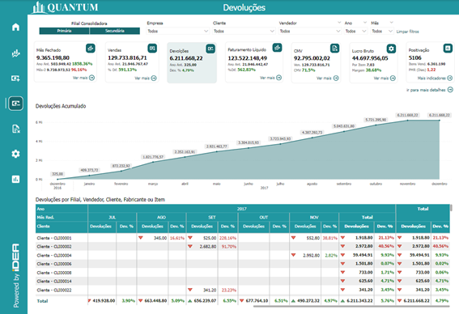

# Painel Devoluções

<h6 align = "center"> Imagem1 - Relatório Geral de Devoluções</h6>

## O que são Devoluções? E Como Funciona?

As devoluções de mercadorias ocorrem quando um cliente retorna um item que já foi recebido e aceito, diferenciando-se do simples retorno de mercadorias que ocorre antes do recebimento oficial. As devoluções podem ser motivadas por diversos fatores, como defeitos no produto, insatisfação do cliente, erro no pedido, ou outros motivos que justifiquem o não aceite do item. Em geral, há um prazo estabelecido para que o cliente possa solicitar a devolução. O objetivo é cancelar a compra, aplicando o mesmo tratamento fiscal utilizado na compra original, seja com benefícios tributários ou tributação regular.

### Principais aspectos das devoluções no faturamento:

- **Impactos no valor faturado:** Quando há uma devolução, o valor correspondente à mercadoria devolvida deve ser subtraído do total faturado. Esse ajuste é realizado por meio de notas de crédito que corrigem o valor da fatura original.
- **Registro contábil:** As devoluções impactam tanto as contas de receita quanto as de estoque da empresa. Normalmente, o valor das devoluções é registrado em uma conta específica, permitindo o monitoramento detalhado do impacto financeiro dessas operações.
- **Impostos:** Dependendo da legislação aplicável, as devoluções podem reduzir a base de cálculo de tributos, como ICMS, PIS e COFINS, afetando diretamente o valor dos impostos a serem recolhidos pela empresa.
- **Controle de estoque:** Os itens devolvidos precisam ser reintegrados ao estoque da empresa, o que implica em ajustes tanto na quantidade disponível quanto no custo total dos itens em estoque. Esse processo requer atenção para garantir a exatidão dos registros de inventário.

Em resumo, as devoluções no faturamento representam processos que envolvem a reversão parcial ou total de uma venda, impactando diretamente tanto os registros financeiros quanto os operacionais da empresa.

## Gráfico de Devolução Acumulado

O **Gráfico de Devolução Acumulado** é uma representação visual que ilustra o volume de devoluções ao longo do tempo, acumulando os valores em cada ponto do gráfico. Em vez de mostrar apenas os valores pontuais de cada devolução, o gráfico permite visualizar o comportamento das devoluções de forma progressiva, mostrando o total acumulado até determinado momento.

Esse gráfico geralmente apresenta uma linha ou curva crescente, onde cada ponto reflete o total acumulado até aquele período. Se o número de devoluções aumenta rapidamente, a inclinação da curva será mais acentuada; se as devoluções diminuem, a curva se torna mais suave.

### Finalidade do Gráfico:

- **Análise de Tendências:** O gráfico de devolução acumulado permite identificar tendências ao longo do tempo, como períodos de maior ou menor incidência de devoluções. Isso pode ajudar a empresa a entender os momentos críticos e ajustar suas operações conforme necessário.
- **Comparação de Períodos:** Esse gráfico facilita a comparação entre diferentes períodos, como trimestre a trimestre ou ano a ano, permitindo uma análise mais detalhada sobre se o número de devoluções está aumentando ou diminuindo ao longo do tempo.
- **Identificação de Padrões:** Pode ajudar a identificar padrões sazonais ou recorrentes nas devoluções, o que é útil para a tomada de decisões estratégicas, como ajustes em processos de qualidade, políticas de garantia ou atendimento ao cliente.
- **Análise de Impacto Financeiro:** Fornece uma visão clara do impacto financeiro das devoluções ao longo do tempo, permitindo que a empresa avalie de maneira cumulativa como essas devoluções afetam a receita e o fluxo de caixa.

## Gráfico de Devoluções por Filial, Vendedor, Cliente, Fabricante ou Item

Esse tipo de gráfico oferece uma representação visual que distribui o valor das devoluções de acordo com categorias específicas, como Filial, Vendedor, Cliente, Fabricante ou Item. Ele permite que a empresa identifique com precisão onde as devoluções estão ocorrendo e quais fatores ou grupos podem estar influenciando esses retornos de produtos.

### Finalidade do Gráfico:

- **Análise Comparativa:** O gráfico permite comparar o desempenho entre diferentes categorias, ajudando a identificar áreas que necessitam de atenção ou melhorias. Por exemplo, pode-se comparar o volume de devoluções entre diferentes filiais, identificando quais têm mais problemas de devolução e por quê.
- **Tomada de Decisão Estratégica:** Fornece insights valiosos que permitem à empresa ajustar suas políticas de vendas, melhorar a qualidade dos produtos ou revisar o atendimento ao cliente. Por exemplo, se um vendedor específico está associado a um alto volume de devoluções, isso pode indicar a necessidade de treinamento ou de revisão de práticas comerciais.
- **Identificação de Padrões e Problemas:** A visualização dos dados permite identificar padrões anômalos ou recorrentes. Um exemplo disso seria a detecção de um fabricante cujos produtos têm uma taxa de devolução consistentemente elevada, o que pode indicar problemas de qualidade que precisam ser abordados.
- **Monitoramento e Acompanhamento:** Esse gráfico ajuda a acompanhar o desempenho contínuo da empresa, possibilitando a identificação rápida de tendências positivas ou negativas. O monitoramento contínuo permite que a empresa reaja de forma proativa a problemas antes que eles se tornem críticos.

## Gráfico Detalhado de Lançamento das Devoluções

Esse gráfico é uma representação visual detalhada que mostra cada devolução registrada ao longo do tempo. Ele é especialmente útil para monitorar as devoluções de maneira granular, permitindo que a empresa acompanhe cada evento de devolução com todos os detalhes relevantes, como número do documento, data de lançamento, filial, vendedor, cliente, fabricante, data de devolução e percentual de devoluções.

### Finalidade do Gráfico:

- **Monitoramento Granular:** O gráfico fornece uma visão detalhada e contínua de cada devolução registrada, permitindo que a empresa acompanhe cada transação individualmente. Isso é essencial para garantir que cada devolução seja tratada adequadamente e dentro dos prazos esperados.
- **Identificação de Padrões e Anomalias:** Esse gráfico permite a detecção de padrões de devoluções que podem não ser visíveis em gráficos agregados. Por exemplo, ele pode revelar picos de devoluções em um dia específico ou uma série de devoluções anômalas relacionadas a um único produto ou cliente.
- **Análise de Causas:** Ao detalhar cada lançamento de devoluções, o gráfico permite uma análise aprofundada das causas dessas devoluções. Pode-se, por exemplo, identificar se um lote específico de produtos apresentou problemas que resultaram em um volume elevado de devoluções.
- **Monitoramento de Fluxo de Devoluções:** Esse gráfico ajuda a equipe de operações a monitorar o fluxo de devoluções de maneira eficiente, garantindo que o processo de devolução esteja sendo gerenciado de forma adequada e dentro dos prazos estabelecidos.

Em resumo, esse tipo de gráfico é uma ferramenta valiosa para o monitoramento detalhado e a análise minuciosa de cada devolução registrada, permitindo uma gestão mais precisa e proativa das operações de devolução.

## Gráfico de Devoluções por Fabricante

O gráfico de devolução por fabricante é uma ferramenta visual que mostra o valor e o percentual das devoluções de produtos associados a diferentes fabricantes. Utilizando barras para comparar os fabricantes, esse gráfico é útil para analisar o desempenho de cada fornecedor em termos de qualidade de produto, ajudando a identificar quais estão gerando mais devoluções.

### Finalidade do Gráfico:

- **Análise de Qualidade:** Esse gráfico ajuda a identificar quais fabricantes estão entregando produtos com maior incidência de problemas, refletidos no volume de devoluções. Isso pode orientar decisões importantes, como renegociações de contratos, melhorias nos processos de qualidade dos fabricantes ou até a substituição de fornecedores.
- **Comparação de Desempenho:** O gráfico permite uma comparação clara e visual entre diferentes fabricantes, destacando quais estão atendendo melhor às expectativas de qualidade da empresa e dos clientes.
- **Decisões de Abastecimentos:** As empresas podem usar esse gráfico para otimizar sua cadeia de suprimentos, priorizando fabricantes com menores taxas de devoluções e possivelmente renegociando condições com aqueles que apresentam altos volumes de retornos.
- **Monitoramento de Tendências:** Ao longo do tempo, o gráfico pode ser utilizado para monitorar como as devoluções de diferentes fabricantes evoluem, ajudando a identificar melhorias ou deteriorações no desempenho de qualidade de cada fornecedor.

Resumindo, o gráfico de devolução por fabricante é um indicador eficaz para analisar a qualidade dos produtos fornecidos por diferentes fabricantes, fornecendo uma visualização clara e comparativa que pode ajudar na tomada de decisões estratégicas relacionadas a fornecedores e qualidade de produtos.

## Gráfico de Devoluções por Filial, Vendedor, Cliente ou Item

Esse gráfico exibe o valor e o percentual das devoluções distribuídas por Filial, Vendedor, Cliente ou Produto. O objetivo é permitir a análise comparativa das devoluções com base em diferentes parâmetros operacionais, como as filiais da empresa, o desempenho de vendedores, os comportamentos de clientes ou o resultado de produtos específicos. Esse tipo de gráfico facilita a identificação de padrões, problemas e oportunidades de melhoria em diferentes áreas da empresa.

### Finalidade do Gráfico:

- **Análise de Desempenho:** O gráfico permite identificar qual filial, vendedor, cliente ou item está gerando mais devoluções, auxiliando na tomada de decisões estratégicas para melhoria nessas áreas. Isso pode resultar em ajustes nas operações, como aprimoramento no atendimento ao cliente ou revisão dos processos de logística.
- **Identificação de Padrões e Problemas:** A visualização dos dados facilita a identificação de padrões recorrentes ou anomalias. Por exemplo, se um cliente específico apresenta uma alta taxa de devolução, isso pode indicar problemas que necessitam de uma abordagem personalizada.
- **Monitoramento de Desempenho Contínuo:** Esse gráfico é uma ferramenta eficaz para monitorar o desempenho contínuo das operações da empresa, ajudando a identificar tendências negativas antes que se tornem problemas críticos.
