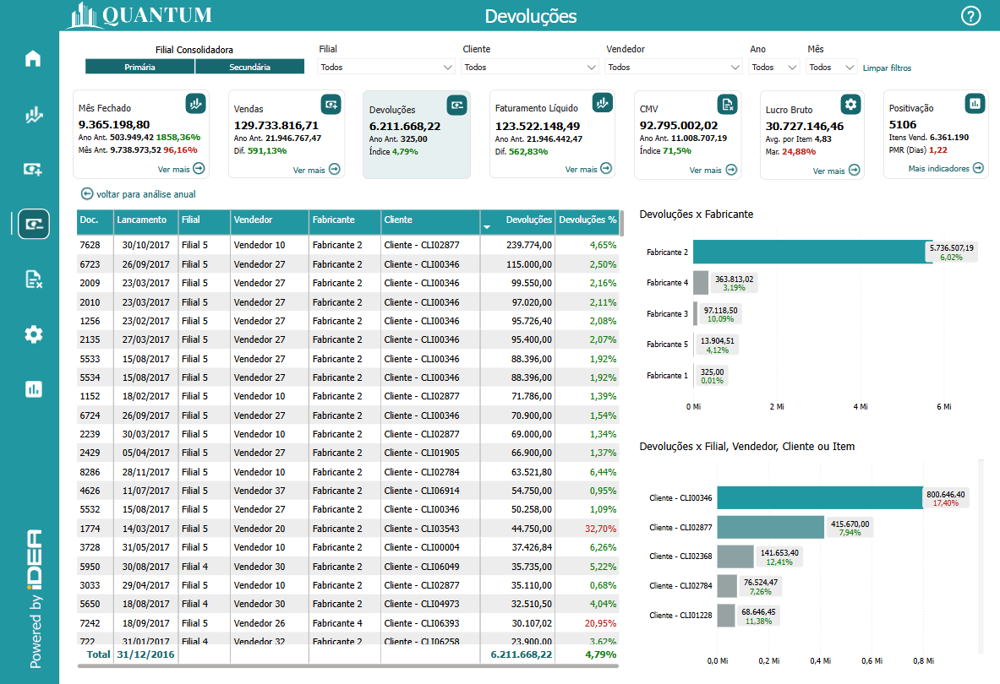

# Painel Devoluções

  
  <h6>Imagem 1: Painel Devoluções - Visão Análise Anual</h6>

  
  <h6>Imagem 2: Painel Devoluções - Visão Detalhes</h6>

## Navegação

Este painel de relatório está dividido em duas visualizações;

- **[Visão Análise Anual](https://idea-technology-it.github.io/docs-idea/faturamento/vendas/#visao-analise-anual)** - pode ser navegada através do [botão](https://idea-technology-it.github.io/docs-idea/faturamento/intro/#botoes-para-diferentes-visoes) "voltar para análise anual".
- **[Visão Detalhes](https://idea-technology-it.github.io/docs-idea/faturamento/vendas/#visao-detalhes)** - pode ser navegada através do [botão](https://idea-technology-it.github.io/docs-idea/faturamento/intro/#botoes-para-diferentes-visoes) "ir para mais detalhes".

## Informações no Painel Devoluções

### Valor de Devoluções

A análise de devoluções é um elemento crucial no Business Intelligence (BI) porque oferece insights valiosos sobre a qualidade dos produtos, a satisfação dos clientes e a eficiência operacional. Monitorar o volume e as razões para devoluções ajuda as empresas a identificar quais produtos, serviços ou processos estão gerando problemas e quais áreas precisam de melhorias. Ao analisar várias métricas de devoluções, as empresas podem otimizar suas operações, melhorar a experiência do cliente e tomar decisões mais embasadas.

Visualizações como devoluções acumuladas e devoluções mês a mês são essenciais para acompanhar o desempenho ao longo do tempo. As devoluções acumuladas oferecem uma visão de longo prazo, mostrando como as devoluções estão se acumulando ao longo de um período específico, o que ajuda a identificar padrões recorrentes e a prever possíveis problemas futuros. A comparação de devoluções mês a mês, por outro lado, permite detectar mudanças de curto prazo, como picos sazonais ou o impacto de campanhas ou mudanças em produtos, e ajustar rapidamente as estratégias operacionais ou de atendimento ao cliente.

Análises detalhadas de devoluções por Filial, Vendedor, Cliente, Fabricante ou Item são fundamentais para uma visão aprofundada dos desafios enfrentados pelo negócio. Esse tipo de análise permite que as empresas identifiquem quais locais, vendedores, produtos ou fabricantes estão gerando mais devoluções, revelando potenciais problemas de qualidade, logística ou atendimento ao cliente. Compreender essa distribuição ajuda a identificar pontos fracos que podem estar afetando a percepção da marca, permitindo a adoção de medidas corretivas, como programas de melhoria de produto, treinamentos para equipes de vendas ou ajustes no suporte ao cliente.

A análise das devoluções também fornece insights sobre o comportamento dos clientes e a gestão da relação com eles. Por exemplo, é possível identificar quais clientes fazem devoluções frequentes e as razões por trás dessas devoluções, o que permite à empresa melhorar o atendimento e oferecer soluções mais adequadas, como políticas de devolução mais flexíveis ou suporte técnico especializado. Além disso, a identificação de padrões nas devoluções pode ajudar a ajustar políticas de garantia ou a implementar processos de controle de qualidade mais rigorosos.

O impacto da análise de devoluções vai muito além do departamento de atendimento ao cliente. Os insights obtidos a partir dos dados de devoluções podem influenciar decisões nas áreas de marketing, desenvolvimento de produtos, cadeia de suprimentos e finanças. Por exemplo, compreender quais produtos têm altas taxas de devolução pode ajudar as equipes de marketing a ajustar suas mensagens e expectativas com os consumidores, enquanto insights sobre problemas de qualidade podem orientar as equipes de suprimentos e produção a melhorar seus processos de fabricação. Além disso, a análise de devoluções ajuda as equipes financeiras a calcular com mais precisão os impactos nas margens de lucro e a ajustar projeções de receita.

Em resumo, a análise de devoluções no BI é uma ferramenta poderosa para melhorar a eficiência operacional e a satisfação do cliente. Ao examinar as devoluções de vários ângulos, como desempenho cumulativo, variações mês a mês e detalhamento por diversos fatores, as empresas podem identificar áreas críticas para ajustes e melhorias. Essa análise não só otimiza a gestão de devoluções, mas também impacta positivamente outras áreas-chave, como marketing, finanças e operações, ajudando a criar um ambiente de negócios mais eficiente, ágil e orientado por dados.

## Visão Análise Anual

### Devoluções Acumulado

  
  <h6>Imagem 3: Devoluções Acumulado</h6>

Um gráfico de área é uma ferramenta extremamente eficaz para visualizar o comportamento das devoluções acumuladas ao longo do tempo, especialmente quando o eixo x é dividido por ano e mês. Esse tipo de gráfico permite que as empresas acompanhem a tendência das devoluções em um período específico, revelando padrões, taxas de aumento ou redução, além de flutuações sazonais. A área preenchida abaixo da linha não só realça visualmente o volume crescente ou decrescente de devoluções, mas também facilita a compreensão de como os problemas com produtos, logística ou atendimento estão se acumulando mês a mês.

Esse tipo de visualização é especialmente útil para destacar variações nas devoluções e identificar momentos de pico ou redução. Um aumento repentino no número de devoluções pode apontar para questões como falhas de qualidade em um produto, insatisfação generalizada do cliente ou problemas com o processo de entrega. Por outro lado, uma redução consistente no volume de devoluções pode indicar melhorias significativas nas operações, na satisfação do cliente ou na qualidade dos produtos. A empresa pode usar essas informações para ajustar suas estratégias, seja aprimorando processos internos, ajustando políticas de devolução ou investindo em campanhas de suporte ao cliente para mitigar problemas.

Além disso, o gráfico de área acumulada é uma excelente maneira de identificar sazonalidades nas devoluções. Por exemplo, uma empresa pode notar que após períodos de alta nas vendas, como durante o final de ano ou grandes promoções, o volume de devoluções também aumenta, destacando a necessidade de um planejamento mais eficaz para lidar com devoluções em massa. Com essa análise, a empresa pode se preparar melhor para esses períodos, ajustando suas políticas de devolução, capacitando suas equipes de atendimento ou otimizando seus processos logísticos para lidar de maneira mais eficiente com picos sazonais.

Outra grande vantagem desse gráfico é sua capacidade de oferecer uma visão clara da comparação entre diferentes períodos. Ele permite que as empresas observem como o volume de devoluções de um determinado mês ou trimestre se compara ao mesmo período de anos anteriores. Isso ajuda a identificar se a empresa está efetivamente reduzindo a quantidade de devoluções ao longo do tempo ou se há problemas persistentes que precisam ser abordados. A visão cumulativa das devoluções ao longo do tempo permite que as empresas identifiquem se suas ações corretivas estão surtindo efeito ou se ajustes mais radicais são necessários.

Além de facilitar o acompanhamento e análise das devoluções passadas, o gráfico de área acumulada é uma ferramenta valiosa para planejamento futuro e previsão de riscos. Com base em tendências passadas, a empresa pode prever com maior precisão quais períodos estão mais propensos a altas taxas de devolução e preparar-se para eles. Isso também auxilia no ajuste de orçamentos operacionais, garantindo que a empresa tenha recursos suficientes para lidar com picos de devoluções, como em termos de estoque reverso, logística e atendimento ao cliente.

Em resumo, o gráfico de área acumulada para devoluções proporciona uma visão clara e abrangente das tendências de devolução ao longo do tempo, permitindo que as empresas identifiquem padrões e tomem decisões informadas para mitigar problemas e melhorar seus processos. A capacidade de observar o comportamento das devoluções em diferentes períodos oferece insights estratégicos que impactam diretamente na gestão de qualidade, no suporte ao cliente e na eficiência operacional. Ao fornecer uma base sólida para análise e previsões, essa visualização apoia as empresas em sua busca por um atendimento ao cliente mais eficiente e por um controle rigoroso sobre a qualidade de seus produtos e serviços.

### Devoluções por Mês x Filial, Vendedor, Cliente, Fabricante ou Item

  
  <h6>Imagem 4: Devoluções por Mês x Filial, Vendedor, Cliente, Fabricante ou Item</h6>

Uma matriz que exibe os valores de devoluções mês a mês com ícones que indicam aumento (verde) ou diminuição (vermelho) em relação ao mês anterior oferece uma maneira dinâmica e intuitiva de analisar o comportamento das devoluções ao longo do tempo. Essa matriz permite aos usuários monitorar facilmente as flutuações nas devoluções, identificar tendências preocupantes e reconhecer melhorias em diferentes períodos. O uso de ícones coloridos simplifica a interpretação, fornecendo sinais visuais imediatos — verde para reduções no volume de devoluções e vermelho para aumentos — facilitando a análise dos dados sem a necessidade de uma imersão profunda nos números.

O grande diferencial desta matriz é que, além de apresentar os valores absolutos de devoluções, ela também exibe a percentagem de devoluções em relação às vendas totais, com um texto que muda de cor: verde para percentagens abaixo de 10%, indicando uma taxa de devolução aceitável, e vermelho para percentagens superiores a 10%, sinalizando uma área de risco que necessita de atenção. Essa codificação por cores oferece uma leitura rápida e eficaz das taxas de devolução, permitindo que os gestores identifiquem imediatamente os locais ou produtos que estão fora dos padrões desejados.

A capacidade de alterar os cabeçalhos das linhas entre Filial, Vendedor, Cliente, Fabricante ou Item torna essa matriz uma ferramenta incrivelmente poderosa para uma análise detalhada e segmentada. Quando se analisa por Filial, é possível ver quais unidades da empresa estão enfrentando maiores desafios com devoluções, permitindo uma abordagem mais direcionada para corrigir problemas localizados. Mudar para Vendedor proporciona uma visão clara do desempenho de cada representante de vendas em termos de qualidade do serviço prestado e satisfação do cliente, identificando quais vendedores precisam melhorar o atendimento para reduzir devoluções. Ao analisar por Cliente, a matriz revela comportamentos de devolução, ajudando a detectar clientes que frequentemente devolvem produtos e que podem precisar de atenção especial. Da mesma forma, ao usar Fabricante ou Item, a análise permite que a empresa identifique quais produtos ou fornecedores apresentam maiores problemas de qualidade, possibilitando negociações mais eficazes ou até a substituição de produtos problemáticos.

Esse tipo de visualização não apenas auxilia na tomada de decisões ágeis, como também ajuda a identificar oportunidades de melhoria em várias áreas da operação. A flexibilidade em alternar entre diferentes dimensões, como Filial, Vendedor, Cliente, Fabricante ou Item, oferece uma visão ampla e detalhada, permitindo a formulação de estratégias mais eficazes para reduzir as devoluções, melhorar a qualidade dos produtos e aumentar a satisfação dos clientes. Com essa matriz, a empresa pode rapidamente detectar padrões e agir de maneira proativa, garantindo que as devoluções sejam mantidas sob controle e otimizando seus processos de maneira geral.

Para navegar entre os níveis, você pode usar os [ícones de cabeçalho](https://idea-technology-it.github.io/docs-idea/faturamento/intro/#icones-de-cabecalho) que estão disponíveis quando você passa o mouse ou clica no gráfico.

  
  <h6>Ícones de Cabeçalho</h6>

Aqui, você pode mover para cima ou para baixo entre Filial, Vendedor, Cliente, Fabricante ou Item para analisar a área necessária.

## Visão Detalhes

### Tabela de Devoluções Detalhes

  
  <h6>Imagem 5: Tabela de Devoluções Detalhes</h6>

A Tabela de Devoluções Detalhadas é um componente fundamental para empresas que desejam analisar seus dados de devolução de forma precisa e detalhada. Ela captura informações essenciais sobre cada devolução realizada, incluindo o identificador único de cada transação, a data em que a devolução foi processada, além de dados importantes como a filial envolvida, o representante de vendas associado, o cliente que realizou a devolução, o fornecedor ou fabricante do produto devolvido, e o valor correspondente da devolução.

Dispor desses dados detalhados permite que as empresas monitorem as devoluções individuais de maneira eficaz, facilitando a identificação de padrões, a realização de auditorias e a resolução rápida de discrepâncias. A tabela fornece uma visão clara sobre quais produtos estão sendo devolvidos, quando e por quem, o que é crucial para entender as razões por trás das devoluções, como problemas de qualidade, insatisfação do cliente ou erros no processo de venda. Além disso, ao vincular as devoluções a filiais, representantes de vendas, clientes e fornecedores específicos, as organizações conseguem identificar quais regiões ou equipes de vendas apresentam maiores taxas de devolução, possibilitando uma gestão mais direcionada e proativa.

Esse nível de detalhamento é essencial para otimizar a gestão da cadeia de suprimentos, melhorar o relacionamento com os clientes e aumentar a qualidade dos produtos. Ao analisar quais clientes estão realizando mais devoluções ou quais fornecedores estão relacionados a produtos com maior incidência de devolução, as empresas podem ajustar suas estratégias para reduzir os retornos, seja implementando programas de controle de qualidade, ajustando políticas de vendas, ou promovendo um melhor atendimento ao cliente.

Além disso, os dados de devoluções são críticos para relatórios financeiros e análises de desempenho, uma vez que ajudam a avaliar o impacto das devoluções na receita e a monitorar o fluxo de caixa de maneira mais precisa. Com a capacidade de analisar essas informações detalhadas, as empresas podem tomar decisões estratégicas em relação a políticas de devolução, gerenciamento de estoque e manutenção de margens de lucro saudáveis. Em última análise, a Tabela de Devoluções Detalhadas oferece insights valiosos para melhorar a eficiência operacional e garantir um crescimento sustentável, ao mesmo tempo em que minimiza os custos associados às devoluções.

Esta tabela é essencial quando se busca detalhes sobre devoluções específicas. Ele pode ser filtrado usando [filtros](https://idea-technology-it.github.io/docs-idea/faturamento/intro/#filtros). A seguir, explicamos como interpretar cada coluna da tabela.

#### Doc. 
Número do documento que identifica cada transação de venda. Este permite rastrear e auditar transações específicas, ajudando na análise detalhada e identificação de devoluções individuais no BI.
  
#### Lançamento
Data em que a venda foi registrada que fornece o contexto temporal para as transações, permitindo identificar tendências e padrões de vendas ao longo do tempo.
  
#### Filial
A unidade da empresa onde a venda foi realizada. Auxilia na comparação de desempenho entre diferentes filiais, destacando quais locais estão gerando mais vendas ou onde há necessidade de ajustes.
  
#### Vendedor
O representante de vendas responsável pela transação, facilita a análise de desempenho individual dos vendedores, ajudando identificar os melhores vendedores ou onde é necessário mais suporte.

#### Fabricante
O fornecedor ou fabricante do produto vendido. Essencial para monitorar a contribuição de diferentes fornecedores para as vendas, permitindo avaliar a demanda por produtos de fabricantes específicos.

#### Cliente
Identificação do cliente que realizou a compra que é crucial para segmentação de clientes e análise de comportamento de compra, permitindo estratégias de vendas personalizadas e retenção de clientes.
  
#### Devoluções
O valor monetário da devolução que permite acompanhar o impacto financeiro das devoluções, ajudando a identificar potenciais problemas com produtos ou serviços.

#### Devoluções %
Percentual da venda devolvida que ajuda a mensurar a taxa de devolução em relação ao total de vendas, indicando a satisfação do cliente e a qualidade dos produtos vendidos. Quando a porcentagem está abaixo de 10%, o texto será exibido em verde, indicando um nível mais aceitável de devoluções.

### Devoluções x Fabricante

  
  <h6>Imagem 6: Devoluções x Fabricante</h6>

Um gráfico de barras intitulado Devoluções x Fabricante oferece uma representação visual crucial do impacto das devoluções com base nos diferentes fabricantes que fornecem os produtos vendidos. Cada barra no gráfico representa um fabricante específico e exibe tanto o valor monetário quanto a porcentagem de devoluções, permitindo que a empresa analise como os retornos de produtos estão distribuídos entre os fornecedores.

Uma característica importante desse gráfico é o uso de cores para indicar a porcentagem de devoluções: quando a porcentagem de devoluções está acima de 10%, o texto da porcentagem será exibido em vermelho, sinalizando um possível problema com a qualidade ou conformidade do produto fornecido. Quando a porcentagem está abaixo de 10%, o texto será exibido em verde, indicando um nível mais aceitável de devoluções.

Esse gráfico é particularmente valioso para avaliar o desempenho dos fabricantes em termos de devoluções. O fabricante tem um papel essencial na qualidade do produto e na conformidade com as expectativas do cliente. Um gráfico Devoluções x Fabricante ajuda a identificar quais fornecedores estão associados a maiores taxas de devoluções, permitindo que a empresa tome medidas corretivas, como revisar os contratos, renegociar termos ou até mesmo buscar novos parceiros de fornecimento.

Ao identificar padrões de devoluções associados a determinados fabricantes, a empresa pode investigar problemas de qualidade ou inconsistências que estejam gerando insatisfação entre os clientes. Esses insights são fundamentais para garantir que a cadeia de suprimentos esteja alinhada com os padrões de qualidade da empresa, minimizando o impacto das devoluções tanto no custo operacional quanto na reputação da marca.

Além disso, o gráfico permite identificar fabricantes que têm baixos índices de devoluções, o que pode indicar uma alta confiabilidade em seus produtos. Esses fabricantes podem se tornar parceiros estratégicos, ajudando a melhorar a oferta de produtos da empresa, reduzir custos associados a devoluções e melhorar a satisfação do cliente.

Por fim, a análise das devoluções por fabricante não apenas ajuda a melhorar a gestão de fornecedores, mas também possibilita que a empresa atue de forma proativa para mitigar o risco de devoluções em grande escala, garantindo que os produtos atendam ou superem as expectativas dos clientes.

No geral, o gráfico de barras Devoluções x Fabricante oferece uma visão detalhada e essencial para a gestão da cadeia de suprimentos, com indicadores visuais (vermelho/verde) que facilitam a identificação de áreas críticas. Ele capacita os tomadores de decisão a avaliar o desempenho dos fabricantes, fortalecer relações com fornecedores confiáveis e mitigar problemas de devolução que impactam diretamente a rentabilidade e a experiência do cliente.

### Devoluções x Filial, Vendedor, Cliente ou Item

  
  <h6>Imagem 7: Devoluções x Filial, Vendedor, Cliente ou Item</h6>

Um gráfico de barras intitulado Devoluções x Filial, Vendedor, Cliente ou Item oferece uma representação visual poderosa do desempenho de devoluções, segmentado por várias dimensões comerciais importantes, como Filial, Vendedor, Cliente ou Item. Cada barra no gráfico representa uma dessas dimensões e exibe tanto o valor monetário quanto a porcentagem de devoluções, permitindo que a empresa analise como as devoluções estão distribuídas entre diferentes entidades.

Uma funcionalidade importante desse gráfico é o uso de cores para indicar a porcentagem de devoluções: quando a porcentagem de devoluções está acima de 10%, o texto da porcentagem será exibido em vermelho, sinalizando uma preocupação ou problema que requer atenção. Por outro lado, quando a porcentagem de devoluções está abaixo de 10%, o texto será exibido em verde, indicando uma situação mais controlada e favorável.

Esse tipo de gráfico é inestimável para identificar problemas e padrões em devoluções. Por exemplo, um gráfico Devoluções x Filial ajuda a empresa a avaliar o impacto das devoluções em diferentes filiais, mostrando quais locais enfrentam maior volume ou porcentagem de devoluções. Esse insight permite que a empresa tome decisões informadas, como investigar as causas das devoluções em locais específicos e implementar soluções para reduzir a taxa de devolução.

Da mesma forma, um gráfico Devoluções x Vendedor oferece uma visão clara de como cada vendedor está gerando devoluções em relação ao valor total de vendas. Ele ajuda a identificar quais vendedores podem precisar de treinamento adicional ou apoio para reduzir devoluções, enquanto também possibilita o reconhecimento de vendedores com menor índice de devoluções.

Um gráfico Devoluções x Cliente revela quais clientes têm as maiores taxas de devolução, tanto em valor absoluto quanto percentual. Isso permite que a empresa adote estratégias direcionadas para lidar com clientes que fazem devoluções frequentes, ajustando expectativas ou oferecendo suporte pós-venda para melhorar a satisfação do cliente e reduzir o número de devoluções.

Ao examinar as Devoluções por Item, o gráfico permite que as empresas analisem quais produtos estão sendo devolvidos com mais frequência, seja em termos de valor ou percentual de vendas. Isso é essencial para a gestão de produtos, pois ajuda a identificar produtos com problemas de qualidade, discrepâncias de expectativas ou outras causas subjacentes que levam a devoluções. A empresa pode usar esses insights para melhorar a qualidade dos produtos, ajustar descrições de produtos ou ofertas, e, eventualmente, reduzir as devoluções.

No geral, o gráfico de barras Devoluções x Filial, Vendedor, Cliente ou Item oferece uma análise detalhada das devoluções, tanto em termos de valor monetário quanto de porcentagem em relação às vendas, com indicadores visuais (vermelho/verde) que facilitam a identificação de áreas críticas. Ele capacita os tomadores de decisão a identificar áreas problemáticas, reduzir custos relacionados a devoluções e melhorar a experiência geral do cliente. Com essas informações, a empresa pode otimizar seus processos operacionais, de vendas e de atendimento ao cliente.

Para navegar entre os níveis, você pode usar os [ícones de cabeçalho](https://idea-technology-it.github.io/docs-idea/faturamento/intro/#icones-de-cabecalho) que estão disponíveis quando você passa o mouse ou clica no gráfico.

  
  <h6>Ícones de Cabeçalho</h6>

Aqui, você pode mover para cima ou para baixo entre Filial, Vendedor, Cliente, Fabricante ou Item para analisar a área necessária.

  
***Aviso Legal:** Os números e informações apresentados nesta documentação são baseados em um conjunto de dados fictício. Eles são destinados exclusivamente para fins educacionais e de demonstração. Os dados não refletem condições do mundo real ou métricas de negócios reais e não devem ser usados ​​para tomada de decisão ou análise. Qualquer semelhança com entidades, eventos ou dados reais é mera coincidência.*
