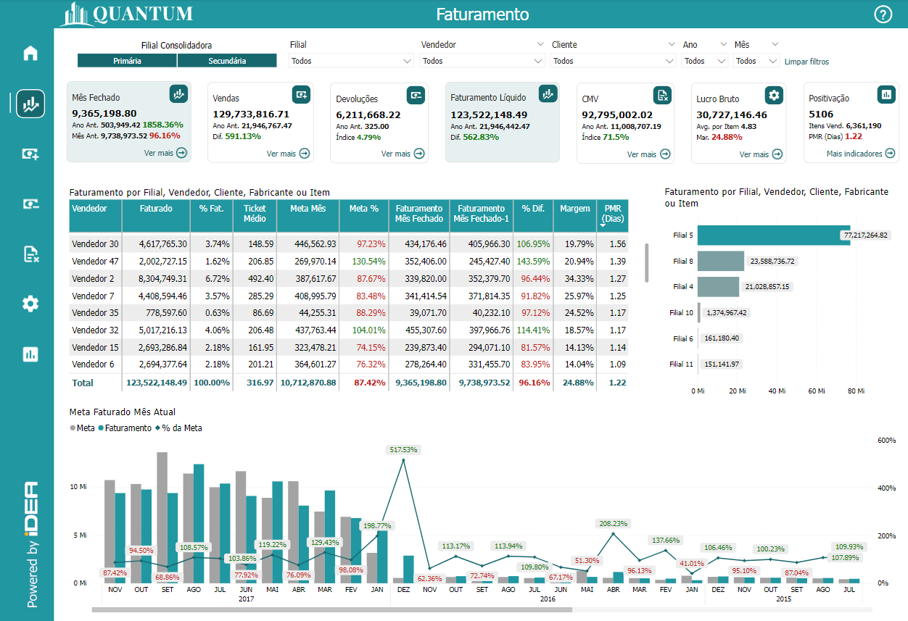
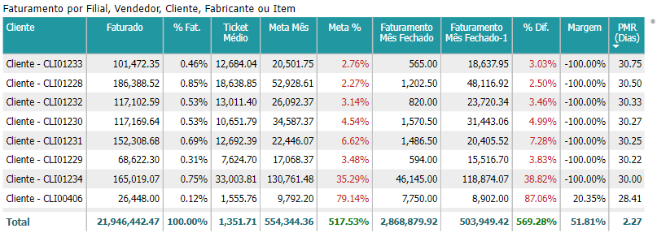
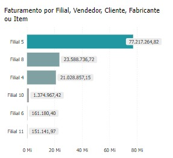
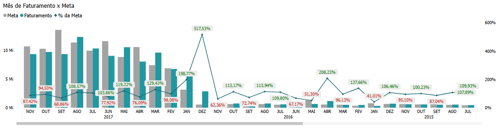

# Painel Faturamento Líquido

<h6 align="center">Imagem 1: Relatório Geral de Faturamento Líquido</h6>

O **Faturamento Líquido** é o valor total das vendas de uma empresa após a dedução de impostos sobre vendas, devoluções de mercadorias, descontos comerciais e outras deduções aplicáveis. Ele representa a receita efetiva gerada pelas vendas, sendo um indicador importante para avaliar o desempenho financeiro real da empresa.

No cálculo do Faturamento Líquido, são subtraídos do faturamento bruto os valores referentes a:

- **Impostos sobre Vendas**: Como o ICMS, ISS, PIS, COFINS, entre outros tributos que incidem diretamente sobre as vendas.
- **Devoluções de Mercadorias**: Produtos que foram devolvidos pelos clientes, seja por defeitos, insatisfação ou outros motivos.
- **Descontos Comerciais**: Reduções concedidas aos clientes sobre o preço original de venda, geralmente para pagamentos antecipados ou em grandes quantidades.
- **Outras Deduções**: Podem incluir abatimentos ou outros valores que reduzem o valor total das vendas.

O Faturamento Líquido é um indicador crucial porque mostra a receita que a empresa realmente obteve após cumprir suas obrigações fiscais e comerciais. Ele é frequentemente utilizado para calcular outras métricas financeiras, como a margem de lucro, e para avaliar a viabilidade de operações de negócio e estratégias de vendas.

## Faturamento por Filial, Vendedor, Cliente, Fabricante ou Item

<em>Imagem 1: Tabela de Faturamento por Filial, Vendedor, Cliente, Fabricante ou Item</em>

Esta tabela fornece uma análise detalhada do Faturamento Líquido segregado por diferentes dimensões, como Filial, Vendedor, Cliente, Fabricante ou Item. A tabela apresenta diversas colunas que oferecem informações essenciais para a gestão financeira, incluindo faturamento, metas, margens e prazo médio de recebimento (PMR). A seguir, explicamos cada coluna e como interpretar os dados apresentados.

### Colunas Principais

- **Filial**: Identifica a filial específica da empresa. Cada linha da tabela corresponde a uma filial diferente, permitindo visualizar o desempenho de faturamento por unidade.

- **Faturado**: Exibe o valor total faturado por cada filial. Este valor representa o Faturamento Líquido, ou seja, o valor das vendas após a dedução de impostos, devoluções e descontos.

- **% Fat.**: Percentual de participação do faturamento de cada filial no total geral. Essa coluna ajuda a entender a contribuição de cada unidade para o faturamento total da empresa.

- **Ticket Médio**: Valor médio das vendas por transação. Essa métrica é útil para avaliar a eficiência das vendas, indicando se as filiais estão conseguindo vender produtos de maior valor agregado.

- **Meta Mês**: A meta de faturamento estabelecida para cada filial no mês em análise. Esse valor é comparado com o faturamento real para avaliar o desempenho.

- **Meta %**: Percentual de cumprimento da meta de faturamento. Um valor acima de 100% indica que a filial superou a meta estabelecida.

- **Faturamento Mês Fechado**: Faturamento realizado pela filial no mês anterior ao mês em análise. Essa coluna é útil para comparar o desempenho recente com o histórico.

- **Faturamento Mês Fechado-1**: Faturamento realizado pela filial dois meses antes do mês em análise. Serve como uma referência adicional para entender a tendência de vendas ao longo do tempo.

- **% Dif.**: Percentual de diferença entre o faturamento do mês atual e o mês anterior. Um valor positivo indica crescimento no faturamento, enquanto um valor negativo sugere uma queda.

- **Margem**: Representa a margem de lucro obtida por cada filial. Essa métrica é crucial para avaliar a rentabilidade das operações, mostrando a porcentagem de lucro sobre o faturamento.

- **PMR (Dias)**: Prazo Médio de Recebimento, em dias, que cada filial leva para receber os pagamentos das vendas realizadas. Um PMR menor indica que a filial consegue converter vendas em caixa mais rapidamente.

### Como Usar Esta Tabela

- **Análise Comparativa**: Utilize esta tabela para comparar o desempenho de diferentes filiais em termos de faturamento, cumprimento de metas e rentabilidade.
  
- **Identificação de Tendências**: Observe as colunas de Faturamento Mês Fechado e Mês Fechado-1 para identificar tendências de crescimento ou declínio nas vendas de cada filial.

- **Avaliação de Desempenho**: A coluna de Meta % permite avaliar quais filiais estão superando as metas estabelecidas e quais estão ficando aquém das expectativas.

- **Gestão de Caixa**: A coluna PMR (Dias) é essencial para a gestão do fluxo de caixa, ajudando a identificar filiais que estão levando mais tempo para receber os pagamentos e que podem precisar de estratégias de cobrança mais eficazes.

Com esta documentação, você pode interpretar e utilizar os dados da tabela "Faturamento por Filial, Vendedor, Cliente, Fabricante ou Item" para tomar decisões informadas sobre a gestão financeira e o desempenho das unidades de negócio.

## Gráfico "Faturamento por Filial, Vendedor, Cliente, Fabricante ou Item"

<em>Imagem 1: Gráfico de Faturamento por Filial, Vendedor, Cliente, Fabricante ou Item</em>

Este gráfico apresenta uma visualização do Faturamento Líquido segregado por Filial, Vendedor, Cliente, Fabricante ou Item. Cada barra do gráfico representa uma unidade específica (neste caso, Filiais), mostrando o valor total faturado por cada uma.

### Interpretação do Gráfico

- **Filial**: Cada barra corresponde a uma Filial da empresa, permitindo a comparação direta entre as unidades em termos de faturamento. As filiais estão listadas ao lado esquerdo do gráfico.

- **Faturamento**: O comprimento de cada barra indica o valor total de faturamento para a respectiva Filial. Valores maiores resultam em barras mais longas, destacando as Filiais que contribuíram mais para o faturamento total da empresa.

### Como Usar Este Gráfico

- **Identificação de Filiais de Alto Desempenho**: As barras mais longas indicam as Filiais que mais contribuem para o faturamento. Isso pode ajudar a identificar unidades de alto desempenho que podem servir como exemplo ou foco para investimentos adicionais.

- **Análise Comparativa**: Compare o desempenho das diferentes Filiais para entender onde estão as maiores oportunidades de crescimento ou necessidade de melhoria.

- **Gestão Estratégica**: Utilize as informações deste gráfico para tomar decisões estratégicas, como alocação de recursos, mudanças nas políticas de vendas ou desenvolvimento de campanhas específicas para melhorar o desempenho das unidades com faturamento menor.

Este gráfico fornece uma visão clara e comparativa do desempenho de faturamento entre diferentes Filiais, ajudando a identificar as unidades que mais contribuem para o sucesso financeiro da empresa e aquelas que podem precisar de mais atenção ou suporte.

## Gráfico "Meta Faturado Mês Atual"

<em>Imagem 1: Gráfico de Meta Faturado Mês Atual</em>

Este gráfico apresenta a comparação entre a meta de faturamento estabelecida e o faturamento efetivamente realizado pela empresa ao longo de diferentes meses. Além disso, o gráfico mostra o percentual de cumprimento da meta (% da Meta) para cada período.

### Interpretação do Gráfico

- **Meta (Colunas Cinza)**: Representa a meta de faturamento estabelecida para cada mês. As colunas cinza indicam o valor-alvo que a empresa pretendia alcançar em cada período.

- **Faturamento (Colunas Verde)**: Mostra o faturamento real obtido em cada mês. A comparação entre as colunas de Faturamento e Meta permite visualizar se a empresa conseguiu atingir ou superar suas metas de faturamento.

- **% da Meta (Linha Verde)**: A linha que percorre o gráfico indica o percentual de cumprimento da meta para cada mês. Valores acima de 100% mostram que a meta foi superada, enquanto valores abaixo de 100% indicam que a meta não foi atingida.

### Como Usar Este Gráfico

- **Avaliação de Desempenho**: Utilize este gráfico para avaliar o desempenho mensal da empresa em relação às metas de faturamento. Ele permite identificar quais meses foram mais desafiadores e quais superaram as expectativas.

- **Análise Sazonal**: Identifique padrões sazonais que possam afetar o cumprimento das metas de faturamento. Isso pode ajudar na definição de metas mais realistas e no planejamento de estratégias de venda.

- **Ajuste de Estratégias**: Se forem observados meses consecutivos com desempenho abaixo da meta, pode ser necessário revisar as estratégias de venda ou ajustar as metas para melhor refletir a realidade do mercado.

Este gráfico é uma ferramenta poderosa para monitorar o desempenho da empresa em relação às metas de faturamento ao longo do tempo, permitindo uma gestão mais informada e estratégica.

