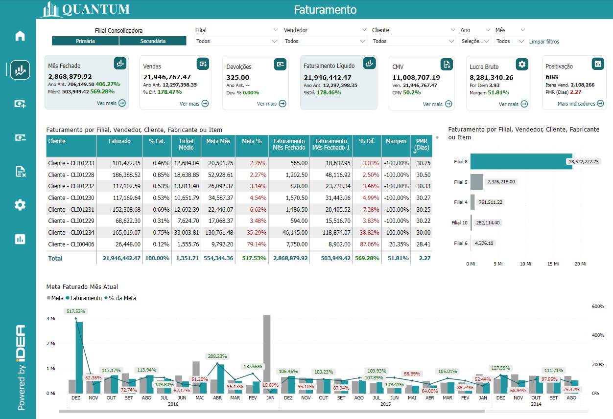
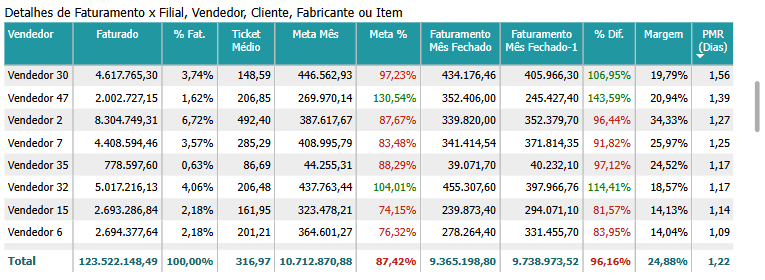
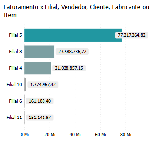
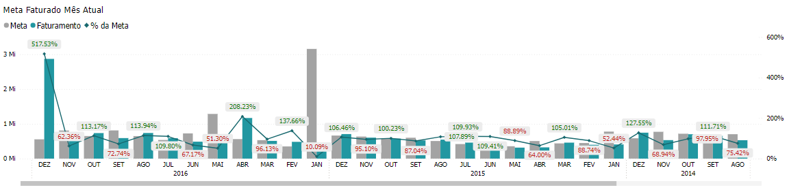

# Painel de Faturamento Líquido

  
  <h6>Imagem 1: Painel de Faturamento Líquido</h6>

Faturamento Líquido é o valor total das vendas de uma empresa após a dedução de impostos sobre vendas, devoluções de mercadorias, descontos comerciais e outras deduções aplicáveis. Ele reflete a receita efetivamente gerada pelas vendas e é um indicador fundamental para avaliar o desempenho financeiro real da empresa.

Ao calcular o Faturamento Líquido, são subtraídos do Faturamento Bruto os seguintes itens:

- **Impostos sobre Vendas:** Tributos como ICMS, ISS, PIS, COFINS, entre outros que incidem diretamente sobre as vendas.
- **Devoluções de Mercadorias:** Produtos devolvidos por clientes devido a defeitos, insatisfação ou outras razões.
- **Descontos Comerciais:** Reduções concedidas sobre o preço original de venda, geralmente por pagamento antecipado ou compras em grandes quantidades.
- **Outras Deduções:** Incluem abatimentos ou outros valores que diminuem o total das vendas.

O Faturamento Líquido é um indicador crucial porque revela a receita real que a empresa obtém após cumprir suas obrigações fiscais e comerciais. Ele serve como base para o cálculo de métricas financeiras importantes, como a margem de lucro, e é essencial para avaliar a viabilidade de operações, além de orientar decisões estratégicas relacionadas a vendas e crescimento.

## Detalhes de Faturamento x Filial, Vendedor, Cliente, Fabricante ou Item

  
  <h6>Imagem 2: Detalhes de Faturamento x Filial, Vendedor, Cliente, Fabricante ou Item</h6>

Detalhes de Faturamento x Filial, Vendedor, Cliente, Fabricante ou Item oferece uma visão detalhada do desempenho de vendas, organizada com métricas essenciais para acompanhar o progresso e avaliar a eficiência da equipe de vendas. O primeiro nível da tabela pode ser detalhado por diferentes categorias, proporcionando maior flexibilidade na análise:

Vendedor (com drill-down para Filial, Cliente, Fabricante ou Item): O nome do vendedor pode ser expandido para visualizar o desempenho por diferentes níveis de detalhe, incluindo Filial (local da venda), Cliente (comprador), Fabricante (marca do produto), ou Item (produto vendido). Isso facilita uma análise mais granular ou mais agregada conforme necessário.

- **Faturado:** O valor total de vendas realizadas, seja por filial, vendedor, cliente, fabricante ou item, dependendo do nível de drill-down escolhido.
- **% Fat.:** A porcentagem de contribuição no total faturado da empresa, mostrando a relevância relativa de cada vendedor, filial, cliente, fabricante ou item nas vendas gerais.
- **Ticket Médio:** O valor médio das vendas individuais realizadas no período analisado, ajustado conforme o nível de drill-down, indicando o valor médio por venda.
- **Meta Mês:** O valor alvo de vendas estabelecido para cada vendedor ou nível de análise no mês.
- **Meta %:** A porcentagem da meta de vendas que foi atingida. O texto será exibido em vermelho se a meta não foi atingida e em verde se a meta foi cumprida, facilitando a identificação rápida de quem está abaixo ou acima das expectativas.
- **Faturamento Mês Fechado:** O valor total de vendas realizadas no mês atual, encerrado, com base no nível de detalhamento.
- **Faturamento Mês Fechado - 1:** O faturamento realizado no mês anterior ao atual, para facilitar a comparação de desempenho recente.
- **% Dif.:** A diferença percentual entre o faturamento do mês atual e o do mês anterior, ajudando a avaliar o crescimento ou retração mês a mês.
- **Margem:** A margem de lucro gerada pelas vendas, refletindo a lucratividade das operações.
- **PMR (Dias):** O Prazo Médio de Recebimento, ou seja, o número médio de dias que o vendedor (ou a filial, cliente, fabricante ou item) leva para receber o pagamento das vendas, auxiliando na análise do ciclo de caixa.

Esta tabela é uma ferramenta valiosa para monitorar e otimizar o desempenho de vendas, fornecendo insights acionáveis em diferentes níveis de detalhe. A possibilidade de realizar drill-down para Filial, Vendedor, Cliente, Fabricante ou Item oferece uma análise personalizada, permitindo a identificação de tendências, oportunidades de crescimento e áreas que precisam de melhorias. O acompanhamento do Faturado em relação às metas de vendas possibilita que as equipes visualizem rapidamente o progresso de cada vendedor, filial ou cliente, facilitando a tomada de decisões informadas para melhorar o desempenho individual ou coletivo.

A tabela também facilita a avaliação comparativa, com a comparação do Faturamento Mês Fechado com o mês anterior e a diferença percentual (% Dif.), o que permite identificar se o desempenho está melhorando ou apresentando queda. Isso é essencial para ajustar estratégias e reagir a mudanças de mercado ou comportamento do cliente. A coluna Meta %, com texto colorido (verde para metas atingidas e vermelho para metas não alcançadas), oferece uma forma visual rápida e simples de identificar quem está superando as expectativas e quem precisa de suporte ou revisão de metas, permitindo respostas rápidas da gestão.

Além disso, a inclusão da Margem permite que a equipe de vendas não foque apenas no volume de vendas, mas também na lucratividade, o que é crucial para garantir que o crescimento de vendas esteja alinhado com os objetivos financeiros da empresa. O Prazo Médio de Recebimento (PMR) mostra a eficiência financeira, indicando quanto tempo a empresa leva para receber o pagamento das vendas. Um PMR alto pode indicar problemas de fluxo de caixa, enquanto um PMR baixo reflete maior eficiência, ajudando a ajustar políticas de crédito ou renegociar condições com clientes.

A flexibilidade de detalhamento por Filial, Cliente, Fabricante ou Item possibilita uma análise granular que ajuda a identificar quais fatores específicos estão impulsionando ou limitando o desempenho de vendas. Isso permite que ações corretivas sejam tomadas rapidamente, como no caso de uma filial ou produto específico com queda no faturamento. Além disso, o Ticket Médio ajuda a entender o valor médio das transações, o que pode ser útil para ajustar estratégias de precificação ou vendas, como focar em produtos de maior valor ou oferecer incentivos para aumentar o ticket médio.

Em resumo, esta tabela não só facilita o acompanhamento do desempenho de vendas em tempo real, mas também ajuda a identificar rapidamente oportunidades de melhoria e ajustes estratégicos, promovendo uma abordagem mais eficaz e orientada a resultados.

Para navegar entre os níveis, você pode usar os [ícones de cabeçalho](https://idea-technology-it.github.io/docs-idea/faturamento/intro/#icones-de-cabecalho) que estão disponíveis quando você passa o mouse ou clica no gráfico.

  
  <h6>Ícones de Cabeçalho</h6>

Aqui, você pode navegar entre as opções de Filial, Vendedor, Cliente, Fabricante ou Item, permitindo que você explore e analise a área específica de interesse com mais profundidade.

## Faturamento x Filial, Vendedor, Cliente, Fabricante ou Item

  
  <h6>Imagem 3: Faturamento x Filial, Vendedor, Cliente, Fabricante ou Item</h6>

Este gráfico de barras proporciona uma visão clara e detalhada do faturamento, segmentado por diferentes categorias. Ele exibe o valor total de vendas em barras, facilitando a comparação entre as diferentes categorias, que incluem Filial, Vendedor, Cliente, Fabricante e Item. A funcionalidade de drill-down permite uma análise mais profunda, possibilitando explorar os dados em níveis mais específicos ou gerais conforme necessário.

No nível mais alto, o gráfico mostra o faturamento agregado por categoria principal, como Filial ou Vendedor. Ao usar o recurso de drill-down, você pode aprofundar a análise para visualizar o faturamento detalhado por Cliente, Fabricante ou Item. Esta capacidade de drill-down oferece flexibilidade para investigar quais aspectos específicos estão contribuindo para o faturamento total ou quais áreas podem precisar de atenção especial.

O gráfico de barras facilita a visualização do desempenho de vendas em diferentes níveis, permitindo que você identifique rapidamente quais categorias estão performando melhor e quais podem precisar de estratégias de melhoria. A comparação entre as diferentes categorias ajuda a entender melhor as dinâmicas de vendas e a tomar decisões informadas baseadas em dados precisos.

Para navegar entre os níveis, você pode usar os [ícones de cabeçalho](https://idea-technology-it.github.io/docs-idea/faturamento/intro/#icones-de-cabecalho) que estão disponíveis quando você passa o mouse ou clica no gráfico.

  
  <h6>Ícones de Cabeçalho</h6>

Aqui, você pode navegar entre as opções de Filial, Vendedor, Cliente, Fabricante ou Item, permitindo que você explore e analise a área específica de interesse com mais profundidade.

## Mês de Faturamento x Meta

  
  <h6>Imagem 4: Mês de Faturamento x Meta</h6>

Este gráfico de barras oferece uma visão detalhada do faturamento mensal ao longo dos anos, comparando-o diretamente com os valores das metas estabelecidas para cada mês. As barras representam o faturamento real de cada mês, enquanto uma segunda série de barras exibe o valor da meta correspondente. Sobre essas barras, uma linha mostra a porcentagem da meta atingida, com a cor verde indicando que a meta foi alcançada ou superada, e vermelho sinalizando que a meta não foi atingida.

Esse gráfico é extremamente útil porque permite uma análise clara e comparativa do desempenho de vendas em relação às metas estabelecidas. As barras de faturamento e meta permitem uma visualização direta da diferença entre o desempenho real e as expectativas, facilitando a identificação de variações e períodos em que os objetivos foram ou não cumpridos. A linha de porcentagem fornece um feedback imediato sobre o grau de cumprimento das metas, destacando de forma visual se os objetivos foram atingidos. Esta combinação de dados facilita o monitoramento contínuo do progresso, a avaliação da eficácia das estratégias de vendas e a identificação de áreas que podem precisar de ajustes. Em suma, este gráfico oferece uma ferramenta valiosa para acompanhar o desempenho, ajustar estratégias e tomar decisões informadas para melhorar os resultados futuros.
