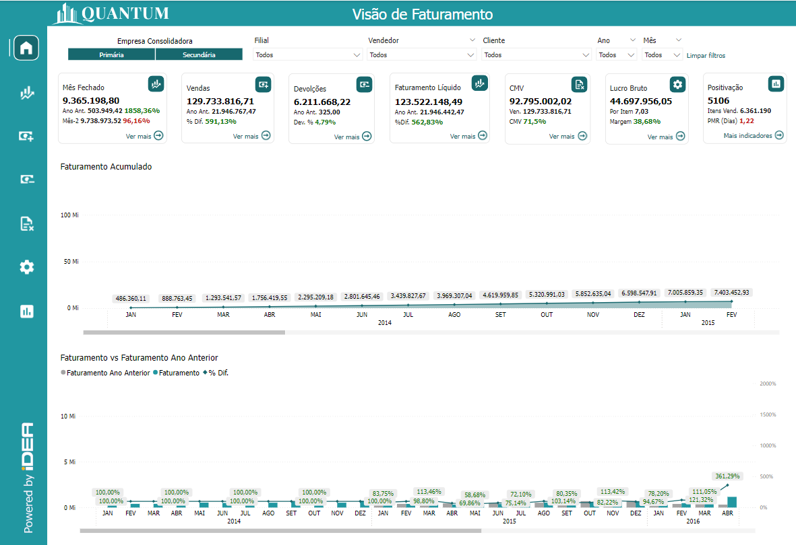

Um relatório de BI (Business Intelligence) abrangente e focado em Faturamento é essencial para oferecer uma visão clara e detalhada do desempenho comercial de uma empresa.

Esse tipo de relatório permite uma análise profunda das vendas, incluindo a gestão de receitas, comparação de produtos e serviços vendidos, e avaliação do desempenho de vendas ao longo do tempo.

Através de visualizações precisas e detalhadas, é possível identificar tendências de mercado, monitorar variações nas vendas e tomar decisões informadas para otimizar a estratégia comercial e maximizar a receita da empresa.

Na página de Home, você encontrará:

Este gráfico de área exibe a evolução do saldo em tesouraria da empresa ao longo do tempo, mostrando tanto os valores positivos quanto os negativos. A linha de base do gráfico representa um saldo de zero, com áreas acima da linha 
indicativas de saldos positivos e áreas abaixo indicativas de saldos negativos.
 
**Onde:**

### Eixo X (Horizontal):
- RO eixo X representa o tempo, dividido em períodos regulares, como meses, trimestres ou anos, dependendo do intervalo de dados disponível. Este eixo mostra a progressão do faturamento da empresa ao longo do tempo, permitindo uma análise detalhada
das tendências de receita.

### Eixo Y (Vertical):
- O eixo Y representa o valor do faturamento acumulado, que pode variar entre valores positivos e negativos, refletindo o desempenho financeiro da empresa. Valores positivos indicam crescimento nas receitas, enquanto valores negativos, caso existam,
indicariam quedas ou períodos de perda financeira.

### Área do Gráfico:
- **Valores Positivos:** São representados por uma área preenchida acima da linha de base, geralmente em uma cor neutra ou verde. Isso indica que a empresa está gerando receitas, acumulando um saldo positivo ao longo do tempo, o que é um sinal de
desempenho financeiro saudável.
- **Valores Negativos:** Embora menos comuns em gráficos de faturamento, valores negativos podem aparecer abaixo da linha de base. Estes seriam representados em vermelho ou outra cor de alerta, destacando períodos em que o faturamento
acumulado foi insuficiente para cobrir despesas ou indicar uma retração significativa nas receitas, sinalizando possíveis problemas financeiros.

