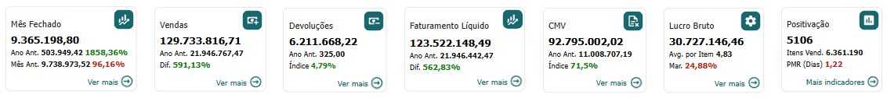
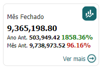
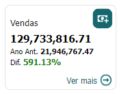
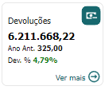
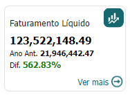
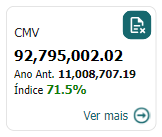
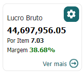
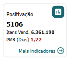

# Indicadores Faturamento

  
  <h6>Imagem 1: Indicadores Faturamento</h6>

Em cada página do nosso relatório no Power BI, você encontrará indicadores destacados no topo, projetados para melhorar sua experiência de análise. Esses indicadores exibem consistentemente os "valores-chave" essenciais para cada seção do relatório, oferecendo uma referência rápida e facilitando a compreensão dos dados críticos sem a necessidade de alternar entre diferentes páginas.

Uma das principais vantagens desses indicadores é a sua consistência. Os valores exibidos são uniformes em todo o relatório, proporcionando uma visão contínua das principais métricas. Independentemente da página em que você se encontra, os dados essenciais permanecem acessíveis, permitindo uma análise mais fluida e eficiente. Isso é especialmente útil ao realizar análises detalhadas, pois elimina a necessidade de reorientação constante com os dados.

Além disso, os indicadores são dinamicamente ajustados conforme os filtros aplicados ao relatório. À medida que você refina sua análise usando diferentes filtros, os valores nos indicadores são automaticamente atualizados para refletir os dados filtrados. Essa integração dinâmica não só torna a análise mais eficiente, mas também mais precisa, oferecendo uma visão clara de como os filtros impactam os dados gerais. Seja examinando períodos, regiões ou outras dimensões, esses indicadores ajudam a simplificar o processo, proporcionando uma visão concisa e imediata dos dados filtrados.

Em resumo, os indicadores no topo de cada página do relatório no Power BI são fundamentais para manter a clareza e a continuidade da análise. Eles fornecem métricas consistentes e sensíveis aos filtros, facilitando a comparação e o acompanhamento das principais métricas ao longo de todo o relatório, e aprimorando a experiência analítica geral.

## Indicador de Mês Fechado

  
  <h6>Imagem 2: Mês Fechado</h6>

### Faturamento Mês Fechado

O valor Mês Fechado, que representa a receita do mês mais recentemente concluído, é fundamental para uma avaliação financeira precisa e para decisões informadas. Ele fornece uma visão clara das vendas reais, sem dados parciais, permitindo uma análise confiável das tendências e uma comparação eficaz com as metas estabelecidas. Esta métrica é essencial para avaliar o desempenho ao longo do tempo, orientar o orçamento e alocar recursos de forma eficiente. Além disso, garante que os relatórios financeiros para as partes interessadas sejam baseados nas informações mais recentes e precisas, promovendo uma gestão financeira mais robusta e um planejamento estratégico mais eficaz.

### Mês Fechado Ano Anterior

O valor Mês Fechado Ano Anterior (Ano Ant.) representa a receita do mesmo mês no ano anterior e serve como uma referência crítica para avaliar o desempenho ano a ano. Ao comparar esse valor com o atual "Mês Fechado", as empresas podem avaliar o crescimento ou declínio na receita, identificar tendências sazonais e medir o impacto de decisões estratégicas ao longo do tempo. Essa comparação é essencial para entender a dinâmica do mercado, definir metas futuras realistas e tomar decisões informadas para melhorar o desempenho financeiro e a competitividade.

### Mês Fechado Mês Anterior

O valor Mês Fechado Mês Anterior (Mês Ant.) representa a receita do mês imediatamente anterior. Essa métrica é valiosa para avaliar tendências de desempenho de curto prazo e entender mudanças recentes na atividade empresarial. Ao compará-lo com o atual "Mês Fechado", as empresas podem identificar rapidamente quaisquer mudanças significativas na receita, sejam positivas ou negativas, e responder adequadamente. Essa comparação ajuda a detectar padrões emergentes, avaliar a eficácia de estratégias recentes e fazer ajustes oportunos para manter ou melhorar o desempenho financeiro.

### Botão Ver mais

O botão "Ver mais" direciona o usuário para a página de Faturamento. Se o usuário já estiver na página de Faturamento, o botão "Ver mais" não será exibido e o cartão correspondente será destacado. Isso garante uma navegação intuitiva e evita a duplicação de informações na mesma página.

## Indicador de Vendas

  
  <h6>Imagem 3: Vendas</h6>

### Vendas

O valor Vendas representa o valor total de vendas, fornecendo uma medida clara da geração geral de receita da empresa. Essa métrica é crucial para rastrear a saúde financeira, avaliar o desempenho de vendas e tomar decisões informadas relacionadas ao gerenciamento de estoque, preços e estratégias de marketing. Além disso, desempenha um papel fundamental em relatórios financeiros, definição de metas e previsões, ajudando a empresa a avaliar sua posição atual e planejar o crescimento futuro.

### Vendas Ano Anterior

O cartão Vendas Ano Anterior (Ano Ant.) apresenta o total de vendas do mesmo período do ano passado, oferecendo uma referência crucial para a avaliação do desempenho anual. Esta métrica permite que as empresas comparem as vendas atuais com os resultados do ano anterior, facilitando a identificação de tendências de crescimento, a avaliação do impacto de iniciativas estratégicas e a compreensão das dinâmicas de mercado. Com base nessa análise, as empresas podem tomar decisões informadas para aprimorar o desempenho futuro, ajustar estratégias e estabelecer metas de vendas realistas, fundamentadas em dados históricos.

### Diferença %

A Diferença (Dif.) representa a diferença percentual entre as vendas atuais (Vendas) e as vendas do mesmo período do ano anterior (Vendas Ano Anterior). Essa métrica é crucial para entender o crescimento ou declínio das vendas ao longo do tempo, fornecendo um indicador claro da trajetória de desempenho da empresa. Ao destacar a mudança percentual, ela ajuda as empresas a avaliar rapidamente se suas estratégias estão levando a melhorias ou se ajustes são necessários. Esse insight é essencial para definir metas futuras, tomar decisões estratégicas e manter a competitividade no mercado.

### Botão Ver mais

Botão "Ver mais", quando clicado, este botão leva o usuário à página de Vendas. Quando o cartão já corresponde à página atual (ou seja, o usuário já está na página de Vendas), o botão "Ver Mais" não é visível, e o cartão é destacado.

## Indicador de Devoluções

  
  <h6>Imagem 4: Devoluções</h6>

### Devoluções

Devoluções representam o valor total de devoluções processadas dentro do período atual. Essa métrica é importante para entender o volume de produtos devolvidos, o que pode indicar satisfação do cliente, qualidade do produto ou problemas com processos de atendimento. Ao monitorar esse número, as empresas podem identificar tendências em devoluções, avaliar o impacto nas vendas gerais e tomar ações corretivas para minimizar devoluções futuras e melhorar a experiência do cliente.

### Devoluções Ano Anterior

O valor de Devoluções Ano Anterior (Ano Ant.) mostra o valor total de devoluções do mesmo período do ano anterior. Esse número é essencial para comparar as taxas de devolução atuais com as do ano passado, ajudando a identificar se as taxas de devolução estão aumentando ou diminuindo ao longo do tempo. Analisar esses dados permite que as empresas avaliem a eficácia das medidas tomadas para reduzir as devoluções e tomem decisões informadas sobre a qualidade do produto, atendimento ao cliente e gerenciamento da cadeia de suprimentos.

### Devoluções %

A métrica Devoluções % (Índice) é calculada dividindo o valor total das devoluções pelo total de vendas no mesmo período. Essa porcentagem fornece insights sobre a proporção de vendas que resultam em devoluções, que é um indicador-chave da qualidade do produto e da satisfação do cliente. Uma porcentagem menor indica um processo de vendas mais saudável com menos devoluções, enquanto uma porcentagem maior pode sinalizar problemas potenciais que precisam ser resolvidos. O monitoramento dessa métrica ajuda as empresas a identificar tendências nas taxas de devolução, avaliar a eficácia das medidas de controle de qualidade e melhorar a experiência geral do cliente reduzindo a frequência de devoluções.

### Botão Ver mais

Botão "Ver mais", quando clicado, este botão leva o usuário à página de Devoluções. Quando o cartão já corresponde à página atual (ou seja, o usuário já está na página de Devoluções), o botão "Ver Mais" não é visível, e o cartão é destacado.

## Indicador de Faturamento Líquido

  
  <h6>Imagem 5: Faturamento Líquido</h6>

### Faturamento Líquido

O valor do Faturamento Líquido mostra a receita líquida do período atual após contabilizar descontos, devoluções e abatimentos. Essa métrica fornece uma visão clara da receita real gerada pelas vendas, refletindo o verdadeiro desempenho financeiro da empresa. Ao focar na receita líquida, as empresas podem entender melhor sua lucratividade, avaliar a eficácia das estratégias de preços e tomar decisões informadas sobre gerenciamento de custos e crescimento de vendas.

### Faturamento Líquido Ano Anterior

O valor do Faturamento Líquido Ano Anterior (Ano Ant.) representa a receita líquida do mesmo período do ano anterior. Esse número é crucial para comparações ano a ano, permitindo que as empresas avaliem mudanças na receita líquida e identifiquem tendências ao longo do tempo. Ao comparar a receita líquida atual com a do ano anterior, as empresas podem avaliar seu crescimento, entender o impacto de decisões estratégicas e ajustar suas estratégias financeiras para melhorar o desempenho.

### Diferença %

A Diferença (Dif.) exibe a variação percentual entre a receita líquida atual e a receita líquida do mesmo período do ano anterior. Essa porcentagem ajuda as empresas a avaliar rapidamente se sua receita líquida aumentou ou diminuiu em comparação ao ano anterior. Uma porcentagem positiva indica crescimento, enquanto uma porcentagem negativa sinaliza um declínio. Analisar essa porcentagem é essencial para entender as tendências de receita, medir o sucesso das estratégias de negócios e tomar decisões baseadas em dados para impulsionar o crescimento futuro.

### Botão Ver mais

Botão "Ver mais", quando clicado, este botão leva o usuário à página de Faturamento. Quando o cartão já corresponde à página atual (ou seja, o usuário já está na página de Faturamento), o botão "Ver Mais" não é visível, e o cartão é destacado.

## Indicador de CMV

  
  <h6>Imagem 6: CMV</h6>

### CMV

O CMV representa o Custo da Mercadoria Vendida, que é o custo total incorrido para produzir ou adquirir os bens vendidos durante o período atual. Esse indicador é crucial para entender os custos diretos associados à produção ou compra de produtos, permitindo que as empresas avaliem sua margem bruta e a rentabilidade geral. Ao analisar o CMV, as empresas podem avaliar a eficiência de custo, identificar oportunidades de redução de custos e tomar decisões informadas sobre precificação e gestão de inventário.

### CMV Ano Anterior

O valor do CMV Ano Anterior (Ano Ant.) representa o custo de mercadorias vendidas no mesmo período do ano anterior. Esse número é crucial para comparações ano a ano, permitindo que as empresas avaliem mudanças nos custos de produção e identifiquem tendências ao longo do tempo. Ao comparar o CMV atual com o do ano anterior, as empresas podem avaliar o controle de custos, entender o impacto de decisões estratégicas e ajustar suas estratégias operacionais para melhorar a eficiência e lucratividade.

### CMV %

O valor do CMV % (Índice) calcula a porcentagem do Custo da Mercadoria Vendida em relação à receita total de vendas. Essa porcentagem é crucial para entender quanto da receita é consumido pelos custos de produção ou aquisição. Uma porcentagem mais baixa indica margens brutas mais altas e melhor rentabilidade, enquanto uma porcentagem mais alta sugere custos mais elevados em relação à receita. Analisar essa porcentagem ajuda as empresas a avaliar sua estrutura de custos, melhorar as medidas de controle de custos e otimizar estratégias de precificação para aumentar a rentabilidade geral.

### Botão Ver mais

Botão "Ver mais", quando clicado, este botão leva o usuário à página de Custo da Mercadoria Vendida. Quando o cartão já corresponde à página atual (ou seja, o usuário já está na página de Custo da Mercadoria Vendida), o botão "Ver Mais" não é visível, e o cartão é destacado.

## Indicador de Lucro Bruto

  
  <h6>Imagem 7: Lucro Bruto</h6>

### Lucro Bruto

Lucro Bruto representa o lucro obtido após subtrair o Custo das Mercadorias Vendidas (CMV) da receita total de vendas. Este indicador é fundamental para avaliar a rentabilidade direta das operações de vendas antes de considerar despesas operacionais, impostos e outras deduções. O Lucro Bruto fornece uma visão clara da eficiência em gerar lucro a partir das vendas e ajuda a identificar o impacto dos custos de produção ou aquisição sobre a margem de lucro. Monitorar o Lucro Bruto permite que as empresas analisem a saúde financeira da operação, avaliem o impacto das estratégias de precificação e ajuste seus processos para melhorar a lucratividade.

### Médio Lucro Bruto Por Item

O valor do Médio Lucro Bruto Por Item (Avg. por Item) representa o lucro bruto médio gerado por cada item vendido. Este indicador é calculado dividindo o lucro bruto total pelo número de itens vendidos durante o período analisado. Analisar o Médio Lucro Bruto Por Item é essencial para entender a lucratividade individual de cada produto, permitindo que as empresas identifiquem quais itens são mais lucrativos e quais podem estar gerando margens menores. Esse insight ajuda a ajustar estratégias de precificação, otimizar a combinação de produtos e tomar decisões informadas sobre a gestão de inventário e a promoção de produtos.

### Margem

Margem de Lucro % (Mar.) representa a porcentagem de lucro líquido em relação à receita total de vendas. Este indicador é calculado dividindo o lucro líquido pelo total de vendas e multiplicando o resultado por 100 para obter a porcentagem. A Margem de Lucro % é crucial para avaliar a eficiência geral da empresa em gerar lucro a partir de suas vendas, considerando todos os custos e despesas. Uma margem de lucro mais alta indica uma boa capacidade de gerar lucro em relação à receita, enquanto uma margem mais baixa pode sinalizar a necessidade de melhorar a gestão de custos ou estratégias de precificação. Monitorar esta margem ajuda as empresas a entender melhor sua rentabilidade, tomar decisões estratégicas para melhorar a eficiência e assegurar a sustentabilidade financeira.

### Botão Ver mais

Botão "Ver mais", quando clicado, este botão leva o usuário à página de Itens. Quando o cartão já está na página de Regra dos 40 (ou seja, o usuário já está visualizando a página de Itens), o botão "Ver Mais" não é visível, e o cartão é destacado.

## Indicador de Positivação

  
  <h6>Imagem 8: Positivação</h6>

### Positivação

Positivação representa o número total de clientes ativos ou registrados em um determinado período. Este indicador é fundamental para avaliar o alcance e o crescimento da base de clientes da empresa. A quantidade de clientes ajuda a medir a eficácia das estratégias de aquisição e retenção de clientes, a entender a penetração de mercado e a identificar tendências de crescimento. Monitorar esse número permite que as empresas ajustem suas campanhas de marketing, ofereçam promoções direcionadas e aprimorem seus produtos ou serviços para atender melhor às necessidades dos clientes. Além disso, uma base de clientes crescente pode indicar sucesso nas estratégias de vendas e uma demanda contínua pelos produtos ou serviços oferecidos.

### Itens Vendidos

O valor de Itens Vendidos (Itens Vend.) mostra o número total de unidades de produtos ou serviços que foram vendidas durante um período específico. Esse dado é essencial para avaliar o desempenho de vendas e a aceitação dos produtos pelo mercado. Monitorar o número de itens vendidos permite identificar quais produtos estão se destacando, ajustar a gestão de estoque e planejar melhor a produção ou aquisição de novos itens. Além disso, esse indicador é essencial para analisar a receita, definir metas de vendas e implementar estratégias de marketing. Um aumento no número de itens vendidos pode refletir uma demanda crescente e ajudar no planejamento de recursos e otimização de estoque.

### Prazo Médio de Recebimento (Dias)

Prazo Médio de Recebimento (PMR (Dias)) indica o tempo médio que a empresa leva para receber pagamentos após a emissão de faturas. Esse indicador é calculado como a média do número de dias entre a data de emissão da fatura e a data de recebimento do pagamento. O PMR é crucial para avaliar a eficiência das práticas de cobrança e o impacto dos recebíveis no fluxo de caixa da empresa. Monitorar o PMR ajuda a identificar possíveis atrasos nos pagamentos e a ajustar as políticas de crédito e cobrança para melhorar a liquidez. Um PMR mais curto indica que a empresa está recebendo pagamentos de forma mais rápida, enquanto um PMR mais longo pode sinalizar problemas na recuperação de créditos ou necessidade de revisão das condições de pagamento com clientes.

### Botão Mais indicadores

Botão "Mais indicadores", quando clicado, este botão leva o usuário à página de Indicadores. Quando o cartão já está na página de Indicadores (ou seja, o usuário já está visualizando a página de Indicadores), o botão "Mais indicadores" não é visível, e o cartão é destacado.
Na página de "Indicadores", você pode encontrar os seguintes indicadores:

- **CMV - Custo da Mercadoria Vendida (%)**
- **Devoluções (%)**
- **Margem de Lucro (%)**
- **MDR - Máximo Dias a Receber (Dias)**
- **Meta Mensal (%)**
- **Pedido Médio (R$)**
- **PMR - Prazo Médio de Recebimento (Dias)**
- **Positivação**
- **Quantidade de Vendas**
- **Ticket Médio (R$)**
  
