# Introdução ao BI Faturamento

  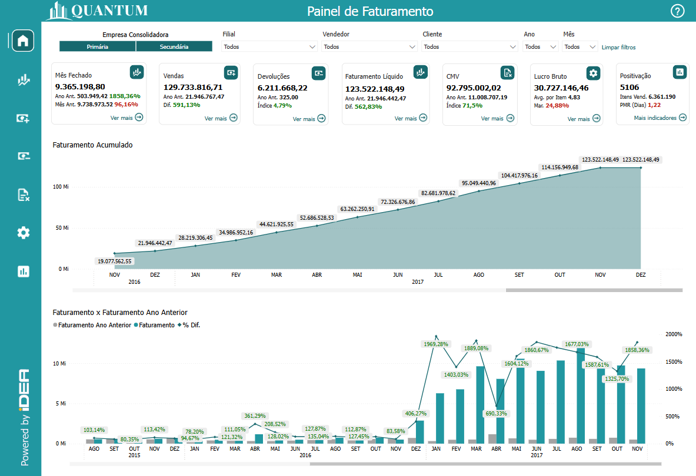
  <h6>Imagem 1: Relatório Faturamento - Painel de Faturamento</h6>

Um relatório de BI (Business Intelligence) abrangente e focado em Faturamento é essencial para oferecer uma visão clara e detalhada do desempenho das vendas de uma empresa. Esse tipo de relatório proporciona uma análise aprofundada das receitas, permitindo a monitorização eficiente do volume de vendas, a identificação de tendências de mercado, e a avaliação de desempenho ao longo do tempo. As visualizações precisas e detalhadas ajudam a destacar os produtos ou serviços mais lucrativos, a analisar variações sazonais e a tomar decisões informadas para otimizar as estratégias de vendas e aumentar a receita.

Uma das principais vantagens dos relatórios de BI em Faturamento é a capacidade de atualização contínua. Isso significa que os dados são atualizados conforme uma frequência estabelecida, garantindo que as informações refletidas no relatório sejam sempre atuais e relevantes para as decisões de vendas. Essa atualização contínua permite que os gestores respondam rapidamente a mudanças no comportamento do cliente ou nas condições de mercado, ajustando táticas e campanhas conforme necessário.

Além disso, os relatórios de BI para Faturamento oferecem a capacidade de integrar dados financeiros de vários módulos do _SAP Bussinees One_. Isso proporciona uma visão holística e consolidada das vendas da empresa, facilitando a análise comparativa e a identificação de oportunidades de crescimento ou áreas que precisam de atenção.

Esses relatórios também aumentam a precisão e consistência das informações de faturamento, reduzindo o risco de erros manuais e inconsistências que podem ocorrer com relatórios tradicionais baseados em planilhas. Adicionalmente, eles oferecem ferramentas de análise avançadas, como gráficos interativos e filtros dinâmicos, que ajudam a explorar os dados de maneira mais detalhada e a gerar insights mais profundos sobre o desempenho das vendas.

Em resumo, um relatório de BI bem estruturado em Faturamento não apenas fornece uma visão detalhada e atualizada das receitas da empresa, mas também facilita a tomada de decisões estratégicas, melhora a eficiência operacional e fortalece a capacidade da empresa de se adaptar e prosperar em um ambiente de negócios em constante evolução.

## Navegação

Existem várias maneiras de navegar pelo BI Financeiro. Botões estrategicamente posicionados e rotulados são colocados em todos os painéis, otimizando a experiência do usuário ao permitir uma navegação clara e intuitiva. Esses botões fornecem acesso direto às principais áreas, permitindo que os usuários explorem dados de forma eficiente sem se perderem em menus complexos. Seja retornando a uma página anterior, buscando insights mais específicos ou alternando entre diferentes visões financeiras, o layout garante que os usuários possam se mover suavemente pelo relatório, melhorando sua interação geral e produtividade.

### Botões de Menu

A primeira opção é a [barra de menu](https://idea-technology-it.github.io/docs-idea/faturamento/intro/#barra-de-menu), sempre no lado esquerdo do relatório, não importa qual painel você esteja visualizando. Cada botão navega para um painel específico no relatório. Ao passar o mouse, uma instrução descritiva aparecerá como esta;

  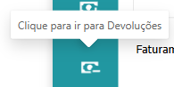

### Botões de Ver mais ou Mais Indicadores

A segunda maneira de navegar é através dos botões "Ver mais" ou "Mais indicadores" localizados nos [Indicadores Financeiros](https://idea-technology-it.github.io/docs-idea/faturamento/indicadores_faturamento/) - as caixas que aparecem na parte superior de cada página. Eles também têm uma descrição quando o mouse passa sobre eles, no entanto, para maior clareza, as imagens na caixa correspondente correspondem à imagem usada na barra de menu.

  
  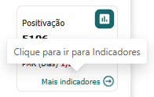

### Botões para Diferentes Visões

O terceiro método é usar botões para alternar entre diferentes visualizações dentro de um painel. Em certos painéis, há duas visualizações, com visuais diferentes para aquele painel. Abaixo dos [Indicadores Financeiros](https://idea-technology-it.github.io/docs-idea/faturamento/indicadores_faturamento/) pode haver um desses botões, se disponível, o botão alternará a visualização e o botão oposto aparecerá. Para entender melhor essas visualizações, você pode ver quais opções estão disponíveis para o painel através do [Botão para Documentação](https://idea-technology-it.github.io/docs-idea/faturamento/intro/#botao-para-documentacao) que contém imagens e explicações de todos os visuais disponíveis.

  
  

  
  

### Botão para Documentação

Finalmente, há um botão em cada painel do relatório que está vinculado à documentação daquele painel específico, o que facilita a navegação direta para explicações sobre os recursos visuais ou recursos.

## Barra de Menu

  
  <h6>Imagem 2: Barra de Menu</h6>

A barra de menu, situada no lado esquerdo de todas as páginas do relatório, é uma ferramenta de navegação essencial que oferece acesso direto às diversas seções e páginas do relatório. Ela facilita a movimentação entre diferentes áreas de análise e insights dos dados. O botão correspondente à página atual estará destacado, facilitando a identificação da sua localização no relatório.

Aqui está uma visão geral dos botões disponíveis na barra de menu:

### Botão Painel de Faturamento

<h6>Esquerda: Página atual, Direita: Página disponível</h6>
Este botão redireciona os usuários para a página principal, chamada [Painel de Faturamento](./painel_faturamento.md). Esta página serve como o ponto central de partida, oferecendo uma visão geral abrangente e facilitando a navegação para outras seções do relatório.
  
### Botão de Faturamento Líquido

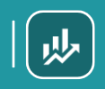

<h6>Esquerda: Página atual, Direita: Página disponível</h6>
Clicar neste botão direciona os usuários para a página intitulada [Faturamento Líquido](./faturamento_liquido.md). Esta página inclui visualizações e análises relacionadas ao faturamento gerada pela empresa.
  
### Botão Vendas

<h6>Esquerda: Página atual, Direita: Página disponível</h6>
Este botão direciona os usuários para a página chamada [Vendas](./vendas.md), onde é possível visualizar e analisar as vendas realizadas pela empresa. Esta seção fornece insights detalhados sobre o desempenho das vendas, auxiliando na compreensão dos resultados e no planejamento estratégico.
  
###  Botão Devoluções

<h6>Esquerda: Página atual, Direita: Página disponível</h6>
Selecionar este botão leva os usuários à página [Devoluções](./devolucoes.md). Aqui, os usuários podem visualizar e analisar as devoluções realizadas pela empresa, ajudando a entender os padrões de retorno e a melhorar a gestão de produtos e o atendimento ao cliente.
  
### Botão Custo da Mercadoria Vendida (CMV)

<h6>Esquerda: Página atual, Direita: Página disponível</h6>
Este botão leva os usuários à página [Custo da Mercadoria Vendida](./cmv.md), onde é possível explorar e analisar os custos associados às mercadorias vendidas pela empresa. Esta seção fornece informações valiosas para a gestão da margem de lucro e a otimização da eficiência operacional, ajudando a entender e controlar os custos envolvidos na produção e comercialização dos produtos.
  
### Botão Itens

<h6>Esquerda: Página atual, Direita: Página disponível</h6>
Clicar neste botão abre a página denominada [Itens](./itens.md), onde os usuários podem visualizar informações como: quantidade de itens vendidos, tíquete médio, itens mais vendidos e com maior receita e maior preço médio de venda, tudo por item.
  
### Botão Indicadores

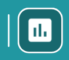

<h6>Esquerda: Página atual, Direita: Página disponível</h6>
Este botão navega para a página intitulada [Indicadores](./indicadores.md), esta página inclui 10 indicadores divididos por ano e mês, filial, vendedor e cliente para dar uma forma abrangente e rápida de visualizar o desempenho. Esses indicadores são:

- CMV - Custo da Mercadoria Vendida (%) 
- Devoluções (%) 
- Margem de Lucro (%) 
- MDR - Máximo Dias a Receber (Dias) 
- Meta Mensal (%) 
- Pedido Médio (R$) 
- PMR - Período Médio de Recebimento (Dias) 
- Positivação 
- Quantidade de Vendas 
- Ticket Médio (R$)

## Filtros

  
  <h6>Imagem 3: Filtros ou Slicers</h6>

Os filtros, são ferramentas cruciais que permitem filtrar todos os visuais presentes nas páginas do relatório de forma dinâmica e sincronizada. 

Ao ajustar qualquer um dos filtros, todos os gráficos, tabelas e outros elementos visuais em todas as páginas do relatório são atualizados automaticamente para refletir apenas os dados relevantes de acordo com o critério selecionado.

Os filtros são baseados nos dados da empresa e permitem a filtragem por áreas específicas, como projeto ou filial. Por exemplo, ao selecionar um projeto chamado “Novo Edifício” no filtro, ele será aplicado a todas as páginas do relatório, mostrando apenas os dados relacionados a esse projeto. Isso facilita a visualização e análise detalhada das informações pertinentes ao projeto escolhido.

###	Filial Consolidadora

Este filtro permite que você filtre dados com base na filial consolidadora da empresa. Quando você seleciona uma filial consolidadora, todos os visuais em todas as páginas do relatório mostrarão informações relacionadas somente a esse grupo. Isso é útil para analisar o desempenho ou comparar grupos separados de filiais, divididos por critérios como área, tipo de negócio ou equipe de gestão.

###	Filial

Este filtro permite filtrar os dados com base na filial específica da empresa. Ao selecionar uma filial, todos os visuais em todas as páginas do relatório mostrarão informações apenas relacionadas a essa filial. Isso é útil para analisar o desempenho e os resultados de diferentes unidades de negócios ou localizações.

###	Vendedor

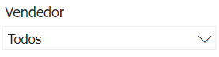

O filtro de vendedor possibilita a filtragem dos dados por vendedores específicos. Selecionando um vendedor, o relatório ajusta todos os visuais para exibir apenas informações relevantes a esse vendedor, facilitando a análise indicadores associados.

###	Cliente

Este filtro permite filtrar os dados com base no cliente. Ao selecionar uma cliente, todos os visuais em todas as páginas do relatório mostrarão informações apenas relacionadas a essa cliente. Isso é útil para analisar o desempenho e os resultados de diferentes clientes.

###	Ano

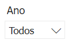

O filtro de ano permite selecionar o ano desejado para a análise. Aplicando um filtro de ano, todos os visuais nas páginas do relatório são atualizados para mostrar dados exclusivamente para o ano selecionado, permitindo uma comparação e análise de tendências anuais.

###	Mês

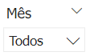

Este filtro possibilita a filtragem dos dados por mês específico. Ao escolher um mês, todos os visuais no relatório são ajustados para refletir apenas as informações desse período, facilitando a análise mensal e a identificação de variações sazonais.

###	Limpar filtros

Para limpar todos os filtros aplicados e retornar à visualização completa dos dados, clique no botão "Limpar filtros" situado à direita dos filtros. Isso eliminará todos os filtros ativos, permitindo uma visão geral completa e abrangente dos dados.

## Ícones de Cabeçalho

  
  <h6>Imagem 4: Ícones de Cabeçalho</h6>

Quando você seleciona um visual ou passa o mouse sobre ele, ícones de cabeçalho podem aparecer no canto superior direito. A presença e o tipo desses ícones variam conforme o tipo e o conteúdo do visual, além das opções configuradas durante a criação.

No nosso relatório, os ícones mais úteis são "drill down" e "drill up". Esses ícones facilitam a navegação entre diferentes níveis de detalhes, como cliente ou projeto, proporcionando uma análise mais aprofundada e eficiente dos dados.

Abaixo estão as opções que um usuário pode ver, o que elas significam e como usá-las.

### Fazer drill on Linhas ou Colunas

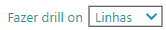

Isso altera o drill down para as linhas ou colunas em uma tabela, por exemplo, os cabeçalhos das colunas têm anos e meses, você pode selecionar colunas, permitindo que você faça drill up apenas para os anos, down apenas para os meses ou expanda para ver o ano e o mês como cabeçalhos de coluna. Da mesma forma, se você selecionar linhas, poderá navegar pela hierarquia das linhas.

### Fazer drill up

O botão "drill up" permite que você suba um nível na hierarquia do visual. Por exemplo, se você estiver visualizando dados detalhados por filial e clicar neste botão, o visual exibirá o nível imediatamente superior, que neste caso seria a origem. Isso ajuda a obter uma visão mais ampla e consolidada dos dados.

### Clique aqui para habilitar o Drill down

Este botão não é necessário para nossos relatórios, ele habilita os recursos de detalhamento, mas eles são predefinidos na criação.

### Ir para o próximo nível na hierarquia

Este botão é diferente do botão "Expandir". Ao utilizá-lo, você avança para o próximo nível da hierarquia, substituindo completamente o nível atual. Por exemplo, se sua hierarquia for composta de cliente, origem, filial e projeto, e você estiver visualizando dados por cliente, clicar neste botão exibirá a origem, ocultando os dados por cliente. Se estiver visualizando uma hierarquia de ano e mês, clicar no botão mostrará apenas o mês, sem associá-lo ao ano. Quando no nível mais alto, clicar neste botão desativará a opção de "Expandir todo o campo um nível abaixo na hierarquia" nos níveis subsequentes.

### Expandir todo o campo um nível abaixo ne hierarquia

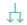

Este botão permite expandir os dados no visual sem substituir o nível atual da hierarquia. Em vez de avançar para o próximo nível, ele exibe as subcategorias dentro do nível selecionado. Por exemplo, em uma hierarquia de ano e mês, se você estiver no nível de ano e clicar neste botão, verá o ano e os meses correspondentes dentro daquele ano. Da mesma forma, em uma hierarquia de cliente, origem, filial e projeto, se estiver no nível de cliente, ao clicar, verá a origem exibida como subcategorias de cada cliente.

Ao usar este botão no nível superior, a opção de "Ir para o próximo nível na hierarquia" ficará desativada para os níveis subsequentes.

### Filtros e segmentações afetando este visual

Informa quais filtros estão impactando o visual no momento.

### Modo de foco

Abre o modo de foco, que é uma nova página com apenas o visual selecionado, dando mais espaço ao visual.

### Mais opções

Este botão abre um menu com mais opções como Pesquisar, Exportar dados, Mostrar como tabela, Remover, Destacar e Classificar.
Nem todas essas opções estarão disponíveis em todos os visuais.

## Dicas de Ferramentas

  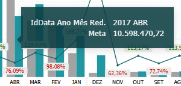
  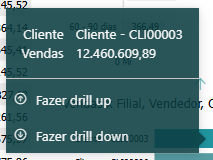

As Dicas de Ferramentas oferecem uma maneira poderosa de visualizar contexto adicional ou detalhes sobre pontos de dados em um visual, sem sobrecarregar a exibição principal. Ao passar o cursor sobre um elemento específico em um visual, como uma barra em um gráfico de barras ou um ponto de dados em um gráfico de linhas, uma Dica de Ferramenta aparecerá exibindo informações relevantes para aquela seleção. Normalmente, as Dicas de Ferramentas mostram métricas chave, como totais, percentuais ou médias, ajudando os usuários a entender o significado do ponto de dados. No entanto, elas também podem conter detalhes adicionais que não estão visíveis diretamente no visual principal, oferecendo uma visão mais profunda. Por exemplo, um gráfico pode mostrar o valor, e a Dica de Ferramenta poderia incluir esse valor junto com o percentual correspondente. Essa camada oculta de informações enriquece a experiência do usuário, permitindo que explorem os dados de forma mais completa, sem sobrecarregar o visual com muitos detalhes de uma só vez. Para visualizar as Dicas de Ferramentas, os usuários simplesmente precisam passar o cursor sobre os diferentes pontos de dados, tornando-as um recurso intuitivo que aprimora a exploração de dados e a tomada de decisões.

  
***Aviso Legal:** Os números e informações apresentados nesta documentação são baseados em um conjunto de dados fictício. Eles são destinados exclusivamente para fins educacionais e de demonstração. Os dados não refletem condições do mundo real ou métricas de negócios reais e não devem ser usados ​​para tomada de decisão ou análise. Qualquer semelhança com entidades, eventos ou dados reais é mera coincidência.*
