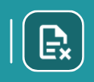
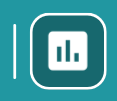
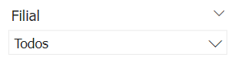
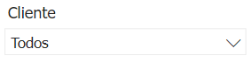
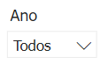
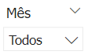
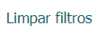

# Introdução ao BI Faturamento

  
  <h6>Imagem 1: Relatório Faturamento - Painel de Faturamento</h6>

Um relatório de BI (Business Intelligence) abrangente e focado em Faturamento é essencial para oferecer uma visão clara e detalhada do desempenho das vendas de uma empresa. Esse tipo de relatório proporciona uma análise aprofundada das receitas, permitindo a monitorização eficiente do volume de vendas, a identificação de tendências de mercado, e a avaliação de desempenho ao longo do tempo. As visualizações precisas e detalhadas ajudam a destacar os produtos ou serviços mais lucrativos, a analisar variações sazonais e a tomar decisões informadas para otimizar as estratégias de vendas e aumentar a receita.

Uma das principais vantagens dos relatórios de BI em Faturamento é a capacidade de atualização contínua. Isso significa que os dados são atualizados em tempo real ou conforme uma frequência estabelecida, garantindo que as informações refletidas no relatório sejam sempre atuais e relevantes para as decisões de vendas. Essa atualização contínua permite que os gestores respondam rapidamente a mudanças no comportamento do cliente ou nas condições de mercado, ajustando táticas e campanhas conforme necessário.

Além disso, os relatórios de BI para Faturamento oferecem a capacidade de integrar dados de várias fontes, como sistemas de CRM, ERP, e plataformas de e-commerce, em um único painel. Isso proporciona uma visão holística e consolidada das vendas da empresa, facilitando a análise comparativa e a identificação de oportunidades de crescimento ou áreas que precisam de atenção.

Esses relatórios também aumentam a precisão e consistência das informações de faturamento, reduzindo o risco de erros manuais e inconsistências que podem ocorrer com relatórios tradicionais baseados em planilhas. Adicionalmente, eles oferecem ferramentas de análise avançadas, como gráficos interativos e filtros dinâmicos, que ajudam a explorar os dados de maneira mais detalhada e a gerar insights mais profundos sobre o desempenho das vendas.

Em resumo, um relatório de BI bem estruturado em Faturamento não apenas fornece uma visão detalhada e atualizada das receitas da empresa, mas também facilita a tomada de decisões estratégicas, melhora a eficiência operacional e fortalece a capacidade da empresa de se adaptar e prosperar em um ambiente de negócios em constante evolução.

## Barra de Menu

  
  <h6>Imagem 2: Barra de Menu</h6>

A barra de menu é um recurso de navegação localizado no lado esquerdo de todas as páginas do relatório, fornecendo acesso fácil a várias seções e páginas detalhadas do relatório. Ela ajuda os usuários a navegarem de forma eficiente entre diferentes áreas de análise e insights dos dados. O botão da página atual ficará destacado (mostrado abaixo).

Aqui está uma visão geral dos botões disponíveis na barra de menu:

### Botão Home

<h6>Esquerda: Página atual, Direita: Página disponível</h6>
Este botão leva os usuários de volta à página principal, intitulada Painel de Faturamento. É o ponto central de partida onde os usuários podem acessar uma visão geral e navegar para outras seções.

  
### Botão Faturamento

<h6>Esquerda: Página atual, Direita: Página disponível</h6>
Clicar neste botão direciona os usuários para a página intitulada Faturamento. Esta página inclui visualizações e análises relacionadas ao faturamento gerada pela empresa.
  
### Botão Vendas

<h6>Esquerda: Página atual, Direita: Página disponível</h6>
Este botão navega para a página intitulada Vendas. Aqui, os usuários podem visualizar e analisar as vendas realizadas pela empresa, auxiliando na compreensão dos resultados e no planejamento estratégico.
  
###  Botão Devoluções

<h6>Esquerda: Página atual, Direita: Página disponível</h6>
Selecionar este botão leva os usuários à página intitulada Devoluções. Aqui, os usuários podem visualizar e analisar as devoluções realizadas pela empresa, ajudando a entender os padrões de retorno e a melhorar a gestão de produtos e o atendimento ao cliente.
  
### Botão CMV (Custo da Mercadoria Vendida)

<h6>Esquerda: Página atual, Direita: Página disponível</h6>
Este botão direciona para a página intitulada CMV (Custo da Mercadoria Vendida). Aqui, os usuários podem visualizar e analisar o custo associado às mercadorias vendidas pela empresa, fornecendo insights cruciais para a gestão de margem de lucro e a eficiência operacional.
  
### Botão Itens

<h6>Esquerda: Página atual, Direita: Página disponível</h6>
Clicar neste botão abre a página intitulada Itens, onde os usuários podem visualizar informações como: quantidade de itens vendidos, tíquete médio, itens mais vendidos e com maior receita e maior preço médio de venda, tudo por item.
  
### Botão Indicadores

<h6>Esquerda: Página atual, Direita: Página disponível</h6>
Este botão navega para a página intitulada Indicadores, esta página inclui 10 indicadores divididos por ano e mês, filial, vendedor e cliente para dar uma forma abrangente e rápida de visualizar o desempenho. Esses indicadores são:

- CMV - Custo da Mercadoria Vendida (%) 
- Devoluções (%) 
- Margem de Lucro (%) 
- MDR - Máximo Dias a Receber (Dias) 
- Meta Mensal (%) 
- Pedido Médio (R$) 
- PMR - Período Médio de Recebimento (Dias) 
- Positivação 
- Quantidade de Vendas 
- Ticket Médio (R$)

## Filtros

  
  <h6>Imagem 3: Filtros ou Slicers</h6>

Os filtros, são ferramentas cruciais que permitem filtrar todos os visuais presentes nas páginas do relatório de forma dinâmica e sincronizada. 

Ao ajustar qualquer um dos filtros, todos os gráficos, tabelas e outros elementos visuais em todas as páginas do relatório são atualizados automaticamente para refletir apenas os dados relevantes de acordo com o critério selecionado.

Os filtros são feitos a partir dos dados da empresa, ou seja, você pode filtrar por áreas específicas como projeto ou filial. Por exemplo, se você quiser ver os números de um projeto chamado “Novo Edifício”, basta selecioná-lo no slicer e o filtro será aplicado. Agora você pode ver todos os dados relacionados a este projeto em cada página do relatório.

###	Filial Consolidadora

Este filtro permite que você filtre dados com base na filial consolidadora da empresa. Quando você seleciona uma filial consolidadora, todos os visuais em todas as páginas do relatório mostrarão informações relacionadas somente a esse grupo. Isso é útil para analisar o desempenho ou comparar grupos separados de filiais, divididos por critérios como área, tipo de negócio ou equipe de gestão.

###	Filial

Este filtro permite filtrar os dados com base na filial específica da empresa. Ao selecionar uma filial, todos os visuais em todas as páginas do relatório mostrarão informações apenas relacionadas a essa filial. Isso é útil para analisar o desempenho e os resultados de diferentes unidades de negócios ou localizações.

###	Vendedor

O filtro de vendedor possibilita a filtragem dos dados por vendedores específicos. Selecionando um vendedor, o relatório ajusta todos os visuais para exibir apenas informações relevantes a esse vendedor, facilitando a análise indicadores associados.

###	Cliente

Este filtro permite filtrar os dados com base no cliente. Ao selecionar uma cliente, todos os visuais em todas as páginas do relatório mostrarão informações apenas relacionadas a essa cliente. Isso é útil para analisar o desempenho e os resultados de diferentes clientes.

###	Ano

O filtro de ano permite selecionar o ano desejado para a análise. Aplicando um filtro de ano, todos os visuais nas páginas do relatório são atualizados para mostrar dados exclusivamente para o ano selecionado, permitindo uma comparação e análise de tendências anuais.

###	Mês

Este filtro possibilita a filtragem dos dados por mês específico. Ao escolher um mês, todos os visuais no relatório são ajustados para refletir apenas as informações desse período, facilitando a análise mensal e a identificação de variações sazonais.

###	Limpar filtros

Para limpar todos os filtros aplicados e retornar à visualização completa dos dados, utilize o botão "Limpar filtros" localizado no lado direito dos slicers. Este botão remove todos os filtros, proporcionando uma visão geral abrangente dos dados.

