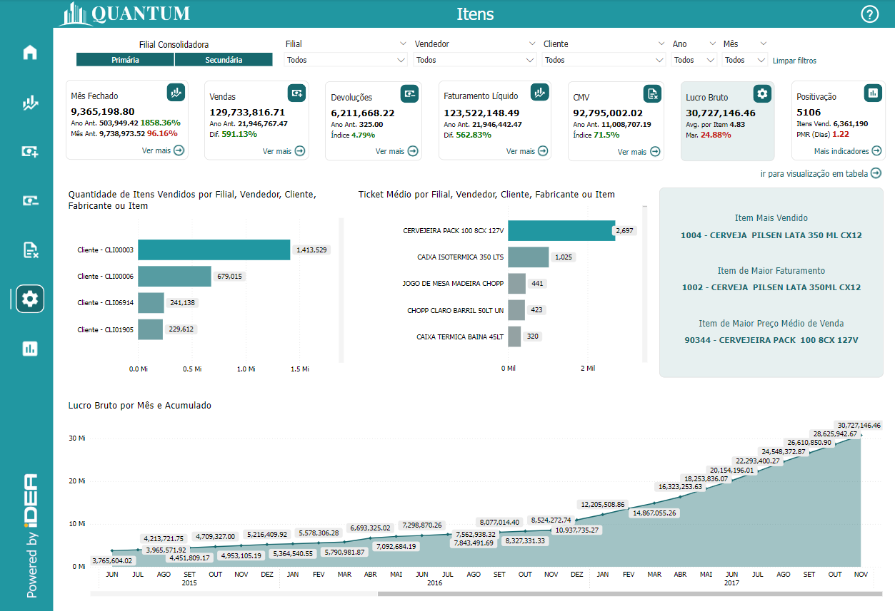
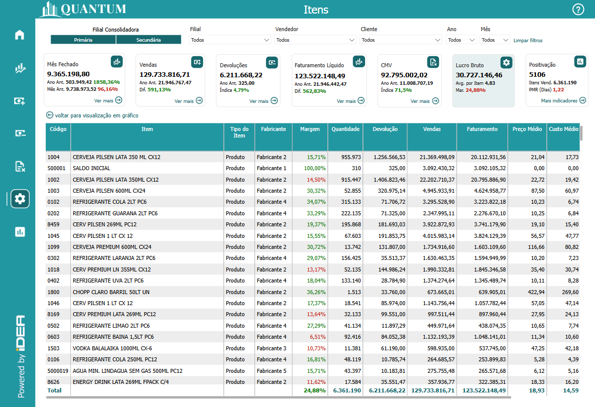

# Painel Itens

  
  <h6>Imagem 1: Painel Itens - Visão Análise Anual</h6>

  
  <h6>Imagem 2: Painel Itens - Visão Detalhes</h6>

## Navegação

Este painel de relatório está dividido em duas visualizações;

- **[Visão Análise Anual](https://idea-technology-it.github.io/docs-idea/faturamento/vendas/#visao-analise-anual)** - pode ser navegada através do [botão](https://idea-technology-it.github.io/docs-idea/faturamento/intro/#botoes-para-diferentes-visoes) "voltar para visualização em gráfico".
- **[Visão Detalhes](https://idea-technology-it.github.io/docs-idea/faturamento/vendas/#visao-detalhes)** - pode ser navegada através do [botão](https://idea-technology-it.github.io/docs-idea/faturamento/intro/#botoes-para-diferentes-visoes) "ir para visualização em tabela".

## Informações no Painel Devoluções

### Análise de Itens

A análise de itens é uma componente fundamental do Business Intelligence (BI), oferecendo insights essenciais sobre o desempenho dos produtos e a eficiência das operações comerciais. Avaliar indicadores como Lucro Bruto, Quantidade Vendida, Ticket Médio e Margens de Lucro ajuda as empresas a compreender a rentabilidade e o sucesso de cada item em seu portfólio. Monitorar essas métricas permite identificar quais produtos estão contribuindo mais para o lucro e quais podem precisar de ajustes em termos de estratégia de venda ou precificação.

Visualizações detalhadas, como o Lucro Bruto por Item e a Quantidade Vendida, são cruciais para avaliar o desempenho financeiro dos produtos ao longo do tempo. O Lucro Bruto por Item oferece uma visão clara da rentabilidade gerada por cada produto, ajudando a identificar quais itens estão gerando maiores margens de lucro e quais podem estar impactando negativamente o resultado financeiro. A análise da Quantidade Vendida, por sua vez, revela quais produtos estão atraindo mais demanda, fornecendo uma base para decisões de reabastecimento e estratégias de marketing.

Análises do Ticket Médio e das Margens de Lucro são igualmente importantes para entender o impacto financeiro de cada item. O Ticket Médio fornece uma visão do valor médio das vendas por transação, ajudando a identificar tendências de compra e a ajustar estratégias de precificação. Margens de Lucro detalhadas mostram a eficiência na geração de lucro a partir das vendas, revelando quais produtos oferecem melhores retornos e quais podem necessitar de revisão na estratégia de custo.

Além disso, a análise detalhada por Filial, Vendedor, Cliente e Fabricante oferece uma visão aprofundada sobre a performance de itens em diferentes contextos. Por exemplo, entender o desempenho dos itens por Filial ajuda a identificar quais unidades estão vendendo mais ou menos, permitindo ajustes localizados. A análise por Vendedor revela quais representantes de vendas estão gerando melhores resultados com determinados itens, enquanto a análise por Cliente permite identificar preferências e comportamentos de compra. Avaliar o impacto dos Fabricantes ajuda a entender a relação entre fornecedores e o sucesso dos produtos no mercado.

Em resumo, a análise de itens no BI é uma ferramenta poderosa para otimizar a gestão de produtos e maximizar a rentabilidade. Ao examinar indicadores como Lucro Bruto, Quantidade Vendida, Ticket Médio e Margens de Lucro, bem como segmentar esses dados por diferentes dimensões, as empresas podem tomar decisões informadas que aprimoram a eficiência operacional, ajustam as estratégias de venda e melhoram a satisfação do cliente. Esse processo de análise não só melhora a gestão de itens, mas também impacta positivamente outras áreas-chave do negócio, como marketing, vendas e operações.

## Visão Gráfico

### Quantidade de Itens Vendidos x Filial, Vendedor, Cliente, Fabricante ou Item

### Ticket Médio x Filial, Vendedor, Cliente, Fabricante ou Item

### Itens Destacados

<em>Imagem 5: Acumulado</em>

<em>Imagem 6: Tabela Detalhamento</em>

  
***Aviso Legal:** Os números e informações apresentados nesta documentação são baseados em um conjunto de dados fictício. Eles são destinados exclusivamente para fins educacionais e de demonstração. Os dados não refletem condições do mundo real ou métricas de negócios reais e não devem ser usados ​​para tomada de decisão ou análise. Qualquer semelhança com entidades, eventos ou dados reais é mera coincidência.*
