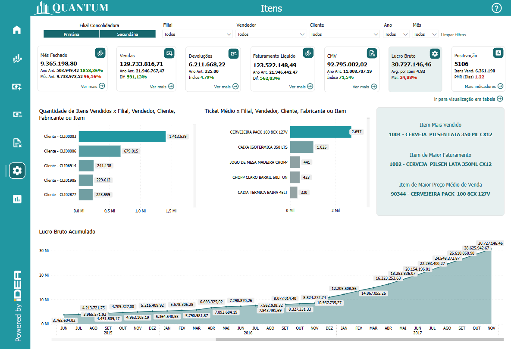
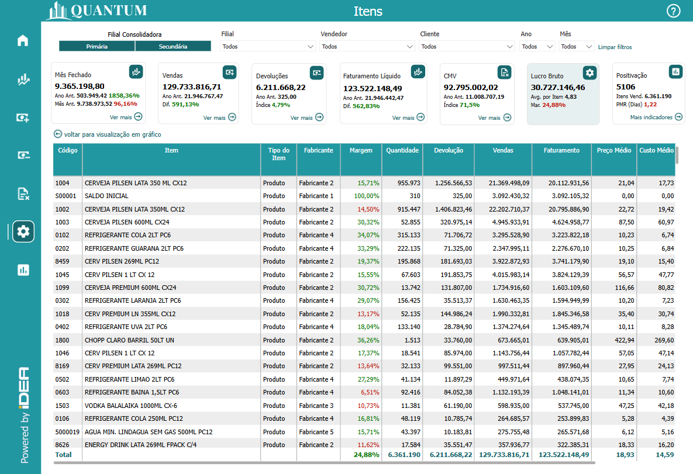
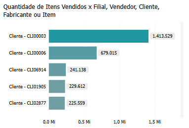
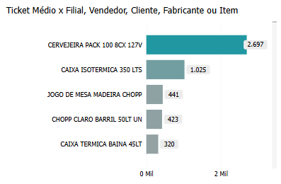
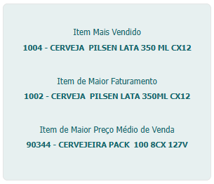
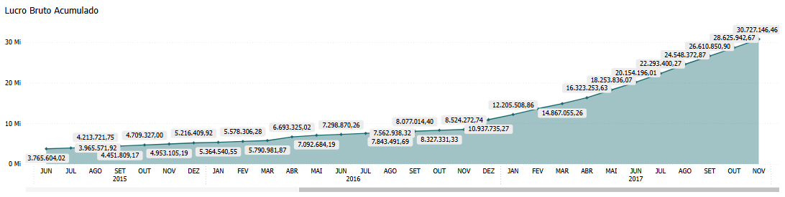
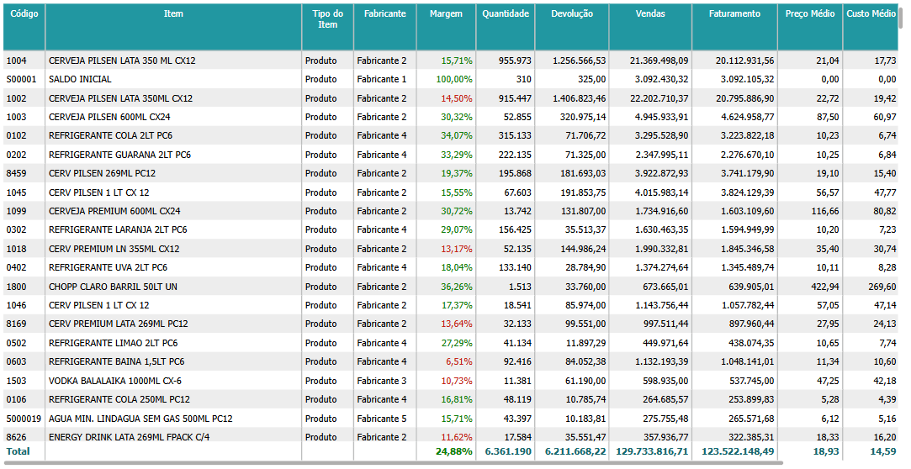

# Painel Itens

  
  <h6>Imagem 1: Painel Itens - Visão Análise Anual</h6>

  
  <h6>Imagem 2: Painel Itens - Visão Detalhes</h6>

## Navegação

Este painel de relatório está dividido em duas visualizações;

- **[Visão Gráfico](https://idea-technology-it.github.io/docs-idea/faturamento/vendas/#visao-analise-anual)** - pode ser navegada através do [botão](https://idea-technology-it.github.io/docs-idea/faturamento/intro/#botoes-para-diferentes-visoes) "voltar para visualização em gráfico".
- **[Visão Tabela](https://idea-technology-it.github.io/docs-idea/faturamento/vendas/#visao-detalhes)** - pode ser navegada através do [botão](https://idea-technology-it.github.io/docs-idea/faturamento/intro/#botoes-para-diferentes-visoes) "ir para visualização em tabela".

## Informações no Painel Devoluções

### Análise de Itens

A análise de itens é uma componente fundamental do Business Intelligence (BI), oferecendo insights essenciais sobre o desempenho dos produtos e a eficiência das operações comerciais. Avaliar indicadores como Lucro Bruto, Quantidade Vendida, Ticket Médio e Margens de Lucro ajuda as empresas a compreender a rentabilidade e o sucesso de cada item em seu portfólio. Monitorar essas métricas permite identificar quais produtos estão contribuindo mais para o lucro e quais podem precisar de ajustes em termos de estratégia de venda ou precificação.

Visualizações detalhadas, como o Lucro Bruto por Item e a Quantidade Vendida, são cruciais para avaliar o desempenho financeiro dos produtos ao longo do tempo. O Lucro Bruto por Item oferece uma visão clara da rentabilidade gerada por cada produto, ajudando a identificar quais itens estão gerando maiores margens de lucro e quais podem estar impactando negativamente o resultado financeiro. A análise da Quantidade Vendida, por sua vez, revela quais produtos estão atraindo mais demanda, fornecendo uma base para decisões de reabastecimento e estratégias de marketing.

Análises do Ticket Médio e das Margens de Lucro são igualmente importantes para entender o impacto financeiro de cada item. O Ticket Médio fornece uma visão do valor médio das vendas por transação, ajudando a identificar tendências de compra e a ajustar estratégias de precificação. Margens de Lucro detalhadas mostram a eficiência na geração de lucro a partir das vendas, revelando quais produtos oferecem melhores retornos e quais podem necessitar de revisão na estratégia de custo.

Além disso, a análise detalhada por Filial, Vendedor, Cliente e Fabricante oferece uma visão aprofundada sobre a performance de itens em diferentes contextos. Por exemplo, entender o desempenho dos itens por Filial ajuda a identificar quais unidades estão vendendo mais ou menos, permitindo ajustes localizados. A análise por Vendedor revela quais representantes de vendas estão gerando melhores resultados com determinados itens, enquanto a análise por Cliente permite identificar preferências e comportamentos de compra. Avaliar o impacto dos Fabricantes ajuda a entender a relação entre fornecedores e o sucesso dos produtos no mercado.

Em resumo, a análise de itens no BI é uma ferramenta poderosa para otimizar a gestão de produtos e maximizar a rentabilidade. Ao examinar indicadores como Lucro Bruto, Quantidade Vendida, Ticket Médio e Margens de Lucro, bem como segmentar esses dados por diferentes dimensões, as empresas podem tomar decisões informadas que aprimoram a eficiência operacional, ajustam as estratégias de venda e melhoram a satisfação do cliente. Esse processo de análise não só melhora a gestão de itens, mas também impacta positivamente outras áreas-chave do negócio, como marketing, vendas e operações.

## Visão Gráfico

### Quantidade de Itens Vendidos x Filial, Vendedor, Cliente, Fabricante ou Item

  
  <h6>Imagem 3: Quantidade de Itens Vendidos x Filial, Vendedor, Cliente, Fabricante ou Item</h6>

A organização do gráfico de barras por **Filial, Vendedor, Cliente, Fabricante ou Item**, conforme indicado no subtítulo, oferece uma estrutura clara e lógica para analisar os dados de **Quantidade de Itens Vendidos**, facilitando a compreensão do impacto de diferentes categorias sobre as vendas da empresa. Essa categorização permite que os tomadores de decisão identifiquem rapidamente quais filiais, vendedores, clientes, fabricantes ou itens estão gerando mais vendas, ajudando a destacar os segmentos mais lucrativos e aqueles que necessitam de mais atenção.

As informações fornecidas pelas etiquetas de quantidade e pelos dicas de ferramentas, que exibem o valor exato e percentuais de cada categoria, são cruciais para o gerenciamento estratégico das vendas. Esses dados auxiliam na priorização de esforços, identificando áreas de maior desempenho e áreas que podem necessitar de ajustes nas estratégias de vendas ou marketing. A análise detalhada dos dados permite uma visão mais aprofundada das tendências de vendas e ajuda a otimizar a alocação de recursos e o planejamento estratégico.

Além disso, a interação entre os gráficos é **bidirecional**: ao clicar em outro visual na página, como o [Quantidade de Itens Vendidos por Filial, Vendedor, Cliente, Fabricante ou Item](https://idea-technology-it.github.io/docs-idea/vendas/quantidade_itens_vendidos/), este visual será automaticamente filtrado de acordo com a seleção realizada. Da mesma forma, ao selecionar um item no visual, ele filtrará os outros visuais, criando uma análise interativa e detalhada que facilita a compreensão dos dados e possibilita uma tomada de decisão mais informada. Esse comportamento dinâmico proporciona uma experiência integrada, permitindo que os usuários explorem as correlações entre variáveis e entendam como diferentes categorias influenciam as vendas.

A **seleção de categoria** neste gráfico permite criar várias combinações com outros visuais, como o de [Quantidade de Itens Vendidos por Vendedor, Cliente, Fabricante ou Item](https://idea-technology-it.github.io/docs-idea/vendas/quantidade_itens_vendidos/), aumentando ainda mais a flexibilidade na análise. A capacidade de escolher diferentes cabeçalhos de linha em cada visual facilita a identificação de combinações relevantes, ajudando a visualizar as relações mais importantes para a análise das quantidades vendidas. Por exemplo, o usuário pode optar por visualizar Filial neste gráfico, Cliente na segunda e Fabricante na terceira, ou ainda Item e Vendedor em outras combinações, ajustando o gráfico para exibir as informações mais significativas conforme o contexto.

Para navegar entre os níveis, você pode usar os [ícones de cabeçalho](https://idea-technology-it.github.io/docs-idea/faturamento/intro/#ícones_de_cabeçalho) que estão disponíveis quando você passa o mouse ou clica no gráfico.

  
  <h6>Ícones de Cabeçalho</h6>

Aqui, você pode mover para cima ou para baixo entre Filial, Vendedor, Cliente, Fabricante ou Item para analisar a área necessária.

### Ticket Médio x Filial, Vendedor, Cliente, Fabricante ou Item

  
  <h6>Imagem 4: Ticket Médio x Filial, Vendedor, Cliente, Fabricante ou Item</h6>

A organização do gráfico de barras por **Filial, Vendedor, Cliente, Fabricante ou Item**, conforme indicado no subtítulo, oferece uma estrutura clara e lógica para analisar os dados de **Ticket Médio**, permitindo uma visão detalhada da média de valores de vendas por categoria. Essa categorização facilita a compreensão do impacto de diferentes segmentos sobre o ticket médio da empresa e ajuda a identificar quais áreas estão contribuindo mais significativamente para a média de vendas.

O gráfico exibe o **valor do Ticket Médio** por categoria e oferece informações adicionais nos **tooltips**, como o valor exato do ticket médio e suas variações percentuais, proporcionando uma visão mais completa e detalhada. Esses dados são essenciais para avaliar a eficiência das vendas e identificar áreas que podem necessitar de ajustes nas estratégias de precificação ou vendas. A análise do Ticket Médio ajuda a entender melhor o comportamento dos clientes, a eficácia das estratégias de vendas e o desempenho de filiais, vendedores e fabricantes.

A interação entre os gráficos é **bidirecional**: ao clicar em outro visual na página, como o [Ticket Médio por Filial, Vendedor, Cliente, Fabricante ou Item](https://idea-technology-it.github.io/docs-idea/vendas/ticket_medio/), o gráfico será automaticamente filtrado conforme a seleção feita. Da mesma forma, ao selecionar um item no gráfico, ele filtrará os outros visuais, criando uma análise interativa e detalhada que facilita a compreensão dos dados e possibilita uma tomada de decisão mais informada. Esse comportamento dinâmico proporciona uma experiência integrada, permitindo que os usuários explorem as correlações entre variáveis e compreendam como diferentes categorias influenciam o Ticket Médio.

A **seleção de categoria** neste gráfico permite criar várias combinações com outros visuais, como o de [Ticket Médio por Vendedor, Cliente, Fabricante ou Item](https://idea-technology-it.github.io/docs-idea/vendas/ticket_medio/), aumentando a flexibilidade na análise. A capacidade de escolher diferentes cabeçalhos de linha em cada visual facilita a identificação de combinações relevantes, ajudando a visualizar as relações mais importantes para a análise do Ticket Médio. Por exemplo, o usuário pode optar por visualizar Filial neste gráfico, Cliente na segunda e Fabricante na terceira, ou ainda Item e Vendedor em outras combinações, ajustando o gráfico para exibir as informações mais significativas conforme o contexto.

Para navegar entre os níveis, você pode usar os [ícones de cabeçalho](https://idea-technology-it.github.io/docs-idea/faturamento/intro/#ícones_de_cabeçalho) que estão disponíveis quando você passa o mouse ou clica no gráfico.

  
  <h6>Ícones de Cabeçalho</h6>

Aqui, você pode mover para cima ou para baixo entre Filial, Vendedor, Cliente, Fabricante ou Item para analisar a área necessária.

### Itens Destacados

  
  <h6>Imagem 6: Itens Destacados</h6>

O visual contendo três cartões destacando o **Item Mais Vendido**, o **Item de Maior Faturamento** e o **Item de Maior Preço Médio de Venda** oferece uma visão detalhada e estratégica dos principais itens no portfólio de produtos de uma empresa. Cada cartão proporciona uma perspectiva única sobre o desempenho dos itens, ajudando os gestores a identificar quais produtos estão dominando as vendas e gerando maiores receitas, bem como aqueles que possuem os maiores preços médios de venda.

O **Item Mais Vendido** destaca o produto que tem o maior volume de unidades comercializadas. Essa informação é crucial para entender quais itens estão sendo mais procurados pelos clientes e, portanto, ajudam a empresa a ajustar seu estoque e estratégias de marketing para atender à demanda. Saber quais produtos são mais vendidos permite que os gestores tomem decisões informadas sobre reabastecimento, promoções e até mesmo desenvolvimento de novos produtos baseados nas preferências do mercado.

O **Item de Maior Faturamento** revela o produto que gera a maior receita total. Este cartão é vital para identificar quais itens são mais lucrativos em termos de valor monetário. Com essa visão, a empresa pode analisar a rentabilidade dos produtos e decidir onde concentrar seus esforços para maximizar o retorno financeiro. A análise do item de maior faturamento também pode informar estratégias de preço, promoção e desenvolvimento de produtos para maximizar a receita.

Por fim, o **Item de Maior Preço Médio de Venda** destaca o produto que tem o maior preço médio de venda. Este indicador é essencial para entender quais produtos estão sendo vendidos a preços mais altos e avaliar a eficácia das estratégias de precificação. Produtos com altos preços médios podem ser analisados para identificar características que justificam seus valores, influenciar futuras estratégias de precificação e ajustar as ofertas para otimizar o lucro.

Juntos, esses três cartões fornecem uma visão abrangente do desempenho dos produtos, permitindo que os gestores identifiquem oportunidades e desafios, ajustem suas estratégias de vendas e marketing, e otimizem suas operações para melhorar a rentabilidade e a satisfação do cliente.

### Lucro Bruto Acumulado

  
  <h6>Imagem 5: Lucro Bruto Acumulado</h6>

O gráfico de área com **Lucro Bruto Acumulado** é uma ferramenta analítica fundamental para entender a evolução do lucro bruto de uma empresa ao longo do tempo. Esse gráfico exibe a soma acumulada dos lucros brutos, oferecendo uma visão clara de como o lucro total se desenvolveu em diferentes períodos. Ele é crucial para visualizar o crescimento contínuo do lucro bruto, permitindo que os gestores identifiquem facilmente períodos de aumento ou diminuição significativa e, assim, possam avaliar o desempenho financeiro com mais precisão.

A importância deste gráfico também se destaca na capacidade de revelar tendências e padrões sazonais, facilitando o planejamento estratégico e a adaptação das operações para maximizar o lucro. A análise do desempenho geral da empresa é aprimorada pela visualização acumulada, que mostra como o lucro bruto total evolui ao longo do tempo e como as estratégias empresariais impactam esses resultados.

Além disso, o gráfico de área é especialmente útil para a análise do impacto de diferentes itens ou categorias de produtos no lucro bruto. Comparando o lucro bruto acumulado com dados de vendas ou despesas específicas, é possível identificar quais produtos ou categorias estão contribuindo mais para o lucro e quais podem precisar de ajustes. Isso proporciona uma base sólida para a tomada de decisões informadas, ajudando a otimizar as estratégias e a maximizar o desempenho financeiro da empresa.

## Visão Tabela

### Tabela de Detalhes de Itens

  
  <h6>Imagem 6: Tabela de Detalhes de Itens</h6>

Este gráfico exibe uma tabela detalhada dos itens, organizada de forma a proporcionar uma visão abrangente e estruturada das informações relacionadas a cada produto. A tabela inclui várias colunas que fornecem dados cruciais, desde o **Código** e **Item** até o **Lucro Bruto Total**. Essa disposição detalhada permite à empresa realizar uma análise minuciosa de cada produto, oferecendo uma visão clara de aspectos essenciais como o **Tipo de Item**, o **Fabricante**, e as métricas de desempenho como **Margem**, **Quantidade**, **Vendas**, **Faturamento**, **Preço Médio**, **Custo Médio**, e **Lucro Bruto por Item**.

Com essa tabela, a empresa pode monitorar o desempenho de cada item, identificar quais produtos têm maior contribuição para o faturamento e lucro, e avaliar a eficiência dos preços e custos. A análise detalhada permite reconhecer padrões de venda e margem, facilitando decisões informadas sobre ajustes de preço, gestão de inventário e estratégias de compras. Além disso, a tabela possibilita uma visão integrada da rentabilidade de cada item, ajudando a priorizar produtos que oferecem maior retorno financeiro. Para um exame mais específico, a tabela pode ser filtrada utilizando [filtros](https://idea-technology-it.github.io/docs-idea/faturamento/intro/#filtros), permitindo personalizar a análise conforme as necessidades e objetivos da empresa.

#### Código
Identificador único atribuído a cada item no sistema, utilizado para rastrear e gerenciar produtos de forma eficiente.
#### Item
Nome ou descrição do produto ou serviço oferecido, essencial para identificar o que está sendo vendido ou analisado.
#### Tipo de Item
Categoria ou classificação do item, como eletrônico, vestuário, ou alimento, que ajuda a segmentar os produtos e analisar vendas por categorias.
#### Fabricante
Nome da empresa ou indivíduo que produziu o item, importante para rastrear a origem dos produtos e avaliar o desempenho de diferentes fabricantes.
#### Margem
Percentual que representa a diferença entre o preço de venda e o custo do item, indicando a lucratividade de cada produto.
#### Quantidade
Número total de unidades do item que foram vendidas ou estocadas, crucial para entender o volume de vendas e o gerenciamento de inventário.
#### Devolução
Quantidade de itens retornados pelos clientes, importante para avaliar a satisfação do cliente e identificar problemas com a qualidade do produto.
#### Vendas
Valor total das vendas realizadas para o item, que reflete o desempenho comercial do produto no mercado.
#### Faturamento
Receita total gerada pelas vendas do item, essencial para medir o impacto financeiro de cada produto nas finanças da empresa.
#### Preço Médio
Valor médio pelo qual o item foi vendido, calculado dividindo o faturamento pela quantidade vendida, útil para análise de preços e ajuste de estratégias de preço.
#### Custo Médio
Custo médio para adquirir ou produzir o item, importante para avaliar a eficiência dos processos de aquisição e produção.
#### Lucro Bruto por Item
Diferença entre o faturamento e o custo do item, representando a lucratividade de cada produto antes das despesas operacionais.
#### Lucro Bruto Total
Soma dos lucros brutos de todos os itens, fornecendo uma visão geral da rentabilidade total da empresa em relação aos produtos vendidos.

  
***Aviso Legal:** Os números e informações apresentados nesta documentação são baseados em um conjunto de dados fictício. Eles são destinados exclusivamente para fins educacionais e de demonstração. Os dados não refletem condições do mundo real ou métricas de negócios reais e não devem ser usados ​​para tomada de decisão ou análise. Qualquer semelhança com entidades, eventos ou dados reais é mera coincidência.*
