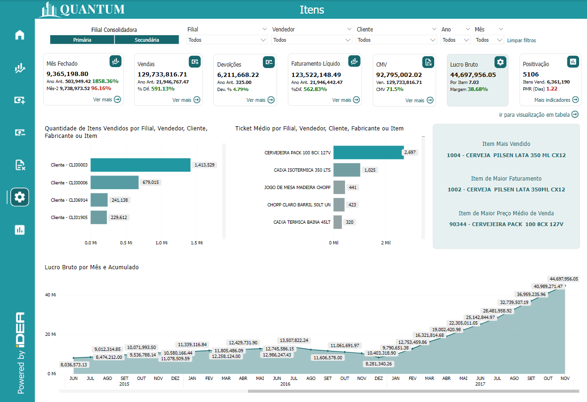
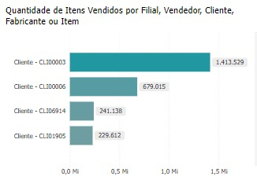
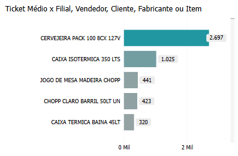
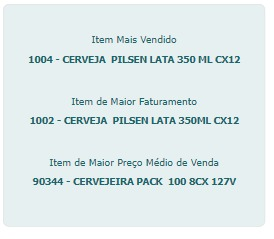
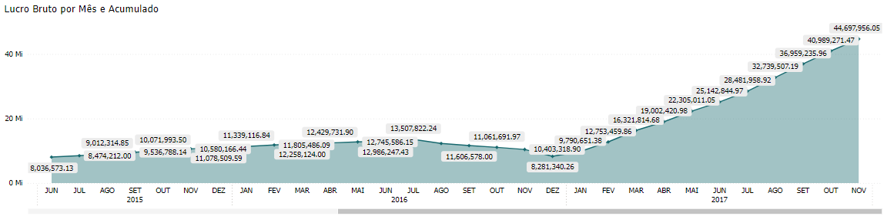
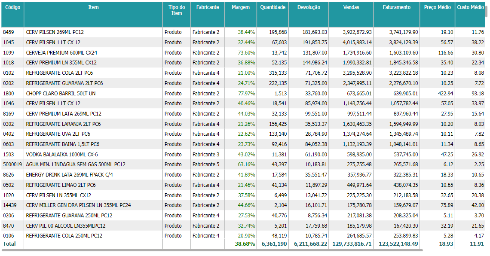

# Painel Itens

<em>Imagem 1: Relatório de Lucro Bruto</em>

O **Lucro Bruto** é uma métrica financeira fundamental que representa a diferença entre a receita líquida de vendas e o custo dos produtos vendidos (CPV). Em outras palavras, o lucro bruto é o valor que sobra das vendas depois que os custos diretos de produção, como materiais e mão de obra, são subtraídos.

No contexto empresarial, o Lucro Bruto é um indicador crucial da eficiência operacional, pois demonstra a capacidade da empresa de gerar lucro a partir de suas operações principais, antes de considerar outras despesas, como administrativas, de vendas e financeiras.

A fórmula para calcular o Lucro Bruto é:

**Lucro Bruto = Receita Líquida de Vendas - Custo dos Produtos Vendidos (CPV)**

## Importância do Lucro Bruto

- **Avaliação da Rentabilidade**: O Lucro Bruto é utilizado para avaliar a rentabilidade das atividades principais da empresa. Um lucro bruto elevado indica que a empresa está conseguindo vender seus produtos ou serviços com uma margem saudável sobre os custos de produção.

- **Margem Bruta**: A margem bruta, expressa em percentual, é derivada do lucro bruto e é calculada dividindo o Lucro Bruto pela Receita Líquida de Vendas. Ela ajuda a entender a proporção de lucro gerada por cada real de venda.

- **Análise de Eficiência Operacional**: Ao monitorar o Lucro Bruto, a empresa pode identificar se os custos de produção estão controlados e se as estratégias de precificação estão adequadas para garantir uma margem de lucro satisfatória.

O Lucro Bruto é, portanto, uma métrica essencial para entender a saúde financeira e a eficiência operacional de uma empresa. Ele serve como base para a análise de outras métricas financeiras e para a tomada de decisões estratégicas voltadas à maximização do lucro.

## Gráfico "Quantidade de Itens Vendidos por Filial, Vendedor, Cliente, Fabricante ou Item"

<em>Imagem 2: Gráfico de Quantidade de Itens Vendidos por Filial, Vendedor, Cliente, Fabricante ou Item</em>

Este gráfico apresenta a quantidade de itens vendidos, segmentada por Cliente, Vendedor, Filial, Fabricante ou Item. Cada barra do gráfico representa uma entidade específica (neste caso, Clientes), mostrando o número total de itens vendidos para cada uma.

### Interpretação do Gráfico

- **Cliente**: Cada barra corresponde a um Cliente da empresa. O gráfico mostra quantos itens foram vendidos para cada um, permitindo uma comparação direta entre os clientes.

- **Quantidade Vendida**: O comprimento de cada barra indica a quantidade total de itens vendidos para o respectivo Cliente. Valores maiores resultam em barras mais longas, destacando os clientes que mais compraram.

### Como Usar Este Gráfico

- **Identificação de Clientes de Alto Desempenho**: As barras mais longas indicam os clientes que mais contribuem para o volume de vendas. Isso pode ajudar a identificar os principais clientes e direcionar esforços para manter e expandir esses relacionamentos.

- **Análise Comparativa**: Compare o volume de vendas entre diferentes clientes para entender quais são os mais importantes para a empresa em termos de quantidade de itens vendidos.

- **Gestão de Relacionamentos**: Utilize as informações deste gráfico para focar em estratégias de vendas e marketing que possam melhorar o desempenho dos clientes com menor volume de compras, ou para fortalecer os relacionamentos com os principais compradores.

Este gráfico fornece uma visão clara e comparativa do volume de vendas entre diferentes clientes, ajudando a identificar os que mais contribuem para o sucesso comercial da empresa e aqueles que podem precisar de mais atenção ou suporte.

## Gráfico "Ticket Médio por Filial, Vendedor, Cliente, Fabricante ou Item"

<em>Imagem 3: Gráfico de Ticket Médio por Filial, Vendedor, Cliente, Fabricante ou Item</em>

Este gráfico apresenta o Ticket Médio, segmentado por Item, Filial, Vendedor, Cliente ou Fabricante. O Ticket Médio representa o valor médio das transações de venda para cada entidade, fornecendo uma visão sobre quais itens ou clientes geram transações de maior valor.

### Interpretação do Gráfico

- **Item**: Cada barra corresponde a um item específico vendido pela empresa. O gráfico mostra o valor médio por transação (Ticket Médio) para cada um desses itens.

- **Ticket Médio**: O comprimento de cada barra indica o valor médio das vendas associadas a cada item. Itens com valores mais altos geram um ticket médio maior, indicando transações de maior valor por venda.

### Como Usar Este Gráfico

- **Identificação de Itens de Alto Valor**: As barras mais longas indicam os itens que geram transações de maior valor. Isso pode ajudar a identificar quais produtos contribuem mais para a receita em termos de ticket médio.

- **Análise Comparativa**: Compare o ticket médio entre diferentes itens para entender quais produtos são mais lucrativos em termos de valor médio por transação.

- **Otimização de Vendas**: Utilize as informações deste gráfico para focar em estratégias de venda que promovam itens de alto ticket médio, ou para identificar oportunidades de aumentar o ticket médio de itens com menor valor.

Este gráfico fornece uma visão clara e comparativa do valor médio por transação para diferentes itens, ajudando a identificar produtos que contribuem significativamente para o faturamento e permitindo o desenvolvimento de estratégias para otimizar as vendas.

## Painel de Itens Destacados

<em>Imagem 4: Painel de Itens Mais Vendidos, de Maior Faturamento e de Maior Preço Médio de Venda</em>

Este painel apresenta informações sobre os itens mais importantes em três categorias: o Item Mais Vendido, o Item de Maior Faturamento e o Item de Maior Preço Médio de Venda. Essas métricas ajudam a identificar os produtos que têm maior impacto nas operações de venda da empresa.

## Como Usar Este Painel

- **Análise de Popularidade e Receita**: Este painel fornece uma visão rápida sobre quais produtos são mais populares e quais são mais lucrativos. Isso pode ajudar na definição de estratégias de marketing e vendas para maximizar tanto o volume de vendas quanto o faturamento.

- **Foco em Itens de Alto Valor**: Identificar o Item de Maior Preço Médio de Venda é útil para concentrar esforços de vendas e marketing em produtos que têm um impacto maior no ticket médio, ajudando a aumentar a rentabilidade por transação.

- **Decisões de Estoque e Suprimentos**: O Item Mais Vendido e o Item de Maior Faturamento são indicadores chave para decisões de estoque e suprimentos, garantindo que esses produtos estejam sempre disponíveis para atender à demanda.

Este painel oferece uma visão consolidada dos itens mais importantes para a empresa em termos de volume de vendas, faturamento e preço médio, facilitando a tomada de decisões estratégicas para otimizar o desempenho comercial.

<em>Imagem 5: Acumulado</em>

<em>Imagem 6: Tabela Detalhamento</em>

  
***Aviso Legal:** Os números e informações apresentados nesta documentação são baseados em um conjunto de dados fictício. Eles são destinados exclusivamente para fins educacionais e de demonstração. Os dados não refletem condições do mundo real ou métricas de negócios reais e não devem ser usados ​​para tomada de decisão ou análise. Qualquer semelhança com entidades, eventos ou dados reais é mera coincidência.*
