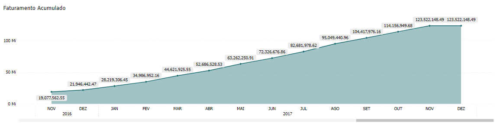
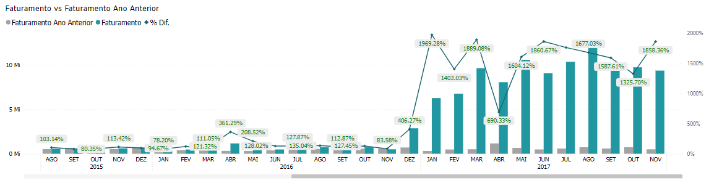

# Painel de Faturamento - Home

<h6 align="center">Imagem 1: Painel de Faturamento - Home</h6>

Um relatório de BI (Business Intelligence) abrangente e focado em Faturamento é essencial para oferecer uma visão clara e detalhada do desempenho comercial de uma empresa.

Esse tipo de relatório permite uma análise profunda das vendas, incluindo a gestão de receitas, comparação de produtos e serviços vendidos, e avaliação do desempenho de vendas ao longo do tempo.

Através de visualizações precisas e detalhadas, é possível identificar tendências de mercado, monitorar variações nas vendas e tomar decisões informadas para otimizar a estratégia comercial e maximizar a receita da empresa.

Na página de Home, você encontrará:

<h6 align="center">Imagem 2: Gráfico "Faturamento Acumulado ao Longo do Tempo"</h6>

Este gráfico de área exibe a evolução do saldo em tesouraria da empresa ao longo do tempo, mostrando tanto os valores positivos quanto os negativos. A linha de base do gráfico representa um saldo de zero, com áreas acima da linha 
indicativas de saldos positivos e áreas abaixo indicativas de saldos negativos.
 
**Onde:**

### Eixo X (Horizontal):
- O eixo X representa o tempo, dividido em períodos regulares, como meses, trimestres ou anos, dependendo do intervalo de dados disponível. Este eixo mostra a progressão do faturamento da empresa ao longo do tempo, permitindo uma análise detalhada das tendências de receita.

### Eixo Y (Vertical):
- O eixo Y representa o valor do faturamento acumulado, refletindo o desempenho financeiro da empresa. Valores positivos indicam crescimento nas receitas.

### Área do Gráfico:
- **Valores Positivos:** São representados por uma área preenchida acima da linha de base, geralmente em uma cor neutra ou verde. Isso indica que a empresa está gerando receitas, acumulando um saldo positivo ao longo do tempo, o que é um sinal de desempenho financeiro saudável.

<h6 align="center">Imagem 2: Gráfico "Faturamento Acumulado ao Longo do Tempo"</h6>

Este gráfico de área mostra a evolução do saldo em tesouraria da empresa ao longo do tempo, comparando os saldos do Ano Atual com os do Ano Anterior. O gráfico utiliza diferentes áreas para representar cada ano, com uma linha de base que indica um saldo de zero. A sobreposição das áreas permite uma fácil visualização das diferenças entre os saldos do Ano Atual e do Ano Anterior, destacando períodos em que o desempenho financeiro melhorou ou piorou em relação ao ano anterior.

**Onde:**

### Eixo X (Horizontal):
- O eixo X deste gráfico representa o tempo, dividido em meses, indo de janeiro de 2014 até fevereiro de 2016. Isso permite uma análise detalhada da evolução do faturamento da empresa ao longo desses dois anos e dois meses. Cada mês é claramente demarcado, permitindo identificar as tendências mensais no desempenho financeiro.

### Eixo Y (Vertical):
- O eixo Y deste gráfico representa dois tipos de dados: à esquerda, o faturamento em milhões (Mi) de unidades monetárias, e à direita, a porcentagem de diferença (% Dif.) entre o faturamento do Ano Atual e do Ano Anterior. O eixo esquerdo mostra o valor absoluto do faturamento, enquanto o eixo direito fornece uma visão relativa de como o faturamento de cada mês se compara ao mesmo mês do ano anterior.

### Área do Gráfico:
- **Valores Positivos:** São representados pelas barras e pelos pontos com linhas que mostram o faturamento para cada mês tanto no Ano Atual quanto no Ano Anterior. As barras azuis-claro representam o faturamento do Ano Anterior, enquanto as barras azuis-escuras mostram o faturamento do Ano Atual. Acima de cada barra, há um valor percentual que indica a diferença relativa em comparação ao ano anterior. Por exemplo, em janeiro de 2015, o faturamento foi menor que o do ano anterior, indicado por um percentual abaixo de 100%, enquanto em fevereiro de 2016, o percentual foi superior a 100%, indicando um crescimento em relação ao mesmo mês do ano anterior.
  
- **Percentual de Diferença:** A linha que acompanha o gráfico, marcada com os valores percentuais ao longo do tempo, destaca os meses onde o faturamento do Ano Atual foi superior (valores acima de 100%) ou inferior (valores abaixo de 100%) em relação ao Ano Anterior. Esta linha fornece uma visão clara de quando a empresa experimentou crescimento ou declínio em sua receita ao longo do período analisado.
