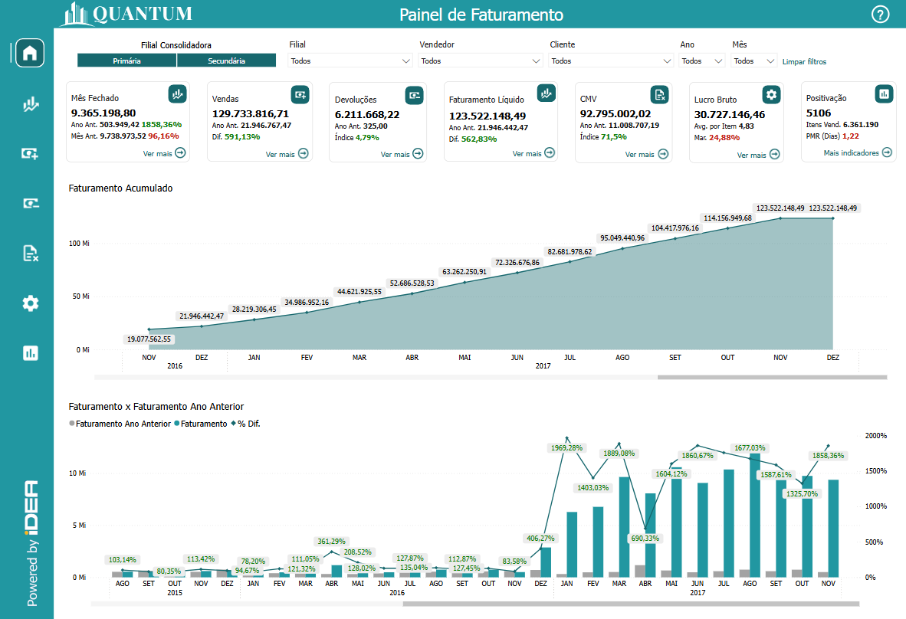

# Painel de Faturamento

  
  <h6>Imagem 1: Painel de Faturamento</h6>

## Informações no Painel de Faturamento

O relatório de faturamento fornece uma visão geral abrangente da receita da sua empresa, rastreando o movimento de entrada de dinheiro gerado pelas vendas de produtos ou serviços. Este relatório é vital para entender o desempenho financeiro da sua organização, garantindo que as metas de receita sejam cumpridas e que as oportunidades de crescimento sejam capitalizadas. Ao analisar o faturamento, você pode identificar tendências de vendas, avaliar o impacto de suas estratégias comerciais e planejar o crescimento futuro de forma mais eficaz.

Este painel fornece uma visão geral do desempenho do faturamento do negócio, exibindo o valor da receita mês a mês e detalhando as principais fontes de receita. É crucial monitorar o crescimento do faturamento, pois isso indica o sucesso das estratégias de vendas e marketing. Ao incorporar previsões de faturamento para os meses futuros, você obtém insights sobre riscos e oportunidades que podem impactar os planos financeiros. Entender o comportamento do faturamento por meio de análises detalhadas de receitas é benéfico para identificar padrões e áreas onde ajustes estratégicos podem ser necessários. Essa abordagem torna mais fácil identificar oportunidades para aumentar o faturamento, garantindo que o negócio continue a crescer de forma sustentável.

## Visão Principal

### Faturamento Acumulado

  
  <h6>Imagem 2: Faturamento Acumulado</h6>

Um gráfico de área mostrando o valor realizado do faturamento acumulado ao longo do tempo até o mês atual.

Este gráfico oferece uma visão clara do desempenho de faturamento da sua empresa ao longo do tempo, exibindo as receitas acumuladas mês a mês até o presente. Ele permite que você visualize como suas estratégias comerciais e de vendas impactaram a geração de receita ao longo do período analisado.

O acompanhamento do faturamento acumulado é essencial para monitorar o progresso em direção às suas metas financeiras. Ele ajuda a identificar padrões de crescimento, sazonalidade nas vendas e áreas onde ajustes podem ser necessários para melhorar o desempenho de faturamento. Ao entender como o faturamento evolui ao longo do tempo, você pode tomar decisões mais informadas para garantir que seu negócio continue a crescer de maneira consistente e sustentável.

### Faturamento x Faturamento Ano Anterior

  
  <h6>Imagem 3: Faturamento x Faturamento Ano Anterior</h6>

Este gráfico de barras compara o faturamento atual com o do ano anterior, exibindo os valores lado a lado. Uma linha sobreposta indica a diferença percentual entre os dois períodos, com os marcadores de texto mudando para verde quando a diferença é positiva e para vermelho quando negativa.

As barras fornecem uma visualização clara dos valores absolutos de cada período, enquanto a linha percentual facilita a análise do desempenho relativo. Quando a linha está em verde, isso indica crescimento, sinalizando que o faturamento atual supera o do ano anterior. Quando está em vermelho, representa uma retração, sugerindo uma queda na receita em relação ao período anterior.

Esse tipo de visualização é fundamental para identificar tendências de crescimento ou declínio, permitindo ajustes nas estratégias de vendas ou marketing. Ele oferece uma visão estratégica, facilitando decisões informadas para melhorar o desempenho financeiro e garantir o progresso em direção às metas de faturamento.

  
***Aviso Legal:** Os números e informações apresentados nesta documentação são baseados em um conjunto de dados fictício. Eles são destinados exclusivamente para fins educacionais e de demonstração. Os dados não refletem condições do mundo real ou métricas de negócios reais e não devem ser usados ​​para tomada de decisão ou análise. Qualquer semelhança com entidades, eventos ou dados reais é mera coincidência.*
