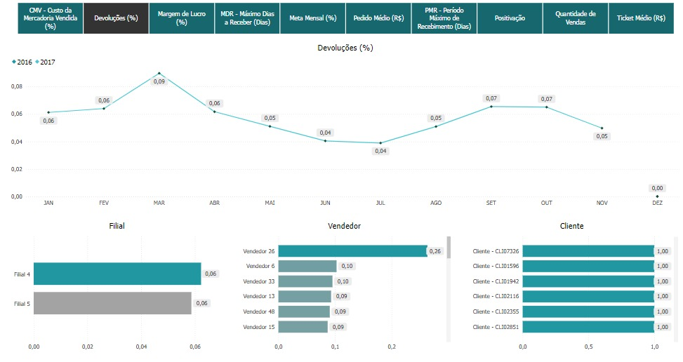
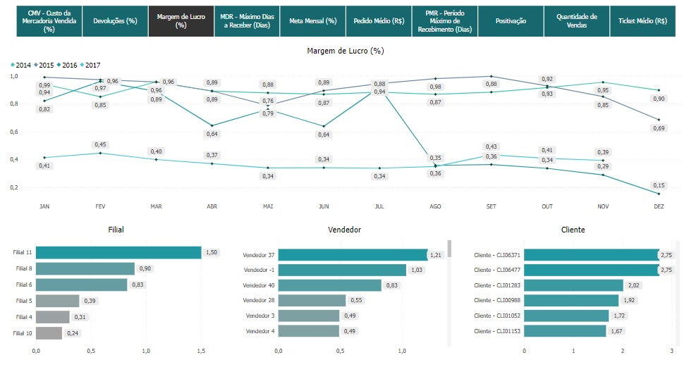
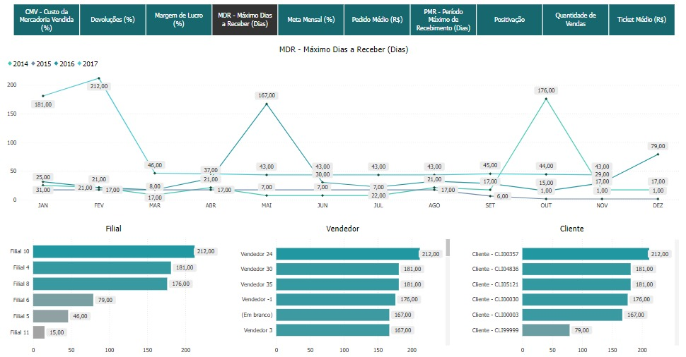
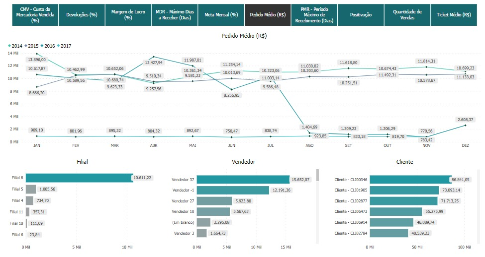
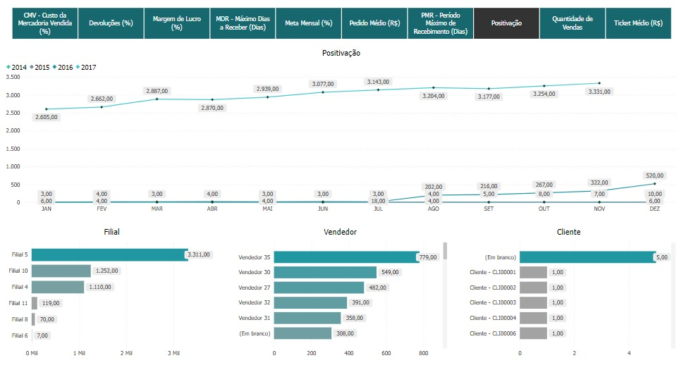
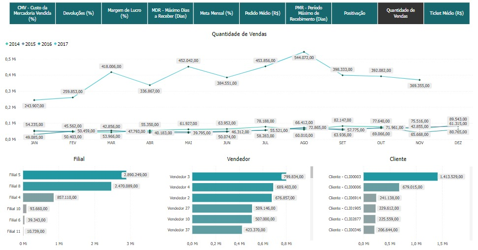
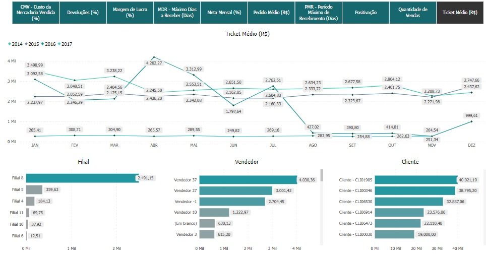

# Positivação

O **Indicador de Positivação** é uma métrica fundamental no contexto de vendas e faturamento, utilizada para medir a eficácia das operações comerciais de uma empresa. Especificamente, positivação refere-se ao percentual de clientes ativos que realizaram pelo menos uma compra dentro de um período determinado. Este indicador é crucial para entender o nível de engajamento e a atividade de compra dos clientes, oferecendo insights valiosos sobre a saúde comercial da empresa.

## Importância da Positivação

- **Avaliação do Engajamento de Clientes**: O indicador de positivação permite que a empresa avalie quantos dos seus clientes ativos estão efetivamente realizando compras. Um alto índice de positivação sugere que a maioria dos clientes está engajada e contribuindo para as receitas da empresa.
  
- **Relação com o Faturamento**: A positivação está diretamente relacionada ao faturamento da empresa. Quanto maior o número de clientes positivados, maior é o potencial de faturamento. Isso faz da positivação uma métrica crucial para o planejamento e a execução de estratégias comerciais.

- **Identificação de Oportunidades de Crescimento**: Ao monitorar a positivação, a empresa pode identificar oportunidades para melhorar a ativação de clientes inativos, aumentando assim o volume de vendas e otimizando os resultados financeiros.

## Aplicação da Positivação

A positivação pode ser aplicada de diversas maneiras para otimizar as operações comerciais:

- **Segmentação de Clientes**: Analisar a positivação por diferentes segmentos de clientes pode ajudar a identificar quais grupos estão mais ou menos ativos. Isso pode informar campanhas de marketing direcionadas para reativar clientes inativos ou fidelizar os ativos.

- **Monitoramento Contínuo**: Acompanhar a positivação ao longo do tempo é essencial para identificar tendências e responder rapidamente a mudanças no comportamento dos clientes.

- **Estratégias de Retenção**: A positivação pode servir como um indicador precoce de problemas na retenção de clientes. Uma queda na positivação pode sinalizar a necessidade de revisar estratégias de atendimento, marketing ou vendas.

A positivação é, portanto, um indicador essencial que, quando monitorado de perto, pode ajudar a garantir a sustentabilidade e o crescimento das receitas da empresa, ao mesmo tempo em que fortalece o relacionamento com os clientes.

## Gráfico "CMV - Custo da Mercadoria Vendida (%)"

<em>Imagem 1: Gráfico de Custo da Mercadoria Vendida (%) ao longo do tempo</em>

Este gráfico apresenta a evolução do **Custo da Mercadoria Vendida (CMV)** ao longo do tempo, expresso em percentual (%). O CMV representa o custo direto associado à produção das mercadorias vendidas pela empresa durante um período específico. Este gráfico permite uma análise detalhada de como o CMV varia ao longo dos meses e anos, ajudando a empresa a monitorar a eficiência operacional e a rentabilidade das suas operações.

### Interpretação do Gráfico

- **Linhas Representativas por Ano**: O gráfico exibe múltiplas linhas, cada uma representando o CMV percentual para um determinado ano (2014, 2015, 2016 e 2017). Isso permite a comparação direta do desempenho ao longo de diferentes períodos.

- **Custo da Mercadoria Vendida (%)**: Cada ponto nas linhas representa o CMV percentual para um mês específico. O CMV é calculado como a relação entre o custo das mercadorias vendidas e a receita gerada por essas vendas, expresso como uma porcentagem.

### Como Usar Este Gráfico

- **Monitoramento da Eficiência Operacional**: Utilize este gráfico para monitorar como os custos diretos de produção estão evoluindo ao longo do tempo. A redução do CMV percentual ao longo dos anos pode indicar melhorias na eficiência operacional ou nas negociações com fornecedores.

- **Identificação de Problemas de Custo**: Os meses com picos de CMV devem ser analisados para identificar se houve problemas específicos na produção ou aumentos temporários nos custos que precisam ser endereçados.

- **Planejamento Estratégico**: Compreender as tendências do CMV ao longo dos anos pode ajudar na elaboração de estratégias para melhorar a rentabilidade, como ajustes nos processos de produção, renegociação de contratos com fornecedores ou revisão das estratégias de precificação.

Este gráfico oferece uma visão detalhada do custo das mercadorias vendidas ao longo do tempo, ajudando a empresa a entender melhor a sua estrutura de custos e a identificar oportunidades para melhorar a margem de lucro.

## Gráfico "Devoluções (%)"

<em>Imagem 1: Gráfico de Devoluções (%) ao longo do tempo</em>

Este gráfico apresenta a evolução das **Devoluções** como percentual do total de vendas ao longo do tempo. As devoluções representam os produtos que foram vendidos e, por algum motivo, retornaram ao estoque da empresa, resultando em uma reversão parcial ou total da venda realizada. Monitorar o percentual de devoluções é crucial para avaliar a qualidade dos produtos, a satisfação do cliente e a eficiência do processo de vendas.

### Interpretação do Gráfico

- **Linhas Representativas por Ano**: O gráfico exibe uma linha representando o percentual de devoluções para os anos de 2016 e 2017. Isso permite uma comparação direta entre os anos e ajuda a entender a tendência das devoluções ao longo do tempo.

- **Percentual de Devoluções (%)**: Cada ponto na linha indica o percentual de devoluções em um mês específico, em relação ao total de vendas realizadas naquele mês.

### Como Usar Este Gráfico

- **Monitoramento da Qualidade**: Utilize este gráfico para monitorar a qualidade dos produtos e a satisfação do cliente. Um percentual elevado de devoluções pode indicar problemas de qualidade, necessidade de melhorias no atendimento ao cliente ou problemas logísticos.

- **Identificação de Problemas Recorretes**: Meses com picos no percentual de devoluções devem ser investigados para entender as causas subjacentes, como defeitos no produto, embalagens inadequadas, ou expectativas mal geridas.

- **Melhoria Contínua**: Analisar as devoluções ao longo do tempo permite à empresa identificar tendências e implementar processos de melhoria contínua, seja no controle de qualidade, no processo de vendas, ou no atendimento ao cliente.

Este gráfico oferece uma visão clara do comportamento das devoluções ao longo do tempo, permitindo à empresa identificar problemas e implementar melhorias para reduzir a taxa de devoluções e, consequentemente, melhorar a rentabilidade e a satisfação do cliente.

## Gráfico "Margem de Lucro (%)"

<em>Imagem 1: Gráfico de Margem de Lucro (%) ao longo do tempo</em>

Este gráfico apresenta a evolução da **Margem de Lucro (%)** ao longo do tempo, comparando diferentes anos (2014, 2015, 2016 e 2017). A margem de lucro é um dos indicadores mais importantes para qualquer empresa, pois mede a eficiência com que uma empresa está gerando lucro a partir de suas vendas. Especificamente, a margem de lucro percentual mostra a proporção de receita que se transforma em lucro, após a dedução de todos os custos e despesas.

### Interpretação do Gráfico

- **Linhas Representativas por Ano**: O gráfico apresenta múltiplas linhas, cada uma representando a margem de lucro percentual para um ano específico. Isso permite a comparação direta da margem de lucro ao longo dos anos e a identificação de tendências de desempenho financeiro.

- **Margem de Lucro (%)**: Cada ponto na linha representa a margem de lucro percentual em um mês específico. A margem de lucro é calculada dividindo-se o lucro operacional pela receita total, e multiplicando-se o resultado por 100 para obter um percentual.

### Como Usar Este Gráfico

- **Monitoramento de Eficiência**: Utilize este gráfico para monitorar a eficiência da empresa em gerar lucro ao longo do tempo. Uma margem de lucro crescente é indicativa de melhor controle de custos e maior eficiência operacional.

- **Análise de Tendências**: Analisar as tendências de margem de lucro ao longo de vários anos pode ajudar a identificar padrões e prever o desempenho futuro. Isso é especialmente útil para o planejamento estratégico e para ajustes nas políticas de preços e custos.

- **Identificação de Oportunidades de Melhoria**: Meses ou anos com margens de lucro mais baixas podem indicar áreas onde há necessidade de melhorias operacionais ou de reavaliação das estratégias de venda e precificação.

Este gráfico oferece uma visão abrangente da margem de lucro da empresa ao longo do tempo, permitindo uma análise detalhada da eficiência operacional e da saúde financeira do negócio.

# Gráfico "MDR - Máximo Dias a Receber (Dias)"

<em>Imagem 1: Gráfico de Máximo Dias a Receber (Dias) ao longo do tempo</em>

Este gráfico apresenta a evolução do **Máximo Dias a Receber (MDR)** ao longo do tempo, comparando diferentes anos (2014, 2015, 2016 e 2017). O MDR indica o maior número de dias que a empresa levou para receber pagamentos de suas vendas a prazo em um determinado período. Este indicador é crucial para a gestão do fluxo de caixa, pois períodos longos de recebimento podem impactar negativamente a liquidez da empresa.

## Interpretação do Gráfico

- **Linhas Representativas por Ano**: O gráfico apresenta múltiplas linhas, cada uma representando o MDR para um ano específico. Isso permite a comparação direta do desempenho ao longo dos anos e a identificação de tendências no recebimento de pagamentos.

- **Máximo Dias a Receber (Dias)**: Cada ponto na linha representa o maior número de dias registrado para o recebimento de uma venda em um mês específico.

## Análise dos Dados

- **Tendências ao Longo do Tempo**: As linhas permitem observar como o MDR varia ao longo dos meses. Picos significativos em determinados meses podem indicar problemas pontuais de recebimento que merecem atenção.

- **Comparação Anual**: Ao comparar as linhas de diferentes anos, é possível identificar se a empresa está conseguindo reduzir o tempo máximo de recebimento, o que indicaria uma melhora na eficiência das cobranças ou nas condições de pagamento negociadas com os clientes.

- **Meses de Alto MDR**: Picos no gráfico indicam meses onde o tempo máximo para receber pagamentos foi elevado. Esses meses devem ser analisados para identificar as causas e implementar ações corretivas, como melhorias no processo de cobrança ou renegociação de termos de crédito.

## Como Usar Este Gráfico

- **Monitoramento da Liquidez**: Utilize este gráfico para monitorar a eficiência da empresa em receber pagamentos dentro de prazos razoáveis. Reduzir o MDR é essencial para melhorar a liquidez e garantir que a empresa tenha os recursos necessários para operar.

- **Análise de Risco de Crédito**: O MDR pode servir como um indicador de risco de crédito, especialmente se houver um aumento consistente no tempo máximo de recebimento. Isso pode indicar que os clientes estão enfrentando dificuldades financeiras ou que as condições de pagamento precisam ser revisadas.

- **Identificação de Oportunidades de Melhoria**: Meses ou anos com MDR elevados podem indicar a necessidade de melhorias nos processos de cobrança ou na seleção de clientes para vendas a prazo.

Este gráfico oferece uma visão clara do tempo máximo que a empresa leva para receber seus pagamentos ao longo do tempo, permitindo uma análise detalhada da gestão do fluxo de caixa e das práticas de crédito.

## Gráfico "MDR - Máximo Dias a Receber (Dias)"

<em>Imagem 1: Gráfico de Máximo Dias a Receber (Dias) ao longo do tempo</em>

Este gráfico apresenta a evolução do **Máximo Dias a Receber (MDR)** ao longo do tempo, comparando diferentes anos (2014, 2015, 2016 e 2017). O MDR indica o maior número de dias que a empresa levou para receber pagamentos de suas vendas a prazo em um determinado período. Este indicador é crucial para a gestão do fluxo de caixa, pois períodos longos de recebimento podem impactar negativamente a liquidez da empresa.

### Interpretação do Gráfico

- **Linhas Representativas por Ano**: O gráfico apresenta múltiplas linhas, cada uma representando o MDR para um ano específico. Isso permite a comparação direta do desempenho ao longo dos anos e a identificação de tendências no recebimento de pagamentos.

- **Máximo Dias a Receber (Dias)**: Cada ponto na linha representa o maior número de dias registrado para o recebimento de uma venda em um mês específico.

### Como Usar Este Gráfico

- **Monitoramento da Liquidez**: Utilize este gráfico para monitorar a eficiência da empresa em receber pagamentos dentro de prazos razoáveis. Reduzir o MDR é essencial para melhorar a liquidez e garantir que a empresa tenha os recursos necessários para operar.

- **Análise de Risco de Crédito**: O MDR pode servir como um indicador de risco de crédito, especialmente se houver um aumento consistente no tempo máximo de recebimento. Isso pode indicar que os clientes estão enfrentando dificuldades financeiras ou que as condições de pagamento precisam ser revisadas.

- **Identificação de Oportunidades de Melhoria**: Meses ou anos com MDR elevados podem indicar a necessidade de melhorias nos processos de cobrança ou na seleção de clientes para vendas a prazo.

Este gráfico oferece uma visão clara do tempo máximo que a empresa leva para receber seus pagamentos ao longo do tempo, permitindo uma análise detalhada da gestão do fluxo de caixa e das práticas de crédito.

## Gráfico "Meta Mensal (%)"

<em>Imagem 1: Gráfico de Meta Mensal (%) ao longo do tempo</em>

Este gráfico apresenta a evolução do desempenho da empresa em relação à **Meta Mensal** estabelecida, expressa em percentual (%), ao longo do tempo. A meta mensal geralmente refere-se a um objetivo específico de vendas, faturamento, ou outro indicador-chave de desempenho (KPI) que a empresa almeja atingir em cada mês. O gráfico permite acompanhar o quão perto ou distante a empresa está de atingir suas metas mensais ao longo dos anos.

### Interpretação do Gráfico

- **Linhas Representativas por Ano**: O gráfico exibe múltiplas linhas, cada uma representando a meta mensal alcançada como percentual para um ano específico (2014, 2015, 2016 e 2017). Isso facilita a comparação entre os anos e a avaliação de tendências no desempenho ao longo do tempo.

- **Meta Mensal (%)**: Cada ponto na linha representa o percentual da meta mensal que foi atingido em um determinado mês. Um valor acima de 100% indica que a meta foi superada, enquanto valores abaixo de 100% indicam que a meta não foi alcançada.

### Como Usar Este Gráfico

- **Monitoramento de Desempenho**: Utilize este gráfico para monitorar o desempenho da empresa em relação às metas estabelecidas. Isso permite uma avaliação contínua das estratégias adotadas e a identificação de áreas que precisam de ajuste.

- **Ajuste de Metas**: Se certos meses consistentemente não atingem a meta, isso pode indicar que as metas estão desajustadas em relação às condições reais do mercado. Revisar e ajustar essas metas pode melhorar a motivação da equipe e o alinhamento estratégico.

- **Planejamento Estratégico**: A análise das metas ao longo do tempo ajuda a empresa a planejar melhor suas atividades futuras, focando em períodos que historicamente mostram desempenho abaixo do esperado e capitalizando nos períodos de alta performance.

Este gráfico oferece uma visão clara do quanto a empresa tem conseguido cumprir suas metas mensais ao longo do tempo, permitindo uma análise detalhada do desempenho e da eficácia das estratégias adotadas.

## Gráfico "Pedido Médio (R$)"

<em>Imagem 1: Gráfico de Pedido Médio (R$) ao longo do tempo</em>

Este gráfico apresenta a evolução do **Pedido Médio (R$)** ao longo do tempo, comparando diferentes anos (2014, 2015, 2016 e 2017). O pedido médio representa o valor médio em reais das vendas realizadas em cada pedido ao longo do tempo. Este indicador é importante para entender o comportamento de compra dos clientes e avaliar a eficácia das estratégias de venda e precificação.

### Interpretação do Gráfico

- **Linhas Representativas por Ano**: O gráfico exibe múltiplas linhas, cada uma representando o valor médio dos pedidos para um ano específico. Isso permite a comparação direta do desempenho ao longo dos anos e a identificação de tendências no valor dos pedidos.

- **Pedido Médio (R$)**: Cada ponto na linha representa o valor médio dos pedidos realizados em um determinado mês.

### Como Usar Este Gráfico

- **Monitoramento de Comportamento de Compra**: Utilize este gráfico para monitorar como o valor médio dos pedidos evolui ao longo do tempo. Um aumento constante no pedido médio pode indicar sucesso em estratégias de upselling ou melhorias na oferta de produtos.

- **Ajuste de Estratégias de Venda**: Se certos meses consistentemente mostram um pedido médio mais baixo, isso pode indicar a necessidade de ajustar as estratégias de vendas ou realizar campanhas promocionais focadas em aumentar o valor do ticket médio.

- **Planejamento de Ofertas**: A análise do pedido médio ao longo do tempo ajuda a empresa a planejar melhor suas ofertas e promoções, maximizando o valor dos pedidos durante períodos de alta demanda.

Este gráfico oferece uma visão clara do valor médio dos pedidos realizados ao longo do tempo, permitindo uma análise detalhada do comportamento de compra dos clientes e da eficácia das estratégias de vendas.

## Gráfico "PMR - Período Máximo de Recebimento (Dias)"

<em>Imagem 1: Gráfico de Período Máximo de Recebimento (Dias) ao longo do tempo</em>

Este gráfico apresenta a evolução do **Período Máximo de Recebimento (PMR)** ao longo do tempo, comparando diferentes anos (2014, 2015, 2016 e 2017). O PMR é uma métrica que indica o tempo máximo, em dias, que a empresa levou para receber pagamentos de suas vendas a prazo em um determinado período. Este indicador é crucial para a gestão do fluxo de caixa e para avaliar a eficiência do processo de recebimento.

### Interpretação do Gráfico

- **Linhas Representativas por Ano**: O gráfico exibe múltiplas linhas, cada uma representando o PMR para um ano específico. Isso permite a comparação direta do desempenho ao longo dos anos e a identificação de tendências no período de recebimento.

- **PMR (Dias)**: Cada ponto na linha representa o número máximo de dias que a empresa levou para receber pagamentos em um determinado mês. Valores elevados podem indicar atrasos significativos nos recebimentos, afetando o fluxo de caixa.

### Como Usar Este Gráfico

- **Monitoramento da Eficiência de Recebimento**: Utilize este gráfico para monitorar a eficiência da empresa em receber pagamentos dentro de prazos razoáveis. Reduzir o PMR é essencial para melhorar a liquidez e garantir que a empresa tenha os recursos necessários para operar.

- **Identificação de Problemas de Cobrança**: Picos no PMR podem indicar problemas nos processos de cobrança ou nas condições de pagamento oferecidas aos clientes. Identificar e corrigir esses problemas pode ajudar a melhorar a eficiência do recebimento.

- **Ajuste de Políticas de Crédito**: Se certos meses ou anos consistentemente mostram um PMR elevado, pode ser necessário revisar as políticas de crédito da empresa ou implementar medidas para garantir que os clientes cumpram os prazos de pagamento.

Este gráfico oferece uma visão clara do tempo máximo que a empresa leva para receber seus pagamentos ao longo do tempo, permitindo uma análise detalhada da gestão do fluxo de caixa e das práticas de crédito da empresa.

## Gráfico "Positivação"

<em>Imagem 1: Gráfico de Positivação ao longo do tempo</em>

O gráfico de **Positivação** apresenta a evolução da quantidade de clientes ou pedidos que foram considerados "positivados" ao longo do tempo, comparando diferentes anos (2014, 2015, 2016 e 2017). Positivação, no contexto de vendas e faturamento, refere-se à proporção de clientes que realizaram ao menos uma compra em um determinado período, ou ao número de pedidos que atingiram um valor mínimo estabelecido pela empresa. Este indicador é importante para avaliar a eficácia das campanhas de vendas e a fidelização dos clientes.

### Interpretação do Gráfico

- **Linhas Representativas por Ano**: O gráfico exibe múltiplas linhas, cada uma representando a positivação para um ano específico. Isso permite a comparação direta do desempenho ao longo dos anos e a identificação de tendências de positivação.

- **Positivação**: Cada ponto na linha representa o número de clientes ou pedidos positivados em um determinado mês. Valores elevados indicam sucesso em engajar clientes ou realizar vendas que atingem os critérios estabelecidos pela empresa.

## Como Usar Este Gráfico

- **Monitoramento de Engajamento de Clientes**: Utilize este gráfico para monitorar o engajamento dos clientes ao longo do tempo. Aumentar a positivação indica sucesso em campanhas de fidelização e eficácia nas estratégias de vendas.

- **Ajuste de Estratégias de Venda**: Se certos meses consistentemente mostram baixa positivação, isso pode indicar a necessidade de ajustar as campanhas de marketing ou as condições oferecidas aos clientes para aumentar as vendas.

- **Planejamento de Ofertas e Promoções**: A análise da positivação ajuda a empresa a planejar melhor suas ofertas e promoções, visando maximizar a participação dos clientes em diferentes períodos do ano.

Este gráfico oferece uma visão clara da eficácia das estratégias de vendas e fidelização ao longo do tempo, permitindo uma análise detalhada do engajamento dos clientes e da eficiência das campanhas promocionais.

## Gráfico "Quantidade de Vendas"

<em>Imagem 1: Gráfico de Quantidade de Vendas ao longo do tempo</em>

O gráfico de **Quantidade de Vendas** mostra a evolução da quantidade de itens vendidos ao longo do tempo, comparando diferentes anos (2014, 2015, 2016 e 2017). Este indicador é fundamental para avaliar o desempenho das vendas da empresa, permitindo identificar padrões de sazonalidade, avaliar o sucesso de campanhas de marketing e ajustar estratégias de vendas.

### Interpretação do Gráfico

- **Linhas Representativas por Ano**: O gráfico apresenta múltiplas linhas, cada uma representando a quantidade de vendas para um ano específico. Isso permite uma comparação direta do desempenho de vendas ao longo dos anos.

- **Quantidade de Vendas**: Cada ponto na linha representa a quantidade total de itens vendidos em um determinado mês. Um aumento no número de vendas pode indicar sucesso em campanhas promocionais, aumento da demanda ou outras estratégias de marketing eficazes.

### Como Usar Este Gráfico

- **Monitoramento de Desempenho de Vendas**: Utilize este gráfico para monitorar o desempenho das vendas ao longo do tempo. Aumentar a quantidade de vendas é um indicador direto de crescimento e sucesso nas estratégias comerciais.

- **Ajuste de Estratégias de Venda**: Se certos meses consistentemente mostram baixa quantidade de vendas, isso pode indicar a necessidade de ajustar as campanhas de marketing ou as condições oferecidas aos clientes para aumentar as vendas.

- **Planejamento de Ofertas e Promoções**: A análise da quantidade de vendas ajuda a empresa a planejar melhor suas ofertas e promoções, visando maximizar as vendas em diferentes períodos do ano.

Este gráfico oferece uma visão clara da evolução das vendas ao longo do tempo, permitindo uma análise detalhada do desempenho comercial da empresa e ajudando na tomada de decisões estratégicas para aumentar as vendas e melhorar a eficiência das campanhas de marketing.

## Gráfico "Ticket Médio (R$)"

<em>Imagem 1: Gráfico de Ticket Médio ao longo do tempo</em>

O gráfico de **Ticket Médio (R$)** mostra a evolução do valor médio das vendas realizadas ao longo do tempo, comparando diferentes anos (2014, 2015, 2016 e 2017). O ticket médio é um indicador importante que reflete o valor médio gasto por cliente em cada transação. Esse gráfico ajuda a entender o comportamento de compra dos clientes e a eficácia das estratégias de venda.

### Interpretação do Gráfico

- **Linhas Representativas por Ano**: O gráfico apresenta múltiplas linhas, cada uma representando o ticket médio para um ano específico. Isso permite uma comparação direta do comportamento de compra dos clientes ao longo dos anos.

- **Ticket Médio**: Cada ponto na linha representa o valor médio das vendas realizadas em um determinado mês. Um aumento no ticket médio pode indicar sucesso em estratégias de upselling ou vendas de produtos de maior valor.

### Como Usar Este Gráfico

- **Monitoramento de Estratégias de Vendas**: Utilize este gráfico para monitorar o impacto de estratégias como upselling, cross-selling e promoções de produtos de maior valor no ticket médio.

- **Ajuste de Campanhas de Marketing**: Se certos meses consistentemente mostram um ticket médio baixo, isso pode indicar a necessidade de ajustar as campanhas de marketing para promover produtos de maior valor ou oferecer incentivos para aumentar o gasto médio por transação.

- **Planejamento de Vendas**: A análise do ticket médio ajuda a empresa a planejar melhor suas vendas e promoções, visando maximizar o valor médio das transações ao longo do ano.

Este gráfico oferece uma visão clara do valor médio das vendas ao longo do tempo, permitindo uma análise detalhada do comportamento de compra dos clientes e ajudando na tomada de decisões estratégicas para aumentar o ticket médio e melhorar a eficiência das campanhas de marketing e vendas.

