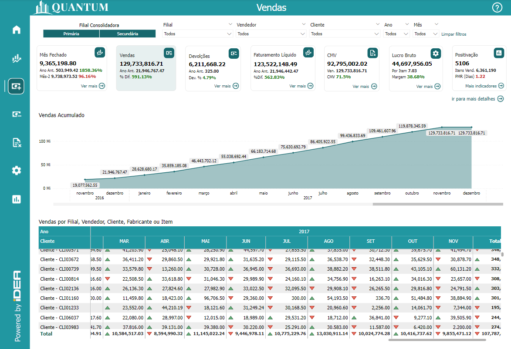
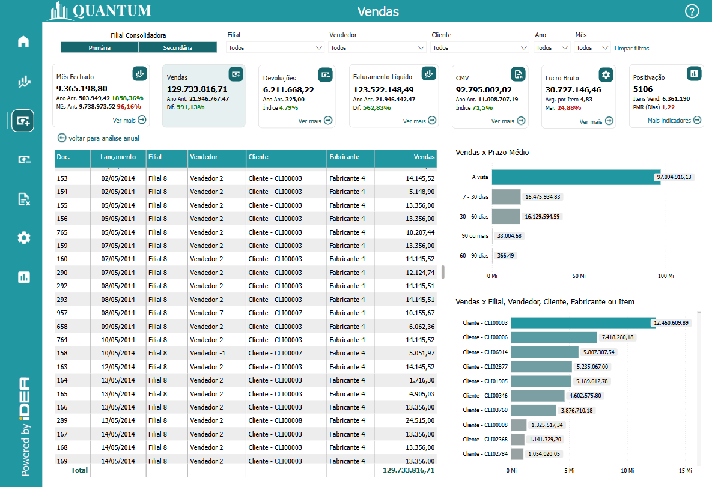
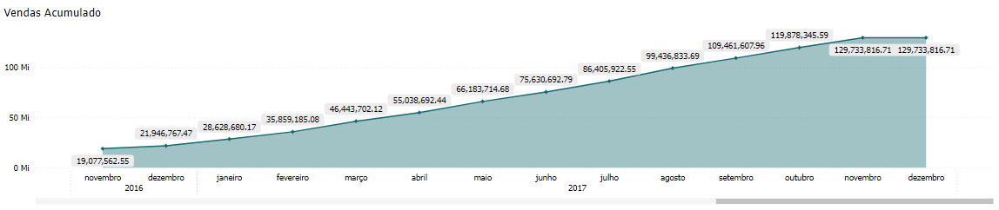
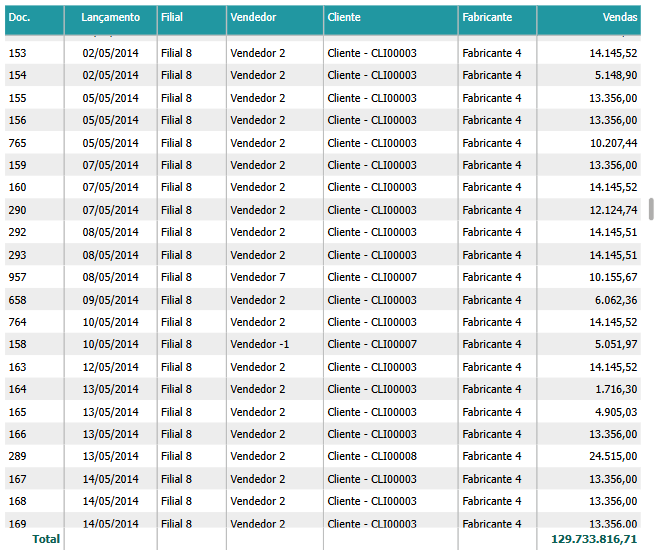
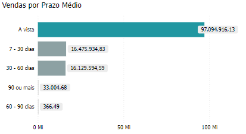
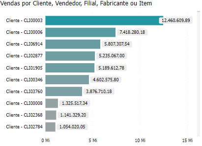
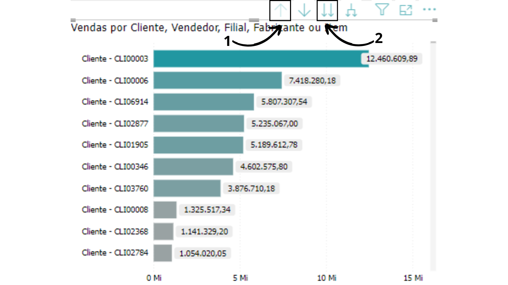
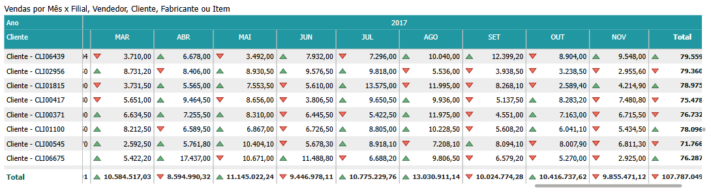

# Painel Vendas

<h6 align="center">Imagem 1: Painel "Visão de Vendas"</h6>

<h6 align="center">Imagem 2: Painel "Visão de Vendas"</h6>

Vendas é uma métrica fundamental que reflete o total de receitas geradas pela empresa através da comercialização de produtos ou serviços. O desempenho em vendas é um indicador direto da saúde financeira e do sucesso operacional de uma empresa, influenciando todos os aspectos do negócio, desde a gestão do fluxo de caixa até as decisões estratégicas de crescimento.

No contexto empresarial, as vendas podem ser analisadas de várias formas, incluindo vendas a prazo, vendas à vista, e vendas por canal ou produto. Entender a composição das vendas e as tendências ao longo do tempo ajuda a empresa a ajustar suas estratégias de marketing, preços e distribuição para maximizar as receitas.

Uma gestão eficiente das vendas é crucial para garantir o crescimento sustentável da empresa. Isso envolve não apenas a maximização das receitas, mas também a compreensão dos ciclos de vendas, o monitoramento das taxas de conversão e a otimização dos esforços de venda para atingir metas de desempenho. A análise das vendas também permite identificar oportunidades de expansão, ajustar ofertas de produtos ou serviços, e melhorar a experiência do cliente.

## Gráfico "Vendas Acumulado"

<h6 align="center">Imagem 3: Gráfico "Faturamento Acumulado ao Longo do Tempo"</h6>

Este gráfico oferece uma análise detalhada do Faturamento Acumulado por período. A ferramenta de BI utilizada permite que você navegue facilmente entre diferentes níveis hierárquicos, como períodos mensais, trimestrais ou anuais, para obter uma visão mais específica ou mais agregada do desempenho de vendas ao longo do tempo. Abaixo está uma explicação de cada nível e instruções sobre como interpretar os dados e navegar entre eles.

### Nível 1: Período Mensal
No nível mensal, o gráfico apresenta o faturamento acumulado ao final de cada mês. Esta visualização é ideal para identificar tendências sazonais e monitorar o desempenho de vendas mês a mês. Use esta visão para detectar períodos de pico ou queda nas vendas e ajustar suas estratégias de marketing e vendas conforme necessário.

### Nível 2: Período Anual
No nível anual, o gráfico mostra o faturamento acumulado ao longo de um ano completo. Esta visão é útil para análises de longo prazo, permitindo que você avalie o crescimento anual da empresa, identifique anos de forte desempenho e compare o progresso em relação às metas de longo prazo.

### Visualizar mais Detalhes

Este gráfico é uma visão detalhada das vendas realizadas após a seleção do botão acima que ativou a navegação para um nível mais específico de análise. Aqui está uma explicação detalhada dos componentes exibidos:

## Tabela de Vendas

<h6 align="center">Imagem 4: Visão mais Detalhada</h6>

- **Descrição:** A tabela exibe um histórico detalhado de vendas, listando individualmente cada transação, permitindo visualizar informações críticas como a data de venda, a filial que efetuou a venda, o vendedor responsável, o cliente que comprou, o fabricante do produto e o valor da venda.

- **Colunas da Tabela:**
  - **Doc.:** Número do documento que identifica cada transação de venda.
  - **Lançamento:** Data em que a venda foi registrada.
  - **Filial:** A unidade da empresa onde a venda foi realizada.
  - **Vendedor:** O representante de vendas responsável pela transação.
  - **Cliente:** Identificação do cliente que realizou a compra.
  - **Fabricante:** O fornecedor ou fabricante do produto vendido.
  - **Vendas:** O valor monetário da venda.

- ***Total de Vendas:***
  - Na parte inferior da tabela, é mostrado o total acumulado das vendas listadas, que neste caso é de R$ 129.733.816,71.

## Vendas por Prazo Médio

<h6 align="center">Imagem 5: Gráfico "Vendas por Prazo Médio"</h6>

Este gráfico de barras apresenta a distribuição das vendas por diferentes intervalos de prazo de recebimento.
- **Categorias:**
  - **À vista:** A maior parte das vendas foi realizada com pagamento à vista, totalizando R$ 97.094.916,13.
  - **7 - 30 dias:** Vendas cujo pagamento foi feito entre 7 e 30 dias somaram R$ 16.475.934,83.
  - **30 - 60 dias:** Pagamentos realizados entre 30 e 60 dias representam R$ 16.129.594,59.
  - **60 - 90 dias:** Este intervalo apresenta o menor valor, R$ 366,49.
  - **90 ou mais dias:** Um montante menor, R$ 33.004,68, corresponde a vendas com prazo de pagamento de 90 dias ou mais.

<h6 align="center">Imagem 6: Gráfico "Vendas por clientes, vendedor, filiais, fabricante ou item"</h6>

O gráfico fornecido mostra as vendas por cliente, comparando os valores de vendas acumuladas para diferentes clientes, vendedor, filiais, fabricante ou item específicos. Cada barra no gráfico representa uma categoria, e a extensão da barra indica o valor total das vendas realizadas para esse cliente durante o período analisado.

### Navegação Entre Níveis: 
Utilize as opções de navegação disponíveis na ferramenta de BI para alternar entre os diferentes níveis de visualização. Por exemplo, você pode começar analisando os dados no nível mensal e, em seguida, subir para o nivel anual para uma visão mais agregada.

- Para ir para o próximo nível de hierarquia (Indicador 1): Clique na opção "Ir para o próximo nível de hierarquia" na interface do BI. Isso levará você para o próximo nível, onde os dados serão detalhados de acordo com a nova categoria (por exemplo, de Cliente para Origem).
- Para retornar ao nível anterior (Indicador 2): Caso queira voltar a um nível mais agregador, clique em "Subir um nível na hierarquia". Isso levará você de volta ao nível anterior de categorização.

## Gráfico "Vendas por Filial, Vendedor, Cliente, Fabricante ou Item"

Este gráfico oferece uma análise detalhada das Vendas Acumuladas por período e  Filial, Vendedor, Cliente, Fabricante ou Item. A ferramenta de BI utilizada permite que você navegue facilmente entre diferentes níveis hierárquicos, como Filial, Vendedor, Cliente, Fabricante ou Item, para obter uma visão mais específica ou mais agregada do desempenho de vendas. Abaixo está uma explicação de cada nível e instruções sobre como interpretar os dados e navegar entre eles.

### Nível 1: Cliente
**Descrição:** No nível de cliente, o gráfico exibe o valor total das vendas associado a cada cliente específico. Cada barra representa um cliente ou grupo de clientes e ilustra o montante total de vendas realizado com eles durante o período analisado.

**Interpretação:** Este gráfico permite identificar quais clientes ou grupos de clientes geram os maiores volumes de vendas, o que pode indicar clientes-chave para o negócio. Com essa informação, a empresa pode focar em fortalecer o relacionamento com esses clientes, personalizar ofertas e serviços, ou desenvolver estratégias para aumentar as vendas com outros clientes que apresentam um potencial de crescimento. Essa análise também ajuda a identificar quais clientes podem precisar de atenção especial para evitar quedas no volume de vendas.

### Nível 2: Filial
**Descrição:** No nível de filial, o gráfico exibe o valor total das vendas associado a cada filial específica. Cada barra representa uma filial e ilustra o montante total de vendas realizadas por essa unidade durante o período analisado.

**Interpretação:** Este gráfico permite identificar quais filiais estão gerando os maiores volumes de vendas, destacando aquelas que desempenham um papel crucial no sucesso da empresa. Com essa informação, a empresa pode analisar as práticas bem-sucedidas dessas filiais, replicá-las em outras unidades, ou ajustar recursos e estratégias para melhorar o desempenho das filiais que estão abaixo das expectativas. Essa análise também pode revelar necessidades de suporte adicional ou oportunidades de expansão em filiais de alto desempenho.

### Nível 3: Vendedor
**Descrição:** No nível de vendedor, o gráfico exibe o valor total das vendas associadas a cada vendedor específico. Cada barra representa um vendedor e ilustra o montante total de vendas que esse profissional realizou durante o período analisado.

**Interpretação:** Este gráfico permite identificar quais vendedores estão gerando os maiores volumes de vendas, ajudando a destacar os melhores desempenhos individuais dentro da equipe. Com essa informação, a empresa pode reconhecer e recompensar o bom desempenho, oferecer treinamentos ou suporte adicional para vendedores que possam estar abaixo da meta, e ajustar as metas de vendas para alinhar com as capacidades de cada membro da equipe. Essa análise também pode ser usada para otimizar a distribuição de leads ou territórios de vendas.

### Nível 4: Fabricante
**Descrição:** No nível de fabricante, o gráfico exibe o valor total das vendas associadas a cada fabricante específico. Cada barra representa um fabricante e ilustra o montante total de vendas dos produtos desse fabricante durante o período analisado.

**Interpretação:**  Este gráfico permite identificar quais fabricantes contribuem mais significativamente para o faturamento da empresa. Com essa informação, a empresa pode estreitar relações com os fabricantes mais lucrativos, renegociar condições de fornecimento, ou ajustar o portfólio de produtos para focar naqueles que geram maior receita. Além disso, a análise pode revelar oportunidades de diversificação, substituição ou eliminação de produtos de fabricantes com desempenho insatisfatório.

### Nível 5: Item
**Descrição:** No nível de item, o gráfico exibe o valor total das vendas associado a cada item específico. Cada barra representa um item de produto ou serviço e ilustra o montante total de vendas gerado por esse item durante o período analisado.

**Interpretação:** Este gráfico permite identificar quais itens são os mais vendidos e quais contribuem de forma mais significativa para o faturamento da empresa. Com essa informação, a empresa pode ajustar seu mix de produtos, focando naqueles que têm maior aceitação no mercado, enquanto considera a reformulação, promoção adicional, ou descontinuação de itens com desempenho insatisfatório. Essa análise também pode ajudar a identificar tendências de consumo e oportunidades para o desenvolvimento de novos produtos ou serviços.

### Navegação Entre Níveis

A ferramenta de BI permite que você navegue facilmente entre os diferentes níveis de hierarquia para obter insights mais detalhados. Para mudar de nível, siga as instruções abaixo:

1 - Seletor de Dimensão (Colunas/Linhas)
- **Função:** Este seletor permite que o usuário escolha a dimensão na qual deseja realizar o drill-down. Na imagem, as opções disponíveis são "Colunas" e "Linhas".
- **Colunas:** Se selecionado, o drill-down será feito ao longo das colunas do gráfico ou tabela, explorando os dados de forma mais detalhada ao longo do eixo horizontal.
- **Linhas:** Se selecionado, o drill-down será realizado nas linhas, explorando os dados ao longo do eixo vertical.
- **Uso:** O usuário deve selecionar a dimensão que deseja expandir ou detalhar antes de prosseguir com o drill-down.

2 - Botão de Drill-Up
- **Função:** Este botão permite que o usuário suba um nível na hierarquia de dados após ter realizado um drill-down.
- **Exemplo:** Se o usuário tiver detalhado as vendas de um ano específico para ver os dados mensais, ao clicar neste botão ele retornará ao nível de visualização anual.
- **Uso:** Útil para retornar a uma visão mais agregada dos dados após explorar detalhes específicos.

3 - Botão de Drill-Down
- **Função:** Este botão permite que o usuário desça um nível na hierarquia de dados para ver informações mais detalhadas.
- **Exemplo:** Se o usuário está visualizando dados de vendas por ano, ao clicar neste botão, ele pode detalhar para ver os dados de vendas por trimestre ou mês.
- **Uso:** Ajuda a explorar informações mais detalhadas dentro de uma visualização, permitindo análises mais aprofundadas.
