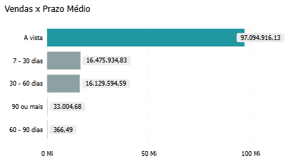
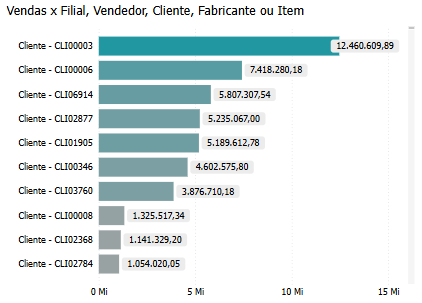

# Painel Vendas

  
  <h6>Imagem 1: Painel Vendas - Visão Análise Anual</h6>

  
  <h6>Imagem 2: Painel Vendas - Visão Detalhes</h6>

## Navegação

Este painel de relatório está dividido em duas visualizações;

- **[Visão Análise Anual](https://idea-technology-it.github.io/docs-idea/faturamento/vendas/#visao-analise-anual)** - pode ser navegada através do [botão](https://idea-technology-it.github.io/docs-idea/faturamento/intro/#botoes-para-diferentes-visoes) "voltar para análise anual".
- **[Visão Detalhes](https://idea-technology-it.github.io/docs-idea/faturamento/vendas/#visao-detalhes)** - pode ser navegada através do [botão](https://idea-technology-it.github.io/docs-idea/faturamento/intro/#botoes-para-diferentes-visoes) "ir para mais detalhes".

## Informações no Painel Vendas

### Valor de Vendas

A análise de vendas é um elemento fundamental no Business Intelligence (BI) porque fornece insights valiosos sobre as fontes de receita de uma empresa, o comportamento do cliente e as tendências de mercado. Monitorar o desempenho de vendas ajuda as empresas a identificar quais produtos, serviços ou mercados estão impulsionando o crescimento e quais áreas precisam de melhorias. Ao analisar várias métricas de vendas, as empresas podem otimizar suas estratégias, melhorar a eficiência operacional e tomar decisões informadas.

Visualizações como vendas acumuladas e crescimento das vendas mês a mês são essenciais para acompanhar o desempenho ao longo do tempo. As vendas acumuladas oferecem uma perspectiva de longo prazo, mostrando como as vendas estão se acumulando ao longo de um período específico, o que ajuda a entender as tendências de receita e a prever o desempenho futuro. Por outro lado, a comparação de vendas mês a mês permite que as empresas detectem mudanças de curto prazo, como flutuações sazonais ou o impacto de campanhas de marketing, e ajustem rapidamente suas estratégias.

Vendas detalhadas por Filial, Vendedor, Cliente, Fabricante ou Item são fundamentais para uma visão detalhada do desempenho do negócio. Esse tipo de análise permite que as empresas identifiquem quais locais, vendedores ou produtos são mais lucrativos ou estão com baixo desempenho. Compreender essa distribuição ajuda a identificar pontos fortes e fracos, permitindo uma melhor alocação de recursos, programas de incentivo para equipes de vendas e estratégias mais focadas no relacionamento com o cliente.

A análise de vendas por prazo médio fornece insights sobre o comportamento de pagamento dos clientes e a gestão de fluxo de caixa. A empresa pode identificar quais clientes estão pagando pontualmente e quais podem precisar de opções de pagamento mais flexíveis, permitindo uma melhor gestão de risco de crédito e otimização do fluxo de caixa.

O impacto da análise de vendas vai além do departamento de vendas. Os insights obtidos dos dados de vendas podem influenciar estratégias de marketing, gestão da cadeia de suprimentos, desenvolvimento de produtos e planejamento financeiro. Por exemplo, entender quais produtos têm bom desempenho pode ajudar as equipes de marketing a direcionar seus esforços de forma mais eficaz, enquanto os insights sobre a demanda do cliente podem ajudar as equipes de suprimentos a gerenciar o estoque com mais eficiência. Além disso, a análise de tendências de vendas ajuda as equipes financeiras a criar previsões de receita mais precisas, gerenciar orçamentos e otimizar estratégias de precificação.

Em resumo, a análise de vendas no BI é uma ferramenta poderosa para impulsionar o crescimento empresarial. Ao examinar as vendas de vários ângulos, como desempenho cumulativo, mudanças mês a mês e detalhamento por diversos fatores, as empresas obtêm uma compreensão mais profunda de seu mercado. Essa análise não só melhora as estratégias de vendas, mas também impacta outras áreas-chave como marketing, finanças e operações, criando um ambiente de negócios mais responsivo e orientado por dados.

## Visão Análise Anual

### Vendas Acumulado

  
  <h6>Imagem 3: Vendas Acumulado</h6>

Um gráfico de área é uma ferramenta poderosa para visualizar o comportamento das vendas acumuladas ao longo do tempo, sendo especialmente útil quando o eixo x é segmentado por ano e mês. Ele permite que as empresas acompanhem de forma contínua como as vendas se acumulam em um determinado período, revelando padrões importantes, taxas de crescimento e flutuações sazonais. Ao preencher a área abaixo da linha, o gráfico fornece uma representação visual mais clara do crescimento progressivo das vendas, enfatizando a evolução da receita de forma cumulativa.

Essa visualização é particularmente eficaz para destacar a velocidade e a consistência do crescimento das vendas mês a mês, tornando fácil identificar momentos de aceleração rápida, crescimento estável ou até mesmo quedas inesperadas. Empresas podem usar essa informação para ajustar suas estratégias de negócios em tempo real. Por exemplo, uma elevação significativa nas vendas em um período pode estar relacionada a promoções bem-sucedidas, lançamentos de novos produtos ou aumento na demanda de clientes. Por outro lado, uma desaceleração pode sinalizar a necessidade de ajustes, como campanhas de marketing mais agressivas, melhorias em produtos ou reforço da equipe de vendas.

Além de permitir a análise de tendências ao longo do tempo, o gráfico de área acumulada ajuda a revelar sazonalidades no desempenho das vendas, fornecendo insights sobre quais meses ou períodos do ano são mais lucrativos ou exigem mais atenção. Isso permite que as empresas se preparem melhor para esses ciclos de vendas, ajustando seus estoques, recursos humanos e campanhas de marketing de acordo com a demanda esperada.

Outro aspecto fundamental de um gráfico de área é que ele fornece uma visão holística do progresso de vendas da empresa, possibilitando comparações entre diferentes períodos ou anos. As empresas podem facilmente observar o desempenho de um mês específico em comparação com o mesmo período em anos anteriores, o que ajuda a entender se estão atingindo suas metas de crescimento e quais fatores externos ou internos podem estar influenciando esses resultados. Ao ver a acumulação contínua das vendas em uma linha do tempo, é possível identificar se a empresa está em uma trajetória de crescimento constante, se há sinais de estagnação ou se há necessidade de intervenções para corrigir um declínio.

Além de ser uma ferramenta analítica poderosa, o gráfico de área acumulada é útil para previsões e planejamento financeiro. Ele ajuda os gestores a projetar o crescimento futuro com base em tendências passadas e a ajustar seus orçamentos e expectativas de acordo com a evolução das vendas. Com a visualização clara das vendas acumuladas, torna-se mais simples fazer previsões assertivas sobre o desempenho a longo prazo e identificar a melhor estratégia para manter ou acelerar o crescimento.

Em suma, o gráfico de área acumulada não apenas proporciona uma visão clara do desempenho passado e presente, mas também oferece às empresas uma base sólida para planejamento estratégico e tomada de decisões informadas. Ao permitir que se observe o comportamento das vendas em um contexto mais amplo, ele orienta ajustes em políticas comerciais, operações e finanças, ajudando as empresas a maximizar o seu potencial de crescimento e melhorar sua competitividade no mercado.

### Vendas por Mês x Filial, Vendedor, Cliente, Fabricante ou Item

  
  <h6>Imagem 4: Vendas por Mês x Filial, Vendedor, Cliente, Fabricante ou Item</h6>

Uma matriz que exibe os valores de vendas mês a mês com ícones que indicam aumento (verde) ou diminuição (vermelho) em relação ao mês anterior oferece uma maneira dinâmica e intuitiva de analisar o desempenho de vendas ao longo do tempo. Esse tipo de matriz permite que os usuários acompanhem facilmente as flutuações nas vendas, identifiquem tendências de crescimento e detectem áreas potenciais de preocupação em diferentes períodos. O uso de ícones coloridos simplifica a comparação, fornecendo sinais visuais imediatos — verde para crescimento positivo e vermelho para queda — facilitando a interpretação rápida dos dados sem precisar se aprofundar em números complexos.

O que torna essa matriz particularmente poderosa é a capacidade de alterar os cabeçalhos das linhas entre Filial, Vendedor, Cliente, Fabricante ou Item. Essa flexibilidade permite uma análise mais profunda em várias dimensões do negócio. Por exemplo, ao mudar para Filial, a empresa pode avaliar o desempenho de diferentes filiais, identificando quais locais estão se destacando ou apresentando desempenho inferior mês a mês. Selecionar Vendedor oferece insights sobre o desempenho individual dos membros da equipe de vendas, destacando os melhores vendedores e aqueles que podem precisar de suporte adicional. Ao analisar por Cliente, a matriz pode revelar mudanças no comportamento de clientes importantes, ajudando a identificar clientes fiéis ou aqueles cujas compras diminuíram. Da mesma forma, a análise por Fabricante ou Item ajuda a acompanhar quais produtos ou fabricantes estão impulsionando o crescimento e quais podem necessitar de atenção ou descontinuação.

Esse tipo de análise visual não só auxilia na tomada de decisões rápidas, mas também permite que as empresas identifiquem oportunidades e riscos em várias áreas de suas operações. A capacidade de mudar as dimensões garante uma análise abrangente e flexível, apoiando estratégias mais direcionadas para melhorar as vendas, o engajamento dos clientes e o desempenho geral da empresa.

## Visão Detalhes

### Tabela de Vendas Detalhes

  
  <h6>Imagem 5: Tabela de Vendas Detalhes</h6>

A Tabela de Vendas Detalhes é um componente crucial para empresas que buscam entender e analisar seus dados de vendas em um nível detalhado. Esta tabela captura informações essenciais sobre cada transação de vendas, incluindo o identificador exclusivo para cada venda, a data da transação e detalhes importantes, como a filial onde a venda ocorreu, o representante de vendas envolvido, o cliente que fez a compra, o fornecedor ou fabricante do produto e o valor monetário da venda.

Ter esses dados detalhados permite que as empresas rastreiem vendas individuais com precisão, facilitando a reconciliação de registros, a realização de auditorias e a resolução de quaisquer discrepâncias. Além disso, a tabela permite insights mais profundos sobre tendências de vendas, mostrando quando as vendas ocorrem e vinculando-as a clientes, filiais e fornecedores específicos. Isso ajuda as organizações a identificar padrões em vendas, como horários de pico para produtos ou regiões específicas, e a entender o desempenho de diferentes representantes de vendas ou filiais. Ao saber quais clientes estão comprando mais ou quais fornecedores fornecem os produtos com maior geração de receita, as empresas podem adaptar suas estratégias de marketing, melhorar os relacionamentos com os clientes e otimizar sua cadeia de suprimentos.

Além disso, dados transacionais detalhados são essenciais para relatórios financeiros e previsões, pois fornecem uma imagem clara do fluxo de receita e ajudam as empresas a avaliar a lucratividade. A capacidade de analisar dados de vendas nesse nível permite que as empresas tomem decisões informadas sobre estratégias de preços, esforços promocionais e gerenciamento de estoque, contribuindo, em última análise, para a eficiência operacional geral e o crescimento estratégico.

Esta tabela é essencial quando se busca detalhes sobre vendas específicas. Ele pode ser filtrado usando [filtros](https://idea-technology-it.github.io/docs-idea/faturamento/intro/#filtros). A seguir, explicamos como interpretar cada coluna da tabela.

#### Doc. 
Número do documento que identifica cada transação de venda.
  
#### Lançamento
Data em que a venda foi registrada.
  
#### Filial
A unidade da empresa onde a venda foi realizada.
  
#### Vendedor
O representante de vendas responsável pela transação.
  
#### Cliente
Identificação do cliente que realizou a compra.
  
#### Fabricante
O fornecedor ou fabricante do produto vendido.
  
#### Vendas
O valor monetário da venda.

### Vendas x Prazo Médio

  
  <h6>Imagem 6: Vendas x Prazo Médio</h6>

O gráfico de barras do Prazo Médio é uma ferramenta essencial para analisar a distribuição de vendas com base em termos de pagamento, dando uma representação visual de quanta receita vem de vendas feitas em diferentes intervalos de pagamento. O gráfico é dividido em intervalos de tempo principais: À vista (vendas feitas com pagamento imediato), 7-30 dias (vendas com pagamento devido em 7 a 30 dias), 30-60 dias, 60-90 dias e 90 ou mais dias (vendas com pagamentos devidos em 90 dias ou mais).

Este gráfico fornece insights valiosos sobre o fluxo de caixa e a saúde financeira da empresa. Ao comparar o volume de vendas entre esses diferentes termos de pagamento, as empresas podem avaliar quanta receita está sendo coletada antecipadamente em comparação a períodos mais longos. Uma proporção maior de vendas nas categorias "À vista" ou de curto prazo, por exemplo, indica um fluxo de caixa imediato mais forte, o que pode ser benéfico para cobrir despesas operacionais sem depender de financiamento externo.

Por outro lado, vendas com prazos de pagamento mais longos, como 90 ou mais dias, podem revelar potenciais desafios de liquidez, pois o dinheiro fica retido em contas a receber por períodos prolongados. Monitorar a distribuição entre essas categorias permite que as empresas identifiquem tendências, como se os clientes estão cada vez mais aproveitando prazos de pagamento mais longos e se isso afeta o fluxo de caixa geral e o planejamento financeiro. Além disso, essas informações ajudam a ajustar as políticas de crédito, negociar melhores termos com os clientes e garantir que o equilíbrio entre recebíveis de curto e longo prazo esteja alinhado com as metas financeiras da empresa.

Ao visualizar as vendas em relação aos prazos de pagamento em um gráfico de barras, as empresas podem facilmente interpretar onde a maior parte de sua receita está concentrada e tomar ações estratégicas para otimizar as políticas de pagamento, aprimorar o gerenciamento do fluxo de caixa e mitigar os riscos associados a pagamentos atrasados.
 
### Vendas x Filial, Vendedor, Cliente, Fabricante ou Item

  
  <h6>Imagem 7: Vendas x Filial, Vendedor, Cliente, Fabricante ou Item</h6>

Um gráfico de barras intitulado Vendas x Filial, Vendedor, Cliente, Fabricante ou Item oferece uma representação visual poderosa do desempenho de vendas segmentado por várias dimensões comerciais importantes, como Filial, Vendedor, Cliente, Fabricante ou Item. Cada barra no gráfico representa uma dessas dimensões, permitindo que a empresa analise como as vendas são distribuídas entre diferentes entidades.

Este tipo de gráfico é inestimável para identificar tendências e padrões em vendas. Por exemplo, um gráfico Vendas x Filial ajuda a empresa a avaliar o desempenho de diferentes filiais, mostrando quais locais estão gerando mais receita. Esse insight permite que as empresas tomem decisões baseadas em dados, como realocar recursos, otimizar esforços de marketing regionais ou identificar filiais de baixo desempenho que podem exigir intervenção estratégica.

Da mesma forma, um gráfico Vendas x Vendedor fornece uma visão clara de como os vendedores individuais estão contribuindo para a receita geral. Ele ajuda a reconhecer os melhores desempenhos, motivar a equipe por meio de incentivos baseados em desempenho e identificar áreas onde treinamento ou suporte adicional podem ser necessários.

Um gráfico Vendas x Cliente revela quais clientes são responsáveis ​​pelos maiores volumes de vendas, permitindo que as empresas se concentrem em clientes de alto valor, personalizem serviços ou ofereçam ofertas exclusivas para impulsionar a retenção e a satisfação do cliente. Ao mesmo tempo, entender a distribuição de vendas por cliente ajuda a segmentar o mercado e identificar oportunidades de crescimento.

Ao examinar as vendas por Fabricante, o gráfico permite que as empresas analisem o desempenho de diferentes fornecedores ou fabricantes. Isso pode ser especialmente importante para o gerenciamento da cadeia de suprimentos, permitindo que a empresa se concentre em relacionamentos com fornecedores de alto desempenho, renegocie termos ou diversifique sua base de fornecedores para reduzir riscos.

Finalmente, um gráfico Vendas x Item divide as vendas por produtos específicos, destacando quais itens são os mais populares ou lucrativos. Esses dados são cruciais para o gerenciamento de estoque, desenvolvimento de produtos e estratégias de preços, garantindo que a empresa possa otimizar seu mix de produtos para atender à demanda do cliente e maximizar a lucratividade.

No geral, o gráfico de barras Vendas x Filial, Vendedor, Cliente, Fabricante ou Item fornece uma análise flexível e detalhada das vendas, permitindo que as empresas se concentrem nas principais dimensões que impulsionam a receita e a eficiência operacional. Ele capacita os tomadores de decisão com insights acionáveis ​​para alocação de recursos, melhoria de desempenho e crescimento estratégico.

Para navegar entre os níveis, você pode usar os [ícones de cabeçalho](https://idea-technology-it.github.io/docs-idea/faturamento/intro/#icones-de-cabecalho) que estão disponíveis quando você passa o mouse ou clica no gráfico.

  
  <h6>Ícones de Cabeçalho</h6>

Aqui, você pode mover para cima ou para baixo entre Filial, Vendedor, Cliente, Fabricante ou Item para analisar a área necessária.
