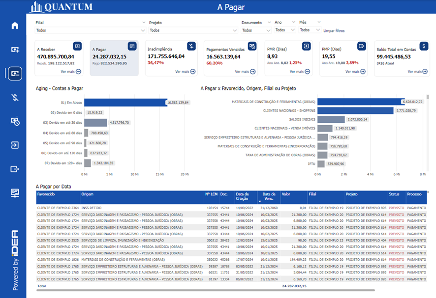
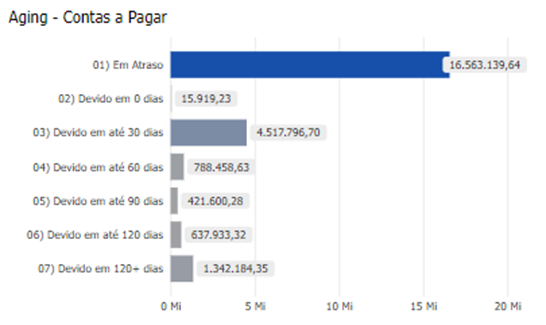
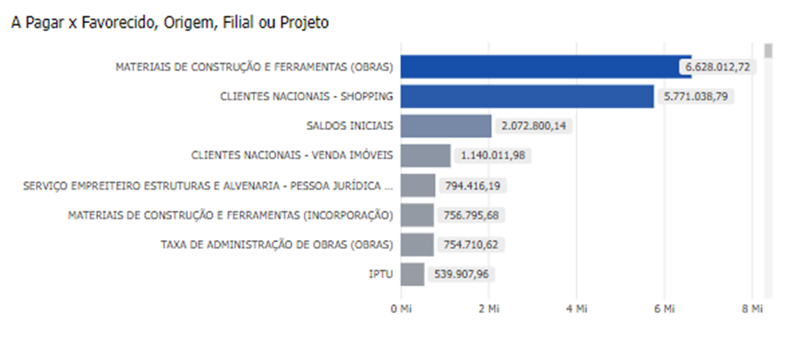
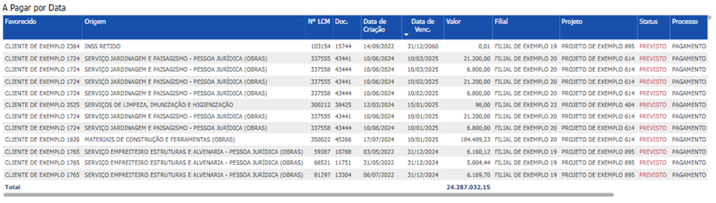

# Painel Contas a Pagar

  
  <h6>Imagem 1: Painel Contas a Pagar</h6>

Contas a pagar representam as obrigações financeiras que uma empresa assume com fornecedores e outros credores, com o compromisso de quitação em um período futuro. 

No contexto empresarial, essas contas incluem dívidas com fornecedores, salários de funcionários, impostos, aluguéis e outras despesas operacionais. No balanço patrimonial, as contas a pagar são classificadas como passivos de curto prazo, pois geralmente precisam ser liquidadas dentro de um ano.

Uma gestão eficiente das contas a pagar é crucial para manter a saúde financeira da empresa, assegurando o cumprimento 
de todas as obrigações sem comprometer o fluxo de caixa ou a liquidez do negócio.

## Aging - Contas a Pagar

  
  <h6>Imagem 2: Aging - Contas a Pagar</h6>

Um gráfico Aging de contas a pagar é uma ferramenta visual utilizada para monitorar e gerenciar o status das obrigações financeiras de uma empresa com seus fornecedores. Ele categoriza as contas a pagar com base no tempo decorrido desde a data de vencimento, facilitando a identificação de dívidas próximas do vencimento ou já vencidas.

### Importância do Gráfico Aging

- **Gestão do Fluxo de Caixa:** Auxilia no planejamento dos pagamentos para evitar problemas de fluxo de caixa.
- **Identificação de Problemas:** Ajuda a detectar questões com fornecedores ou processos internos, como faturas pagas com atraso.
- **Negociação com Fornecedores:** Fornece uma base para negociar prazos de pagamento ou condições de desconto por antecipação de pagamento.
- **Acompanhamento da Saúde Financeira:** Oferece uma visão clara da saúde financeira da empresa, indicando se as dívidas estão sendo geridas de forma adequada.

## A Pagar X Favorecido, Origem, Filial ou Projeto

  
  <h6>Imagem 3: A Pagar X Favorecido, Origem, Filial ou Projeto</h6>

Esse gráfico é uma ferramenta analítica que organiza e exibe as contas a pagar de uma empresa, classificando-as em diferentes categorias. Ele oferece uma visão detalhada das obrigações financeiras por fornecedor, origem, filial ou projeto.

### Indicadores

- **Favorecidos:** Referem-se aos fornecedores ou credores aos quais os pagamentos são devidos. Essa informação é útil para visualizar a concentração de dívidas com determinados fornecedores, auxiliando na priorização de pagamentos ou na negociação de prazos.
- **Origem:** Refere-se à natureza das dívidas, como compras de materiais, serviços contratados, impostos, etc. Essa informação é valiosa para identificar áreas onde os custos estão aumentando, permitindo um controle mais rigoroso.
- **Filial:** Para empresas com várias filiais, esse indicador apresenta as contas a pagar por unidade. Isso ajuda a administração central a identificar quais filiais estão gerando mais despesas e onde é necessário um controle financeiro mais rigoroso.
- **Projeto:** Em empresas que operam com projetos específicos, esse indicador categoriza as contas a pagar por projeto. É particularmente útil para garantir que os projetos estejam dentro do orçamento e para identificar aqueles que podem estar gerando custos inesperados.

## A Pagar por Data

  
  <h6>Imagem 4: A Pagar por Data</h6>

Este gráfico tabular representa o detalhamento organizado das obrigações financeiras da empresa de forma estruturada e segmentada. Ele oferece uma visão abrangente das contas a pagar, reunindo todas as informações necessárias em um único lugar e permitindo uma análise detalhada.

Com essa ferramenta, é possível monitorar prazos, valores e responsabilidades, ajudando a evitar atrasos e garantindo que os pagamentos sejam realizados de forma organizada. Além disso, a grade serve como um registro estruturado, útil em auditorias internas ou externas, assegurando transparência e conformidade com as práticas contábeis.

Com todas essas informações, os gestores podem tomar decisões informadas sobre a priorização de pagamentos, negociações com fornecedores e a gestão do fluxo de caixa.

## Importância deste relatório

- **Controle Financeiro:** Permite à empresa um controle mais preciso de suas despesas, segmentando as informações conforme a necessidade de análise.
- **Tomada de Decisão:** Facilita decisões estratégicas, ajudando os gestores a identificarem áreas que precisam de atenção especial, como fornecedores prioritários ou projetos com maior impacto financeiro.
- **Transparência e Comunicação:** Os indicadores oferecem uma representação clara e objetiva das finanças, facilitando a comunicação interna entre departamentos, gestores e a diretoria.
