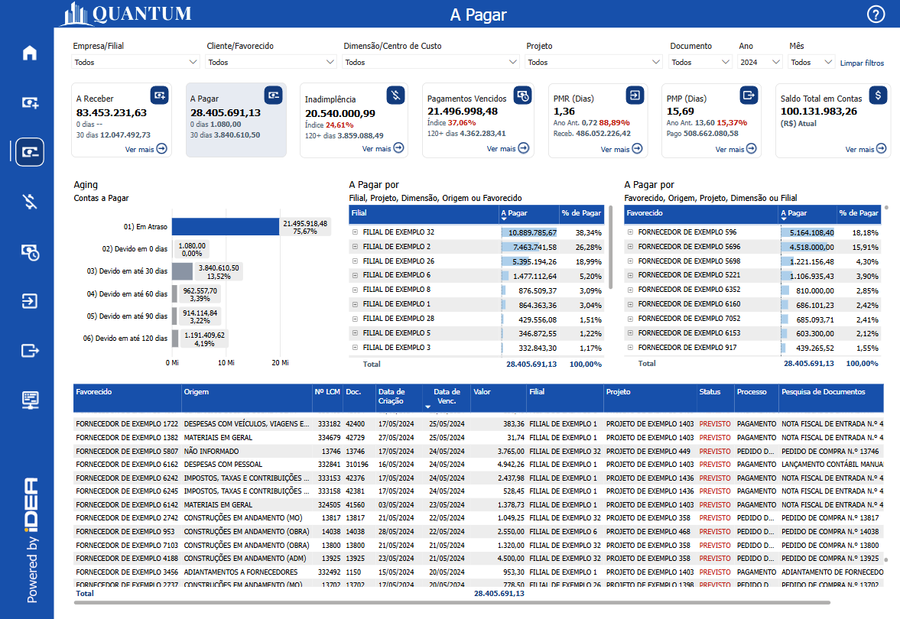
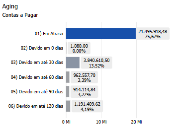
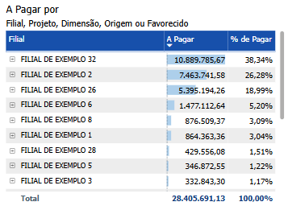
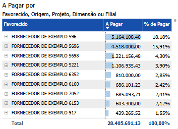
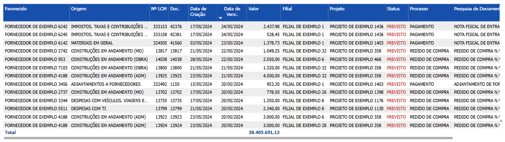

# Painel A Pagar

  
  <h6>Imagem 1: Painel A Pagar</h6>

## Informações no Painel A Pagar

### Valor A Pagar

O valor a pagar representam as obrigações financeiras que uma empresa assume com fornecedores, prestadores de serviços e outros credores, com o compromisso de quitação em um período futuro. Estas contas incluem uma variedade de despesas, como dívidas com fornecedores, salários de funcionários, impostos, aluguéis e outras despesas operacionais necessárias para a manutenção das atividades diárias da empresa. No balanço patrimonial, as contas a pagar são classificadas como passivos de curto prazo, uma vez que geralmente devem ser liquidadas dentro de um ano.

Uma gestão eficiente das contas a pagar é crucial para manter a saúde financeira da empresa. Garantir que todas as obrigações sejam cumpridas de maneira oportuna é essencial para evitar multas e penalidades por atrasos, além de assegurar que o fluxo de caixa e a liquidez do negócio não sejam comprometidos. Um controle adequado das contas a pagar ajuda a planejar melhor o fluxo de caixa, permitindo que a empresa mantenha um equilíbrio entre suas receitas e despesas, e previne possíveis dificuldades financeiras.

Além de seu impacto direto na saúde financeira, uma boa administração das contas a pagar também contribui para a manutenção de relacionamentos positivos com os fornecedores. Pagamentos pontuais podem resultar em condições de crédito mais favoráveis, descontos por pagamentos antecipados e uma relação comercial mais sólida e confiável. Isso não só fortalece a posição da empresa no mercado, mas também apoia a sua sustentabilidade financeira a longo prazo.

Os visuais deste painel são projetados para fornecer uma visão detalhada do valor total a pagar e das áreas influenciadas por esse valor, como Tempo, Projeto e Favorecido. O painel permite uma análise aprofundada das contas a pagar, segmentando os valores de acordo com diferentes critérios e proporcionando uma compreensão clara de como essas obrigações financeiras se distribuem e afetam diferentes aspectos da empresa. Esta abordagem facilita a identificação de áreas de maior impacto financeiro, ajuda na priorização de pagamentos e contribui para a formulação de estratégias eficazes de gestão financeira.

### % de Pagar

A porcentagem (%) de Pagar é uma métrica essencial para a gestão financeira, pois oferece uma visão clara da representatividade de cada categoria (como Filial, Fornecedor, Projeto, Dimensão ou Origem) em relação ao valor total das obrigações a pagar. Essa métrica permite às empresas identificar quais áreas ou fornecedores estão gerando os maiores compromissos financeiros, facilitando a priorização de pagamentos e a gestão do fluxo de caixa. Além de mostrar os valores absolutos, a porcentagem de pagar destaca a relevância de cada componente, o que ajuda a tomar decisões estratégicas sobre alocação de recursos, renegociações de prazos e otimização de desembolsos. A análise percentual também é valiosa para acompanhar o comportamento das dívidas ao longo do tempo, permitindo identificar tendências, como o aumento ou a redução da participação de determinados fornecedores ou projetos nos valores a pagar, ajudando a empresa a se planejar melhor e a manter um controle financeiro mais eficiente.

## Visão Principal

### Aging - Contas a Pagar

  
  <h6>Imagem 2: Aging - Contas a Pagar</h6>

O gráfico de barras do **Aging - Contas a Pagar** é dividido em 7 categorias, começando pelo valor que já está vencido. Em seguida, as categorias representam o tempo em que os pagamentos são devidos, começando em 0 dias (com vencimento imediato), progredindo em intervalos de 30 dias e finalizando com valores a pagar em 120 dias ou mais.

Esse visual oferece uma visão geral essencial de quais contas a pagar estão programadas para os próximos meses, juntamente com as que estão vencidas. As barras representam o valor a pagar para cada categoria de tempo, e os rótulos detalham tanto o valor monetário quanto a porcentagem do total a pagar. Isso fornece uma visão clara da proporção de cada faixa em relação ao total das obrigações financeiras. Essas informações permitem às empresas gerenciar melhor seu fluxo de caixa, garantindo maior estabilidade financeira e eficiência nas operações.

Sem a utilização de filtros, o gráfico exibe o valor total a pagar, mas ao aplicar os [filtros](https://idea-technology-it.github.io/docs-idea/financeiro/intro/#filtros), como por filial, projeto ou período, é possível segmentar as informações e gerenciar áreas específicas do negócio de forma mais detalhada. Esses filtros também interagem dinamicamente com outros visuais na página, proporcionando uma visão mais integrada das finanças.

Além disso, a interação entre os gráficos é bidirecional: ao clicar em outro visual, como uma tabela de contas a pagar, este gráfico de barras será automaticamente filtrado com base na seleção feita. Da mesma forma, ao selecionar uma barra neste gráfico, ele filtrará os outros visuais, permitindo uma análise interativa e detalhada que melhora a compreensão dos dados e facilita decisões financeiras mais bem embasadas.

Apesar de ser um gráfico compacto, ele oferece diversas funcionalidades, especialmente quando usado em conjunto com o gráfico [Aging - Contas a Receber](https://idea-technology-it.github.io/docs-idea/financeiro/contas_a_receber/#aging-contas-a-receber), permitindo ações como:

- Antecipar déficits e planejar saídas de caixa, possibilitando um planejamento financeiro mais preciso;
- Melhorar a gestão de pagamentos por meio da priorização de dívidas e comunicação estratégica com fornecedores;
- Aprimorar o controle de crédito ao monitorar o risco e o comportamento de pagamento, permitindo ajustes nos prazos de pagamento;
- Apoiar o planejamento financeiro do negócio, proporcionando previsões e decisões de investimento mais informadas;
- Mitigar o risco financeiro ao reduzir atrasos e inadimplências, gerenciando as contas de forma proativa para manter bons relacionamentos com fornecedores e parceiros financeiros, o que pode, a longo prazo, melhorar a gestão do caixa e dos pagamentos.

### A Pagar por Filial, Projeto, Dimensão, Origem ou Favorecido

  
  <h6>Imagem 3: A Pagar por Filial, Projeto, Dimensão, Origem ou Favorecido</h6>

Uma matriz exibindo os valores de **A Pagar por Filial, Projeto, Dimensão, Origem ou Favorecido** é uma ferramenta essencial para a análise financeira e a tomada de decisões estratégicas. Ao organizar os pagamentos conforme essas categorias específicas, a matriz permite que os stakeholders identifiquem rapidamente onde os valores pagos estão concentrados e rastreiem os desembolsos realizados para diferentes origens, projetos ou filiais. Essa visualização detalhada é crucial para uma gestão eficaz do fluxo de caixa, destacando quais áreas representam os maiores compromissos financeiros e como esses pagamentos impactam a saúde financeira da organização.

A matriz apresenta o valor total de pagamento e a porcentagem (%) de pagamento em relação ao total, oferecendo uma visão clara da contribuição de cada categoria. Esses indicadores ajudam a priorizar áreas que precisam de mais controle ou ajuste em termos de pagamentos, assegurando uma gestão mais eficiente dos recursos financeiros e dos processos de pagamento. As barras de dados em azul claro atrás dos valores na matriz atuam como um auxílio visual importante para a comparação. Elas fornecem um contexto visual imediato para os valores exibidos, destacando a magnitude relativa de cada categoria. Esse contraste entre as barras de dados e os valores facilita a visualização das diferenças e semelhanças entre os itens, permitindo que os stakeholders identifiquem rapidamente quais categorias têm maiores ou menores valores em comparação com o total. Ao criar uma base de referência visual, as barras de fundo ajudam a interpretar os dados de maneira mais intuitiva, tornando mais fácil detectar padrões, variações e tendências significativas. Essa representação visual aprimorada apoia a análise financeira ao transformar dados complexos em informações visualmente acessíveis e compreensíveis.

Além disso, a interação entre os gráficos é bidirecional: ao clicar em outro visual na página, como o [Aging - Contas a Pagar](https://idea-technology-it.github.io/docs-idea/financeiro/contas_a_pagar/#aging-contas-a-pagar), este gráfico de barras será automaticamente filtrado com base na seleção feita. Da mesma forma, ao selecionar uma barra neste gráfico, ele filtrará os outros visuais, permitindo uma análise interativa e detalhada que facilita a compreensão dos dados e a tomada de decisões embasadas. Esse comportamento dinâmico cria uma experiência integrada, onde os usuários podem navegar pelos dados de forma fluida, investigando correlações entre diferentes variáveis e entendendo como diferentes categorias impactam o pagamento.

A matriz também oferece a funcionalidade de expandir ou recolher hierarquias. Ao clicar no sinal de mais (+) ao lado de uma Filial ou Projeto, a tabela se expande para mostrar os valores de pagamento associados às Dimensões, Origens ou Favorecidos correspondentes. Essa visão hierárquica permite uma análise mais segmentada e detalhada, facilitando o acompanhamento de cada parte envolvida no processo de pagamento. Da mesma forma, os usuários podem recolher a hierarquia clicando no sinal de menos (-), permitindo uma navegação mais simplificada quando uma visão geral é suficiente.

Além disso, a seleção dos cabeçalhos de linha nesta matriz possibilita criar diversas combinações com outra matriz de [A Pagar por Favorecido, Origem, Projeto, Dimensão ou Filial](https://idea-technology-it.github.io/docs-idea/financeiro/contas_a_pagar/#pagamento-por-favorecido-origem-projeto-dimensao-ou-filial), aumentando ainda mais a flexibilidade da análise. A capacidade de escolher diferentes cabeçalhos de linha em cada matriz facilita a identificação das combinações mais relevantes, ajudando a visualizar as relações importantes na análise de pagamentos. Por exemplo, o usuário pode optar por visualizar Filial nesta matriz e Favorecido na segunda, ou Projeto nesta e Origem na outra, ajustando a visualização para exibir as informações mais relevantes no contexto da análise.

Com a exibição clara dos valores absolutos de pagamento e suas respectivas porcentagens, e a capacidade de explorar hierarquias e combinações de forma interativa, a matriz de **A Pagar por Filial, Projeto, Dimensão, Origem ou Favorecido** se torna uma ferramenta essencial para a gestão financeira. Ela possibilita uma navegação eficiente por grandes volumes de dados e interações com múltiplos visuais, auxiliando os tomadores de decisão a focar nas áreas mais críticas e a otimizar o desempenho financeiro da organização.

Para navegar entre os níveis, você pode usar os [ícones de cabeçalho](https://idea-technology-it.github.io/docs-idea/financeiro/intro/#icones-de-cabecalho) que estão disponíveis quando você passa o mouse ou clica no gráfico.

  
  <h6>Ícones de Cabeçalho</h6>

Aqui, você pode navegar entre diferentes níveis hierárquicos, como Projeto, Filial ou Dimensão, para analisar a área desejada.

### A Pagar por Favorecido, Origem, Projeto, Dimensão ou Filial

  
  <h6>Imagem 4: A Pagar X Favorecido ou Origem</h6>

Uma matriz exibindo os valores de **A Pagar por Favorecido, Origem, Projeto, Dimensão ou Filial** é uma ferramenta essencial para a análise financeira e a tomada de decisões estratégicas. Ao organizar os pagamentos com base nessas categorias específicas, a matriz permite que os stakeholders identifiquem rapidamente onde os valores pagos estão concentrados e monitorem os desembolsos feitos para diferentes favorecidos, origens de despesa ou projetos. Esse nível de detalhamento é crucial para uma gestão eficiente do fluxo de caixa, destacando quais áreas representam os maiores compromissos financeiros e ajudando a identificar eventuais riscos ou oportunidades de otimização financeira.

A matriz apresenta tanto o valor total de pagamento quanto a porcentagem (%) que cada favorecido, origem, projeto, dimensão ou filial representa no total, fornecendo uma visão clara da contribuição relativa de cada categoria. Esses indicadores facilitam a priorização de áreas que demandam mais controle, possibilitando ajustes mais rápidos e eficazes nos processos de pagamento e gerenciamento de despesas. As barras de dados em azul claro atrás dos valores na matriz atuam como um auxílio visual importante para a comparação. Elas fornecem um contexto visual imediato para os valores exibidos, destacando a magnitude relativa de cada categoria. Esse contraste entre as barras de dados e os valores facilita a visualização das diferenças e semelhanças entre os itens, permitindo que os stakeholders identifiquem rapidamente quais categorias têm maiores ou menores valores em comparação com o total. Ao criar uma base de referência visual, as barras de fundo ajudam a interpretar os dados de maneira mais intuitiva, tornando mais fácil detectar padrões, variações e tendências significativas. Essa representação visual aprimorada apoia a análise financeira ao transformar dados complexos em informações visualmente acessíveis e compreensíveis.

Além disso, a interação entre os gráficos é **bidirecional**: ao clicar em outro visual na página, como o gráfico [Aging - Contas a Pagar](https://idea-technology-it.github.io/docs-idea/financeiro/contas_a_pagar/#aging-contas-a-pagar), esta matriz será automaticamente filtrada com base na seleção feita. Da mesma forma, ao selecionar um item nesta matriz, ela filtrará os outros visuais, como gráficos de barras ou tabelas, permitindo uma análise interativa e detalhada que facilita a compreensão dos dados e a tomada de decisões informadas. Essa integração dinâmica cria uma experiência de exploração de dados fluida, onde os usuários podem rapidamente identificar correlações e entender como diferentes categorias impactam os pagamentos.

A matriz também oferece a funcionalidade de expandir e recolher hierarquias. Ao clicar no sinal de mais (+) ao lado de um Favorecido ou Origem, por exemplo, a tabela se expande para revelar os valores de pagamento detalhados por Projeto, Dimensão ou Filial. Essa visão hierárquica permite uma análise mais aprofundada, facilitando o acompanhamento de cada favorecido ou projeto e sua respectiva contribuição para o fluxo de caixa. Os usuários podem também recolher a hierarquia clicando no sinal de menos (-), permitindo uma navegação mais simplificada quando uma visão mais geral é suficiente.

A seleção de cabeçalhos de linha nesta matriz também permite combinações poderosas com a matriz de **A Pagar por Favorecido, Origem, Projeto, Dimensão ou Filial**, proporcionando ainda mais flexibilidade na análise. A capacidade de alternar entre diferentes combinações de cabeçalhos de linha em ambas as matrizes facilita a visualização de conexões relevantes entre favorecidos, projetos, filiais e dimensões. Por exemplo, o usuário pode optar por visualizar **Favorecido** nesta matriz e **Filial** na outra, ou explorar **Origem** aqui e **Projeto** na outra, ajustando as tabelas conforme as necessidades da análise.

Com a exibição clara dos valores absolutos de pagamento e suas respectivas porcentagens, além da capacidade de explorar as relações hierárquicas e combinações de forma interativa, a matriz de **A Pagar por Favorecido, Origem, Projeto, Dimensão ou Filial** se torna uma ferramenta essencial para a gestão financeira. Ela oferece uma navegação eficiente em grandes volumes de dados e facilita interações com múltiplos visuais, ajudando os tomadores de decisão a focar nos principais pontos críticos e a otimizar o desempenho financeiro da organização.

Para navegar entre os níveis, você pode usar os [ícones de cabeçalho](https://idea-technology-it.github.io/docs-idea/financeiro/intro/#icones-de-cabecalho) que estão disponíveis quando você passa o mouse ou clica no gráfico.

  
  <h6>Ícones de Cabeçalho</h6>

Aqui, você pode navegar para cima ou para baixo entre Favorecido ou Origem, facilitando a análise detalhada da área de interesse.

### A Pagar por Data

  
  <h6>Imagem 5: A Pagar por Data</h6>

Este gráfico exibe uma tabela detalhada das contas a pagar, organizada por data de vencido, que apresenta uma visão completa das transações em ordem cronológica. A tabela inclui várias colunas que fornecem informações cruciais sobre cada fatura, desde o favorecido até o status atual e os documentos relacionados. Essa visão tabular permite à empresa analisar minuciosamente cada conta a pagar, fornecendo todas as informações necessárias para o acompanhamento e a gestão eficaz dos pagáveis. Através desta estrutura, a empresa pode monitorar detalhadamente o fluxo de caixa e tomar decisões informadas sobre o gerenciamento financeiro. A seguir, explicamos como interpretar cada coluna da tabela.

Esta tabela é essencial ao procurar detalhes sobre contas a pagar específicas. Ela pode ser filtrada usando [filtros](https://idea-technology-it.github.io/docs-idea/financeiro/intro/#filtros) ou clicando nas barras dentro dos outros dois visuais na página. Por exemplo, para ver os detalhes de todas as transações a pagar que vencem em 30 dias, clique na coluna no gráfico Aging - Contas a Pagar que diz "03) Devido em até 30 dias".

#### Favorecido
Esta coluna indica o favorecido específico que tem um valor a pagar, permitindo que você veja claramente quem são os favorecidos.
#### Origem
A origem da fatura, como "INSS Retido" ou "Serviço Instalações", é indicada nesta coluna. Isso ajuda a entender a natureza da dívida e a sua fonte dentro das operações da empresa.
#### Nº LCM
Esta coluna mostram o número do lançamento contábil relacionado à fatura. Elas são úteis para rastrear documentos específicos e reconciliar com registros contábeis.
#### Doc.
O número do documento associado à fatura encontra-se aqui. Este é o número mais comumente usado ao pesquisar a transação no banco de dados.
#### Data de Criação
Indica quando a fatura foi criada. Essa informação é importante para entender o histórico da transação e verificar quanto tempo se passou desde a emissão da fatura.
#### Data de Venc.
Esta coluna mostra a data de vencimento da fatura. Comparar esta data com a data atual ajuda a identificar faturas que estão próximas de vencer ou já estão atrasadas.
#### Valor
Exibe o valor devido em cada fatura. Esta coluna permite uma visão clara dos montantes que estão em aberto.
#### Empresa/Filial
Indica a filial da empresa responsável pela fatura. Isso é útil para entender a distribuição geográfica dos pagáveis.
#### Projeto
Relaciona cada fatura a um projeto específico. Esta informação é essencial para empresas que gerenciam múltiplos projetos e precisam monitorar os fluxos de caixa associados a cada um deles.
#### Status
O status da fatura que é "Previsto" é mostrado aqui. Este status serve para mostrar que o pagamento ainda está pendente e evita confusão com transações mostradas no [Painel de Pagamentos Realizados](https://idea-technology-it.github.io/docs-idea/financeiro/painel_pagamentos_realizados/).
#### Processo
Indica o processo associado ao recebimento, como "Pagamento". Essa coluna auxilia na compreensão do fluxo de trabalho relacionado à fatura.
#### Pesquisa de Documentos
Esta coluna contém informações relacionadas à pesquisa de documentos que podem fornecer detalhes adicionais sobre a fatura ou transação. Isso é útil para obter informações mais detalhadas ou resolver dúvidas sobre um determinado pagável.
#### Dimensão/Centro de Custo
Esta coluna exibe o nome da dimensão que é relevante para a transação. Embora você possa filtrar por dimensão usando o filtro [Dimensão/Centro de Custo](https://idea-technology-it.github.io/docs-idea/financeiro/intro/#dimensaocentro-de-custo), isso facilita a análise ao fornecer uma referência direta aos nomes das dimensões, organizando os dados de uma forma intuitiva para identificar e entender as diferentes áreas de análise.

  
***Aviso Legal:** Os números e informações apresentados nesta documentação são baseados em um conjunto de dados fictício. Eles são destinados exclusivamente para fins educacionais e de demonstração. Os dados não refletem condições do mundo real ou métricas de negócios reais e não devem ser usados ​​para tomada de decisão ou análise. Qualquer semelhança com entidades, eventos ou dados reais é mera coincidência.*
