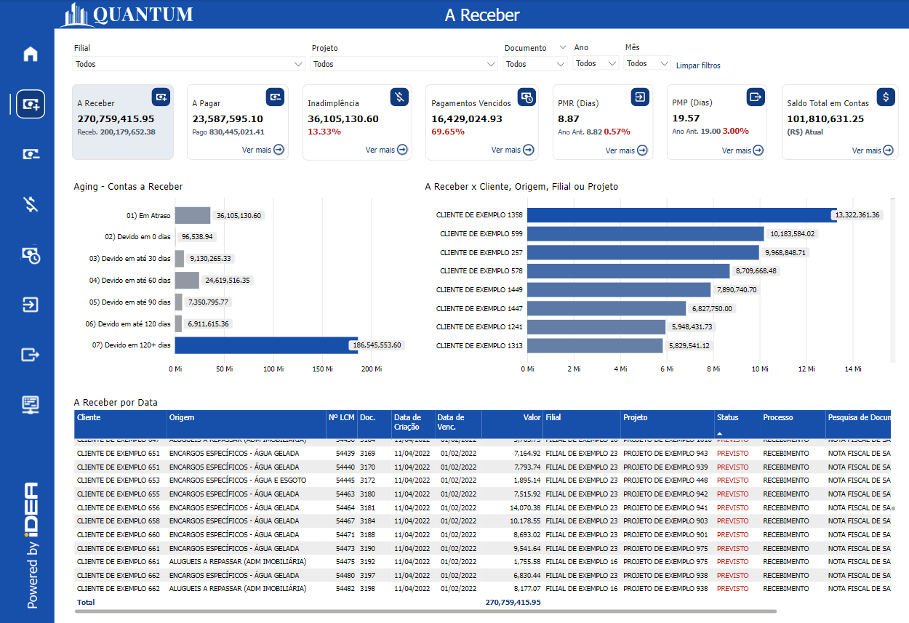
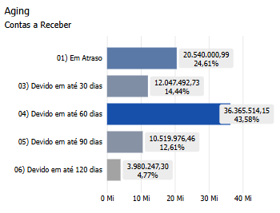
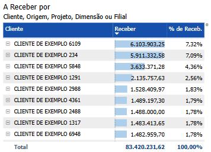
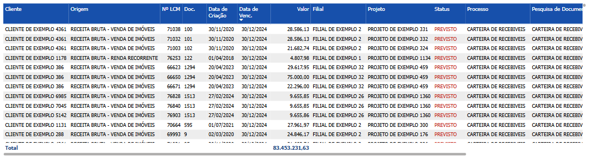

# Painel A Receber

  
  <h6>Imagem 1: Painel A Receber</h6>

A Receber representam os valores que uma empresa tem o direito de receber de seus clientes, oriundos de vendas de produtos ou serviços a prazo, com a expectativa de recebimento em um período futuro.

No contexto empresarial, as contas a receber englobam valores devidos por clientes em função de vendas a crédito, financiamentos e outras transações comerciais. No balanço patrimonial, essas contas são classificadas como ativos circulantes, pois representam recursos que a empresa espera converter em caixa dentro de um curto prazo, geralmente inferior a um ano.

Uma gestão eficiente das contas a receber é crucial para garantir a liquidez da empresa e o fluxo de caixa necessário para suas operações. Isso envolve o monitoramento rigoroso dos prazos de pagamento, a identificação e minimização dos riscos de inadimplência e a garantia de que os recebíveis sejam convertidos em caixa o mais rapidamente possível. Além disso, uma boa administração das contas a receber contribui para a manutenção de relacionamentos saudáveis com os clientes e apoia a sustentabilidade financeira do negócio.

## Aging - Contas a Receber

  
  <h6>Imagem 2: Aging - Contas a Receber</h6>

O gráfico de barras é dividido em 7 categorias, a primeira das quais é o valor que já está vencido. Em seguida, vem o tempo em que esse valor é devido, começando em 0 dias (com vencimento imediato), progredindo em intervalos de 30 dias e terminando com qualquer coisa que seja devida em 120 dias ou mais.

Este visual oferece uma ótima visão geral de quais contas a receber são esperadas nos próximos meses, juntamente com o que está vencido (mais detalhado no [Painel Inadimplência](https://idea-technology-it.github.io/docs-idea/financeiro/inadimplencia/)). Essas informações capacitam as empresas a gerenciar seu fluxo de caixa de forma mais eficaz, garantindo estabilidade financeira e eficiência operacional.

Sem usar nenhum filtro, o gráfico representa o valor total a receber, mas usando os [filtros](https://idea-technology-it.github.io/docs-idea/financeiro/intro/#filtros) filial ou projeto, é possível gerenciar áreas específicas dentro do negócio também.

Embora pequeno, este gráfico tem muitas funções, especialmente quando acoplado ao gráfico [Aging - Contas A Pagar](https://idea-technology-it.github.io/docs-idea/financeiro/contas_a_pagar/#aging-contas-a-pagar), permitindo ações como;

- Prever déficits e planejar atrasos no fluxo de caixa para um planejamento financeiro mais preciso,
- Melhorar os processos de cobrança por meio da priorização e comunicação estratégica para melhorar o fluxo de caixa,
- Aprimorar o controle de crédito avaliando o risco e o comportamento, permitindo ajustes de prazo,
- Apoiar o planejamento financeiro dentro do negócio por meio de previsões e decisões de investimento informadas,
- Mitigando o risco financeiro reduzindo dívidas inadimplentes e fortalecendo relacionamentos gerenciando proativamente as contas antes que elas aumentem, potencialmente levando a melhores comportamentos de pagamento ao longo do tempo.

## A Receber x Cliente, Origem, Filial ou Projeto

  
  <h6>Imagem 3: A Receber x Cliente, Origem, Filial ou Projeto</h6>

Um gráfico de barras que segmenta os recebíveis por cliente, conta, empresa ou projeto oferece vantagens significativas para a gestão e análise da saúde financeira do seu negócio. Visualmente, o gráfico proporciona uma visão rápida e clara de quais clientes, contas, empresas ou projetos têm os maiores valores em aberto, permitindo que a administração identifique facilmente onde os montantes mais significativos de dinheiro estão alocados. Essa análise comparativa permite direcionar esforços de cobrança de forma mais eficaz, garantindo que os recursos sejam aplicados na recuperação dos maiores recebíveis primeiro. Além disso, o gráfico ajuda a identificar concentrações de risco, como no caso de recebíveis fortemente associados a um cliente, conta, empresa ou projeto específico, o que pode representar riscos financeiros caso não sejam recebidos a tempo. Esse entendimento apoia o planejamento financeiro, permitindo uma previsão de fluxo de caixa mais precisa e melhor alinhamento dos recebíveis com as obrigações financeiras futuras.

O gráfico também é valioso para monitorar o desempenho de diferentes contas e empresas, oferecendo insights sobre os comportamentos de pagamento ao longo do tempo. Essas informações podem orientar decisões sobre estratégias de vendas, gestão de contas e políticas empresariais. Além disso, o gráfico pode ser usado como uma ferramenta de negociação, fornecendo vantagem em discussões com clientes ou empresas ao apresentar um panorama claro dos pagamentos em aberto. Essa abordagem baseada em dados não só melhora os termos de pagamento, mas também fortalece as relações com clientes e parceiros de negócios. Adicionalmente, ao destacar onde os recebíveis estão concentrados, seja por conta ou empresa, o gráfico informa a tomada de decisões estratégicas, como a alocação de recursos ou a necessidade de revisar os termos de engajamento com clientes ou projetos específicos. Em resumo, esse gráfico de barras é uma ferramenta poderosa que aprimora a capacidade de gerir o fluxo de caixa, mitigar riscos e otimizar o desempenho financeiro em diferentes níveis do seu negócio.

Para navegar entre os níveis, você pode usar os [ícones de cabeçalho](https://idea-technology-it.github.io/docs-idea/financeiro/intro/#filtros) que estão disponíveis quando você passa o mouse ou clica no gráfico.

  
  <h6>Ícones de Cabeçalho</h6>

Aqui, você pode navegar entre diferentes níveis hierárquicos, como Cliente, Origem, Filial ou Projeto, para analisar a área desejada.

## A Receber por Data

  
  <h6>Imagem 4: A Receber por Data</h6>

Este gráfico exibe uma tabela detalhada das contas a receber, organizada por data de vencido, que apresenta uma visão completa das transações em ordem cronológica. A tabela inclui várias colunas que fornecem informações cruciais sobre cada fatura, desde o cliente até o status atual e os documentos relacionados. Essa visão tabular permite à empresa analisar minuciosamente cada conta a receber, fornecendo todas as informações necessárias para o acompanhamento e a gestão eficaz dos recebíveis. Através desta estrutura, a empresa pode monitorar detalhadamente o fluxo de caixa e tomar decisões informadas sobre o gerenciamento financeiro. A seguir, explicamos como interpretar cada coluna da tabela.

Esta tabela é essencial ao procurar detalhes sobre contas a receber específicas. Ela pode ser filtrada usando [filtros](https://idea-technology-it.github.io/docs-idea/financeiro/intro/#filtros) ou clicando nas barras dentro dos outros dois visuais na página. Por exemplo, para ver os detalhes de todas as transações a receber que vencem em 30 dias, clique na coluna no gráfico Aging - Contas a Receber que diz "03) Devido em até 30 dias".

#### Cliente
Esta coluna identifica o cliente específico que tem um valor a pagar, permitindo que você veja claramente quem são os devedores.
#### Origem
A origem da fatura, como "Encargos Comuns" ou "Aluguel de Imóveis", é indicada nesta coluna. Isso ajuda a entender a natureza da dívida e a sua fonte dentro das operações da empresa.
#### Nº LCM
Esta coluna mostram o número do lançamento contábil relacionado à fatura. Elas são úteis para rastrear documentos específicos e reconciliar com registros contábeis.
#### Doc.
O número do documento associado à fatura encontra-se aqui. Este é o número mais comumente usado ao pesquisar a transação no banco de dados.
#### Data de Criação
Indica quando a fatura foi criada. Essa informação é importante para entender o histórico da transação e verificar quanto tempo se passou desde a emissão da fatura.
#### Data de Venc.
Esta coluna mostra a data de vencimento da fatura. Comparar esta data com a data atual ajuda a identificar faturas que estão próximas de vencer ou já estão atrasadas.
#### Valor
Exibe o valor devido em cada fatura. Esta coluna permite uma visão clara dos montantes que estão em aberto.
#### Filial
Indica a filial da empresa responsável pela fatura. Isso é útil para entender a distribuição geográfica dos recebíveis.
#### Projeto
Relaciona cada fatura a um projeto específico. Esta informação é essencial para empresas que gerenciam múltiplos projetos e precisam monitorar os fluxos de caixa associados a cada um deles.
#### Status
O status da fatura que é "Previsto" é mostrado aqui. Este status serve para mostrar que o pagamento ainda está pendente e evita confusão com transações mostradas no [Painel de Recebimentos Realizados](https://idea-technology-it.github.io/docs-idea/financeiro/painel_recebimentos_realizados/)
#### Processo
Indica o processo associado ao recebimento, como "Recebimento" ou "Carteira de Recebíveis". Essa coluna auxilia na compreensão do fluxo de trabalho relacionado à fatura.
#### Pesquisa de Documentos
Esta coluna contém informações relacionadas à pesquisa de documentos que podem fornecer detalhes adicionais sobre a fatura ou transação. Isso é útil para obter informações mais detalhadas ou resolver dúvidas sobre um determinado recebível.
#### Dimensão
Esta coluna exibe o nome da dimensão que é relevante para a transação. Embora você possa filtrar por dimensão usando o filtro [Dimensão](https://idea-technology-it.github.io/docs-idea/financeiro/intro/#dimensao), isso facilita a análise ao fornecer uma referência direta aos nomes das dimensões, organizando os dados de uma forma intuitiva para identificar e entender as diferentes áreas de análise.
