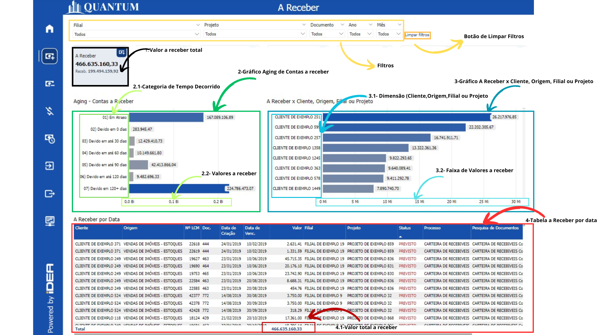
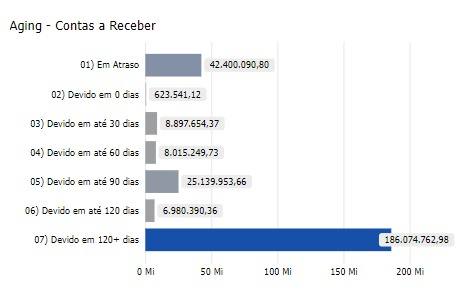
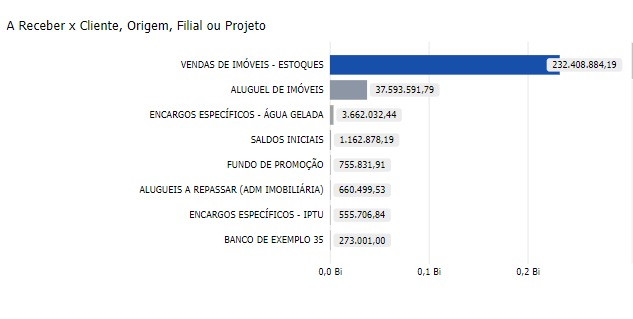
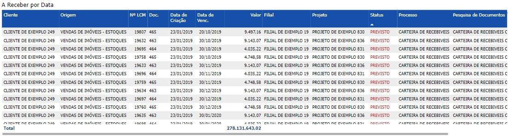

# Contas a Receber

<h6 align="center">Imagem 1: Relatório Geral Contas a Receber</h6>

Contas a Receber representam os direitos financeiros que uma empresa possui em relação aos seus clientes, resultantes de vendas de produtos ou serviços a prazo, com a expectativa de recebimento em um período futuro.

No contexto empresarial, as contas a receber incluem valores devidos por clientes em virtude de vendas a crédito, financiamentos e outras transações comerciais. No balanço patrimonial, as contas a receber são classificadas como ativos circulantes, pois representam recursos que a empresa espera converter em caixa dentro de um curto prazo, geralmente inferior a um ano.

Uma gestão eficiente das contas a receber é fundamental para assegurar a liquidez da empresa e o fluxo de caixa necessário para suas operações. Isso inclui monitorar os prazos de pagamento, identificar e minimizar os riscos de inadimplência, e garantir que os recebíveis sejam convertidos em caixa o mais rapidamente possível. Uma boa administração das contas a receber também contribui para a manutenção de relacionamentos saudáveis com os clientes, ao mesmo tempo em que suporta a sustentabilidade financeira do negócio.

## Gráfico de Aging

<h6 align="center">Imagem 2: Gráfico de Aging de Contas a Receber</h6>

Um gráfico de Aging de Contas a Receber é uma ferramenta visual essencial para monitorar e gerenciar os valores que uma empresa tem a receber de seus clientes. Ele organiza as contas a receber em diferentes categorias, baseando-se no tempo decorrido desde a data de emissão da fatura até o momento atual. Isso ajuda a empresa a identificar rapidamente quais valores estão próximos do vencimento, quais já estão vencidos, e a tomar as medidas necessárias para garantir que esses valores sejam recebidos.

Este gráfico de **Aging de Contas a Receber** categoriza as contas a receber de acordo com o tempo decorrido desde a emissão da fatura até o momento atual. Aqui está como você pode ler e interpretar as informações apresentadas:

### Em Atraso
A primeira barra, identificada como "Em Atraso", representa o total de contas a receber que já passaram da data de vencimento. Esta barra indica a quantidade de faturas que não foram pagas dentro do prazo acordado. A altura ou o comprimento desta barra, em comparação com as outras, indica a proporção de valores que estão atrasados.

### Devido em até 30 dias
A segunda barra mostra as faturas que ainda não venceram, mas que estão previstas para serem pagas nos próximos 30 dias. Esta categoria ajuda a visualizar os recebíveis de curto prazo e permite a empresa se preparar para as entradas de caixa esperadas neste período.

### Devido em até 60 dias
A terceira barra representa as contas a receber que vencem em até 60 dias. Essa categoria ajuda a monitorar os valores que ainda estão dentro de um prazo relativamente curto, mas além do primeiro mês.

### Devido em até 90 dias
A quarta barra mostra as contas que devem ser pagas em até 90 dias. Este intervalo de tempo estende a análise para um horizonte de médio prazo, permitindo o planejamento de recebimentos futuros.

### Devido em até 120 dias
A quinta barra exibe os valores que são esperados dentro de 120 dias. Isso permite à empresa visualizar seus recebíveis a médio prazo, antes que atinjam quatro meses.

### Devido em mais de 120 dias
A última barra categoriza as contas a receber que vencerão após 120 dias. Esta seção do gráfico oferece uma visão de longo prazo sobre os recebíveis, possibilitando o planejamento financeiro para um futuro mais distante.

## Gráfico "A Receber x Cliente, Origem, Filial ou Projeto"

<h6 align="center">Imagem 3: Gráfico de Recebimento por Cliente, Origem e Filial</h6>

Este gráfico fornece uma análise detalhada das contas a receber, organizadas em diferentes níveis hierárquicos: Cliente, Origem, Filial e Projeto. A ferramenta de BI permite que você navegue facilmente entre esses níveis para obter uma visão mais específica ou mais agregada dos valores a receber. Abaixo está uma explicação de cada nível e instruções sobre como navegar entre eles.

### Nível 1: Cliente
**Descrição**: No nível de Cliente, o gráfico exibe as contas a receber classificadas por cliente específico. Cada barra representa um cliente e mostra o total de valores que ele deve à empresa.

**Interpretação**: Este nível permite identificar rapidamente quais clientes têm os maiores montantes em aberto, facilitando a priorização de esforços de cobrança.

### Nível 2: Origem
**Descrição**: No nível de Origem, as contas a receber são organizadas de acordo com a origem das faturas, como vendas específicas, contratos ou outros tipos de transações.

**Interpretação**: A análise por origem ajuda a entender de onde vêm os principais valores a receber e pode ser útil para identificar padrões em diferentes tipos de receita.

### Nível 3: Filial
**Descrição**: Neste nível, o gráfico categoriza os valores a receber por filial. Cada barra representa uma filial específica da empresa e o total de valores que ela deve receber.

**Interpretação**: A visualização por filial permite avaliar o desempenho financeiro de diferentes unidades da empresa, ajudando na alocação de recursos e estratégias de cobrança regionais.

### Nível 4: Projeto
**Descrição**: No nível de Projeto, as contas a receber são organizadas de acordo com os diferentes projetos em que a empresa está envolvida.

**Interpretação**: Esta análise ajuda a empresa a entender quais projetos estão gerando as maiores receitas a receber e pode auxiliar no planejamento e gestão de projetos futuros.

### Navegação Entre os Níveis
A ferramenta de BI permite que você navegue facilmente entre os diferentes níveis de hierarquia para obter insights mais detalhados. Para mudar de nível, siga as instruções abaixo:

- **Para ir para o próximo nível de hierarquia**: Clique na opção "Ir para o próximo nível de hierarquia" na interface do BI. Isso levará você para o próximo nível, onde os dados serão detalhados de acordo com a nova categoria (por exemplo, de Cliente para Origem).
- **Para retornar ao nível anterior**: Caso queira voltar a um nível mais agregador, clique em "Subir um nível na hierarquia". Isso levará você de volta ao nível anterior de categorização.

## Gráfico "A Receber por Data"

<h6 align="center">Imagem 4: Tabela de A Receber por Data</h6>

Este gráfico exibe uma tabela detalhada das contas a receber, organizada por data. A tabela inclui várias colunas que fornecem informações cruciais sobre cada fatura, desde o cliente até o status atual e os documentos relacionados. A seguir, explicamos o conceito e como interpretar cada coluna da tabela.

### Conceito Geral
O gráfico "A Receber por Data" apresenta uma visão detalhada das contas a receber, listando cada transação em ordem cronológica. Esta visão tabular permite à empresa analisar detalhadamente cada conta a receber, com todas as informações necessárias para o acompanhamento e gestão dos recebíveis.

- **Cliente**: Esta coluna identifica o cliente específico que tem um valor a pagar. Cada linha da tabela corresponde a um cliente diferente, permitindo que você veja claramente quem são os devedores.
- **Origem**: A origem da fatura, como "Encargos Comuns" ou "Aluguel de Imóveis", é indicada nesta coluna. Isso ajuda a entender a natureza da dívida e a sua fonte dentro das operações da empresa.
- **Nº LCM** e **Doc.**: Estas colunas mostram o número do lançamento contábil e o número do documento relacionado à fatura. Elas são úteis para rastrear documentos específicos e reconciliar com registros contábeis.
- **Data de Criação**: Indica quando a fatura foi criada. Essa informação é importante para entender o histórico da transação e verificar quanto tempo se passou desde a emissão da fatura.
- **Data de Venc.**: Esta coluna mostra a data de vencimento da fatura. Comparar esta data com a data atual ajuda a identificar faturas que estão próximas de vencer ou já estão atrasadas.
- **Valor**: Exibe o valor devido em cada fatura. Esta coluna permite uma visão clara dos montantes que estão em aberto.
- **Filial**: Indica a filial da empresa responsável pela fatura. Isso é útil para entender a distribuição geográfica dos recebíveis.
- **Projeto**: Relaciona cada fatura a um projeto específico. Esta informação é essencial para empresas que gerenciam múltiplos projetos e precisam monitorar os fluxos de caixa associados a cada um deles.
- **Status**: O status da fatura (por exemplo, "Previsto" ou "Recebido") é mostrado aqui. O status ajuda a entender em que estágio do processo de pagamento a fatura se encontra.
- **Processo**: Indica o processo associado ao recebimento, como "Recebimento" ou "Lançamento". Essa coluna auxilia na compreensão do fluxo de trabalho relacionado à fatura.
- **Pesquisa de Documentos**: Esta coluna contém informações relacionadas à pesquisa de documentos que podem fornecer detalhes adicionais sobre a fatura ou transação. Isso é útil para obter informações mais detalhadas ou resolver dúvidas sobre um determinado recebível.

### Como Usar Este Gráfico
- **Análise Detalhada**: Use esta tabela para fazer uma análise minuciosa de cada fatura, verificando os detalhes específicos, como datas de vencimento e status.
- **Identificação de Prioridades**: Observe as colunas de "Data de Venc." e "Status" para identificar faturas que precisam de atenção imediata, como aquelas que estão próximas de vencer ou já atrasadas.
- **Navegação e Pesquisa**: Utilize a coluna "Pesquisa de Documentos" para acessar mais detalhes ou resolver discrepâncias nos registros, garantindo que todas as informações estejam corretas e completas.
