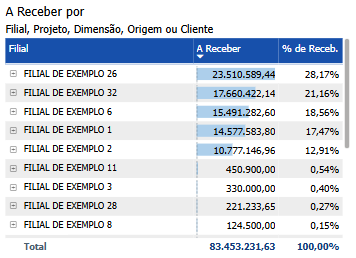

# Painel A Receber

  
  <h6>Imagem 1: Painel A Receber</h6>

## Informações no Painel A Receber

### Valor A Receber

O valor a receber representa as receitas que uma empresa tem a receber de clientes, prestadores de serviços e outras partes, com base em vendas ou serviços prestados, que ainda não foram pagos. Estas receitas incluem montantes devidos por vendas a prazo, contas a receber de clientes, empréstimos concedidos e outras formas de crédito concedido pela empresa. No balanço patrimonial, o valor a receber é classificado como ativo circulante, pois espera-se que seja convertido em caixa dentro de um ano.

Uma gestão eficiente do valor a receber é crucial para manter a saúde financeira da empresa. Garantir que os recebimentos sejam feitos de maneira oportuna é essencial para manter um fluxo de caixa positivo e assegurar que os recursos estejam disponíveis para cobrir as despesas operacionais e investir no crescimento do negócio. Um controle adequado do valor a receber ajuda a planejar melhor o fluxo de caixa, prevenindo dificuldades financeiras e permitindo que a empresa mantenha um equilíbrio saudável entre suas receitas e obrigações.

Além de seu impacto direto na saúde financeira, uma boa administração do valor a receber também contribui para a manutenção de relacionamentos positivos com os clientes. Gerenciar eficazmente os recebimentos pode resultar em melhores condições de crédito, aumento da satisfação dos clientes e uma relação comercial mais sólida e confiável. Isso não só fortalece a posição da empresa no mercado, mas também apoia a sua sustentabilidade financeira a longo prazo.

Os visuais deste painel são projetados para fornecer uma visão detalhada do valor total a receber e das áreas influenciadas por esse valor, como Tempo, Projeto e Favorecido. O painel permite uma análise aprofundada das contas a receber, segmentando os valores de acordo com diferentes critérios e proporcionando uma compreensão clara de como essas receitas se distribuem e afetam diferentes aspectos da empresa. Esta abordagem facilita a identificação de áreas de maior impacto financeiro, ajuda na priorização de estratégias de cobrança e contribui para a formulação de estratégias eficazes de gestão financeira.

## Visão Principal

### A Receber x Projeto, Filial ou Dimensão

  
  <h6>Imagem 2: A Receber x Projeto, Filial ou Dimensão</h6>

Uma matriz exibindo o valor de "A Receber" com cabeçalhos de linha para Projeto, Filial ou Dimensão é uma ferramenta crucial para análise financeira e tomada de decisão. Ao organizar os recebíveis pendentes por essas categorias específicas, a matriz permite que as partes interessadas identifiquem rapidamente onde os recebíveis estão concentrados e rastreiem os pagamentos devidos de diferentes projetos ou filiais. Essa análise detalhada é importante para gerenciar o fluxo de caixa de forma eficaz, pois destaca quais projetos ou filiais podem ter pagamentos atrasados ​​e podem impactar a saúde financeira geral da organização.

Além disso, essa matriz se torna ainda mais poderosa com recursos interativos. Ao clicar em uma linha específica dentro da matriz, os usuários podem filtrar outros visuais no painel, como gráficos, tabelas ou gráficos, para exibir apenas os dados relevantes para o projeto, filial ou dimensão selecionada. Essa filtragem dinâmica permite que os usuários mergulhem mais profundamente em áreas específicas de interesse, facilitando a análise de conexões entre recebíveis e suas áreas respeitadas. Isso agiliza o processo de isolamento de dados críticos, permitindo uma tomada de decisão mais rápida e informada.

Os usuários podem explorar facilmente relacionamentos hierárquicos dentro da matriz usando o sinal de mais (+) ao lado do nome de um projeto. Clicar neste símbolo expande a tabela para revelar os Filiais e Dimensões associados a esse projeto, dando uma visão mais detalhada da estrutura de recebíveis. Da mesma forma, os usuários podem retrair a visão clicando no sinal de menos (-) para recolher a hierarquia, simplificando a tabela quando uma visão geral de alto nível for suficiente. Essa funcionalidade de expandir e recolher fornece flexibilidade na navegação de grandes conjuntos de dados, permitindo que os usuários alternem entre visualizações resumidas e detalhadas com facilidade, tornando a exploração de dados mais eficiente e adaptável a diferentes necessidades de relatórios.

Para navegar entre os níveis, você pode usar os [ícones de cabeçalho](https://idea-technology-it.github.io/docs-idea/financeiro/intro/#filtros) que estão disponíveis quando você passa o mouse ou clica no gráfico.

  
  <h6>Ícones de Cabeçalho</h6>

Aqui, você pode navegar entre diferentes níveis hierárquicos, como Projeto, Filial ou Dimensão, para analisar a área desejada.

### Aging - Contas a Receber

  
  <h6>Imagem 3: Aging - Contas a Receber</h6>

O gráfico de barras é dividido em 7 categorias, a primeira das quais é o valor que já está vencido. Em seguida, vem o tempo em que esse valor é devido, começando em 0 dias (com vencimento imediato), progredindo em intervalos de 30 dias e terminando com qualquer coisa que seja devida em 120 dias ou mais.

Este visual oferece uma ótima visão geral de quais contas a receber são esperadas nos próximos meses, juntamente com o que está vencido (mais detalhado no [Painel Inadimplência](https://idea-technology-it.github.io/docs-idea/financeiro/inadimplencia/)). Essas informações capacitam as empresas a gerenciar seu fluxo de caixa de forma mais eficaz, garantindo estabilidade financeira e eficiência operacional.

Sem usar nenhum filtro, o gráfico representa o valor total a receber, mas usando os [filtros](https://idea-technology-it.github.io/docs-idea/financeiro/intro/#filtros) filial ou projeto, é possível gerenciar áreas específicas dentro do negócio também.

Embora pequeno, este gráfico tem muitas funções, especialmente quando acoplado ao gráfico [Aging - Contas A Pagar](https://idea-technology-it.github.io/docs-idea/financeiro/contas_a_pagar/#aging-contas-a-pagar), permitindo ações como;

- Prever déficits e planejar atrasos no fluxo de caixa para um planejamento financeiro mais preciso,
- Melhorar os processos de cobrança por meio da priorização e comunicação estratégica para melhorar o fluxo de caixa,
- Aprimorar o controle de crédito avaliando o risco e o comportamento, permitindo ajustes de prazo,
- Apoiar o planejamento financeiro dentro do negócio por meio de previsões e decisões de investimento informadas,
- Mitigando o risco financeiro reduzindo dívidas inadimplentes e fortalecendo relacionamentos gerenciando proativamente as contas antes que elas aumentem, potencialmente levando a melhores comportamentos de pagamento ao longo do tempo.

### A Receber x Cliente ou Origem

  
  <h6>Imagem 4: A Receber x Cliente ou Origem</h6>

Um gráfico de barras que segmenta os recebíveis por cliente ou origem oferece vantagens significativas para a gestão e análise da saúde financeira do seu negócio. Visualmente, o gráfico proporciona uma visão rápida e clara de quais clientes ou origens têm os maiores valores em aberto, permitindo que a administração identifique facilmente onde os montantes mais significativos de dinheiro estão alocados. Essa análise comparativa permite direcionar esforços de cobrança de forma mais eficaz, garantindo que os recursos sejam aplicados na recuperação dos maiores recebíveis primeiro. Além disso, o gráfico ajuda a identificar concentrações de risco, como no caso de recebíveis fortemente associados a um cliente ou origem específico, o que pode representar riscos financeiros caso não sejam recebidos a tempo. Esse entendimento apoia o planejamento financeiro, permitindo uma previsão de fluxo de caixa mais precisa e melhor alinhamento dos recebíveis com as obrigações financeiras futuras.

O gráfico também é valioso para monitorar o desempenho de diferentes clientes e origens, oferecendo insights sobre os comportamentos de pagamento ao longo do tempo. Essas informações podem orientar decisões sobre estratégias de vendas, gestão de contas e políticas empresariais. Além disso, o gráfico pode ser usado como uma ferramenta de negociação, fornecendo vantagem em discussões com clientes ao apresentar um panorama claro dos pagamentos em aberto. Essa abordagem baseada em dados não só melhora os termos de pagamento, mas também fortalece as relações com clientes e parceiros de negócios. Adicionalmente, ao destacar onde os recebíveis estão concentrados, seja por origem ou cliente, o gráfico informa a tomada de decisões estratégicas, como a alocação de recursos ou a necessidade de revisar os termos de engajamento com clientes específicos. Em resumo, esse gráfico de barras é uma ferramenta poderosa que aprimora a capacidade de gerir o fluxo de caixa, mitigar riscos e otimizar o desempenho financeiro em diferentes níveis do seu negócio.

Para navegar entre os níveis, você pode usar os [ícones de cabeçalho](https://idea-technology-it.github.io/docs-idea/financeiro/intro/#filtros) que estão disponíveis quando você passa o mouse ou clica no gráfico.

  
  <h6>Ícones de Cabeçalho</h6>

Aqui, você pode navegar entre diferentes níveis hierárquicos, como Cliente ou Origem, para analisar a área desejada.

### A Receber por Data

  
  <h6>Imagem 5: A Receber por Data</h6>

Este gráfico exibe uma tabela detalhada das contas a receber, organizada por data de vencido, que apresenta uma visão completa das transações em ordem cronológica. A tabela inclui várias colunas que fornecem informações cruciais sobre cada fatura, desde o cliente até o status atual e os documentos relacionados. Essa visão tabular permite à empresa analisar minuciosamente cada conta a receber, fornecendo todas as informações necessárias para o acompanhamento e a gestão eficaz dos recebíveis. Através desta estrutura, a empresa pode monitorar detalhadamente o fluxo de caixa e tomar decisões informadas sobre o gerenciamento financeiro. A seguir, explicamos como interpretar cada coluna da tabela.

Esta tabela é essencial ao procurar detalhes sobre contas a receber específicas. Ela pode ser filtrada usando [filtros](https://idea-technology-it.github.io/docs-idea/financeiro/intro/#filtros) ou clicando nas barras dentro dos outros dois visuais na página. Por exemplo, para ver os detalhes de todas as transações a receber que vencem em 30 dias, clique na coluna no gráfico Aging - Contas a Receber que diz "03) Devido em até 30 dias".

#### Cliente
Esta coluna identifica o cliente específico que tem um valor a pagar, permitindo que você veja claramente quem são os devedores.
#### Origem
A origem da fatura, como "Encargos Comuns" ou "Aluguel de Imóveis", é indicada nesta coluna. Isso ajuda a entender a natureza da dívida e a sua fonte dentro das operações da empresa.
#### Nº LCM
Esta coluna mostram o número do lançamento contábil relacionado à fatura. Elas são úteis para rastrear documentos específicos e reconciliar com registros contábeis.
#### Doc.
O número do documento associado à fatura encontra-se aqui. Este é o número mais comumente usado ao pesquisar a transação no banco de dados.
#### Data de Criação
Indica quando a fatura foi criada. Essa informação é importante para entender o histórico da transação e verificar quanto tempo se passou desde a emissão da fatura.
#### Data de Venc.
Esta coluna mostra a data de vencimento da fatura. Comparar esta data com a data atual ajuda a identificar faturas que estão próximas de vencer ou já estão atrasadas.
#### Valor
Exibe o valor devido em cada fatura. Esta coluna permite uma visão clara dos montantes que estão em aberto.
#### Filial
Indica a filial da empresa responsável pela fatura. Isso é útil para entender a distribuição geográfica dos recebíveis.
#### Projeto
Relaciona cada fatura a um projeto específico. Esta informação é essencial para empresas que gerenciam múltiplos projetos e precisam monitorar os fluxos de caixa associados a cada um deles.
#### Status
O status da fatura que é "Previsto" é mostrado aqui. Este status serve para mostrar que o pagamento ainda está pendente e evita confusão com transações mostradas no [Painel de Recebimentos Realizados](https://idea-technology-it.github.io/docs-idea/financeiro/painel_recebimentos_realizados/)
#### Processo
Indica o processo associado ao recebimento, como "Recebimento" ou "Carteira de Recebíveis". Essa coluna auxilia na compreensão do fluxo de trabalho relacionado à fatura.
#### Pesquisa de Documentos
Esta coluna contém informações relacionadas à pesquisa de documentos que podem fornecer detalhes adicionais sobre a fatura ou transação. Isso é útil para obter informações mais detalhadas ou resolver dúvidas sobre um determinado recebível.
#### Dimensão
Esta coluna exibe o nome da dimensão que é relevante para a transação. Embora você possa filtrar por dimensão usando o filtro [Dimensão](https://idea-technology-it.github.io/docs-idea/financeiro/intro/#dimensao), isso facilita a análise ao fornecer uma referência direta aos nomes das dimensões, organizando os dados de uma forma intuitiva para identificar e entender as diferentes áreas de análise.

  
***Aviso Legal:** Os números e informações apresentados nesta documentação são baseados em um conjunto de dados fictício. Eles são destinados exclusivamente para fins educacionais e de demonstração. Os dados não refletem condições do mundo real ou métricas de negócios reais e não devem ser usados ​​para tomada de decisão ou análise. Qualquer semelhança com entidades, eventos ou dados reais é mera coincidência.*
