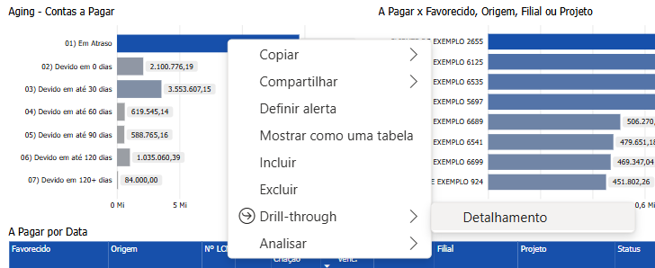

# Painel de Detalhamento

  
  <h6>Imagem 1: Painel de Detalhamento</h6>

O Painel de Detalhamento tem uma função diferente das outras áreas do BI Financeiro. Isso ocorre porque ele contém uma tabela detalhada que os usuários podem acessar "drill-through" em pontos de dados específicos de qualquer outra página do relatório. 

## Drill-through

A função usada para fazer isso é chamada de "Drill-through" e pode ser executada clicando com o botão direito em um visual e selecionando Drill-through no menu que aparece, isso estenderá o menu que mostra "Detalhamento". Uma vez clicado, o Painel de Detalhamento será aberto e será filtrado automaticamente pelo ponto de dados em que você clicou com o botão direito. Abaixo está um exemplo de clique com o botão direito na barra para 01) Em Atraso no visual Aging - Contas a Pagar;

  
  <h6>Imagem 2: Drill-through</h6>

Por padrão, este painel fica oculto, tornando-se visível apenas quando um drillthrough é iniciado. Uma vez na página de drillthrough, os usuários encontrarão uma tabela abrangente exibindo todos os campos e dados relevantes vinculados ao item específico em que eles fizeram drill, oferecendo uma visão mais granular desses dados.

Além disso, quando terminar de revisar os detalhes, os usuários podem clicar no botão de retorno na barra de menu (que só aparece depois que um drillthrough é executado) para voltar à página de onde vieram. Essa configuração permite uma exploração mais profunda dos dados sem perder o contexto original.

## Tabela de Detalhes

  
  <h6>Imagem 3: Tabela de Detalhes</h6>

Este gráfico exibe uma tabela detalhada de transações, organizada por data do documento, fornecendo uma visão completa das transações em ordem cronológica. A tabela inclui várias colunas que fornecem informações cruciais sobre cada transação, do cliente ao status atual e documentos relacionados. Esta visão tabular permite que a empresa visualize cada valor de transação em detalhes, fornecendo todas as informações necessárias para rastrear e gerenciar efetivamente as áreas com base na seleção por meio da função [drill-through](https://idea-technology-it.github.io/docs-idea/financeiro/detalhamento/#drill-through).

Com esta estrutura, a empresa pode escolher a área que deseja analisar em qualquer lugar dentro do BI Finanaceiro e acessar instantaneamente os aspectos relevantes. Abaixo, explicamos como interpretar cada coluna na tabela.

#### Cliente
Esta coluna identifica o cliente específico que tem um valor a pagar, permitindo que você veja claramente quem são os devedores.
#### Origem
A origem da fatura, como "Encargos Comuns" ou "Aluguel de Imóveis", é indicada nesta coluna. Isso ajuda a entender a natureza da dívida e a sua fonte dentro das operações da empresa.
#### Nº LCM
Esta coluna mostram o número do lançamento contábil relacionado à fatura. Elas são úteis para rastrear documentos específicos e reconciliar com registros contábeis.
#### Doc.
O número do documento associado à fatura encontra-se aqui. Este é o número mais comumente usado ao pesquisar a transação no banco de dados.
#### Data de Criação
Indica quando a fatura foi criada. Essa informação é importante para entender o histórico da transação e verificar quanto tempo se passou desde a emissão da fatura.
#### Data de Venc.
Esta coluna mostra a data de vencimento da fatura. Comparar esta data com a data atual ajuda a identificar faturas que estão próximas de vencer ou já estão atrasadas.
#### Valor
Exibe o valor devido em cada fatura. Esta coluna permite uma visão clara dos montantes que estão em aberto.
#### Filial
Indica a filial da empresa responsável pela fatura. Isso é útil para entender a distribuição geográfica dos recebíveis.
#### Projeto
Relaciona cada fatura a um projeto específico. Esta informação é essencial para empresas que gerenciam múltiplos projetos e precisam monitorar os fluxos de caixa associados a cada um deles.
#### Status
O status da fatura que é "Previsto" ou "Realizado" é mostrado aqui. Este status é para mostrar que o pagamento está pendente ou concluído.
#### Dias em Atraso
Para mostrar o tempo que a transação está atrasada.
#### Processo
Indica o processo associado ao recebimento, como "Recebimento" ou "Carteira de Recebíveis". Essa coluna auxilia na compreensão do fluxo de trabalho relacionado à fatura.
#### Pesquisa de Documentos
Esta coluna contém informações relacionadas à pesquisa de documentos que podem fornecer detalhes adicionais sobre a fatura ou transação. Isso é útil para obter informações mais detalhadas ou resolver dúvidas sobre um determinado recebível.
#### Dimensão
Esta coluna exibe o nome da dimensão que é relevante para a transação. Embora você possa filtrar por dimensão usando o filtro [Dimensão](https://idea-technology-it.github.io/docs-idea/financeiro/intro/#dimensao), isso facilita a análise ao fornecer uma referência direta aos nomes das dimensões, organizando os dados de uma forma intuitiva para identificar e entender as diferentes áreas de análise.
